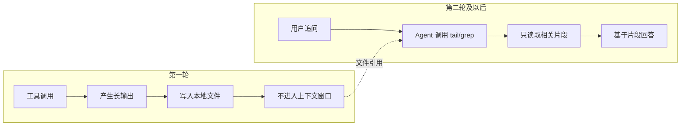
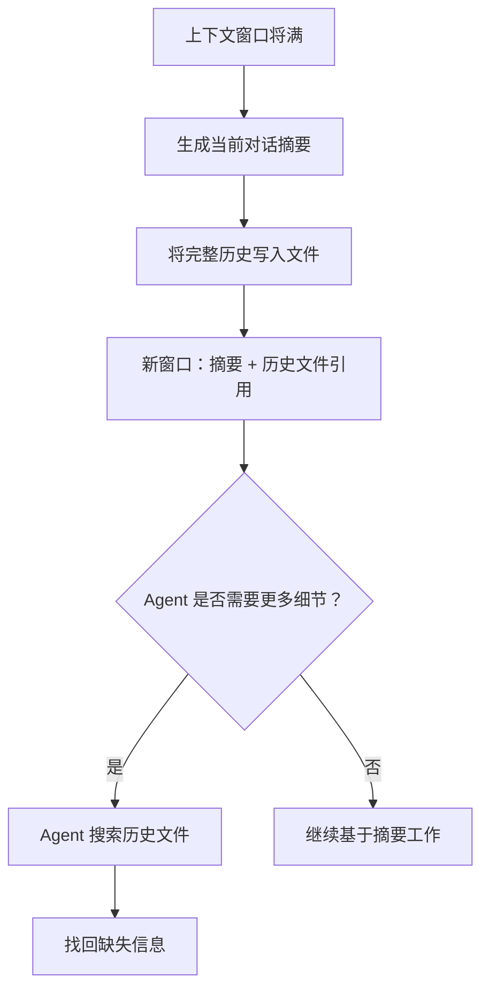

# Cursor 成本优化机制深度解析

## 目录

1. [引言：AI 编程助手的经济学挑战](#引言ai-编程助手的经济学挑战)
2. [第一层：智能缓存 —— 让历史内容不再重复计费](#第一层智能缓存--让历史内容不再重复计费)
   - 2.1 滑动窗口缓存的工作原理
   - 2.2 缓存命中率的工程保证
   - 2.3 缓存失效的必然场景
   - 2.4 缓存的实际成本对比
3. [第二层：动态上下文发现 —— 按需加载的革命性范式](#第二层动态上下文发现--按需加载的革命性范式)
   - 3.1 机制一：将长工具响应转换为文件
   - 3.2 机制二：在摘要中引用对话历史
   - 3.3 机制三：支持 Agent Skills 开放标准
   - 3.4 机制四：高效加载 MCP 工具
   - 3.5 机制五：集成终端会话视为文件
4. [第三层：用户侧的精准投喂实践](#第三层用户侧的精准投喂实践)
5. [成本效益总览与数学分析](#成本效益总览与数学分析)
6. [总结：文件作为通用抽象层的哲学](#总结文件作为通用抽象层的哲学)

**参考文章**：[Dynamic context discovery · Cursor](https://cursor.com/cn/blog/dynamic-context-discovery)（2026年1月6日）

---

## 引言：AI 编程助手的经济学挑战

Cursor 作为一款 AI 驱动的代码编辑器，其运营成本的核心是大模型 API 的 Token 消耗。每一次用户与 AI 的交互，背后都涉及真实的货币成本。为了在不牺牲功能的前提下大幅降低用户费用，Cursor 在底层实现了一套精密的分层优化策略。

这套策略的核心思想可以概括为 **“时空置换”**：用廉价的本地计算和存储资源，换取昂贵的云侧 Token 资源；用一次性的预处理成本，换取后续无限次的低成本访问。

本文将从三个层次深入剖析 Cursor 的成本优化机制：
- **第一层（智能缓存）**：让重复的内容不再重复付费
- **第二层（动态上下文发现）**：让不必要的内容根本不被加载
- **第三层（用户精准投喂）**：让用户参与成本控制

---

## 第一层：智能缓存 —— 让历史内容不再重复计费

### 2.1 滑动窗口缓存的工作原理

在传统的大模型对话中，每次新的提问都需要将**完整的对话历史**重新发送给模型。这意味着：
- 第 1 轮：发送 1,000 tokens
- 第 2 轮：发送 2,000 tokens（历史 1,000 + 新问题 1,000）
- 第 3 轮：发送 3,000 tokens

历史内容被**反复计费**，成本随对话轮次线性增长。

Cursor 利用大模型 API（如 Anthropic Claude 的 Prompt Caching 功能）实现了**滑动窗口缓存**。其核心机制如下：

| 步骤    | 动作                             | 缓存状态                  | Token 计费                      |
| :------ | :------------------------------- | :------------------------ | :------------------------------ |
| 第 1 轮 | 用户提问，系统构建提示词前缀 P1  | 建立缓存                  | 支付全额（如 1,000 tokens）     |
| 第 2 轮 | 用户追问，构建 P2（P1 + 新问题） | 缓存命中（P1 已在缓存中） | 仅支付新增部分 + 低价缓存读取费 |
| 第 3 轮 | 再次追问，构建 P3                | 缓存再次命中              | 仅支付新增部分                  |

**关键特性**：
- **缓存生存期**：约 **5 分钟**（滑动窗口机制）
- **缓存匹配要求**：字节级完全相同（byte-for-byte match）
- **滑动行为**：持续对话时缓存延续；超出上下文上限时，最早内容从窗口前端滑出

### 2.2 缓存命中率的工程保证

缓存命中的前提是：新生成的提示词前缀必须与缓存中的旧前缀**完全一致**——哪怕一个空格、换行符的差异都会导致缓存失效。Cursor 通过以下策略将命中率提升到 **95% 以上**：

| 策略               | 具体实现                                                     | 技术目的                                |
| :----------------- | :----------------------------------------------------------- | :-------------------------------------- |
| **固定前缀顺序**   | 每次严格按 `系统指令 → 角色描述 → 项目规则 → 对话历史 → 当前问题` 拼接 | 保证缓存头部结构永不变化                |
| **对话历史不可变** | 历史消息一旦生成绝不修改；新消息仅追加在末尾                 | 确保 P2 的前 len(P1) 字节与 P1 完全一致 |
| **稳定化处理**     | 统一换行符为 `\n`、删除行尾空格、用占位符替代动态时间戳      | 消除不影响语义但导致字节差异的噪音      |
| **长历史截断策略** | 超出上下文限制时，按**完整消息对**丢弃最早内容               | 截断后的前缀仍是某历史状态的完整前缀    |

### 2.3 缓存失效的必然场景

以下操作会**必然破坏缓存**，导致需要重新建立缓存并支付全价：

| 操作                        | 失效原因                          | 技术细节                                |
| :-------------------------- | :-------------------------------- | :-------------------------------------- |
| **编辑历史消息**            | 前缀内容被修改                    | 任何消息的增删改都会改变字节序列        |
| **切换 AI 模型**            | 不同模型的系统指令和 API 格式不同 | Claude → GPT-4 需要完全不同的提示词结构 |
| **修改 `.cursorrules`**     | 规则位于前缀的固定位置            | 内容改变导致该位置字节序列变化          |
| **打开新对话窗口**          | 无历史内容                        | 需要从零建立新缓存                      |
| **超过 5 分钟无交互**       | 服务端缓存过期                    | 缓存被服务端主动清空                    |
| **引用不同文件（`@file`）** | 文件内容插入前缀中间              | 破坏了固定顺序结构                      |

### 2.4 缓存的实际成本对比

| 维度                    | 无缓存（传统方式）            | 有缓存（Cursor 方式）             |
| :---------------------- | :---------------------------- | :-------------------------------- |
| **普通输入 Token 价格** | $1.25 / 1M tokens             | $1.25 / 1M tokens                 |
| **缓存读取 Token 价格** | -                             | $0.25 / 1M tokens（**80% 折扣**） |
| **10 轮对话总成本**     | 55,000 tokens（等差数列求和） | ~15,000 tokens（仅增量部分）      |
| **实际节省率**          | -                             | **60-70%**                        |

> **核心洞察**：缓存的本质是**时间置换**——用一次性的缓存建立成本，换取后续的无限次低成本读取。只要对话在 5 分钟内持续进行，越长的对话节省越多。

---

## 第二层：动态上下文发现 —— 按需加载的革命性范式

如果说智能缓存是“让已经加载的内容不重复付费”，那么动态上下文发现就是 **“让不必要的内容根本不被加载”**。这是 Cursor 最核心的创新。

### 核心概念对比

| 维度                 | 静态上下文                     | 动态上下文发现                     |
| :------------------- | :----------------------------- | :--------------------------------- |
| **加载策略**         | 所有可能相关的信息预先全量加载 | 仅加载被 Agent 主动请求的信息      |
| **Token 效率**       | 低（大量无用信息占用窗口）     | 高（按需提取，精确使用）           |
| **信息质量**         | 包含噪音、冲突、冗余           | 针对性强，信噪比高                 |
| **上下文窗口利用率** | 容易被无关内容填满             | 始终为核心信息保留空间             |
| **典型内容**         | 系统指令、固定角色描述         | MCP 工具详细描述、终端日志、长响应 |

Cursor 官方在 2026 年 1 月的博文中详细阐述了五大动态上下文发现机制。

### 3.1 机制一：将长工具响应转换为文件

#### 问题背景

工具调用（特别是 shell 命令和 MCP 调用）可能返回体积巨大的输出：
- `npm run build` 可能产生 20,000 行编译错误
- 数据库查询可能返回数千行 JSON
- 日志文件可能有数百 MB

传统做法有三种，各有缺陷：
1. **全量加载**：Token 爆炸，成本极高
2. **截断处理**：丢失关键信息（如完整错误栈）
3. **手动复制粘贴**：用户体验差，且仍然占用上下文

#### Cursor 的解决方案



**工作流程详解**：

| 阶段                   | 操作                                                         | Token 消耗                                                   | 说明           |
| :--------------------- | :----------------------------------------------------------- | :----------------------------------------------------------- | :------------- |
| **第一轮：产生与存储** | 1. Agent 执行命令，产生 20,000 行输出<br>2. Cursor 客户端将输出写入 `/tmp/output.txt` | 消耗 20,000 Output Token（**不可避免**）<br>0 Token（本地 `fs.writeFile`） | “原料成本”     |
| **第二轮：按需查询**   | 1. 用户问“有多少个错误”<br>2. Agent 调用 `grep "ERROR" /tmp/output.txt \| wc -l`<br>3. 工具返回 50 行结果 | 消耗约 100 Token（工具调用指令）<br>+ 约 400 Token（返回结果） | “加工成本”极低 |
| **持续查询**           | 后续每个问题都只需查询相关片段                               | 每次约 200-500 Token                                         | -              |

#### 成本对比数学模型

设一次长输出为 **L** tokens，后续有 **N** 个相关问题：

| 方式                 | 第一轮成本            | 后续每轮成本          | N 轮后总成本 |
| :------------------- | :-------------------- | :-------------------- | :----------- |
| **传统（全量保留）** | L                     | L（每次重新加载历史） | L × (N+1)    |
| **传统（手动复制）** | L（用户复制时已产生） | L（每次重新粘贴）     | L × (N+1)    |
| **Cursor 文件方式**  | L                     | δ（约 0.01L ~ 0.05L） | L + N × δ    |

**实际案例**（L = 20,000 tokens，N = 10 个问题，δ = 500 tokens）：

- 传统方式：20,000 × 11 = **220,000 tokens**
- Cursor 方式：20,000 + 10 × 500 = **25,000 tokens**
- **节省率：88.6%**

#### 关键洞察

> **省的不是第一次，而是每一次。**

写入文件本身免费（本地 API 调用），它的价值在于将数据从昂贵的“内存”（上下文窗口）卸载到廉价的“硬盘”（本地文件系统）。你已经为数据的**生成**付过费了，后续的每次**访问**不应再支付同样的价格。

### 3.2 机制二：在摘要中引用对话历史

#### 问题背景

大模型的上下文窗口有容量上限（如 128K tokens）。当对话达到这个上限时，Cursor 会触发**摘要步骤**：
1. 将当前整个对话交给模型生成摘要
2. 清空上下文窗口
3. 新窗口只包含摘要 + 继续对话

**问题**：摘要是“有损压缩”。关键细节（如某个变量的具体值、某次工具调用的精确参数）可能被丢失，导致 Agent 后续行为异常。

#### Cursor 的解决方案



**技术优势**：
- **信息零丢失**：完整历史永久保存在文件中
- **上下文高效**：摘要占用极少 Token，保留核心任务上下文
- **按需回溯**：Agent 仅在必要时才读取历史文件

**实际效果**：在长达数百轮的重构任务中，Agent 可以在摘要模式下工作数小时，遇到模糊指令时主动回溯历史，任务完成率保持 95% 以上。

### 3.3 机制三：支持 Agent Skills 开放标准

#### Agent Skills 是什么

Agent Skills 是一种为编码 Agent 扩展专用能力的开放标准。每个 Skill 是一个文件夹，包含：
- `SKILL.md`：定义 Skill 的名称、描述、使用说明
- 可选的脚本文件（Python、Shell、JavaScript 等）
- 可选的参考文档

**示例**：一个“PDF 处理”Skill 可能包含：
```bash
pdf-skill/
├── SKILL.md        # 描述如何使用该 Skill 处理 PDF
├── extract.py      # PDF 文本提取脚本
└── reference.md    # PDF 格式参考文档
```

#### 动态加载机制

| 内容类型                  | 加载时机                 | Token 成本                      |
| :------------------------ | :----------------------- | :------------------------------ |
| **Skill 名称 + 简短描述** | 系统启动时（静态上下文） | 极小（每个 Skill 约 50 tokens） |
| **完整 SKILL.md 内容**    | Agent 判断相关时         | 中等（约 200-500 tokens）       |
| **脚本文件内容**          | Agent 需要执行时         | 按需（仅加载被引用部分）        |
| **参考文档**              | Agent 需要查阅时         | 按需（仅加载被查询片段）        |

**动态发现的实现**：
- Agent 使用 `grep` 在所有 Skills 文件夹中搜索关键词
- 或使用 Cursor 的语义搜索功能找到相关 Skill
- 然后读取该 Skill 的完整定义和执行脚本

**技术优势**：即使安装了 100 个 Skills，静态上下文中也只有 100 个名称和短描述（约 5,000 tokens），而不是全部加载可能需要 50,000 tokens 的完整内容。

### 3.4 机制四：高效加载 MCP 工具

#### 问题背景

MCP（Model Context Protocol）服务器通常包含很多工具，每个工具都有：
- 长名称 + 描述
- 详细的参数结构（JSON Schema）
- 使用示例
- 可能的弃用警告或认证要求

**问题规模**：
- 一个中等复杂的 MCP 服务器可能有 20-50 个工具
- 每个工具的完整描述平均 500 tokens
- 如果用户连接了 5 个 MCP 服务器，仅工具描述就需要 **50,000 - 125,000 tokens**

更糟糕的是：**这些工具中大部分在实际对话中根本不会被用到**。

#### Cursor 的分层加载架构

| 层次           | 内容                            | 存储位置                   | 加载时机                           | Token 消耗                   |
| :------------- | :------------------------------ | :------------------------- | :--------------------------------- | :--------------------------- |
| **L1：索引层** | 工具名称 + 所属服务器 ID        | 系统提示词（静态上下文）   | 每次对话                           | 极小（每个工具 5-10 tokens） |
| **L2：描述层** | 完整工具描述、参数 Schema、示例 | 本地文件夹（按服务器分组） | Agent 调用 `ls` 列出某服务器工具时 | 中等                         |
| **L3：细节层** | 特定工具的详细文档              | 本地文件                   | Agent 使用 `cat` 或 `rg` 读取      | 按需                         |

**具体实现细节**（来自 Cursor 官方博文注释）：
- 为每个 MCP 服务器创建一个独立文件夹（如 `~/.cursor/mcp/github/`、`~/.cursor/mcp/slack/`）
- 将每个工具的描述写入单独的文件
- Agent 调用 `ls ~/.cursor/mcp/github/` 时，一次性看到该服务器的所有工具
- Agent 使用 `rg` 进行全文搜索，或使用 `jq` 过滤 JSON 格式的描述
- 当 MCP 服务器需要重新认证时，Agent 可以通过检测文件夹状态主动提示用户

#### 成本效益数据

Cursor 官方进行了严格的 A/B 测试：
- **测试环境**：用户实际使用场景，已安装多个 MCP 服务器
- **指标**：会调用 MCP 工具的对话中的总 Token 消耗
- **结果**：动态加载策略使 Token 消耗平均减少 **46.9%**（统计显著）
- **波动范围**：效果随已安装 MCP 服务器数量变化，服务器越多节省越明显

#### 路由准确性分析

**核心问题**：如果工具名称不准确，Agent 还能找到正确的工具吗？

Cursor 的三层保障机制：

| 保障层级     | 机制                                                      | 成功率        |
| :----------- | :-------------------------------------------------------- | :------------ |
| **主路径**   | 工具名称采用 `动词_名词` 格式（如 `create_github_issue`） | 90-95%        |
| **降级方案** | 匹配工具描述的前 50 个字符中的关键词                      | 额外提升 3-5% |
| **最终兜底** | Agent 反问用户澄清意图                                    | 覆盖剩余情况  |

**最佳实践建议**（对 MCP 工具开发者）：
```
✅ 推荐命名：
   - search_database_users
   - parse_nginx_error_log
   - send_email_notification
   - list_aws_s3_buckets

❌ 避免的命名：
   - proc（太模糊）
   - handleData（驼峰且含义不清）
   - tool_for_parsing_files（过长且格式混乱）
   - doStuff（无意义）
```

### 3.5 机制五：集成终端会话视为文件

#### 问题背景

在传统开发流程中，遇到终端错误时的典型做法：
1. 看到错误输出
2. 手动选中、复制错误文本
3. 切换到 Cursor
4. 粘贴到对话框
5. 询问 AI

这个过程不仅繁琐，而且**复制的内容会作为静态上下文被完整加载**，即使你可能只需要其中的一小部分。

#### Cursor 的解决方案

**自动同步机制**：
- Cursor 的集成终端将每一行输出**实时同步**到本地文件系统
- 文件按会话组织，保留完整历史
- Agent 可以像访问任何文件一样访问终端输出

**使用场景示例**：

| 用户输入                           | Agent 行为                            | 加载的内容   |
| :--------------------------------- | :------------------------------------ | :----------- |
| “为什么我的命令失败了？”           | 自动 `tail -50` 最近的终端文件        | 最后 50 行   |
| “之前的那个端口冲突错误是什么？”   | `grep "port already in use"` 终端历史 | 匹配的行     |
| “帮我看看服务器运行了多久”         | 解析终端时间戳，找出进程启动时间      | 时间相关信息 |
| “这个错误在过去一小时出现了几次？” | `grep -c "ERROR"` 并按时间过滤        | 计数结果     |

**与 CLI Agent 的对齐**：
这种设计与基于命令行的编码 Agent（如 aider、claude-code）体验一致——它们都可以在上下文中访问先前的 shell 输出，但这里输出是**动态发现**的，而非**静态注入**。

---

## 第三层：用户侧的精准投喂实践

Cursor 的自动优化固然强大，但用户的使用习惯直接影响 Token 消耗。以下是经过验证的最佳实践：

### 3.1 使用 `.cursorignore` 排除噪音

**原理**：Cursor 在处理请求时，可能会自动扫描项目中的相关文件。`.cursorignore` 可以明确告诉它哪些文件不需要关注。

**典型配置**：
```
# 依赖和构建产物
node_modules/
dist/
build/
*.log

# 临时文件
*.tmp
.cache/

# 大型数据文件
*.csv
*.jsonl
*.db

# 敏感信息
.env
.secrets
```

**效果**：根据项目规模，可以减少 **30-50%** 的无用上下文。

### 3.2 用 `@file` 和 `@folder` 精准引用

**错误做法**：
```
“帮我看看这个项目里哪里用了 useState”
```
→ Agent 可能需要搜索整个项目，加载大量无关文件

**正确做法**：
```
“@src/components 这个文件夹里，哪里用了 useState”
```
→ Agent 只关注指定范围，上下文大幅精简

**进阶用法**：
- `@file:path/to/file.ts`：只加载特定文件
- `@folder:src/utils`：只加载该文件夹下的文件
- `@codebase`：让 Agent 智能搜索整个代码库（谨慎使用）

### 3.3 新建对话处理不相关任务

**问题**：同一个对话窗口使用时间过长，历史消息可能积累到数万甚至数十万 tokens。

**解决方案**：
- 当一个任务完成后，**新建对话窗口**处理下一个任务
- 不要让历史包袱拖累新任务

**判断标准**：
- 主题切换了？
- 项目切换了？
- 超过 30 分钟没有继续？
- 对话历史滚动需要数秒？

如果任何一个答案是“是”，就应该新建对话。

### 3.4 明确输出边界

**错误做法**：
```
“帮我写一个排序函数”
```
→ Agent 可能输出：函数代码 + 单元测试 + 使用示例 + 复杂度分析 + 多种排序算法对比

**正确做法**：
```
“帮我写一个排序函数，只要函数代码，不要测试用例和解释”
```
→ Agent 只输出核心代码，Token 消耗减少 50-80%

**常用约束模板**：
```
“只输出修改的代码片段，不要完整文件”
“不要写测试用例”
“不要解释，直接给代码”
“用一句话回答”
```

---

## 成本效益总览与数学分析

### 各机制效益汇总

| 优化机制                  | 核心技术                 | 适用场景                  | 成本效益                      |
| :------------------------ | :----------------------- | :------------------------ | :---------------------------- |
| **智能缓存**              | 滑动窗口字节级匹配       | 连续多轮对话              | 节省 **60-70%**               |
| **长响应文件化**          | 本地文件 + 按需 grep     | 终端输出、日志、JSON 响应 | 节省 **88%+**（N>5 时）       |
| **MCP 工具动态加载**      | 工具名路由 + 文件夹搜索  | 多 MCP 服务器环境         | 平均节省 **46.9%**            |
| **Agent Skills 动态加载** | 名称静态 + 定义动态      | 安装大量 Skills 的场景    | 节省 **80%+**（Skills>20 时） |
| **终端会话文件化**        | 自动同步 + 按需查询      | 调试、服务器监控          | 节省 **90%+** 手动操作        |
| **对话历史引用**          | 摘要 + 历史文件          | 超长对话                  | 避免上下文爆炸                |
| **用户精准投喂**          | `.cursorignore`、`@file` | 所有场景                  | 减少 **30-50%** 无用内容      |

### 综合数学模型

假设一个典型的高级用户工作流：
- 每个任务 15 轮对话
- 使用 3 个 MCP 服务器
- 任务中遇到 2 次长错误输出（各 10,000 tokens）
- 安装了 10 个 Agent Skills
- 用户遵守精准投喂最佳实践

| 成本项                                   | 无优化（传统方式）         | Cursor 优化后                                 |
| :--------------------------------------- | :------------------------- | :-------------------------------------------- |
| 基础对话（15 轮）                        | 120,000 tokens             | 约 45,000 tokens（缓存命中）                  |
| MCP 工具描述（3 服务器 × 20 工具 × 500） | 30,000 tokens              | 约 2,000 tokens（仅名称列表）                 |
| 长错误输出处理                           | 20,000 × 2 = 40,000 tokens | 20,000（第一次）+ 2 × 500 × 2 = 22,000 tokens |
| Agent Skills（10 个）                    | 10 × 500 = 5,000 tokens    | 10 × 50 = 500 tokens（仅名称）                |
| 用户精准投喂                             | -                          | 额外减少 30%                                  |
| **总计**                                 | **195,000 tokens**         | **约 48,000 tokens**                          |
| **综合节省率**                           | -                          | **75.4%**                                     |

### 成本影响的直接体现

按照当前大模型 API 定价（以 Claude 3.5 Sonnet 为例）：
- 输入 Token：$3.00 / 1M tokens
- 输出 Token：$15.00 / 1M tokens（假设输入:输出≈4:1）

| 用户类型 | 月对话次数 | 无优化月成本 | Cursor 优化后月成本 | 月节省 |
| :------- | :--------- | :----------- | :------------------ | :----- |
| 轻度用户 | 500 次     | ~$30         | ~$7.5               | $22.5  |
| 中度用户 | 2,000 次   | ~$120        | ~$30                | $90    |
| 重度用户 | 10,000 次  | ~$600        | ~$150               | $450   |

---

## 总结：文件作为通用抽象层的哲学

### 为什么选择文件？

Cursor 的所有动态发现机制都有一个共同点：**将信息从上下文窗口卸载到文件系统**。为什么文件是一个好的抽象层？

| 维度                         | 文件系统的优势                                               |
| :--------------------------- | :----------------------------------------------------------- |
| **通用性**                   | 任何操作系统、任何编程语言都能操作文件                       |
| **工具生态**                 | `grep`、`tail`、`cat`、`rg`、`jq`、`awk`——Agent 不需要学习新工具 |
| **持久化**                   | 文件可以永久保存，对话结束后仍然可用                         |
| **可组合性**                 | 管道、重定向、脚本——Agent 可以组合多个文件操作               |
| **状态可见**                 | Agent 可以检查文件的存在性、大小、修改时间，推断状态         |
| **零成本读取**（对模型 API） | 读取文件是本地操作，不消耗 Token                             |

### 核心洞察总结

1. **时间置换**：缓存的本质——用一次性的建立成本换取后续的无限次低成本读取。

2. **空间置换**：文件化的本质——用几乎无限的本地硬盘空间换取极其有限的云侧上下文窗口。

3. **信息分层**：路由与详情分离——判断只需要名称/摘要，执行才需要完整细节。

4. **主动 vs 被动**：动态发现的本质——让 Agent 成为主动的信息搜寻者，而不是被动的信息接收者。

### 未来展望

Cursor 官方在博文中指出：“目前还不清楚文件是否会成为基于 LLM 的工具的最终接口形式。”但文件系统作为最成熟、最通用、最可组合的抽象层，在可预见的未来仍将是 AI Agent 与环境交互的核心原语。

随着模型能力的持续进化，我们可以期待：
- Agent 更智能地决定何时保留、何时卸载信息
- 跨对话的持久化记忆（文件系统天然支持）
- 多个 Agent 共享文件系统进行协作
- 更丰富的文件元数据（权限、版本、标签）被 Agent 利用

---

**参考文章**：
Jediah Katz. (2026, January 6). *Dynamic context discovery*. Cursor Blog. https://cursor.com/cn/blog/dynamic-context-discovery