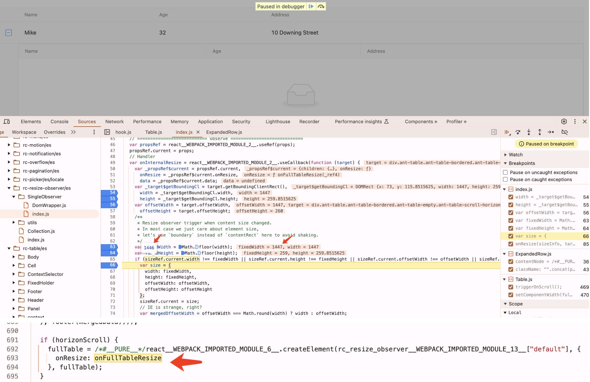
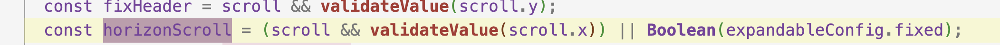

### Table 为空时 width 无限被拉长

1.配置一个有数据的table，开启expandable属性 2.在expand中配置一个没有数据的table 3.在preview中，点击扩展按钮，可以出现一直向右拉长的bug







```
我看了一下源码，其实是在一些 case 的情况下，antd 里面有个 ResizeObserver 导致一直在执行 resize，然后大概看了下这里 resize 的逻辑是它计算到的 width 有可能是小数，Math.floor 之后呢又会和之前的不等最后导致一直在 resize。

应该是一个遗留已久的问题。不过他的触发条件是这个 scroll.x 有值才会去 ResizeObserver。


所以暂时来说你可以让用户为 table 的 scroll.x 用变量绑定成 undefined 我猜就不会有这个问题，而 low code 的  table 的 scroll.x 默认是 true，所以估计很多用户会遇到。然后我会尝试在 infrad 这边尽量修复它。（但不能保证所以我感觉在不需要的情况还是可以不设置 scroll.x 的。


https://github.com/ant-design/ant-design/issues/26621
```

https://git.garena.com/shopee/InfraFe/infra-design/infrad/-/merge_requests/362
