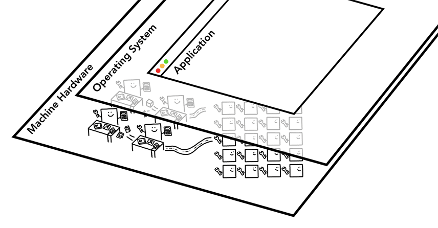
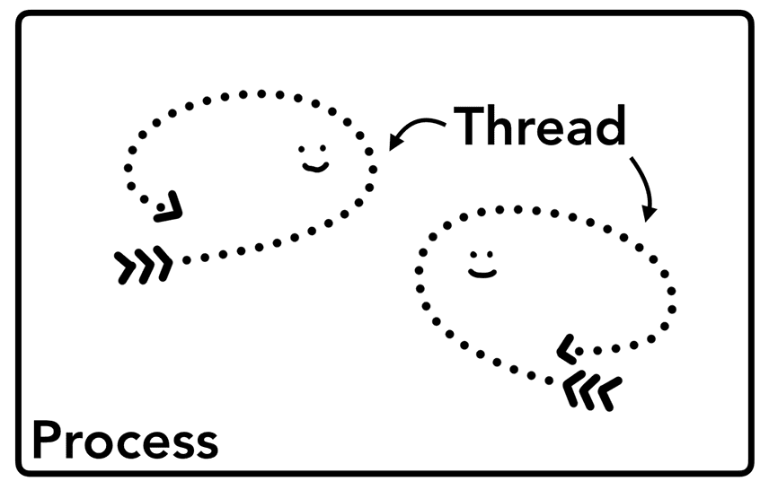
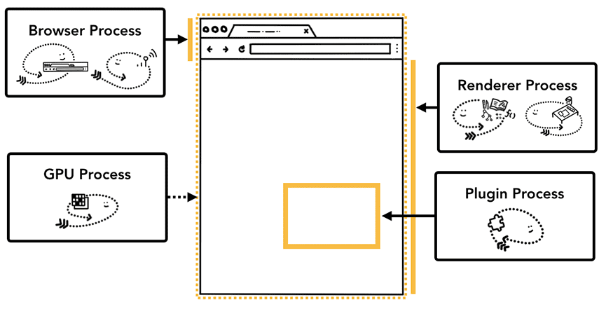

# 计算机架构

三层计算机架构：机器硬件位于底部，操作系统位于中间，应用位于顶部。

当在计算机或手机上启动某个应用时，CPU 和 GPU 是应用的驱动因素。应用通常使用操作系统提供的机制在 CPU 和 GPU 上运行。

# CPU

中央处理器 - Central Processing Unit

CPU 可以视为计算机的大脑。CPU 核心可以在传入时逐一处理许多不同的任务。它可以处理数学、艺术等各种事务，还能知道如何回复客户来电。

过去，大多数 CPU 都是单芯片。在现代硬件中通常会有多个核心，从而为手机和笔记本电脑提供更多计算能力。

# GPU

图形处理器 - Graphics Processing Unit

与 CPU 不同，GPU 擅长同时处理跨内核的简单任务。

它的开发初衷是为了处理图形。近年来，随着 GPU 加速计算的普及，越来越多的单靠 GPU 计算成为可能。

# Process & Thread

进程可以描述为应用的执行程序。线程是位于进程内并执行其进程程序任何部分的线程。

启动应用时，系统会创建一个进程。程序也许会创建一个或多个线程来帮助它工作。

+ 线程是依附于进程的，而进程中使用多线程并行处理能提升运算效率；
+ 多线程可以并行处理任务，但是线程是不能单独存在的，它是由进程来启动和管理的。

一个进程就是一个程序的运行实例：

+ 操作系统为进程提供了一个可以使用的一块内存，所有应用程序状态都保存在该私有内存空间中。关闭应用程序时，相应的进程也会消失，操作系统会释放内存；
+ 进程中的任意一线程执行出错，都会导致整个进程的崩溃；
+ 线程之间共享进程中的数据。

进程之间的内容相互隔离：

+ 进程隔离是为保护操作系统中进程互不干扰，每一个进程只能访问自己占有的数据；
+ 一个进程可以请求操作系统启动另一个进程来运行不同的任务。在这种情况下，系统会将内存的不同部分分配给新进程。如果两个进程需要通信，它们可以使用进程通信实现。
+ 这样一来，如果一个进程崩溃了或者挂起了，可以重启，不会影响到其他进程的。

当一个进程关闭之后，操作系统会回收进程所占用的内存：

+ 当一个进程退出时，操作系统会回收该进程所申请的所有资源；
+ 即使其中任意线程因为操作不当导致内存泄漏，当进程退出时，这些内存也会被正确回收。

## Chrome 进程

之前 Chrome 会尽可能为每个标签页都提供一个进程；现在会尝试为每个网站提供专属进程，包括 iframe。

每个 Chrome 进程及其控制内容如下：

| 进程                    | 控制对象                                                     | 线程                                                         |
| ----------------------- | ------------------------------------------------------------ | ------------------------------------------------------------ |
| 浏览器                  | 控制应用的 “Chrome” 部分：包括地址栏、书签、后退按钮和前进按钮。 处理网络浏览器中不可见的特权部分：例如网络请求和文件访问。 | 界面线程：用于绘制浏览器的按钮和输入字段 网络线程：负责处理网络堆栈以从互联网接收数据 存储线程：用于控制文件访问 等等 |
| 渲染器 渲染程序进程 | 控制标签页中显示网站的一切内容。包括执行 JavaScript 代码。   | 主线程：将 HTML 转为 DOM；加载 img、js 等外部资源；解析 CSS 确定样式；根据 DOM 和样式确定布局树；遍历布局树来创建图层树 合成器线程：光栅化每个图层；创建合成器帧 光栅线程：光栅化每个图块并将其存储在 GPU 内存中 |
| 插件                    | 控制网站使用的所有插件，例如 Flash。                         |                                                              |
| GPU                     | 独立于其他进程处理 GPU 任务。 它分为不同的进程，因为 GPU 会处理来自多个应用的请求并在同一 Surface 中绘制它们。 |                                                              |
| 扩展进程                |                                                              |                                                              |
| 实用程序进程            |                                                              |                                                              |
|                         |                                                              |                                                              |

如果想查看 Chrome 中正在运行的进程，请点击右上角的选项菜单图标，选择“更多工具”，选择“任务管理器”。此时将打开一个窗口，其中包含当前正在运行的进程及其占用的 CPU/内存量。

## Chrome 中多进程架构的优势

一般情况下，每个标签页都由独立的渲染程序进程运行。

+ 稳定性：如果某个标签页无响应，可以关闭无响应标签页并继续，同时让其他标签页保持活跃状态。如果所有标签页都在一个进程上运行，那么当一个标签页无响应时，所有标签页都无响应。
+ 安全性与沙箱化：由于操作系统提供了限制进程权限的方法，浏览器就可以用沙箱保护某些特定功能的进程。例如，Chrome 浏览器可以限制处理用户输入（如渲染器）的进程的文件访问的权限。

由于进程有自己的私有内存空间，所以它们通常包含公共基础设施的拷贝（如 Chrome V8 引擎）。这意味着内存使用量更高，因为它们不能像它们是同一进程中的线程时那样共享。为了节省内存，Chrome 对可以启动的进程数量设置了限制。 该上限因设备的内存和 CPU 性能而异，但当 Chrome 达到上限时，便会开始在一个进程中运行来自同一网站的多个标签页。

一般来说，当 Chrome 在强大的硬件上运行时，可能会将每项服务拆分为不同的进程，以提高稳定性；但如果是在资源有限的设备上，Chrome 会将各项服务合并为一个进程，从而节省内存占用量。在此变更之前，类似的方法整合进程以减少内存用量，就已经在 Android 等平台上使用。

# References

+ [深入了解现代网络浏览器（第 1 部分）](https://developer.chrome.com/blog/inside-browser-part1?hl=zh-cn) 
+ [知乎 - Chrome 为什么多进程而不是多线程？](https://www.zhihu.com/question/368712837) 