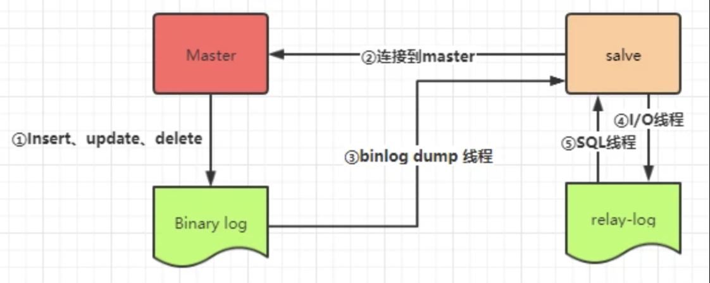

# 术语一角

+ DBMS：Database Management System，数据库管理系统
  + SQL Server：Microsoft SQL Server
  + MySQL

# 数据库的基本概念

## 定义

+ 数据库（Database）是按照数据结构来组织、存储和管理数据的仓库；
+ 每个数据库都有一个或多个不同的 API 用于创建，访问，管理，搜索和复制所保存的数据；
+ 要添加，访问和处理存储在计算机数据库中的数据，您需要一个DBMS，如 Microsoft SQL Server（简称 SQL Server）、 MySQL，[两者之间的区别](https://www.cainiaojc.com/note/qa04w5.html)；
  + **DBMS**（Database Management System，数据库管理系统），一种操纵和管理数据库的大型软件，用于建立、使用和维护数据库；
    + 它对数据库进行统一的管理和控制，以保证数据库的安全性和完整性；
    + 用户通过 DBMS 访问数据库中的数据，数据库管理员也通过 DBMS 进行数据库的维护工作；
    + 它可使多个应用程序和用户用不同的方法在同时或不同时刻去建立、修改和访问数据库；
    + DBMS 提供 DDL 与 DML 供用户定义数据库的模式结构与权限约束，实现对数据的追加、删除等操作。
  + DDL（Data Definition Language，数据定义语言）
  + DML（Data Manipulation Language，数据操作语言）

+ 我们也可以将数据存储在文件中，但是在文件中读写数据速度相对较慢。所以，现在我们使用 RDBMS 来存储和管理大数据量。

## 分类

### 关系/非关系数据库

数据库有两种类型，分别是关系型数据库和非关系型数据库。

#### 关系型数据库 RDBMS

+ **RDBMS**（Relational Database Management System：关系型数据库管理系统），在 DBMS 的基础上增加关系，它通过数据、关系和对数据的约束三者组成的数据模型来存放和管理数据；
+ 所谓的关系型数据库，是建立在**关系模型**基础上的数据库，借助于集合代数等数学概念和方法来处理数据库中的数据；
  + 现实世界中的各种实体以及实体之间的各种联系均用关系模型来表示；
  + 关系模型是由 埃德加·科德于 1970 年首先提出，并配合 “科德十二定律”，如今虽然对此模型由一些批评意见，但它仍是数据存储的传统标准；
  + 关系模型由关系数据结构、关系操作集合和关系完整性约束三部分组成。
+ 关系型数据库是由多张能互相连接的表组成的数据库；
+ 关系型数据库将数据保存在不同的表中，而不是将所有数据放在一个大仓库内，这样就增加了速度并提高了灵活性；
+ 特点：
  - 数据以表格的形式出现；
  - 每行为各种记录名称；
  - 每列为记录名称所对应的数据域；
  - 许多的行和列组成一张表单；
  - 若干的表单组成 database。
+ 关系型数据库可以进行连接查询：
  + 连接是关系型数据库模型的主要特点，也是它区别于其他类型数据库管理系统的一个标识；
  + 在关系型数据库管理系统中，表建立时各数据之间的关系不必确定，常把一个实体的所有信息存放在一个表中；
  + 当检索数据时，通过连接操作查询出存放在多个表中的不同实体的信息；
  + 连接操作具有很大的灵活性，可以在任何时候增加新的数据类型，为不同实体创建信息的表，然后通过连接进行查询。
+ 常见的关系型数据库有 Oracle、DB2、PostgreSQL、Microsoft SQL Server、Microsoft Access、MySQL、clickHouse 等。

**优缺点**

+ 优点：
  + 都是使用表结构，格式一致，易于维护；
  + 使用通用的 SQL 语言操作，使用方便，可用于复杂查询；
  + 数据存储在磁盘中，安全。
+ 缺点：
  + 读写性能比较差，不能满足海量数据的高效率读写；
  + 不节省空间，因为建立在关系模型上，就要遵循某些规则，比如数据中某字段值即使为空仍要分配空间；
  + 固定的表结构，灵活度较低。

**RDBMS的一些术语：**

- **数据库:** 数据库是一些关联表的集合。
- **数据表:** 表是数据的矩阵。在一个数据库中的表看起来像一个简单的电子表格。
- **列:** 一列(数据元素) 包含了相同类型的数据, 例如邮政编码的数据。
- **行：**一行（=元组，或记录）是一组相关的数据，例如一条用户订阅的数据。
- **冗余**：存储两倍数据，冗余降低了性能，但提高了数据的安全性。
- **主键**：主键是唯一的。一个数据表中只能包含一个主键。你可以使用主键来查询数据。
- **外键：**外键用于关联两个表。
- **复合键**：复合键（组合键）将多个列作为一个索引键，一般用于复合索引。
- **索引：**使用索引可快速访问数据库表中的特定信息。索引是对数据库表中一列或多列的值进行排序的一种结构。类似于书籍的目录。
- **参照完整性:** 参照的完整性要求关系中不允许引用不存在的实体。与实体完整性是关系模型必须满足的完整性约束条件，目的是保证数据的一致性。
- 表头(header): 每一列的名称;
- 列(col): 具有相同数据类型的数据的集合;
- 行(row): 每一行用来描述某条记录的具体信息;
- 值(value): 行的具体信息, 每个值必须与该列的数据类型相同;
- **键(key)**: 键的值在当前列中具有唯一性。

#### 非关系型数据库 NoSQL

+ 非关系型数据库又被称为 NoSQL（Not Only SQL )，意为不仅仅是 SQL。通常指数据以对象的形式存储在数据库中，而对象之间的关系通过每个对象自身的属性来决定；
+ 常见的非关系型数据库有 Neo4j、MongoDB、Redis、Memcached、MemcacheDB、HBase 等。

**优缺点**

+ 优点：
  + 非关系型数据库存储数据的格式可以是 key-value 形式、文档形式、图片形式等，使用灵活，应用场景广泛，而关系型数据库则只支持基础类型；
  + 速度快，效率高。 NoSQL 可以使用硬盘或者随机存储器作为载体，而关系型数据库只能使用硬盘；
  + 海量数据的维护和处理非常轻松；
  + 非关系型数据库具有扩展简单、高并发、高稳定性、成本低廉的优势；
  + 可以实现数据的分布式处理。
+ 缺点
    + 非关系型数据库暂时不提供 SQL 支持，学习和使用成本较高；
    + 非关系数据库没有事务处理，无法保证数据的完整性和安全性，虽然适合处理海量数据，但是不一定安全；
    + 功能没有关系型数据库完善。
    

### 行式/列式存储

按照存储方式，数据库可分为行式存储和列式存储。

#### OLTP与OLAP

当今的数据处理大致可分为两大类：

+ 联机事务处理OLTP（on-line transaction processing） 
  + OLTP 是传统关系型数据库的主要应用，用来执行一些基本的、日常的事务处理，比如数据库记录的增、删、改、查等等。
+ 联机分析处理OLAP（on-line analytical processing)
  + 而 OLAP 则是分布式数据库的主要应用，它对实时性要求不高，但处理的数据量大，通常应用于复杂的动态报表系统上。

#### 行式存储

+ 传统的关系型数据库采用行式存储法（Row-based），一行中的数据在存储介质中以连续存储形式存在；
+ MySQL 是行式存储。

适用场景：

+ 适合随机的增删改查操作；
+ 需要在行中选取所有属性的查询操作；
+ 需要频繁插入或更新的操作，其操作与索引和行的大小更为相关；

行式存储的缺陷：

+ 行式数据库在读取数据的时候，会存在一个固有的“缺陷”；
  + 比如所选择查询的目标即使只涉及少数几项属性，但由于这些目标数据埋藏在各行数据单元中，而行单元往往又特别大，应用程序必须读取每一条完整的行记录，从而使得读取效率大大降低；
  + 对此，行式数据库给出的优化方案是加“索引”。在 OLTP 类型的应用中，通过索引机制或给表分区等手段，可以简化查询操作步骤，并提升查询效率。
+ 但针对海量数据背景的 OLAP 应用，例如分布式数据库、数据仓库等等，行式存储的数据库就有些“力不从心”了；
  + 行式数据库建立索引和物化视图，需要花费大量时间和资源，因此还是得不偿失，无法从根本上解决查询性能和维护成本等问题；
  + 也不适用于数据仓库等应用场景，所以后来出现了基于列式存储的数据库；
  + 对于数据仓库和分布式数据库来说，大部分情况下它会从各个数据源汇总数据，然后进行分析和反馈。其操作大多是围绕同一列属性的数据进行的，而当查询某属性的数据记录时，列式数据库只需返回与列属性相关的值；
  + 在大数据量查询场景中，列式数据库可在内存中高效组装各列的值，最终形成关系记录集，因此可以显著减少IO 消耗，并降低查询响应时间，非常适合数据仓库和分布式的应用。

#### 列式存储

+ 列式存储（Column-based）是相对于行式存储来说的，一列中的数据在存储介质中以连续存储形式存在；
+ 新兴的 HBase，GP 等分布式数据库均采用列式存储；
+ ClickHouse 也是列式存储。

查询过程：

+ 查询过程中，可针对各列的运算并发执行（SMP），最后在内存中聚合完整记录集，最大可能降低查询响应时间；
+ 可在数据列中高效查找数据，无需维护索引(任何列都能作为索引)，查询过程中能够尽量减少无关IO，避免全表扫描；
+ 因为各列独立存储，且数据类型已知，可以针对该列的数据类型、数据量大小等因素动态选择压缩算法，以提高物理存储利用率;如果某一行的某一列没有数据，那在列存储时，就可以不存储该列的值，这将比行式存储更节省空间。

不适用的场景：

+ 数据需要频繁更新的交易场景；

+ 表中列属性比较少的小量数据库场景；

+ 不适合做含有删除和更新的实时操作。

## SQL

+ **SQL**（Structured Query Language，结构化查询语言），是一种数据库查询和程序设计语言，用于存取数据以及查询、更新和管理关系型数据库系统；
  + 同时也是数据库脚本文件的扩展名；
  + SQL 是高级的非过程化编程语言，是沟通数据库服务器和客户端的重要工具，允许用户在高层数据结构上工作；
  + 它不要求用户指定对数据的存放方法，也不需要用户了解具体的数据存放方式，所有具有完全不同底层结构的不同数据库系统，也可以使用相同的 SQL 语言作为数据输入与管理的 SQL 接口；
  + 它以记录集合作为操作对象，所有 SQL 语句接受集合作为输入，返回集合作为输出，这种集合特性允许一条 SQL 语句的输出作为另一条 SQL 语句的输入，所以 SQL 语句可以嵌套，具有极大的灵活性和强大的功能。
+ SQL 语言包含三个部分：
  + **DDL**（Data Definition Language，数据定义语言），负责定义，包括创建、修改、删除数据库、表、索引、视图、存储过程和其他对象，例如：CREATE、DROP、ALERT 等语句；
  + **DML**（Data Manipulation Language，数据操作语言），负责操作，包括数据检索、在表中插入行、修改值、删除行等，例如：INSERT、SELECT、UPDATE、DELETE等语句；
  + **DCL**（Data Controlling Language，数据控制语言），负责控制，包括控制用户和数据库对象的安全权限，例如：GRANT、REVOKE、COMMIT、ROLLBACK 等语句。
+ ANSI SQL 标准是美国国家标准学会（ANSI） 对 SQL 进行规范化后的国际标准 SQL 语言；
+ T-SQL 语言，Transact-SQL，遵循 SQL 标准，在此基础上做了少量扩展。

## 分离与附加、备份与还原、复制

SQL 数据库提供了「分离/附加」数据库、「备份/还原」数据库 、「复制」数据库等多种数据库的备份和恢复的方法。

**分离与附加**

「分离/附加」类似于文件拷贝，即把数据库文件（.MDF）和对应的日志文件（.LDF）拷贝到其它磁盘做备份；

+ 分离数据库：就是将某个数据库从 DBMS 数据库列表中删除，使其不再被 DBMS 管理和使用，但改数据库的文件（.MDF）和对应的日志文件（.LDF）完好无损；
  + 分离成功后，就可以把该数据库文件（.MDF）和对应的日志文件（.LDF）拷贝到其它磁盘作为备份保存。
+ 附加数据库：就是将一个备份磁盘中的数据库文件（.MDF）和对应的日志文件（.LDF）拷贝到需要的计算机，并将其添加到某个相同 DBMS 数据库服务器中，由该服务器来管理和使用这个数据库。

**备份与还原**

**复制**

可以执行 sql 脚本，可以通过指令，可以 copy data 文件。

[浅谈MySQL复制问题](https://cygao.top/archives/qian-tan-mysql-fu-zhi-wen-ti)

[将MySQL数据库拷贝到另一台机器](https://www.mysqlzh.com/doc/20/66.html) 

### SQL Server  中的快照

数据库快照，正如其名称所示那样，是数据库在某一时间点的视图。是 SQL Server 在 2005 之后的版本引入的特性。快照的应用场景比较多，但快照设计最开始的目的是为了报表服务。比如我需要出 2011 的资产负债表，这需要数据保持在 2011年12月31日 零点时的状态，则利用快照可以实现这一点。快照还可以和镜像结合来达到读写分离的目的。

**什么是快照**

数据库快照是 SQL Server 数据库的只读静态视图。可以理解为一个只读的数据库。

利用快照，可以提供如下好处：

-   提供了一个静态的视图来为报表提供服务；
-   可以利用数据库快照来恢复数据库，相比备份恢复来说，这个速度会大大提高；
-   和数据库镜像结合使用，提供读写分离；
-   作为测试环境或数据变更前的备份，如在大批导入或删除数据前，或是将数据提供给测试人员进行测试前，做一个快照，如果出现问题，则可以利用快照恢复到快照建立时的状态。

**快照的原理**

+ 与备份数据库复制整个数据库不同，快照并不复制整个数据库的页，而是仅仅复制在快照建立时间点之后改变的页；
+ 因此，当利用快照进行数据库恢复时，也仅仅将那些做出改变的页恢复到源数据库，这个速度无疑会大大高于备份和恢复方式；
+ 快照并不是复制整个数据库，而仅仅利用快照存储原始页；
+ 源数据库上建立快照会给 IO 增加额外负担，当对快照数据库进行查询时，快照时间点之后更改的数据会查询数据文件；
+ 快照会拖累数据库性能，所以数据库不宜存在过多快照。

**快照的存储**

+ 快照数据库的文件是基于稀疏文件的；
+ 稀疏文件是 NTFS 文件系统的一项特性。所谓的稀疏文件，是指文件中出现大量 0 的数据，这些数据对我们用处并不大，却一样占用着磁盘空。因此 NTFS 对此进行了优化，利用算法将这个文件进行压缩；
+ 因此当稀疏文件被创建时，稀疏文件刚开始大小会很小，而当快照创建后，随着对源数据库的改变逐渐增多，稀疏文件也会慢慢增长；
+ 通常来说，当稀疏文件增长到源数据库文件大小的 30% 时，就应该考虑重建快照了。

**快照的读取**

+ 稀疏文件的写入是利用了微软的写入时复制技术，在复制一个对象时，并不是真正把对象复制到另一个位置，而是在新的对象中映射一个指针，指向原对象的位置；
+ 这样当对新对象执行读操作时，直接指向原对象；
+ 而在对新的对象执行写操作时，将改变部分对象的指针指向到新的地址中，并修改映射表到新的位置中。

### SQL Server  中的函数

内置函数大致分为四种：

| 函数     | 说明                                                         |
| -------- | ------------------------------------------------------------ |
| 行集函数 | 返回可在 SQL 语句中像表引用一样使用的对象                    |
| 聚合函数 | 对一组值进行运算，但返回一个汇总值                           |
| 排名函数 | 对分区中的每一行均返回一个排名值                             |
| 标量函数 | 对单一值进行运算，然后返回单一值。只要表达式有效，即可使用标量函数 |

其中，标量函数细分如下：

| 函数                 | 说明                                                         |
| -------------------- | ------------------------------------------------------------ |
| 配置函数             | 返回当前配置信息                                             |
| 游标函数             | 返回游标信息                                                 |
| 日期和时间类型及函数 | 对日期和时间输入值进行运算，然后返回字符串、数字或日期和时间值 |
| 数学函数             | 基于作为函数的参数提供的输入值执行运算，然后返回数字值       |
| 元数据函数           | 返回有关数据库和数据库对象的信息                             |
| 安全函数             | 返回有关用户和角色的信息                                     |
| 字符串函数           | 对字符串输入值执行运算，然后返回一个字符串或数字值           |
| 系统函数             | 执行运算后返回 SQL Server 实例中有关值、对象和设置的信息     |
| 系统统计函数         | 返回系统的统计信息                                           |
| 文本和图像函数       | 对文本或图像输入值或列执行运算，然后返回有关值的信息         |

## 主从复制，读写分离

### 主从复制

+ 主从复制是用来建立一个和主数据库（Master）完全一样的数据库环境，称为从数据库（Slave）；

+ 主数据库一般是准实时的业务数据库。

**作用**：

+ 做数据的热备：作为后备数据库，主数据库服务器故障后，可切换到从数据库继续工作，避免数据丢失；
+ 有利于架构的扩展：业务量越来越大，I/O 访问频率过高，单机无法满足，此时做多库的存储，降低磁盘 I/O 访问的频率，提高单个机器的I/O性能；
+ 读写分离：使数据库能支撑更大的并发，在报表中尤其重要。由于部分报表 sql 语句非常的慢，导致锁表，影响前台服务。如果前台使用 Master，报表使用 Slave，那么报表 sql 将不会造成前台锁，保证了前台速度。

**原理**：

+ MySQL 之间数据复制的基础是二进制日志文件（binary log file）；
+ 一台 MySQL 数据库一旦启用二进制日志后，其作为 Master，它的数据库中所有操作都会以 “事件” 的方式记录在二进制日志中；
+ 其他数据库作为 Slave 通过一个 I/O 线程与主服务器保持通信，并监控 Master 的二进制日志文件的变化；
+ 如果发现 Master 二进制日志文件发生变化，则会把变化复制到自己的中继日志（Relay log）中；
+ 然后 Slave 的一个 SQL 线程会把相关的 “事件” 执行到自己的数据库中，以此实现从数据库和主数据库的一致性，也就实现了主从复制。

 

+ 当 Master 节点进行 insert、update、delete 操作时，会按顺序写入到 binlog 中；
+ Salve 从库连接 Master 主库，Master 有多少个 Salve 就会创建多少个 binlog dump 线程；
+ 当 Master 节点的 binlog 发生变化时，binlog dump 线程会通知所有的 Salve 节点，并将相应的 binlog 内容推送给 Salve 节点；
+ Salve 从库创建的 I/O 线程接收到 binlog 内容后，将内容写入到本地的 relay-log；
+ Salve 从库创建的 SQL 线程读取 I/O 线程写入的 relay-log，并且根据 relay-log 的内容对 Salve 做对应的操作。

### 读写分离

+ MySQL 的主从复制，只会保证主机对外提供服务，而从机是不对外提供服务的，只是在后台为主机进行备份。 

+ 数据库读写分离对于大型系统或者访问量很高的互联网应用来说，是必不可少的一个重要功能；

+ 对于 MySQL 来说，标准的读写分离是主从模式，一个写节点 Master 后面跟着多个读节点，读节点的数量取决于系统的压力，通常是 1-3 个读节点的配置；

+ 实现的方式有很多：

  + AOP 的方式，通过方法名判断，方法名中有 get、select、query 开头的则连接 Slave，其他的则连接 Master 数据库；

  + 现成的框架：Apache ShardingSphere、MySQL-Proxy、Mycat。

**劣势:**

+ 从机是通过 binlog 日志从 master 同步数据的，如果在网络延迟的情况，从机就会出现数据延迟。那么就有可能出现 master 写入数据后，slave 读取数据不一定能马上读出来。

# 表设计规范

数据库的设计通常需要经历四个部分：

+ 需求收集与分析（Requirements Collection and Analysis）
+ 概念设计（Conceptual Design） —— 设计实体关系模型 （ER Model）
+ 逻辑设计（Logical Design）—— 实现从 ER 模型到关系模式（Relation Schemas）的转换。
+ 物理设计（Physical Design）

## 应考虑的因素

E-R 模型：

+ 将所有要存入数据库与的数据归类，整理成一个个的分类；
+ 不同实体之间的的关联需要整理清楚；

数据类型：

+ 适当设计，什么列该用什么样的数据类型；
+ 例如人类年龄，首选 TINYINT，因为普遍不会操作 225 岁，TINYINT 类型只占 1 字节长度；

NULL 值：

+ 尽量少允许列为空；
+ 数据表里的空值既不是 0 也不是空字符串，表示未知，用 NULL 表示；
+ 如果处在变长类型列中的 NULL 值虽然本身不占空间，但它所在的列却实实在在地要占用空间；
+ 而且数据库要对 NULL 字段进行额外的操作，所以如果表中有较多 NULL 字段时会影响数据库的性能；
+ NULL 字段会给编程带来一些麻烦，或者额外处理逻辑；

主键：

+ 数据表中的每一行数据都需要一个绝不重复的标志作为主键；
+ 可以是自增 id，可以是 name，具体看业务场景；

约束和规则：

+ 用于确保数据的完整有效性，一旦定义了约束和规则，那么只有满足这些条件的数据才可以插入数据库；
+ 例如性别要么是男，要么是女，不允许出现第三种情况；

外键关系：

+ 例如会员管理系统，如果会员等级分为金、银、铜这几种类型，是在会员信息表中增加一列来存储会员类型的名称呢，还是单独用另外一张表来存储会员名称，再把两张表关联起来；
+ 会员信息表中的会员类型列就是外键，虽然多了张表，但是有一些好处：
  + 如果会员越来越多，会员类型列因为只存储一个 int 类型的字段，所以空间会节约很多；
  + 方便扩展会员类型分类；

索引：

+ 可以加快对数据表中数据检索效率；

## E-R模型

+ 实体联系模型简称 E-R 模型，是由 P.P.Chen 于 1976 年首先提出的；
+ E-R 图，也就是实体—联系图（Entity Relation Diagram），提供了表示实体、属性和联系的方式，用于描述现实世界的概念模型；
+ 能够用于与非技术用户交流数据库的需求；
+ 不同于概念数据模型。

### E-R 图的基本要素

构成 E-R 图的基本要素是实体、属性和联系。

+ 实体，Entity：
  + 用矩形表示。矩形框内写明实体名；
  + 如果是弱实体，在矩形外面再套实线矩形；
+ 属性，Attribute：
  + 用椭圆表示，并用无向边将其与对应的实体连接起来；
  + 如果是主属性，用下划线表示；
  + 如果是多值属性，在椭圆外面再套实线椭圆；
  + 如果是派生属性，则用虚线椭圆表示；
+ 联系，Relationship：
  + 用菱形表示，菱形框内写明联系名，并用无向边分别与有关实体连接起来，同时在无向边旁边标上联系的类型（1:1、1:n、n:m）；
  + 如果是弱实体的联系则在菱形外面再套菱形；

详细说明举例参考：[【数据库】数据库入门（五）: 实体关系模型 （Entity-Relationship Model）](https://www.jianshu.com/p/e1a6383c2af4) 

## 表分类

按照表的作用，可以将表分为4类：

+ 普通表：标准表。
+ 分区表：将数据水平划分多个单元。
  + 这些单元可以分布到数据库的多个文件中，实现对单元中数据的并行访问；
  + 如果表的数据量非常庞大，并且经常以不同的方式访问这些数据，可以考虑建立分区表；
  + 用户管理大型表，提高表中数据的使用效率。
  + [MySQL分区表最佳实践](https://segmentfault.com/a/1190000022780773) 
+ 临时表：被临时创建，不能永久保存的表。
  + 临时表只在当前连接可见，当断开与数据库的连接后，会自动删除表并释放所有空间；
  + 也可以在当前MySQL会话使用 `DROP TABLE` 命令来手动删除临时表；
  + 当你使用 `SHOW TABLES` 命令显示数据表列表时，你将无法看到临时表；
  + 临时表可以与数据库中的普通表具有相同的名称，此时普通表将变得无法访问，对该表的发起的每个查询会指向临时表（不建议，会引起混乱）；
  + 一个临时表只能由创建它的客户机访问。不同的客户端可以创建具有相同名称的临时表，而不会导致错误，因为只有创建临时表的客户端才能看到它。 但是，在同一个会话中，两个临时表不能共享相同的名称。
+ 系统表：存储服务器相关配置。
  + 例如数据库的设置，用户、架构等信息，一般只能由数据库管理员使用。

# Reference

[浅谈SQL Server中的快照 ](https://www.cnblogs.com/CareySon/archive/2012/03/30/2424880.html) 

[数据库快照 (SQL Server)](https://docs.microsoft.com/zh-cn/sql/relational-databases/databases/database-snapshots-sql-server?view=sql-server-ver15) 

[learningSummary: MySQL数据库](https://github.com/yehongzhi/learningSummary/tree/master/MySQL%E6%95%B0%E6%8D%AE%E5%BA%93) 

[行式存储？列式存储？区别是啥？？？](https://zhuanlan.zhihu.com/p/378814476) 

