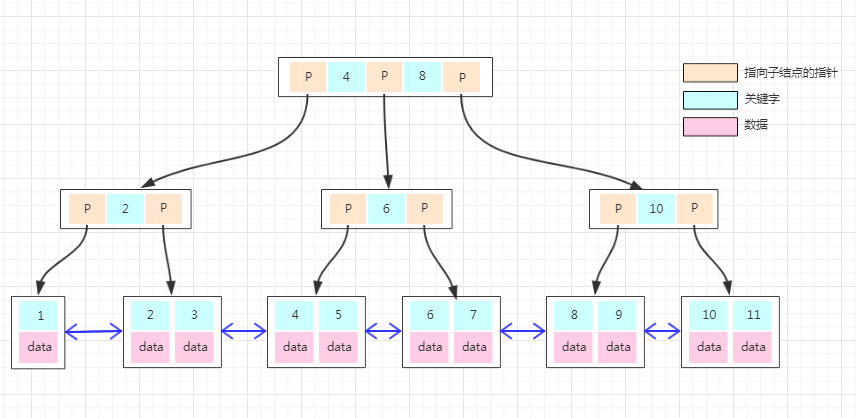
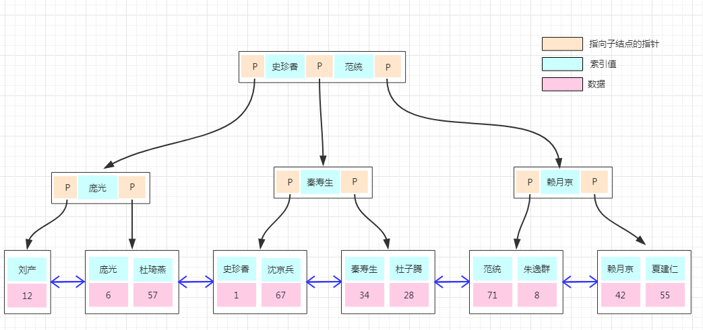

# MySQL 附加的语言元素

除了标准的 DDL、DML、DCL 外，不同的数据库管理系统还扩展了其他语言元素。

就算其他数据库也有同名的语言元素，作用可能也不同：

+ 例如 GO，在 MySQL 中不存在，因为 MySQL 中不同的代码段之间是不需要用 GO 关键字来分割的，默认分号结束就可以了。


## 标识符

Mysql 中的某些对象，包括数据库，table，索引，列，别名，视图，存储过程，分区，table 空间和其他对象名，称为标识符。

[中文手册：9.2 架构对象名称](https://www.docs4dev.com/docs/zh/mysql/5.7/reference/identifiers.html) 


## 关键字

[中文手册：9.3 关键字和保留字](https://www.docs4dev.com/docs/zh/mysql/5.7/reference/keywords.html)


## 变量

一般可以将 MySQL 中的变量分为全局变量、会话变量、用户变量和局部变量：

[MySQL中全局变量、会话变量、用户变量和局部变量的区别](https://www.modb.pro/db/12232) 


**全局变量**

+ 用 `@@` 标识；

+ MySQL 服务器启动时会使用其软件内置的变量（俗称写死在代码中的）和配置文件中的变量（如果允许，是可以覆盖源代码中的默认值的）来初始化整个 MySQL 服务器的运行环境；

+ 这些在内存中的全局变量有很多是可以动态调整的，也就是说可以在 MySQL 服务器运行期间通过 `SET` 命令修改全局变量，而不需要重新启动 MySQL 服务，但是这种方法在修改大部分变量的时候都需要超级权限，比如 root 账户；

+ 查询：

  ```mysql
  // 查询所有的全局变量
  show global variables;
  
  // 加个like控制过滤条件
  show global variables like 'sql%';
  
  // 通过select语句
  select @@global.sql_mode;
  select @@max_connections;
  ```

+ 设置：

  ```mysql
  set global sql_mode='';
  
  set @@global.sql_mode='';
  ```


**会话变量**

+ 用 `@@` 标识；

+ 当有客户端连接到 MySQL 服务器的时候，MySQL 服务器会将这些全局变量的大部分复制一份作为这个连接客户端的会话变量；

+ 这些会话变量与客户端连接绑定，连接的客户端可以修改其中允许修改的变量；

+ 但是当连接断开时这些会话变量全部消失，重新连接时会从全局变量中重新复制一份；

+ 会话对变量修改的要求比全局变量低，因为修改会话变量通常只会影响当前连接；

+ 但是有个别一些变量是例外的，修改它们也需要较高的权限，比如 `binlog_format` 和 `sql_log_bin`，因为设置这些变量的值将影响当前会话的二进制日志记录，也有可能对服务器复制和备份的完整性产生更广泛的影响；

+ 查询：

  ```mysql
  show session variables;
  
  show session variables like 'sql%';
  
  select @@session.sql_mode;
  select @@local.sql_mode;
  select @@sql_mode;
  ```

+ 设置：

  ```mysql
  set session sql_mode = '';
  set local sql_mode = '';
  set @@session.sql_mode = '';
  set @@local.sql_mode = '';
  set @@sql_mode = '';
  set sql_mode = '';
  ```


**用户变量**

+ 用 `@` 标识；

+ 与连接相关的变量不只有会话变量一种，用户变量也是这样的；

+ 用户变量其实就是用户自定义变量，当客户端连接上 MySQL 服务器之后就可以自己定义一些变量；

+ 这些变量在整个连接过程中有效，当连接断开时，这些用户变量消失；

+ 用户变量完全不需要权限，它的定义和使用全都由用户自己掌握；

+ 查询：

  ```mysql
  select @count;
  ```

+ 设置：

  ```mysql
  set @count=1;
  set @sum:=0;
  
  select count(id) into @count from items where price < 99;
  ```


**局部变量**

+ 用 `@` 标识；

+ 通常由 `DECLARE` 关键字来定义，经常出现在存储过程中，非常类似于 C 和 C++ 函数中的局部变量；

+ 用于中间计算结果，交换数据等等，当存储过程执行完，变量的生命周期也就结束了；

+ 局部变量的权限和用户变量一样；

+ 查询：

  ```mysql
  declare count int(4);
  select count;
  ```

+ 设置：

  ```mysql
  declare count int(4);
  declare sum int(4);
  set count=1;
  set sum:=0;
  
  declare count int(4);
  select count(id) into count from items where price < 99;
  ```


## 运算符

MySQL 主要有以下几种运算符：算术运算符、比较运算符、逻辑运算符、位运算符


**算术运算符**

+ 在除法运算和模运算中，如果除数为0，将是非法除数，返回结果为NULL；

+ | 运算符   | 作用 |
  | :------- | :--- |
  | +        | 加法 |
  | -        | 减法 |
  | *        | 乘法 |
  | / 或 DIV | 除法 |
  | % 或 MOD | 取余 |


**比较运算符**

+ 比较结果为真，则返回 1，为假则返回 0，比较结果不确定则返回 NULL；

+ | 符号            | 描述                       | 备注                                                         |
  | :-------------- | :------------------------- | :----------------------------------------------------------- |
  | =               | 等于                       |                                                              |
  | <>, !=          | 不等于                     |                                                              |
  | >               | 大于                       |                                                              |
  | <               | 小于                       |                                                              |
  | <=              | 小于等于                   |                                                              |
  | >=              | 大于等于                   |                                                              |
  | BETWEEN         | 在两值之间                 | >=min&&<=max                                                 |
  | NOT BETWEEN     | 不在两值之间               |                                                              |
  | IN              | 在集合中                   |                                                              |
  | NOT IN          | 不在集合中                 |                                                              |
  | <=>             | 严格比较两个NULL值是否相等 | 两个操作码均为 NULL 时，其所得值为1；而当一个操作码为 NULL 时，其所得值为0 |
  | LIKE            | 模糊匹配                   |                                                              |
  | REGEXP 或 RLIKE | 正则式匹配                 |                                                              |
  | IS NULL         | 为空                       |                                                              |
  | IS NOT NULL     | 不为空                     |                                                              |


**逻辑运算符**

+ 逻辑运算符用来判断表达式的真假；

+ 如果表达式是真，结果返回 1。如果表达式是假，结果返回 0；

+ | 运算符号 | 作用     |
  | :------- | :------- |
  | NOT 或 ! | 逻辑非   |
  | AND      | 逻辑与   |
  | OR       | 逻辑或   |
  | XOR      | 逻辑异或 |


**位运算符**

+ 位运算符是在二进制数上进行计算的运算符；

+ 位运算会先将操作数变成二进制数，进行位运算，然后再将计算结果从二进制数变回十进制数；

+ | 运算符号 | 作用     |
  | :------- | :------- |
  | &        | 按位与   |
  | \|       | 按位或   |
  | ^        | 按位异或 |
  | !        | 取反     |
  | <<       | 左移     |
  | >>       | 右移     |


**运算符优先级**

+ [菜鸟教程：MySQL 运算符](https://www.runoob.com/mysql/mysql-operator.html) 
+ 最高优先级为： `!`、`BINARY`、 `COLLATE`。


# 数据类型

[官方手册：Chapter 11 Data Types](https://dev.mysql.com/doc/refman/8.0/en/data-types.html) 


## 数值类型

+ MySQL 支持所有标准 SQL 数值数据类型；
  + 包括严格数值数据类型，INTEGER、SMALLINT、DECIMAL、 NUMERIC；
  + 以及近似数值数据类型，FLOAT、REAL、 DOUBLE PRECISION；
  + 关键字 INT 是 INTEGER 的同义词，关键字 DEC 是 DECIMAL 的同义词；

+ BIT 数据类型保存位字段值，并且支持 MyISAM、MEMORY、InnoDB 和 BDB表；

+ 作为 SQL 标准的扩展，MySQL 也支持整数类型 TINYINT、MEDIUMINT、 BIGINT；

| 类型         | 大小                                     | 范围（有符号）                                               | 范围（无符号）                                               | 用途            |
| :----------- | :--------------------------------------- | :----------------------------------------------------------- | :----------------------------------------------------------- | :-------------- |
| TINYINT      | 1 Bytes                                  | (-128，127)                                                  | (0，255)                                                     | 小整数值        |
| SMALLINT     | 2 Bytes                                  | (-32 768，32 767)                                            | (0，65 535)                                                  | 大整数值        |
| MEDIUMINT    | 3 Bytes                                  | (-8 388 608，8 388 607)                                      | (0，16 777 215)                                              | 大整数值        |
| INT或INTEGER | 4 Bytes                                  | (-2 147 483 648，2 147 483 647)                              | (0，4 294 967 295)                                           | 大整数值        |
| BIGINT       | 8 Bytes                                  | (-9,223,372,036,854,775,808，9 223 372 036 854 775 807)      | (0，18 446 744 073 709 551 615)                              | 极大整数值      |
| FLOAT        | 4 Bytes                                  | (-3.402 823 466 E+38，-1.175 494 351 E-38)，0，(1.175 494 351 E-38，3.402 823 466 351 E+38) | 0，(1.175 494 351 E-38，3.402 823 466 E+38)                  | 单精度 浮点数值 |
| DOUBLE       | 8 Bytes                                  | (-1.797 693 134 862 315 7 E+308，-2.225 073 858 507 201 4 E-308)，0，(2.225 073 858 507 201 4 E-308，1.797 693 134 862 315 7 E+308) | 0，(2.225 073 858 507 201 4 E-308，1.797 693 134 862 315 7 E+308) | 双精度 浮点数值 |
| DECIMAL      | 对DECIMAL(M,D) ，如果M>D，为M+2否则为D+2 | 依赖于M和D的值                                               | 依赖于M和D的值                                               | 小数值          |


## 日期和时间类型

+ DATETIME、DATE、TIMESTAMP、TIME、YEAR；
+ 每个时间类型有一个有效值范围和一个"零"值，当指定不合法的 MySQL 不能表示的值时使用"零"值；
+ TIMESTAMP类型有专有的自动更新特性；

| 类型      | 大小 ( bytes) | 范围                                                         | 格式                | 零值                  | 用途                     |
| :-------- | :------------ | :----------------------------------------------------------- | :------------------ | --------------------- | :----------------------- |
| DATE      | 3             | 1000-01-01/9999-12-31                                        | YYYY-MM-DD          | '0000-00-00'          | 日期值                   |
| TIME      | 3             | '-838:59:59'/'838:59:59'                                     | HH:MM:SS            | '00:00:00'            | 时间值或持续时间         |
| YEAR      | 1             | 1901/2155                                                    | YYYY                | 0000                  | 年份值                   |
| DATETIME  | 8             | 1000-01-01 00:00:00/9999-12-31 23:59:59                      | YYYY-MM-DD HH:MM:SS | '0000-00-00 00:00:00' | 混合日期和时间值         |
| TIMESTAMP | 4             | 1970-01-01 00:00:00/2038结束时间是第 2147483647 秒，北京时间 2038-1-19 11:14:07，格林尼治时间 2038年1月19日 凌晨 03:14:07 | YYYYMMDD HHMMSS     | '0000-00-00 00:00:00' | 混合日期和时间值，时间戳 |


## 字符串类型

+ CHAR、VARCHAR、BINARY、VARBINARY、BLOB、TEXT、ENUM、SET；
+ char(n) 和 varchar(n) 中括号中 n 代表字符的个数，并不代表字节个数，比如 CHAR(30) 就可以存储 30 个字符；
+ CHAR 和 VARCHAR 类型类似，但它们保存和检索的方式不同。它们的最大长度和是否尾部空格被保留等方面也不同，在存储或检索过程中不进行大小写转换；
+ BINARY 和 VARBINARY 类似于 CHAR 和 VARCHAR，不同的是它们包含二进制字符串而不要非二进制字符串。也就是说，它们包含字节字符串而不是字符字符串。这说明它们没有字符集，并且排序和比较基于列值字节的数值值；
+ BLOB 是一个二进制大对象，可以容纳可变数量的数据。有 4 种 BLOB 类型：TINYBLOB、BLOB、MEDIUMBLOB 和 LONGBLOB。它们区别在于可容纳存储范围不同。
+ 有 4 种 TEXT 类型：TINYTEXT、TEXT、MEDIUMTEXT 和 LONGTEXT。对应的这 4 种 BLOB 类型，可存储的最大长度不同，可根据实际情况选择；

| 类型       | 大小                  | 用途                            |
| :--------- | :-------------------- | :------------------------------ |
| CHAR       | 0-255 bytes           | 定长字符串                      |
| VARCHAR    | 0-65535 bytes         | 变长字符串                      |
| TINYBLOB   | 0-255 bytes           | 不超过 255 个字符的二进制字符串 |
| TINYTEXT   | 0-255 bytes           | 短文本字符串                    |
| BLOB       | 0-65 535 bytes        | 二进制形式的长文本数据          |
| TEXT       | 0-65 535 bytes        | 长文本数据                      |
| MEDIUMBLOB | 0-16 777 215 bytes    | 二进制形式的中等长度文本数据    |
| MEDIUMTEXT | 0-16 777 215 bytes    | 中等长度文本数据                |
| LONGBLOB   | 0-4 294 967 295 bytes | 二进制形式的极大文本数据        |
| LONGTEXT   | 0-4 294 967 295 bytes | 极大文本数据                    |


## 空间类型

MySQL 空间扩展支持地理特征的生成，存储和分析：

- 用于表示空间值的数据类型；
- 用于操纵空间值的函数；
- 空间索引可改善空间列的访问时间；


## JSON 数据类型

+ 自 MySQL5.7.8 版本以来，MySQL 支持原生 JSON 数据类型；
+ MySQL 以内部格式存储 JSON 文档，允许对文档元素的快速读取访问；
+ JSON 文档的存储大约与存储 LONGBLOB 或 LONGTEXT 数据量相同；
+ JSON 列存储的必须是 JSON 格式数据，否则会报错；
+ JSON 数据类型没有默认值的。


# 函数

[官方手册：Chapter 12 Functions and Operators](https://dev.mysql.com/doc/refman/8.0/en/functions.html) 

[中文手册：函数和操作符](http://www.mysqlab.net/docs/view/refman-5.1-zh/chapter/functions.html) 

[菜鸟教程：MySQL 函数](https://www.runoob.com/mysql/mysql-functions.html) 


## 确定性函数和不确定性函数

+ 确定性函数：只要使用特定的输入值集并且数据库具有相同的状态，那么不管何时调用，确定性函数始终都会返回相同的结果；
  + 例如，函数 AVG 对上述给定的限定条件始终返回相同的值。
+ 不确定性函数：即使访问的数据库的状态不变，每次使用特定的输入值集调用非确定性函数都可能会返回不同的结果；
  + 例如，GETDATE 函数始终会返回不同的结果。
+ 如果一个视图引用了任何不确定性函数，则无法对该视图创建聚集索引。
+ [SQL Server 确定性函数和不确定性函数](https://docs.microsoft.com/zh-cn/sql/relational-databases/user-defined-functions/deterministic-and-nondeterministic-functions?view=sql-server-ver15) 


# 约束

查看数据表中的约束

```bash
SHOW CREATE TABLE <数据表名>;
```


## 三大完整性

关系型数据库有三大完整性要求：

+ 实体完整性：用于保证关系数据库中每个元组都是可区分的，唯一的。
  + 实体属性中的标识属性不能为空、不能重复；
  + 该约束通过制定的主键实现；
  + 该约束由系统强制执行。
+ 参照完整性：
  + 实体中的外键可以为空，但不能出错；
  + 不能删除有外键约束的属性；
  + 该约束通过制定的外键实现；
  + 该约束由系统强制执行。
+ 户定义完整性：反映某一具体应用所涉及的数据必须满足的语意要求：
  + 该约束通过在制定列添加 default、check、unique 等方式实现。


## 主键约束

表通常具有包含唯一标识表中每一行的值的一列或一组列，这样的一列或多列称为表的主键，用于强制表的实体完整性：

+ 在创建或修改表时，可以通过定义 **PRIMARY KEY** 约束来创建主键；

+ 一个表只能有一个主键，并且主键约束中的列不能接受空值；

  + 主键约束可以保证数据的唯一性和非空，因此经常对标识列定义这种约束；
  + 如果指定了主键约束，则数据库引擎将通过为主键列创建唯一索引来强制数据的唯一性。所以**主键也是一个特殊的索引**，当在查询中使用主键时，此索引可以用来对数据进行快速访问。所以，所选的主键列必须遵守创建唯一索引的规则。

+ 可以对多列组合进行主键约束，即，联合主键；

  + 如果对多列定义了主键约束，则一列的值可以重复，但是所有列的任何值组合必须唯一；
  + 指定联合主键的列最多 16 个
  + 例如，将部门名和职工姓名一起设为主键，并不是对这两个字段都加主键约束。

+ 主键常常与外键构成参照完整性约束，防止出现数据不一致；

+ 示例：

  + 比如学生表里有学号和姓名，姓名可能有重名的，但学号确是唯一的，你要从学生表中搜索一条纪录如查找一个人，就只能根据学号去查找，这才能找出唯一的一个，这就是主键。

    ```shell
    `id` INT(10) NOT NULL PRIMARY KEY AUTO_INCREMENT 
    ```


## 外键约束

外键是用来建立和加强两个表数据之间的链接的一列或多列，用来维护两个表之间数据的一致性：

+ 在创建或修改表时，可以通过定义 **FOREING KEY** 约束来创建主键；
+ 在外键引用中，当一个表的列被引用作为另一个表的主键值的列时，就在两表之间创建了链接，这个列称为第二个表的外键；
  + 表的外键就是另一表的主键；
  + 按照主从关系，必须先有主表（外键关系中的父表），再有从表（外键关系中的字表）；


+ 要删除一张表中的主键必须首先要确保其它表中的没有相同外键（即该表中的主键没有一个外键和它相关联）；

+ 级联操作：

  + CASCADE：在主表更新时，子表（们）产生连锁更新动作；

    + ```mysql
      ON UPDATE CASCADE;
      ```

  + RESTRICT：禁止主表变更；

  + SET NULL：子表相应字段设置为空

+ 示例：

  + 假如某个电脑生产商，它的数据库中保存着整机和配件的产品信息。用来保存整机产品信息的表叫做 Pc，用来保存配件供货信息的表叫做 Parts；

  + 在 Pc 表中有一个字段，用来描述这款电脑所使用的 CPU 型号；

  + 在 Parts 表中相应有一个字段，描述的正是 CPU 的型号，我们可以把它想成是全部 CPU 的型号列表。

  + 很显然，这个厂家生产的电脑，其使用的 CPU 一定是供货信息表 Parts 中存在的型号。

  + 这时，两个表中就存在一种约束关系 constraint —— Pc 表中的 CPU 型号受到 Parts 表中型号的约束。

  + 若要设置外键，在参照表（referencing table，即 Pc 表）和被参照表（referencedtable，即 Parts表） 中，相对应的两个字段必须都设置索引 index。

  + ```mysql
    // --> 初始化表结构
    CREATE TABLE parts (
    ... 字段定义 ...,
    model VARCHAR(20) NOT NULL,
    ... 字段定义 ...
    );
    
    CREATE TABLE pc (
    ... 字段定义 ...,
    cpumodel VARCHAR(20) NOT NULL,
    ... 字段定义 ...
    };
    
    // --> 事实上这两个索引可以在创建表的时候就设置
    ALTER TABLE parts ADD INDEX idx_model (model);
    ALTER TABLE pc ADD INDEX idx_cpumodel (cpumodel);
    
    // --> 因为 pc 的 CPU 型号必须参照 parts 表中的相应型号，所以我们将 Pc 表的 cpumodel 字段设置为“外键”(FOREIGNKEY)，即这个键的参照值来自于其他表。
    ALTER TABLE pc ADD CONSTRAINT fk_cpu_model
    FOREIGN KEY (cpumodel) REFERENCES parts (model)
    ON UPDATE CASCADE;
    ```

    + 如果我们试着 CREATE 一台 Pc，它所使用的 CPU 的型号是 Parts 表中不存在的，那么 MySQL 会禁止这台 PC 被 CREATE 出来。
    + 当 parts 表中那些 Referenced Column 有所变化时，相应表中的 Referencing Column 也能自动更正。

## 其他约束

**DEFAULT：**

+ 在表中插入一条新记录时，如果没有为某个字段赋值，系统就会自动为这个字段插入默认值；

+ 语法：

  ```mysql
  // 创建
  CREATE TABLE <表名>
  (
  <字段名> <数据类型> DEFAULT <默认值>
  );
  
  // 修改
  ALTER TABLE <数据表名>
  CHANGE COLUMN <字段名> <数据类型> DEFAULT <默认值>;
  
  // 删除
  ALTER TABLE <数据表名>
  CHANGE COLUMN <字段名> <字段名> <数据类型> DEFAULT NULL;
  ```

+ 使用规则：
  + 定义的常量必须与该列的数据类型、精度等匹配；
  + 每个列只能定义一个 DEAFULT 约束；
  + DEFAULT 约束只能用于 INSERT 语句；
  + DEFAULT 约束不能与 IDENTITY 属性列重复定义在一个列上；
  + DEFAULT 约束允许的系统函数包括 SYSTEM_USER、GETDATE 和 CUERREND_USER。


**CHECK：**

+ 在更新表数据的时候，系统会检查更新后的数据行是否满足 CHECK 约束中的限定条件；

  + 若将 CHECK 约束子句置于表中某个列的定义之后，则这种约束也称为基于列的 CHECK 约束；
  + 若将 CHECK 约束子句置于所有列的定义以及主键约束和外键定义之后，则这种约束也称为基于表的 CHECK 约束，该约束可以同时对表中多个列设置限定条件；

+ 语法：

  ```mysql
  // 创建
  CREATE TABLE <表名>
  (
  <字段名> <数据类型> CHECK(<检查约束>)
  );
  
  // 修改
  ALTER TABLE <数据表名>
  ADD CONSTRAINT <检查约束名> CHECK(<检查约束>);
  
  // 删除
  ALTER TABLE <数据表名>
  DROP CONSTRAINT <检查约束名>;
  ```

+ 使用规则：

  + 一个列上可以定义多个 CHECK 约束；
  + CHECK 约束用于 INSERT 和 UPDATE 语句；
  + CHECK 约束可以同时参考本表的其他列，并不局限于某一列；
  + CHECK 约束不能与 IDENTITY 属性列重复定义在一个列上。


**UNIQUE：**

+ 指定表中某一列或多列不能有相同的两行及其以上的数据存在，通过实现唯一性索引来强制实体完整性；

+ 语法：

  ```mysql
  // 创建
  CREATE TABLE <表名>
  (
  <字段名> <数据类型> UNIQUE
  );
  
  // 修改
  ALTER TABLE <数据表名>
  ADD CONSTRAINT <唯一约束名> UNIQUE(<列名>);
  
  // 删除
  ALTER TABLE <数据表名>
  DROP INDEX <唯一约束名>;
  ```

+ 使用规则：

  + 可以对表定义多个 UNIQUE 约束，但只能定义一个 PRIMARY KEY 约束；
  + UNIQUE 约束允许 NULL 值，当参与 UNIQUE 约束的任何值一起使用时，每列仅允许一个空值，但 PRIMARY KEY 约束不允许为 NULL 值。


**NOT NULL：**

+ 对于使用了非空约束的字段，如果用户在添加数据时没有指定值，数据库系统就会报错；

+ 语法：

  ```mysql
  // 创建
  CREATE TABLE <表名>
  (
  <字段名> <数据类型> NOT NULL
  );
  
  // 修改
  ALTER TABLE <数据表名>
  CHANGE COLUMN <字段名>
  <字段名> <数据类型> NOT NULL;
  
  // 删除
  ALTER TABLE <数据表名>
  CHANGE COLUMN <字段名>
  <字段名> <数据类型> NULL;
  ```


# 索引

+ 索引是一种特殊的数据库结构，索引包含从表或者视图中一个或多个列生成的键，以及映射到指定数据的存储位置的指针；
+ 索引就是根据表中的一列或若干列按照一定顺序建立的列值与记录行之间的对应关系表，实质上是一张描述索引列的列值与原表中记录行之间一 一对应关系的有序表；
+ 可以用来快速查询数据表中有某一特定值的记录；

  + 在 MySQL 中，通常有以下两种方式访问数据库表的行数据：

    +  顺序访问（表扫描）：
      + 顺序访问是在表中实行全表扫描，从头到尾逐行遍历，直到在无序的行数据中找到符合条件的目标数据；
      + 顺序访问实现比较简单，但是当表中有大量数据的时候，效率非常低下；
      + 例如，在几千万条数据中查找少量的数据时，使用顺序访问方式将会遍历所有的数据，花费大量的时间，显然会影响数据库的处理性能。

    + 索引访问：
      + 索引访问是通过遍历索引来直接访问表中记录行的方式；
      + 使用这种方式的前提是对表建立一个索引，在列上创建了索引之后，查找数据时可以直接根据该列上的索引找到对应记录行的位置，从而快捷地查找到数据。
      + 例如，在学生基本信息表 tb_students 中，如果基于 student_id 建立了索引，系统就建立了一张索引列到实际记录的映射表。当用户需要查找 student_id 为 12022 的数据的时候，系统先在 student_id 索引上找到该记录，然后通过映射表直接找到数据行，并且返回该行数据。

  + 通过索引，查询数据时不用读完记录的所有信息，而只是查询索引列。否则，数据库系统将读取每条记录的所有信息进行匹配；


## 优缺点

索引可以提高查询速度，但是会影响插入记录的速度。

**优点：**

+ 通过创建唯一索引可以保证数据库表中每一行数据的唯一性；
+ 可以大大加快数据的检索速度；
+ 在使用 GROUP BY 和 ORDER BY 子句进行数据查询时，可以显著减少查询中分组和排序的时间；
+ 加快表与表之间的连接，特别是具有主、外键关系的表之间。

**缺点：**

+ 创建和维护索引组要耗费时间，并且随着数据量的增加而增加；
+ 索引需要占磁盘空间，除了数据表占数据空间以外，每一个索引还要占一定的物理空间，如果要建立聚集索引，所需要的空间会更大；如果有大量的索引，索引文件可能比数据文件更快达到最大文件尺寸；
+ 当对表中的数据进行增加、删除和修改的时候，索引也要动态维护，这样就降低了数据的维护速度；
+ 向有索引的表中插入记录时，数据库系统会按照索引进行排序，这样就降低了插入记录的速度，插入大量记录时的速度影响会更加明显。

**适用索引：**

+ 在经常需要索引的列上，可以加快检索的速度；
+ 在作为主键的列上，强制该列的唯一性和组织表中数据的排列结构；
+ 在经常用在连接的列上，这些列主要是一些外键，可以加快连接的速度；
+ 在经常需要排序的列上创建索引，因为索引已经排序，这样查询可以利用索引的排序，加快排序查询时间；
+ 在经常使用 WHERE 子句的列上面创建索引，加快条件的判断速度。

**不适用索引：**

+ 对于那些在查询很少使用或者参考的列不应该创建索引：因为，既然这些列很少使用到，增加索引也不能提高查询速度，相反，由于增加了索引，反而降低了系统的维护速度，增大了空间需求；
+ 对于那些只有很少数据值的列不应该创建索引：因为，这些列的取值很少，例如性别列，在查询的结果中，结果集的数据行占了表中数据行的很大比例，即需要在表中搜索的数据行的比例很大，增加索引，并不能明显加快检索速度；
+ 对于那些定义为 text、iamge 和 bit 的数据类型的列不应该创建索引：因为，这些列的数据量要么相当大，要么取值很少；
+ 当修改性能远远大于检索性能时不应该创建索引：因为，修改性能和检索性能是相互矛盾的，当增加索引时，会提高检索性能，但会降低修改性能，反之。


## 聚集索引和非聚集索引

MySQL 的 Innodb 存储引擎的索引分为聚集索引和非聚集索引两大类，类似汉语字典的索引：

+ 汉语字典提供了两类检索汉字的方式，第一类是拼音检索（前提是知道该汉字读音），比如拼音为 cheng 的汉字排在拼音 chang 的汉字后面，根据拼音找到对应汉字的页码（因为按拼音排序，二分查找很快就能定位），这就是我们通常所说的字典序；
+ 第二类是部首笔画检索，根据笔画找到对应汉字，查到汉字对应的页码；
+ 拼音检索就是聚集索引，因为存储的记录（数据库中是行数据、字典中是汉字的详情记录）是按照该索引排序的；
+ 笔画索引就是非聚集索引，虽然笔画相同的字在笔画索引中相邻，但是实际存储页码却不相邻。


**聚集索引：**

索引中键值的逻辑顺序决定了表中相应行的物理顺序：

+ 类似于按姓氏排列的电话簿，按拼音排序的汉语字典；
+ 聚集索引确定表中数据的物理顺序；
+ 聚集索引对于那些经常要搜索范围值的列特别有效：
  + 使用聚集索引找到包含第一个值的行后，便可以确保包含后续索引值的行在物理相邻；
  + 例如，如果应用程序执行的一个查询经常检索某一日期范围内的记录，则使用聚集索引可以迅速找到包含开始日期的行，然后检索表中所有相邻的行，直到到达结束日期。这样有助于提高此类查询的性能；
  + 同样，如果对从表中检索的数据进行排序时经常要用到某一列，则可以将该表在该列上聚集（物理排序），避免每次查询该列时都进行排序，从而节省成本。
+ 每个表只能有一个聚集索引，因为表中数据的物理顺序只能有一个；
+ 表中行的物理顺序和索引中行的物理顺序是相同的，在创建任何非聚集索引之前需要先创建聚集索引，这是因为聚集索引改变了表中行的物理顺序，数据行按照一定的顺序排列，并且自动维护这个顺序；
+ 
  + 聚集索引存储在 b+tree 中，有以下特点：
    + 所有的非叶子节点只存储关键字信息；
    + 所有卫星数据（具体数据）都存在叶子结点中；
    + 所有的叶子结点中包含了全部元素的信息；
    + 所有叶子节点之间都有一个链指针。
  + 因此：
    + 对一个范围内的查询特别有效快速（通过叶子的链指针）；
    + 对具体的 key 值查询仅仅比 b-tree 低效一点（因为要到叶子一级），但也可以忽略。
  + 具体搜索过程：
    + 当系统访问表中数据时，首先确定在相应列上是否存在有所以，以及该索引是否对要检索的数据有意义；
    + 如果索引存在并且非常有意义，那么系统使用该索引访问表中的记录；
    + 系统从索引开始浏览数据，索引浏览则从树状索引的根部开始；
    + 从根部开始，搜索值与每一个关键值相比较，确定搜索值是否大于或者等于关键值，这一步重复进行，直到碰上一个比搜索值大的关键值，或者该搜索值大于或等于索引页上所有的关键值为止。


**非聚集索引：**

索引中索引的逻辑顺序与磁盘上行的物理存储顺序不同：

+ 类似于新华字典的偏旁字典，结构顺序与实际存放顺序不一定一致；

+ 除了聚集索引以外的索引都是非聚集索引，如果再细分一下非聚集索引，可以分成普通索引、唯一索引、全文索引；

+ 每个表可以创建不多于 249 个非聚集索引，默认情况下创建的都是非聚集索引；

+ 基础表的数据行不按非聚集键的顺序排列和存储；

+ 非聚集索引有两种体系结构：

  + 在没有聚集索引的表上创建非聚集索引；
    + 那么这个数据表也被称为数据堆；
    + 当非聚集索引在数据堆的顶部创建时，系统使用索引页中的行标识符指向数据页中的记录；
    + 行标识符存储了数据所在位置的信息。
  + 在有聚集索引的表上创建非聚集索引；
    + 当非聚集索引创建在有聚集索引的表上时，系统使用索引页中的指向聚集索引的聚集键，聚集键存储了数据的位置信息；
    + 如果一个表有聚集索引，那么非聚集索引的叶级包含了映射到聚集键的聚集键值，而不是映射到物理的行标识符；
    + 当系统访问有非聚集索引的表中数据时，并且这种非聚集索引创建在聚集索引上，那么它首先从非聚集索引来找到指向聚集索引的指针，然后通过使用聚集索引来查找数据。

+ 

  + 非聚集索引的存储结构与聚集索引是一样的，不同的是在叶子结点的数据部分存的不再是具体的数据，而数据的聚集索引的 key；

  + 所以通过非聚集索引查找的过程是先找到该索引 key 对应的聚集索引的 key，然后再拿聚集索引的 key 到主键索引树上查找对应的数据，这个过程称为**回表**；

  + 例如：

    ```mysql
    create table student (
    
    `id` INT UNSIGNED AUTO_INCREMENT,
    
    `username` VARCHAR(255),
    `score` INT,
    PRIMARY KEY(`id`), KEY(`username`) ) ENGINE=InnoDB DEFAULT CHARSET=utf8;
    ```

    + 聚集索引 id，非聚集索引 username；

    + 使用以下语句进行查询，不需要进行二次查询，直接就可以从非聚集索引的节点里面就可以获取到查询列的数据：

      ```mysql
      select id, username from t1 where username = '小明'
      select username from t1 where username = '小明'
      ```

    + 但是使用以下语句进行查询，就需要二次的查询去获取原数据行的 score：

      ```mysql
      select username, score from t1 where username = '小明'
      ```

+ 可以通过复合索引解决非聚集索引的二次查询问题：

  + 建立两列以上的索引，即可查询复合索引里的列的数据而不需要进行回表二次查询，如 `index(col1, col2)`，执行下面的语句：

    ```mysql
    select col1, col2 from t1 where col1 = '213';
    ```

  + 要注意使用复合索引需要满足最左侧索引的原则，也就是查询的时候如果 where 条件里面没有最左边的一到多列，索引就不会起作用。


**与约束的关系：**

+ 主键约束：
  + 在创建主键约束时，系统自动创建一个唯一性的聚集索引；
  + 在逻辑上，主键约束是一种重要的数据结构，但在物理结构上，与主键约束对应的结构是唯一性聚集索引；
+ 唯一性约束：
  + 在创建唯一性约束时，系统自动创建一个唯一性的非聚集索引；


**何时使用聚集索引或非聚集索引**： 

| 动作描述           | 使用聚集索引 | 使用非聚集索引 |
| ------------------ | ------------ | -------------- |
| 列经常被分组排序   | 应           | 应             |
| 返回某范围内的数据 | 应           | 不应           |
| 一个或极少不同值   | 不应         | 不应           |
| 小数目的不同值     | 应           | 不应           |
| 大数目的不同值     | 不应         | 应             |
| 频繁更新的列       | 不应         | 应             |
| 外键列             | 应           | 应             |
| 主键列             | 应           | 应             |
| 频繁修改索引列     | 不应         | 应             |


## 自增主键

+ 自增主键是指自增列上定义的主键；

+ 定义语法：

  ```mysql
  NOT NULL PRIMARY KEY AUTO_INCREMENT
  ```

  

目前 MySQL 中一般将自增 Id 强制设定为主键索引，这是为了 b+tree 和分页：

+ MySQL 中每次新增数据，都是将一个页写满，然后新创建一个页继续写，这里其实是有个隐含条件的，那就是主键自增；
+ 主键自增写入时新插入的数据不会影响到原有页，插入效率高，而且页的利用率高；
+ 主键自增时每次插入一条新记录，都是追加操作，都不涉及到挪动其他记录，也不会触发叶子节点的分裂；
+ 而且主键长度越小，普通索引的叶子节点就越小，普通索引占用的空间也就越小；
+ 但是如果主键是无序的或者随机的，那每次的插入可能会导致原有页频繁的分裂，影响插入效率，降低页的利用率，这也是为什么在 innodb 中建议设置主键自增的原因；
+ 在 innodb中，如果一个表没有主键，那默认会找建了唯一索引的列，如果也没有，则会生成一个隐形的字段作为主键。


适合用业务字段直接做主键：

+ 只有一个索引；
+ 该索引必须是唯一索引。


## 分类

**MySQL索引按字段特性分类可分为：** 

+ 主键索引：建立在主键上的索引被称为主键索引；
  + 一张数据表只能有一个主键索引，索引列值不允许有空值，通常在创建表时一起创建；
  + **PRIMARY KEY** 
+ 唯一索引：建立在 UNIQUE 字段上的索引被称为唯一索引；
  + 一张表可以有多个唯一索引，索引列值允许为空，列值中出现多个空值不会发生重复冲突；
  + 唯一索引可以保证索引列中的全部数据是唯一的，不会包含重复数据；
  + 只能在可以保证实体完整性的列上创建唯一索引；
  + **UNIQUE KEY** 
+ 普通索引：建立在普通字段上的索引被称为普通索引；
  + **KEY** 
+ 前缀索引：指对字符类型字段的前几个字符或对二进制类型字段的前几个 bytes 建立的索引，而不是在整个字段上建索引；
  + 前缀索引可以建立在类型为 char、varchar、binary、varbinary 的列上，可以大大减少索引占用的存储空间，也能提升索引的查询效率。
  + **INDEX(x)**  


**MySQL索引按字段个数分类可分为：**

+ 单列索引：建立在单个列上的索引被称为单列索引；
+ 联合索引：建立在多个列上的索引被称为联合索引，又叫复合索引、组合索引。


## 设计原则

+ 最左前缀匹配原则：

  + 必须按照从左到右的顺序匹配；

    ```mysql
    create index ix_name_email on s1(name,email)
    
    select * from s1 where name='egon'; # 可以
    select * from s1 where name='egon' and email='asdf'; # 可以
    select * from s1 where email='alex@oldboy.com'; # 不可以
    ```

  + MySQL 会一直向右匹配直到遇到范围查询（>、<、between、like）就停止匹配；

    + 比如 `a = 1 and b = 2 and c > 3 and d = 4` 如果建立 (a,b,d,c) 顺序的索引，d 是用不到索引的；
    + 如果建立 (a,b,d,c) 的索引则都可以用到，a,b,d 的顺序可以任意调整。

  + ORDER BY 能使用索引最左前缀：

    ```mysql
    KEY a_b_c(a,b,c)
    
    ORDER BY a
    ORDER BY a, b
    ORDER BY a, b, c
    ORDER BY a DESC, b DESC, c DESC
    
    # 不会使用索引
    ORDER BY a ASC, b DESC, c DESC # 排序需要保持一致
    ```

  + WHERE 使用索引的最左前缀定义为常量时，则 ORDER BY 也能使用索引：

    ```mysql
    WHERE a = const ORDER BY b, c
    WHERE a = const AND b = const ORDER BY c
    WHERE a = const AND b > const ORDER BY b, c
    WHERE a in (...) ORDER BY b, c # 对于排序来说，多个相等条件也是范围查询
    
    # 不会使用索引
    WHERE g = const ORDER BY b, c # 丢失 a 索引
    WHERE a = const ORDER BY c # 丢失 b 索引
    WHERE a = const ORDER BY a, d # d 不是索引的一部分
    ```

  + 如果通过调整顺序，可以少维护一个索引，那么这个顺序往往就是需要优先考虑采用的：

    + 例如当已经有了 (a,b) 这个联合索引后，一般就不需要单独在 a 上建立索引了；
    + 需要考虑就是空间，例如 name 字段一般比 age 字段大的 ，可以创建一个（name,age) 的联合索引和一个 (age) 的单字段索引。

+ `=` 和 `in` 可以乱序：

  + 比如 `a = 1 and b = 2 and c = 3` 建立 (a,b,c) 索引可以任意顺序，MySQL的查询优化器会帮你优化成索引可以识别的形式；

+ 尽量不要使用NOT IN、<>、!=；

+ 尽量选择区分度高的列作为索引：

  + 区分度的公式是 `count(distinct col)/count(*)` ，表示字段不重复的比例，比例越大我们扫描的记录数越少；
  + 唯一键的区分度是 1，而一些状态、性别字段可能在大数据面前区分度就是 0；
  + 当索引列有大量数据重复时,查询可能不会去利用索引，如一表中有字段 sex，male、female 几乎各一半，那么即使在 sex 上建了索引也对查询效率起不了作用；

+ 索引列不能参与计算，保持列 “干净”：

  + 比如 `from_unixtime(create_time) = ’2014-05-29’` 就不能使用到索引；
  + 因为，b+ 树中存的都是数据表中的字段值，但进行检索时，需要把所有元素都应用函数才能比较，显然成本太大，所以语句应该写成 `create_time = unix_timestamp(’2014-05-29’)` ；

+ 索引字段尽量使用数字型（简单的数据类型）；

+ 尽量不要让字段的默认值为 NULL；

+ 使用组合索引代替多个列索引；

+ 如果对大的文本进行搜索，使用全文索引而不要用使用 like ‘%…%’，like语句不要以通配符开头：

  + 对于LIKE，在以通配符 % 和 _ 开头作查询时，MySQL不会使用索引；

  + ```mysql
    SELECT * FROM mytable WHERE username like'admin%' # 使用索引
    
    SELECT * FROM mytable WHEREt Name like'%admin' # 不会使用索引
    ```

+ 任何地方都不要使用 select * from t ，用具体的字段列表代替“*”，不要返回用不到的任何字段如果。MySQL 估计使用索引比全表扫描更慢，则不使用索引。


# 视图

+ 视图是一种虚拟表，其内容由查询定义。同真实表一样，视图也由列和行构成；
+ 除了索引视图，其余视图在数据库中并不是以数值存储集形式存在，这些数据都存放在定义视图查询所引用的真实表中；
+ 行和列的数据来自于定义视图的查询中所使用的表，并且还是在使用视图时动态生成的；
+ 使用视图查询数据时，数据库会从真实表中取出对应的数据。因此，视图中的数据是依赖于真实表中的数据的。一旦真实表中的数据发生改变，显示在视图中的数据也会发生改变；
+ 对其中所引用的真实表来说，视图的作用类似于筛选。定义视图的筛选可以来自当前或者其他数据库的一个或者多个表，或者其他视图。这样做既使应用简单化，也保证了系统的安全；
+ 视图可以分为三种：标准视图、索引视图、分区视图。


## 与数据库的区别

+ 视图不是数据库中真实的表，而是一张虚拟表，其结构和数据是建立在对数据中真实表的查询基础上的；
+ 视图没有实际的物理记录，不是以数据集的形式存储在数据库中的，它所对应的数据实际上是存储在视图所引用的真实表中的；
+ 视图是数据的窗口，而表是内容。表是实际数据的存放单位，而视图只是以不同的显示方式展示数据，其数据来源还是实际表；
+ 视图是查看数据表的一种方法，可以查询数据表中某些字段构成的数据，只是一些 SQL 语句的集合；
+ 从安全的角度来看，视图的数据安全性更高，使用视图的用户不接触数据表，不知道表结构；
+ 视图的建立和删除只影响视图本身，不影响对应的基本表。


## 优点

+ 定制用户数据，聚焦特定的数据：
  + 在实际的应用过程中，不同的用户可能对不同的数据有不同的要求；
  + 当数据库同时存在时，如学生基本信息表、课程表和教师信息表等多种表同时存在时，可以根据需求让不同的用户使用各自的数据。学生查看修改自己基本信息的视图，安排课程人员查看修改课程表和教师信息的视图，教师查看学生信息和课程信息表的视图；
+ 简化数据操作：
  + 在使用查询时，很多时候要使用聚合函数，同时还要显示其他字段的信息，可能还需要关联到其他表，语句可能会很长，如果这个动作频繁发生的话，可以创建视图来简化操作；
+ 提高数据的安全性：
  + 视图是虚拟的，物理上是不存在的；
  + 可以只授予用户视图的权限，而不具体指定使用表的权限，来保护基础数据的安全；
  + 使用视图的用户不接触数据表，不知道表结构；
+ 共享所需数据：
  + 通过使用视图，每个用户不必都定义和存储自己所需的数据，可以共享数据库中的数据，同样的数据只需要存储一次；
+ 更改数据格式：
  + 通过使用视图，可以重新格式化检索出的数据，并组织输出到其他应用程序中；
+ 重用 SQL 语句：
  + 视图提供的是对查询操作的封装，本身不包含数据，所呈现的数据是根据视图定义从基础表中检索出来的，如果基础表的数据新增或删除，视图呈现的也是更新后的数据。视图定义后，编写完所需的查询，可以方便地重用该视图。
  


## 操作

**创建视图规则：**

+ 可以对其他视图创建视图；
+ 不能创建里临时视图，不能对临时表创建视图；
+ 视图定义中引用的表或视图必须存在；
  + 但是，创建完视图后，可以删除定义引用的表或视图；
  + 可使用 CHECK TABLE 语句检查视图定义是否存在这类问题；
+ 用户除了拥有 CREATE VIEW 权限外，还具有操作中涉及的基础表和其他视图的相关权限；
+ SELECT 语句不能：
  + 引用系统或用户变量；
  + 包含 FROM 子句中的子查询；
  + 引用预处理语句参数；
+ 视图定义中允许使用 ORDER BY 语句；
  + 但是若从特定视图进行选择，而该视图使用了自己的 ORDER BY 语句，则视图定义中的 ORDER BY 将被忽略。


**基于单表的视图：**

```mysql
CREATE VIEW <视图名> AS <SELECT语句>

# 默认情况下，创建的视图和基本表的字段是一样的
CREATE VIEW view_students_info
AS SELECT * FROM tb_students_info;

SELECT * FROM v_students_info;
+----+--------+---------+------+------+--------+------------+
| id | name   | dept_id | age  | sex  | height | login_date |
+----+--------+---------+------+------+--------+------------+
|  1 | Dany   |       1 |   25 | F    |    160 | 2015-09-10 |
+----+--------+---------+------+------+--------+------------+

# 也可以通过指定视图字段的名称来创建视图
CREATE VIEW v_students_info
(s_id,s_name,d_id,s_age,s_sex,s_height,s_date)
AS SELECT id,name,dept_id,age,sex,height,login_date
FROM tb_students_info;

SELECT * FROM v_students_info;
+------+--------+------+-------+-------+----------+------------+
| s_id | s_name | d_id | s_age | s_sex | s_height | s_date     |
+------+--------+------+-------+-------+----------+------------+
|    1 | Dany   |    1 |    24 | F     |      160 | 2015-09-10 |
+------+--------+------+-------+-------+----------+------------+
10
```

+ `<视图名>`：指定视图的名称。该名称在数据库中必须是唯一的，不能与其他表或视图同名。
+ `<SELECT语句>`：指定创建视图的 SELECT 语句，可用于查询多个基础表或源视图。


**基于多表的视图：**

```bash

```


**查询视图：**

视图一经定义之后，就可以如同查询数据表一样，使用 SELECT 语句查询视图中的数据，语法和查询基础表的数据一样。视图用于查询主要应用在以下几个方面：

- 使用视图重新格式化检索出的数据。
- 使用视图简化复杂的表连接。
- 使用视图过滤数据。


**查看视图定义：**

+ 可以使用 DESCRIBE 查询视图的定义：

  ```mysql
  DESCRIBE 视图名;
  DESC 视图名;
  ```

+ SHOW CREATE VIEW 语句可以查看查看创建视图的语句，以 `\G` 结尾能使显示结果格式化：

  ```mysql
  SHOW CREATE VIEW 视图名 \G;
  ```

+ 例子：
  ```mysql
  # 创建表
  CREATE TABLE studentinfo(
  ID INT(11) PRIMARY KEY,
  NAME VARCHAR(20),
  SCORE DECIMAL(4,2),
  SUBJECT VARCHAR(20),
  TEACHER VARCHAR(20)
  );
      
  # 创建视图
  CREATE VIEW v_studentinfo AS SELECT name,score FROM studentinfo;
  
  # 查看视图
  DESCRIBE v_studentinfo;
  +-------+--------------+------+-----+---------+-------+
  | Field | Type         | Null | Key | Default | Extra |
  +-------+--------------+------+-----+---------+-------+
  | name  | varchar(20)  | YES  |     | NULL    |       |
  | score | decimal(4,2) | YES  |     | NULL    |       |
  +-------+--------------+------+-----+---------+-------+
  
  SHOW CREATE VIEW v_studentinfo \G;
  *************************** 1. row ***************************
                  View: v_studentinfo
           Create View: CREATE ALGORITHM=UNDEFINED DEFINER=`root`@`localhost` SQL SECURITY DEFINER VIEW `v_studentinfo` AS select `studentinfo`.`NAME` AS `name`,`studentinfo`.`SCORE` AS `score` from `studentinfo`
  character_set_client: gbk
  collation_connection: gbk_chinese_ci
  ```

  

**修改视图语句：**

+ 当基本表的某些字段发生变化时，可以通过修改视图来保持与基本表的一致性；

+ 语法：

  ```mysql
  ALTER VIEW <视图名> AS <SELECT语句>
  
  # 例子
  ALTER VIEW view_students_info
  AS SELECT id,name,age
  FROM tb_students_info;
  ```

  + `<视图名>`：指定视图的名称。该名称在数据库中必须是唯一的，不能与其他表或视图同名；
  + `<SELECT 语句>`：指定创建视图的 SELECT 语句，可用于查询多个基础表或源视图；

+ 对于 ALTER VIEW 语句的使用，需要用户具有针对视图的 CREATE VIEW 和 DROP 权限，以及由 SELECT 语句选择的每一列上的某些权限；

+ 修改视图的定义，除了可以通过 ALTER VIEW 外，也可以使用 DROP VIEW 语句先删除视图，再使用 CREATE VIEW 语句来实现。


**修改视图数据：**

+ 视图是一个虚拟表，实际的数据来自于基本表，所以通过插入、修改和删除操作更新视图中的数据，实质上是在更新视图所引用的基本表的数据；
+ 对视图的修改就是对基本表的修改，因此在修改时，要满足基本表的数据定义；

+ 以下特点的视图不允许更新数据：

  + 有 UNION 或 UNION ALL 等集合操作度；

  + 有 GROUP BY 子句；

  + 有 HAVING 子句；

  + 有 MAX、MIN、AVG、SUM、COUNT 等聚合函数；

  + 有 DISTINCT 关键字；

  + 位于选择列表中的子查询；

  + 某种连接表的视图；

  + FROM 子句中的不可更新视图或包含多个表；

  + WHERE 子句中的子查询，引用 FROM 子句中的表；

  + ALGORITHM 选项为 TEMPTABLE（使用临时表总会使视图成为不可更新的）的时候。

+ 语法：

  ```mysql
  UPDATE <视图名> <修改语句>
  
  # 例子
  UPDATE view_students_info
  SET age=25 WHERE id=1;
  ```


**删除视图：**

```mysql
DROP VIEW <视图名1> [ , <视图名2> …]

# 例子
DROP VIEW IF EXISTS v_students_info;
```

+ `<视图名>` 指定要删除的视图名；
+ DROP VIEW 语句可以一次删除多个视图，但是必须在每个视图上拥有 DROP 权限。


# 流程控制语句

在存储过程和自定义函数中可以使用流程控制语句来控制程序的流程。

[官方手册：13.6.5 Flow Control Statements](https://dev.mysql.com/doc/refman/8.0/en/flow-control-statements.html) 


## IF···ELSE···语句

+ 用来进行条件判断，根据是否满足条件（可包含多个条件），来执行不同的语句；

+ 基于语法：

  ```mysql
  IF search_condition THEN statement_list
      [ELSEIF search_condition THEN statement_list]...
      [ELSE statement_list]
  END IF
  ```

  + search_condition 参数表示条件判断语句；
  + 如果返回值为 TRUE ，相应的 statement_list 被执行；
  + 如果返回值为 FALSE，则 ELSE 子句的语句列表被执行；
  + statement_list 可以包括一个或多个语句；
  + IF 语句都需要使用 END IF 来结束。

+ 例如：

  ```mysql
  IF age>20 THEN SET @count1=@count1+1;
      ELSEIF age=20 THEN @count2=@count2+1;
      ELSE @count3=@count3+1;
  END lF;
  ```

  + 如果 age 值大于20，那么将 count1 的值加 1；如果 age 值等于 20，那么将 count2 的值加 1；其他情况将 count3 的值加 1。


## CASE 语句

+ 用来进行条件判断的，提供了多个条件进行选择，可以实现比 IF 语句更复杂的条件判断；

+ 基本语法：

  ```mysql
  CASE case_value
      WHEN when_value THEN statement_list
      [WHEN when_value THEN statement_list]...
      [ELSE statement_list]
  END CASE
  ```

  + case_value 参数表示条件判断的变量，决定了哪一个 WHEN 子句会被执行；
  + when_value 参数表示变量的取值，如果某个 when_value 表达式与 case_value 变量的值相同，则执行对应的 THEN 关键字后的 statement_list 中的语句；
  + statement_list 参数表示 when_value 值没有与 case_value 相同值时的执行语句。
  + CASE 语句都要使用 END CASE 结束。

+ CASE 语句还有另一种形式：

  ```mysql
  CASE
      WHEN search_condition THEN statement_list
      [WHEN search_condition THEN statement_list] ...
      [ELSE statement_list]
  END CASE
  ```

  + search_condition 参数表示条件判断语句；
  + statement_list 参数表示不同条件的执行语句；
  + 与上述语句不同的是，该语句中的 WHEN 语句将被逐个执行，直到某个 search_condition 表达式为真，则执行对应 THEN 关键字后面的 statement_list 语句；
  + 如果没有条件匹配，ELSE 子句里的语句被执行。

+ 例子：

  ```mysql
  CASE age
      WHEN 20 THEN SET @count1=@count1+1;
      ELSE SET @count2=@count2+1;
  END CASE;
  
  # 等价于
  CASE
      WHEN age=20 THEN SET @count1=@count1+1;
      ELSE SET @count2=@count2+1;
  END CASE;
  ```

  + 如果 age 值为 20，count1 的值加 1，否则 count2 的值加 1。


## LOOP 语句

+ 可以使某些特定的语句重复执行；

+ 与 IF 和 CASE 语句相比，LOOP 只实现了一个简单的循环，并不进行条件判断；

+ LOOP 语句本身没有停止循环的语句，必须使用 LEAVE 语句等才能停止循环，跳出循环过程；

+ 基本语法：

  ```mysql
  [begin_label:]LOOP
      statement_list
  END LOOP [end_label]
  ```

  + begin_label 参数和 end_label 参数分别表示循环开始和结束的标志，这两个标志必须相同，而且都可以省略；
  + statement_list 参数表示需要循环执行的语句；
  + LOOP 循环都以 END LOOP 结束。

+ 例子：

  ```mysql
  add_num:LOOP
      SET @count=@count+1;
  END LOOP add_num;
  ```

  + 循环执行 count 加 1 的操作。因为没有跳出循环的语句，这个循环成了一个死循环。


## LEAVE 语句

+ 主要用于跳出循环控制；

+ 基本语法：

  ```mysql
  LEAVE label
  ```

  + label 参数表示循环的标志；
  + LEAVE 语句必须跟在循环标志前面。

+ 例子：

  ```mysql
  add_num:LOOP
      SET @count=@count+1;
      IF @count=100 THEN
          LEAVE add_num;
  END LOOP add num;
  ```

  + 循环执行 count 加 1 的操作。当 count 的值等于 100 时，跳出循环。


## ITERATE 语句

+ 用来跳出本次循环，直接进入下一次循环；

+ 基本语法：

  ```mysql
  ITERATE label
  ```

  + label 参数表示循环的标志；
  + ITERATE 语句必须跟在循环标志前面。

+ 例子：

  ```mysql
  add_num:LOOP
      SET @count=@count+1;
      IF @count=100 THEN
          LEAVE add_num;
      ELSE IF MOD(@count,3)=0 THEN
          ITERATE add_num;
      SELECT * FROM employee;
  END LOOP add_num;
  ```

  + 循环执行 count 加 1 的操作，count 值为 100 时结束循环。如果 count 的值能够整除 3，则跳出本次循环，不再执行下面的 SELECT 语句。

+ LEAVE 和 ITERATE 的区别：

  + LEAVE 语句和 ITERATE 语句都用来跳出循环语句；
  + LEAVE 语句是跳出整个循环，然后执行循环后面的程序；
  + ITERATE 语句是跳出本次循环，然后进入下一次循环。


## REPEAT 语句

+ 有条件控制的循环语句，每次语句执行完毕后，会对条件表达式进行判断，如果表达式返回值为 TRUE，则循环结束，否则重复执行循环中的语句；

+ 基本语法：

  ```mysql
  [begin_label:] REPEAT
      statement_list
      UNTIL search_condition
  END REPEAT [end_label]
  ```

  + begin_label 为 REPEAT 语句的标注名称，该参数可以省略；
  + REPEAT 语句内的语句被重复，直至 search_condition 返回值为 TRUE。
  + statement_list 参数表示循环的执行语句；
  + search_condition 参数表示结束循环的条件，满足该条件时循环结束。
  + REPEAT 循环都用 END REPEAT 结束。

+ 例子：

  ```mysql
  REPEAT
      SET @count=@count+1;
      UNTIL @count=100
  END REPEAT;
  ```

  + 循环执行 count 加 1 的操作，count 值为 100 时结束循环。


## WHILE 语句

+ 有条件控制的循环语句；

+ 基本语法：

  ```mysql
  [begin_label:] WHILE search_condition DO
      statement list
  END WHILE [end label]
  ```

  + search_condition 参数表示循环执行的条件，满足该条件时循环执行；
  + statement_list 参数表示循环的执行语句；
  + WHILE 循环需要使用 END WHILE 来结束。

+ 例子：

  ```mysql
  WHILE @count<100 DO
      SET @count=@count+1;
  END WHILE;
  ```

  + 循环执行 count 加 1 的操作，count 值小于 100 时执行循环。如果 count 值等于 100 了，则跳出循环。

+ REPEAT 和 WHILE 的区别：
  + WHILE 语句是当满足条件时，执行循环内的语句，否则退出循环；
  + REPEAT 语句是先执行循环内的语句，再判断是否满足条件。


# 存储过程

+ MySQL 从 5.0 版本开始支持存储过程；
+ 存储过程是一组为了完成特定功能的 SQL 语句集合；
+ 使用存储过程的**目的**是将常用或复杂的工作预先用 SQL 语句写好并用一个指定名称存储起来，这个过程经编译和优化后存储在数据库服务器中，因此称为**存储过程**。当以后需要数据库提供与已定义好的存储过程的功能相同的服务时，只需调用 `CALL存储过程名字` 即可自动完成；
+ 一个存储过程是一个可编程的函数，它在数据库中创建并保存，一般由 SQL 语句和一些特殊的控制结构组成，类似于编程语言，一次执行成功，就可以随时被调用，完成指定的功能操作；
+ 使用场景：
  + 需要多条 SQL 语句处理多个表才能完成的操作；
  + 当希望在不同的应用程序或平台上执行相同的特定功能时；
  + 可以用于转换数据、数据迁移、制作报表；
+ 存储过程有如下优点：
  + 封装性
    + 通常完成一个逻辑功能需要多条 SQL 语句，而且各个语句之间很可能传递参数，所以，编写逻辑功能相对来说稍微复杂些，而存储过程可以把这些 SQL 语句包含到一个独立的单元中，使外界看不到复杂的 SQL 语句，只需要简单调用即可达到目的；
    + 并且数据库专业人员可以随时对存储过程进行修改，而不会影响到调用它的应用程序源代码。
  + 可增强 SQL 语句的功能和灵活性
    + 存储过程可以用流程控制语句编写，有很强的灵活性，可以完成复杂的判断和较复杂的运算。
  + 可减少网络流量
    + 由于存储过程是在服务器端运行的，且执行速度快，因此当客户计算机上调用该存储过程时，网络中传送的只是该调用语句，从而可降低网络负载。
  + 高性能
    + 当存储过程被成功编译后，就存储在数据库服务器里了，以后客户端可以直接调用，这样所有的 SQL 语句将从服务器执行，从而提高性能；
    + 但存储过程不是越多越好，过多的使用存储过程反而影响系统性能。
  + 提高数据库的安全性和数据的完整性
    + 存储过程提高安全性的一个方案就是把它作为中间组件，存储过程里可以对某些表做相关操作，然后存储过程作为接口提供给外部程序；
    + 这样，外部程序无法直接操作数据库表，只能通过存储过程来操作对应的表，因此在一定程度上，安全性是可以得到提高的。
  + 使数据独立
    + 数据的独立可以达到解耦的效果，也就是说，程序可以调用存储过程，来替代执行多条的 SQL 语句；
    + 这种情况下，存储过程把数据同用户隔离开来，优点就是当数据表的结构改变时，调用表不用修改程序，只需要数据库管理者重新编写存储过程即可。


## 操作

**声明存储过程：** 

+ 使用 `CREATE PROCEDURE` 语句创建存储过程；

+ 在创建存储过程时，必须具有 CREATE ROUTINE 权限；

+ 基本语法：

  ```mysql
  CREATE PROCEDURE <过程名> ( [过程参数[,…] ] ) <过程体>
  [过程参数[,…] ] 格式
  [ IN | OUT | INOUT ] <参数名> <类型>
  ```

  + 过程名

    + 存储过程的名称，默认在当前数据库中创建；
    + 若需要在特定数据库中创建存储过程，则要在名称前面加上数据库的名称，例如 db_name.sp_name；
    + 过程名避免选取与 MySQL 内置函数相同的名称，否则会出错。
  + 过程参数
    
    + 存储过程的参数列表，<参数名>为参数名，<类型>为参数的类型；
    + 存储过程可以没有参数，也可以有 1 个或多个参数，当有多个参数时，参数列表中彼此间用逗号分隔；
    + MySQL 存储过程支持三种类型的参数：输入参数、输出参数、输入/输出参数，分别用 IN、OUT 和 INOUT 三个关键字标识。
      + 输入参数可以传递给一个存储过程；
      + 输出参数用于存储过程需要返回一个操作结果的情形；
      + 输入/输出参数既可以充当输入参数也可以充当输出参数；
    
    + 参数的取名不要与数据表的列名相同，虽然不会返回出错信息，但是存储过程的 SQL 语句会将参数名看作列名，从而引发不可预知的结果。
  + 过程体
    + 存储过程的主体部分，也称为存储过程体，包含在过程调用的时候必须执行的 SQL 语句；
    + 这个部分以关键字 BEGIN 开始，以关键字 END 结束。若存储过程体中只有一条 SQL 语句，则可以省略 BEGIN-END 标志。
  
+ 使用 `DELIMITER` 子句将结束命令修改为其他字符;

  + 在 MySQL 中，语句默认是以分号作为语句结束标志的;

  + 在创建存储过程时，可能包含有多条 SQL 语句，这些 SQL 语句如果仍以分号作为语句结束符，那么会出问题，可以使用 DELIMITER；

  + 语法：

    ```mysql
    DELIMITER $$
    ```

    + $$ 是用户定义的结束符，通常这个符号可以是一些特殊的符号；
    + 应该避免使用反斜杠“\”字符，因为它是 MySQL 的转义字符；

+ 例子：

  ```mysql
  DELIMITER //
  CREATE PROCEDURE GetScoreByStu (IN name VARCHAR(30))
  BEGIN
    SELECT student_score FROM tb_students_score
    WHERE student_name=name;
  END //
  DELIMITER ;
  ```


**查看存储过程的状态：**

+ 基本语法：

  ```mysql
  SHOW PROCEDURE STATUS LIKE 存储过程名;
  
  # 例子
  SHOW PROCEDURE STATUS LIKE 'GetScoreByStu';
  SHOW PROCEDURE STATUS LIKE 'GetScore%';
  ```

+ 查询结果显示了存储过程的创建时间、修改时间和字符集等信息。


**查看存储过程的定义：**

+ 基本语法：

  ```mysql
  SHOW CREATE PROCEDURE 存储过程名;
  
  # 例子
  SHOW CREATE PROCEDURE GetScoreByStu;
  ```

+ 查询结果显示了存储过程的定义和字符集信息等。；

+ `SHOW STATUS` 语句只能查看存储过程是操作的哪一个数据库、存储过程的名称、类型、谁定义的、创建和修改时间、字符编码等信息。但是，这个语句不能查询存储过程的集体定义，如果需要查看详细定义，需要使用 `SHOW CREATE` 语句。


**从系统层面查看存储过程：**

+ 存储过程的信息都存储在 information_schema 数据库下的 Routines 表中，可以通过查询该表的记录来查询存储过程的信息：

  ```mysql
  SELECT * FROM information_schema.Routines WHERE ROUTINE_NAME=存储过程名;
  ```

+ 在 information_schema 数据库下的 routines 表中，存储着所有存储过程的定义。


**使用存储过程：**

+ 使用 `CALL` 语句来调用存储过程；

+ 调用存储过程后，数据库系统将执行存储过程中的 SQL 语句，然后将结果返回给输出值。

+ 基本语法：

  ```mysql
  CALL sp_name([parameter[...]]);
  
  # 例子
  CALL GetScoreByStu('TTT');
  ```

  + sp_name 表示存储过程的名称；
  + parameter 表示存储过程的参数。
  
+ 例子，往表 t 中插入 10 万行记录，取值按整数递增：

  ```mysql
  CREATE TABLE `t` (
    `id` int(11) NOT NULL AUTO_INCREMENT,
    `a` int(11) DEFAULT NULL,
    `b` int(11) DEFAULT NULL,
    PRIMARY KEY (`id`)
  ) ENGINE=InnoDB;
  
  
  DELIMITER ;;
  CREATE PROCEDURE idata()
  BEGIN
    DECLARE i int;
    SET i=1;
    WHILE(i<=100000)DO
      INSERT INTO t values(i, i, i);
      SET i=i+1;
    END WHILE;
  END;;
  DELIMITER ;
  CALL idata();
  ```

  

**修改存储过程：**

+ 使用 `ALTER PROCEDURE` 语句修改存储过程；

+ 基本语法：

  ```mysql
  ALTER PROCEDURE 存储过程名 [ 特征 ... ]
  ```

  + `特征`指定了存储过程的特性，可能的取值有：
    - CONTAINS SQL 表示子程序包含 SQL 语句，但不包含读或写数据的语句；
    - NO SQL 表示子程序中不包含 SQL 语句；
    - READS SQL DATA 表示子程序中包含读数据的语句；
    - MODIFIES SQL DATA 表示子程序中包含写数据的语句；
    - SQL SECURITY { DEFINER |INVOKER } 指明谁有权限来执行；
    - DEFINER 表示只有定义者自己才能够执行；
    - INVOKER 表示调用者可以执行；
    - COMMENT 'string' 表示注释信息；
  + ALTER PROCEDURE 语句仅用于修改存储过程的某些特征；
  + 如果要修改存储过程的内容，可以先删除原存储过程，再以相同的命名创建新的存储过程；
  + 如果要修改存储过程的名称，可以先删除原存储过程，再以不同的命名创建新的存储过程。

+ 将读写权限改为 MODIFIES SQL DATA，并指明调用者可以执行：

  ```mysql
  ALTER PROCEDURE GetScoreByStu MODIFIES SQL DATA SQL SECURITY INVOKER;
  ```


**删除存储过程：**

+ 存储过程被创建后，就会一直保存在数据库服务器上，直至被删除；

+ 使用 `DROP PROCEDURE` 语句删除存储过程；

+ 基本语法：

  ```mysql
  DROP PROCEDURE [ IF EXISTS ] <过程名>
  ```

+ 在删除之前，必须确认该存储过程没有任何依赖关系，否则会导致其他与之关联的存储过程无法运行；

+ 删除后，可以通过查询 information_schema 数据库下的 routines 表来确认上面的删除是否成功；

+ 例子：

  ```mysql
  DROP PROCEDURE GetScoreByStu;
  SELECT * FROM information_schema.Routines WHERE ROUTINE_NAME='GetScoreByStu';
  ```

  

## 自定义函数

+ 当 MySQL 自带的函数完成不了我们的业务需求时，可以使用自定义函数。
+ 自定义函数是一种与存储过程十分相似的过程式数据库对象，它与存储过程一样，都是由 SQL 语句和过程式语句组成的代码片段，并且可以被应用程序和其他 SQL 语句调用。
+ 自定义函数与存储过程之间存在几点区别：
  - 自定义函数不能拥有输出参数，这是因为自定义函数自身就是输出参数，而存储过程可以拥有输出参数；
  - 自定义函数中必须包含一条 RETURN 语句，而这条特殊的 SQL 语句不允许包含于存储过程中；
  - 可以直接对自定义函数进行调用而不需要使用 CALL 语句，而对存储过程的调用需要使用 CALL 语句；


**声明自定义函数：**

+ 使用 `CREATE FUNCTION` 语句创建自定义函数；

+ 基本语法：

  ```mysql
  CREATE FUNCTION <函数名> ( [ <参数1> <类型1> [ , <参数2> <类型2>] ] … )
    RETURNS <类型>
    <函数主体>
  ```

  + `<函数名>`：指定自定义函数的名称，自定义函数不能与存储过程具有相同的名称；
  + `<参数><类型>`：用于指定自定义函数的参数。这里的参数只有名称和类型，不能指定关键字 IN、OUT 和 INOUT；
  + `RETURNS<类型>`：用于声明自定义函数返回值的数据类型，其中，`<类型>`用于指定返回值的数据类型；
  + `<函数主体>`：自定义函数的主体部分，也称函数体；
    + 所有在存储过程中使用的 SQL 语句在自定义函数中同样适用，包括前面所介绍的局部变量、SET 语句、流程控制语句、游标等；
    + 除此之外，自定义函数体还必须包含一个 `RETURN<值>` 语句，其中 `<值>` 用于指定自定义函数的返回值；
    + 在 RETURN VALUE 语句中包含 SELECT 语句时，SELECT 语句的返回结果只能是一行且只能有一列值。

+ 例子：

  ```mysql
  CREATE FUNCTION StuNameById()
    RETURNS VARCHAR(45)
    RETURN
    (SELECT name FROM tb_students_info
    WHERE id=1);
  ```


**查询自定义函数：**

+ 若要查看数据库中存在哪些自定义函数，可以使用 `SHOW FUNCTION STATUS` 语句；
+ 若要查看数据库中某个具体的自定义函数，可以使用 `SHOW CREATE FUNCTION<函数名>` 语句，其中 `<函数名>` 用于指定该自定义函数的名称。


**使用自定义函数：**

+ 成功创建自定义函数后，就可以如同调用系统内置函数一样，使用关键字 `SELECT` 调用用户自定义的函数;

+ 基本语法：

  ```mysql
  SELECT <自定义函数名> ([<参数> [,...]])
  ```

+ 例子：

  ```mysql
  SELECT StuNameById();
  ```

  

**修改自定义函数：**

+ 可以使用 `ALTER FUNCTION` 语句来修改自定义函数的某些相关特征；
+ 若要修改自定义函数的内容，则需要先删除该自定义函数，然后重新创建。


**删除自定义函数：**

+ 自定义函数被创建后，一直保存在数据库服务器上以供使用，直至被删除；

+ 删除自定义函数的方法与删除存储过程的方法基本一样，可以使用 `DROP FUNCTION` 语句来实现。

+ 基本语法：

  ```mysql
  DROP FUNCTION [ IF EXISTS ] <自定义函数名>
  ```

  + `<自定义函数名>`：指定要删除的自定义函数的名称；
  + `IF EXISTS`：指定关键字，用于防止因误删除不存在的自定义函数而引发错误。

+ 例子：

  ```mysql
  DROP FUNCTION StuNameById;
  
  SELECT StuNameById();
  # ERROR 1305 (42000): FUNCTION test_db.StuNameById does not exist
  ```


## 变量

+ 在存储过程和函数中都可以定义和使用变量；
+ 用户可以定义变量，定义后可以为变量赋值；
+ 这些变量的作用范围是 `BEGIN...END` 程序段中。


**定义变量：**

+ 使用 `DECLARE` 关键字来定义变量；

+ 基本语法：

  ```mysql
  DECLARE var_name[,...] type [DEFAULT value]
  
  # 例子
  DECLARE my_sql INT DEFAULT 10;
  ```

  - var_name 参数是变量的名称，可以同时定义多个变量；
  - type 参数用来指定变量的类型；
  - DEFAULT value 子句将变量默认值设置为 value，没有使用 DEFAULT 子句时，默认值为 NULL。


**为变量赋值：**

+ 使用 `SET` 关键字来为变量赋值；

+ 基本语法：

  ```mysql
  SET var_name = expr[,var_name = expr]...
  
  # 例子
  SET my_sql=30;
  ```

  - var_name 参数是变量的名称；
  - expr 参数是赋值表达式；

  + 一个 SET 语句可以同时为多个变量赋值，各个变量的赋值语句之间用逗号隔开。

+ 还可以使用 `SELECT..INTO` 语句为变量赋值;

+ 基本语法：

  ```mysql
  SELECT col_name [...] INTO var_name[,...]
  FROM table_name WEHRE condition
  
  # 例子
  SELECT id INTO my_sql FROM tb_student WEHRE id=2；
  ```

  - col_name 参数表示查询的字段名称；
  - var_name 参数是变量的名称；
  - table_name 参数指表的名称；
  - condition 参数指查询条件；
  - 当将查询结果赋值给变量时，该查询语句的返回结果只能是单行.


## 定义条件和处理程序

+ 在程序的运行过程中可能会遇到问题，此时可以通过定义条件和处理程序来事先定义这些问题；
+ 定义条件是指事先定义程序执行过程中遇到的问题；
+ 处理程序定义了在遇到这些问题时应当采取的处理方式和解决办法；
+ 定义条件和处理程序能保证存储过程和函数在遇到警告或错误时能继续执行，从而增强程序处理问题的能力，避免程序出现异常被停止执行。


**定义条件：**

+ 使用 `DECLARE` 关键字来定义条件；

+ 基本语法：

  ```mysql
  DECLARE condition_name CONDITION FOR condition_value;
  
  condition value:
  SQLSTATE [VALUE] sqlstate_value | mysql_error_code
  ```

  - condition_name 参数表示条件的名称；
  - condition_value 参数表示条件的类型；
  - sqlstate_value 参数和 mysql_error_code 参数都可以表示 MySQL 的错误；
    - sqlstate_value 表示长度为 5 的字符串类型错误代码；
    - mysql_error_code 表示数值类型错误代码；
    - 例如 ERROR 1146(42S02) 中，sqlstate_value 值是 42S02，mysql_error_code 值是 1146。

- 定义 “ERROR 1146 (42S02)” 这个错误，名称为 can_not_find：

  ```mysql
  # 方法一：使用sqlstate_value
  DECLARE can_not_find CONDITION FOR SQLSTATE '42S02';
  
  # 方法二：使用 mysql_error_code
  DECLARE can_not_find CONDITION FOR 1146;
  ```


**定义处理程序：**

+ 使用 `DECLARE` 关键字来定义处理程序；

+ 基本语法：

  ```mysql
  DECLARE handler_type HANDLER FOR condition_value[...] sp_statement;
  
  handler_type:
  CONTINUE | EXIT | UNDO
  
  condition_value:
  SQLSTATE [VALUE] sqlstate_value | condition_name | SQLWARNING | NOT FOUND | SQLEXCEPTION | mysql_error_code
  ```

  - handler_type 参数指明错误的处理方式，该参数有 3 个取值：
    - CONTINUE 表示遇到错误不进行处理，继续向下执行；
    - EXIT 表示遇到错误后马上退出；
    - UNDO 表示遇到错误后撤回之前的操作，MySQL 中暂时还不支持这种处理方式；
    - 通常情况下，执行过程中遇到错误应该立刻停止执行下面的语句，并且撤回前面的操作。但是，MySQL 中现在还不能支持 UNDO 操作。因此，遇到错误时最好执行 EXIT 操作。如果事先能够预测错误类型，并且进行相应的处理，那么可以执行 CONTINUE 操作。
  - 参数指明错误类型，该参数有 6 个取值：
    - sqlstate_value：包含 5 个字符的字符串错误值；
    - condition_name：表示 DECLARE 定义的错误条件名称；
    - SQLWARNING：匹配所有以 01 开头的 sqlstate_value 值；
    - NOT FOUND：匹配所有以 02 开头的 sqlstate_value 值；
    - SQLEXCEPTION：匹配所有没有被 SQLWARNING 或 NOT FOUND 捕获的 sqlstate_value 值；
    - mysql_error_code：匹配数值类型错误代码。
  - sp_statement 参数为程序语句段，表示在遇到定义的错误时，需要执行的一些存储过程或函数。

- 定义处理程序的几种方式：

  ```mysql
  # 方法一：捕获 sqlstate_value
  # 如果遇到 sqlstate_value 值为 42S02，执行 CONTINUE 操作，并且输出“CAN NOT FIND”信息
  DECLARE CONTINUE HANDLER FOR SQLSTATE '42S02' SET @info='CAN NOT FIND';
  
  # 方法二：捕获 mysql_error_code
  # 如果遇到 mysql_error_code 值为 1146， 执行 CONTINUE 操作，并且输出“CAN NOT FIND”信息
  DECLARE CONTINUE HANDLER FOR 1146 SET @info='CAN NOT FIND';
  
  # 方法三：先定义条件，然后调用
  # 先定义 can_not_find 条件，遇到 1146 错误就执行 CONTINUE 操作
  DECLARE can_not_find CONDITION FOR 1146;
  DECLARE CONTINUE HANDLER FOR can_not_find SET @info='CAN NOT FIND';
  
  # 方法四：使用 SQLWARNING
  # SQLWARNING 捕获所有以 01 开头的 sqlstate_value 值，然后执行 EXIT 操作，并且输出“ERROR"信息
  DECLARE EXIT HANDLER FOR SQLWARNING SET @info='ERROR';
  
  # 方法五：使用 NOT FOUND
  # NOT FOUND 捕获所有以 02 开头的 sqlstate_value 值，然后执行 EXIT 操作，并且输出“CAN NOT FIND”信息
  DECLARE EXIT HANDLER FOR NOT FOUND SET @info='CAN NOT FIND';
  
  # 方法六：使用 SQLEXCEPTION
  # SQLEXCEPTION 捕获所有没有被 SQLWARNING 或 NOT FOUND 捕获的 sqlstate_value 值，然后执行 EXIT 操作，并且输出“ERROR”信息
  DECLARE EXIT HANDLER FOR SQLEXCEPTION SET @info='ERROR';
  ```

  


## 游标

+ 在 MySQL 中，存储过程或函数中的查询有时会返回多条记录，而使用简单的 SELECT 语句，没有办法得到第一行、下一行或前十行的数据，这时可以使用游标来逐条读取查询结果集中的记录；
+ 关系数据库管理系统实质是面向集合的，在 MySQL 中并没有一种描述表中单一记录的表达形式，除非使用 WHERE 子句来限制只有一条记录被选中。所以有时我们必须借助于游标来进行单条记录的数据处理；
+ 一般通过游标定位到结果集（符合 SQL 语句的所有记录的集合）的某一行进行数据修改；
+ 游标充当指针的作用；
+ 尽管游标能遍历结果中的所有行，但他一次只指向一行；
+ 不像多数 DBMS，MySQL 游标只能用于存储过程和函数；
+ 游标的作用就是用于对查询数据库所返回的记录进行遍历，以便进行相应的操作；
+ 使用流程一般是：
  + 声明一个游标；
  + 打开定义的游标；
  + 获得下一行数据；
  + 需要执行的语句；
  + 释放游标。


**声明游标：**

+ MySQL 中使用 `DECLARE` 关键字来声明游标，并定义相应的 SELECT 语句，根据需要添加 WHERE 和其它子句；

+ 基本语法：

  ```mysql
  DECLARE cursor_name CURSOR FOR select_statement;
  ```

  + cursor_name 表示游标的名称；
  + select_statement 表示 SELECT 语句；
  + 可以返回一行或多行数据。

  

**打开游标：**

+ 使用 `OPEN` 关键字来实现打开游标，声明游标之后，要想从游标中提取数据，必须首先打开游标；

+ 在程序中，一个游标可以打开多次，用户打开游标后，其他用户或程序可能正在更新数据表，所以有时会导致用户每次打开游标后，显示的结果都不同；

+ 基本语法：

  ```mysql
  OPEN cursor_name;
  ```

  + cursor_name 表示所要打开游标的名称；
  + 打开一个游标时，游标并不指向第一条记录，而是指向第一条记录的前边。


**使用游标：**

+ 使用 `FETCH...INTO` 语句来读取数据；

+ MySQL 的游标是只读的，且只能顺序地从开始往后读取结果集，不能从后往前，也不能直接跳到中间的记录；

+ 基本语法:

  ```mysql
  FETCH cursor_name INTO var_name [,var_name]...
  ```

  + 将游标 cursor_name 中 SELECT 语句的执行结果保存到变量参数 var_name 中；
  + 变量参数 var_name 必须在游标使用之前定义；
  + 使用游标类似高级语言中的数组遍历，当第一次使用游标时，此时游标指向结果集的第一条记录。


**关闭游标：**

+ 使用 `CLOSE` 关键字关闭游标；

+ CLOSE 会释放游标使用的所有内部内存和资源，因此游标使用完毕后，要及时关闭；

+ 在一个游标关闭后，如果没有重新打开，不能使用 FETCH 来使用该游标。但是，使用声明过的游标不需要再次声明，用 OPEN 语句打开它就可以了；

+ 如果没有明确关闭游标，MySQL 将会在到达 END 语句时自动关闭它；

+ 基本语法：

  ```mysql
  CLOSE cursor_name;
  ```

  

例子：

```mysql
BEGIN  
  
--定义变量  
declare testrangeid BIGINT;  
declare versionid BIGINT;   
declare done int;  
--创建游标，并存储数据  
declare cur_test CURSOR for   
   select id as testrangeid,version_id as versionid from tp_testrange;  
--游标中的内容执行完后将done设置为1  
 DECLARE CONTINUE HANDLER FOR NOT FOUND SET done=1;   
--打开游标  
open cur_test;  
--执行循环  
  posLoop:LOOP  
--判断是否结束循环  
        IF done=1 THEN    
      LEAVE posLoop;  
    END IF;   
--取游标中的值  
    FETCH  cur_test into testrangeid,versionid;  
--执行更新操作  
    update tp_data_execute set version_id=versionid where testrange_id = testrangeid;  
  END LOOP posLoop;  
--释放游标  
CLOSE cur_test;  
  
END
```


# 触发器

+ MySQL 的触发器和存储过程一样，都是嵌入到 MySQL 中的一段程序，是 MySQL 中管理数据的有力工具；
+ 存储过程的执行必须使用 CALL 语句来调用，触发器的执行不需要使用 CALL 语句来调用，也不需要手工启动，而是通过对数据表的相关操作来触发、激活从而实现执行；
+ 触发器与数据表关系密切，主要用于保护表中的数据，特别是当有多个表具有一定的相互联系的时候，触发器能够让不同的表保持数据的一致性；
+ 在 MySQL 中，只有执行 INSERT、UPDATE 和 DELETE 操作时才能激活触发器，其它 SQL 语句则不会激活触发器；
+ 优点：
  + 触发器的执行是自动的，当对触发器相关表的数据做出相应的修改后立即执行；
  + 触发器可以实施比 FOREIGN KEY 约束、CHECK 约束更为复杂的检查和操作；
  + 触发器可以实现表数据的级联更改，在一定程度上保证了数据的完整性。
+ 缺点：
  + 使用触发器实现的业务逻辑在出现问题时很难进行定位，特别是涉及到多个触发器的情况下，会使后期维护变得困难；
  + 大量使用触发器容易导致代码结构被打乱，增加了程序的复杂性；
  + 如果需要变动的数据量较大时，触发器的执行效率会非常低。


## 触发器的分类

MySQL 所支持的触发器有三种：INSERT 触发器、UPDATE 触发器和 DELETE 触发器。


**INSERT 触发器：**

+ 在 INSERT 语句执行之前或之后响应的触发器；
+ 使用时需要注意：
  - 在 INSERT 触发器代码内，可引用一个名为 NEW（不区分大小写）的虚拟表来访问被插入的行；
  - 在 BEFORE INSERT 触发器中，NEW 中的值也可以被更新，即允许更改被插入的值（只要具有对应的操作权限）；
  - 对于 AUTO_INCREMENT 列，NEW 在 INSERT 执行之前包含的值是 0，在 INSERT 执行之后将包含新的自动生成值。


**UPDATE 触发器：**

+ 在 UPDATE 语句执行之前或之后响应的触发器；

+ 使用时需要注意：

  - 在 UPDATE 触发器代码内，可引用一个名为 NEW（不区分大小写）的虚拟表来访问更新的值；

  - 在 UPDATE 触发器代码内，可引用一个名为 OLD（不区分大小写）的虚拟表来访问 UPDATE 语句执行前的值；

  - 在 BEFORE UPDATE 触发器中，NEW 中的值可能也被更新，即允许更改将要用于 UPDATE 语句中的值（只要具有对应的操作权限）；

  - OLD 中的值全部是只读的，不能被更新；
  - 当触发器设计对触发表自身的更新操作时，只能使用 BEFORE 类型的触发器，AFTER 类型的触发器将不被允许。


**DELETE 触发器：**

+ 在 DELETE 语句执行之前或之后响应的触发器；
+ 使用时需要注意：
  - 在 DELETE 触发器代码内，可以引用一个名为 OLD（不区分大小写）的虚拟表来访问被删除的行；
  - OLD 中的值全部是只读的，不能被更新。


## 触发器的错误处理

+ 对于事务性表，如果触发程序失败，以及由此导致的整个语句失败，那么该语句所执行的所有更改将回滚；
+ 对于非事务性表，则不能执行此类回滚，即使语句失败，失败之前所做的任何更改依然有效；
+ 若 BEFORE 触发程序失败，则 MySQL 将不执行相应行上的操作；
+ 若在 BEFORE 或 AFTER 触发程序的执行过程中出现错误，则将导致调用触发程序的整个语句失败；
+ 仅当 BEFORE 触发程序和行操作均已被成功执行，MySQL 才会执行 AFTER 触发程序。


## 操作

**声明触发器：**

+ 使用 `CREATE TRIGGER` 语句创建存储过程；

+ 基本语法：

  ```mysql
  CREATE TRIGGER <触发器名> < BEFORE | AFTER >
  <INSERT | UPDATE | DELETE >
  ON <表名> FOR EACH Row<触发器主体>
  ```

  + 触发器名
    + 触发器的名称，触发器在当前数据库中必须具有唯一的名；
    + 如果要在某个特定数据库中创建，名称前面应该加上数据库的名称。
  + BEFORE | AFTER
    + 触发器被触发的时刻，表示触发器是在激活它的语句之前或之后触发；
    + 若希望验证新数据是否满足条件，则使用 BEFORE 选项；
    + 若希望在激活触发器的语句执行之后完成几个或更多的改变，则通常使用 AFTER 选项。
  + INSERT | UPDATE | DELETE
    + 触发事件，用于指定激活触发器的语句的种类，三种触发器的执行时间如下：
    + INSERT：将新行插入表时激活触发器。例如，INSERT 的 BEFORE 触发器不仅能被 MySQL 的 INSERT 语句激活，也能被 LOAD DATA 语句激活；
    + DELETE： 从表中删除某一行数据时激活触发器，例如 DELETE 和 REPLACE 语句；
    + UPDATE：更改表中某一行数据时激活触发器，例如 UPDATE 语句。

  + 表名
    + 与触发器相关联的表名，此表必须是永久性表，不能将触发器与临时表或视图关联起来；
    + 在该表上触发事件发生时才会激活触发器；
    + 同一个表不能拥有两个具有相同触发时刻和事件的触发器；
    + 例如，对于一张数据表，不能同时有两个 BEFORE UPDATE 触发器，但可以有一个 BEFORE UPDATE 触发器和一个 BEFORE INSERT 触发器，或一个 BEFORE UPDATE 触发器和一个 AFTER UPDATE 触发器；

  + FOR EACH ROW
    + 一般是指行级触发，对于受触发事件影响的每一行都要激活触发器的动作；
    + 例如，使用 INSERT 语句向某个表中插入多行数据时，触发器会对每一行数据的插入都执行相应的触发器动作。
  + 触发器主体
    + 触发器动作主体，包含触发器激活时将要执行的 MySQL 语句；
    + 如果要执行多个语句，可使用 BEGIN…END 复合语句结构。

+ 每个表都支持 INSERT、UPDATE 和 DELETE 的 BEFORE 与 AFTER，因此每个表最多支持 6 个触发器；

+ 单一触发器不能与多个事件或多个表关联。

+ 例子，创建一个名为 SumOfSalary 的触发器，触发的条件是向数据表 tb_emp8 中插入数据之前，对新插入的 salary 字段值进行求和计算：

  ```mysql
  # 声明
  CREATE TRIGGER SumOfSalary
  BEFORE INSERT ON tb_emp8
  FOR EACH ROW
  SET @sum=@sum+NEW.salary;
  
  # 使用
  SET @sum=0;
  INSERT INTO tb_emp8 VALUES(1,'A',1,1000),(2,'B',1,500);
  SELECT @sum;  # 1500
  ```

+ 例子，创建一个名为 double_salary 的触发器，触发的条件是向数据表 tb_emp6 中插入数据之后，再向数据表 tb_emp7 中插入相同的数据，并且 salary 为 tb_emp6 中新插入的 salary 字段值的 2 倍：

  ```mysql
  # 声明
  CREATE TRIGGER double_salary
  AFTER INSERT ON tb_emp6
  FOR EACH ROW
  INSERT INTO tb_emp7
  VALUES (NEW.id,NEW.name,deptId,2*NEW.salary);
  
  # 使用
  INSERT INTO tb_emp6 VALUES (1,'A',1,1000),(2,'B',1,500);
  SELECT * FROM tb_emp6;
  +----+------+--------+--------+
  | id | name | deptId | salary |
  +----+------+--------+--------+
  |  1 | A    |      1 |   1000 |
  |  2 | B    |      1 |    500 |
  +----+------+--------+--------+
  SELECT * FROM tb_emp7;
  +----+------+--------+--------+
  | id | name | deptId | salary |
  +----+------+--------+--------+
  |  1 | A    |      1 |   2000 |
  |  2 | B    |      1 |   1000 |
  +----+------+--------+--------+
  ```


**查询触发器：**

+ 基本语法：

  ```mysql
  SHOW TRIGGERS;
  ```

  + 由运行结果可以看到触发器的基本信息；
  + Trigger 表示触发器的名称；
  + Event 表示激活触发器的事件；
  + Table 表示激活触发器的操作对象表；
  + Statement 表示触发器执行的操作；
  + Timing 表示触发器触发的时间；
  + 还有一些其他信息，比如触发器的创建时间、SQL 的模式、触发器的定义账户和字符集等。

+ SHOW TRIGGERS 语句用来查看当前创建的所有触发器的信息；

+ 如果要查看特定触发器的信息或者数据库中触发器较多时，可以直接从 information_schema 数据库中的 triggers 数据表中查找；

+ 基本语法：

  ```mysql
  SELECT * FROM information_schema.triggers WHERE trigger_name= '触发器名';
  
  SELECT * FROM information_schema.triggers
  ```


**删除触发器：**

+ 删除触发器需要 SUPER 权限；

+ 使用 `DROP TRIGGER` 语句删除存储过程；

+ 基本语法：

  ```mysql
  DROP TRIGGER [ IF EXISTS ] [数据库名] <触发器名>
  ```

+ 删除一个表的同时，也会自动删除该表上的触发器；
+ 触发器不能更新或覆盖，为了修改一个触发器，必须先删除它，再重新创建。


# 事务

+ 事务是指是程序中一系列严密的逻辑操作，而且所有操作必须全部成功完成，否则在每个操作中所作的所有更改都会被撤消；
+ 通俗理解：把多件事情当做一件事情来处理;
+ MySQL 是一个支持多引擎的系统，但并不是所有的引擎都支持事务。比如 MySQL 原生的 MyISAM 引擎就不支持事务，这也是 MyISAM 被 InnoDB 取代的重要原因之一。


## ACID

事务有四个特性：

+ **原子性**（Atomicity）
  + 操作这些指令时，要么全部执行成功，要么全部不执行；
  + 只要其中一个指令执行失败，所有的指令都执行失败，数据进行回滚，回到执行指令前的数据状态。
+ **一致性**（Consistency）
  + 事务的执行使数据从一个状态转换为另一个状态，但是对于整个数据的完整性保持稳定；
  + 例如转账，假设用户 A 和用户 B 两者的钱加起来一共是 20000，那么不管 A 和 B 之间如何转账，转几次账，事务结束后两个用户的钱相加起来应该还得是 20000，这就是事务的一致性。
+ **隔离性**（Isolation）
  + 当多个用户并发访问数据库时，比如操作同一张表时，数据库为每一个用户开启的事务，不能被其他事务的操作所干扰，多个并发事务之间要相互隔离；
  + 即要达到这么一种效果：对于任意两个并发的事务T1和T2，在事务T1看来，T2要么在T1开始之前就已经结束，要么在T1结束之后才开始，这样每个事务都感觉不到有其他事务在并发地执行。
+ **持久性**（Durability）
  + 当事务正确完成后，它对于数据的改变是永久性的；
  + 例如我们在使用 JDBC 操作数据库时，在提交事务方法后，提示用户事务操作完成，当我们程序执行完成直到看到提示后，就可以认定事务以及正确提交，即使这时候数据库出现了问题，也必须要将我们的事务完全执行完成。否则就会造成我们看到提示事务处理完毕，但是数据库因为故障而没有执行事务的重大错误。


## 并发事务导致的问题

在许多事务处理同一个数据时，如果没有采取有效的隔离机制，那么并发处理数据时，会带来一些的问题：

+ **第一类丢失更新**
  + 撤销一个事务时，把其他事务已提交的更新数据覆盖。
  + 例如，小明去银行柜台存钱，他的账户里原来的余额为 100 元，现在打算存入 100 元。在他存钱的过程中，银行年费扣了 5 元，余额只剩 95 元。突然他又想着这 100 元要用来请女朋友看电影吃饭，不打算存了。在他撤回存钱操作后，余额依然为他存钱之前的 100 元。所以那 5 块钱到底扣了谁的？
+ **脏读**（dirty read）
  + 脏读是指在一个事务处理过程里读取了另一个未提交的事务中的数据。
  + 例如：小明的银行卡余额里有 100 元。现在他打算用手机点一个外卖饮料，需要付款 10 元。但是这个时候，他的女朋友看中了一件衣服 95 元，她正在使用小明的银行卡付款。于是小明在付款的时候，程序后台读取到他的余额只有 5 块钱了，根本不够 10 元，所以系统拒绝了他的交易，告诉余额不足。但是小明的女朋友最后因为密码错误，无法进行交易。小明非常郁闷，明明银行卡里还有 100 元，怎么会余额不足呢？
+ **不可重复读**（non-repeatable read）
  + 一个事务两次读取同一行的数据，结果得到不同状态的结果，中间正好另一个事务更新了该数据，两次结果相异，不可被信任。
  + 例如：例如事务 T1 在读取某一数据，而事务 T2 立马修改了这个数据并且提交事务给数据库，事务 T1 再次读取该数据就得到了不同的结果，发送了不可重复读。
  + 不可重复读和脏读的区别：脏读是某一事务读取了另一个事务未提交的脏数据，而不可重复读则是读取了前一事务提交的数据。
+ **幻读**（phantom read）
  + 一个事务执行两次查询，第二次结果集包含第一次中没有或某些行已经被删除的数据，造成两次结果不一致，这是另一个事务在这两次查询中间插入或删除了数据造成的。
  + 例如：例如事务 T1 对一个表中所有的行的某个数据项做了从 “1” 修改为 “2” 的操作，这时事务 T2 又对这个表中插入了一行数据项，而这个数据项的数值还是为 “1” 并且提交给数据库。而操作事务 T1 的用户如果再查看刚刚修改的数据，会发现还有一行没有修改，其实这行是从事务 T2 中添加的，就好像产生幻觉一样，这就是发生了幻读。
  + 幻读和不可重复读都是读取了另一条已经提交的事务（这点就脏读不同），所不同的是不可重复读查询的都是同一个数据项，而幻读针对的是一批数据整体（比如数据的个数）。
+ **第二类丢失更新**
  + 是不可重复读的特殊情况。如果两个事物都读取同一行，然后两个都进行写操作，并提交，第一个事物所做的改变就会丢失。
  + 例如：小明和女朋友一起去逛街。女朋友看中了一支口红，小明大方的掏出了自己的银行卡，告诉女朋友：亲爱的，随便刷，随便买，我坐着等你。然后小明就坐在商城座椅上玩手机，等着女朋友。这个时候，程序员的聊天群里有人推荐了一本书，小明一看，哎呀，真是本好书，还是限量发行呢，我一定更要买到。于是小明赶紧找到购买渠道，进行付款操作。而同时，小明的女朋友也在不亦乐乎的买买买，他们同时进行了一笔交易操作，但是这个时候银行系统出了问题，当他们都付款成功后，却发现，银行只扣了小明的买书钱，却没有扣去女朋友此时交易的钱。哈哈哈，小明真是太开心了！


## 隔离级别

+ 一般有 4 种隔离级别，并行性能依次降低，安全性依次提高；
  + 读未提交（read uncommitted）
    + 一个事务还没提交时，它做的变更就能被别的事务看到；
    + 别人改数据的事务尚未提交，我在我的事务中也能读到；
    + 例如：老板要给程序员发工资，程序员的工资是 3.6 万/月。但是发工资时老板不小心按错了数字，按成 3.9 万/月，该钱已经打到程序员的户口，但是事务还没有提交，就在这时，程序员去查看自己这个月的工资，发现比往常多了 3 千元，以为涨工资了非常高兴。但是老板及时发现了不对，马上回滚差点就提交了的事务，将数字改成 3.6 万再提交；
    + 造成脏读。
  + 读提交（read committed）
    + 一个事务提交之后，它做的变更才会被其他事务看到；
    + 别人改数据的事务已经提交，我在我的事务中才能读到；
    + 例如：程序员拿着信用卡去享受生活（卡里当然是只有 3.6 万），当他买单时（程序员事务开启），收费系统事先检测到他的卡里有 3.6 万，就在这个时候！！程序员的妻子要把钱全部转出充当家用，并提交。当收费系统准备扣款时，再检测卡里的金额，发现已经没钱了（第二次检测金额当然要等待妻子转出金额事务提交完）。程序员就会很郁闷，明明卡里是有钱的；
    + 造成不可重复读。
  + 可重复读（repeatable read）
    + 一个事务执行过程中看到的数据，总是跟这个事务在启动时看到的数据是一致的。当然在可重复读隔离级别下，未提交变更对其他事务也是不可见的；
    + 别人改数据的事务已经提交，我在我的事务中也不去读；
    + 例如：程序员拿着信用卡去享受生活（卡里当然是只有 3.6 万），当他买单时（事务开启，不允许其他事务的 UPDATE 修改操作），收费系统事先检测到他的卡里有 3.6 万。这个时候他的妻子不能转出金额了。接下来收费系统就可以扣款了；
    + 例如：程序员某一天去消费，花了 2 千元，然后他的妻子去查看他今天的消费记录（全表扫描 FTS，妻子事务开启），看到确实是花了 2 千元，就在这个时候，程序员花了 1 万买了一部电脑，即新增 INSERT 了一条消费记录，并提交。当妻子打印程序员的消费记录清单时（妻子事务提交），发现花了 1.2 万元，似乎出现了幻觉，这就是幻读。
    + 造成幻读。
  + 串行化（serializable ）
    + 对于同一行记录，“写” 会加 “写锁”，“读” 会加 “读锁”，当出现读写锁冲突的时候，后访问的事务必须等前一个事务执行完成，才能继续执行；
    + 我的事务尚未提交，别人就别想改数据。

+ 串行化事务隔离级别效率低下，比较耗数据库性能，一般不使用；

+ 大多数数据库默认的事务隔离级别是 Read committed，比如 Sql Server，Oracle。Mysql 的默认隔离级别是 Repeatable read。

+ 隔离级别的设置只对当前链接有效；
  + 对于使用 MySQL 命令窗口而言，一个窗口就相当于一个链接，当前窗口设置的隔离级别只对当前窗口中的事务有效；
  + 对于 JDBC 操作数据库来说，一个 Connection 对象相当于一个链接，而对于 Connection 对象设置的隔离级别只对该 Connection 对象有效，与其他链接 Connection 对象无关。

+ 设置数据库的隔离级别一定要是在开启事务之前。


# 锁

+ 数据库锁设计的初衷是处理并发问题；

+ 作为多用户共享的资源，当出现并发访问的时候，数据库需要合理地控制资源的访问规则，锁就是用来实现这些访问规则的重要数据结构。


## 全局锁

+ 全局锁就是对整个数据库实例加锁；

+ MySQL 提供了一个加全局读锁的方法：

  ```mysql
  # 读锁
  Flush TABLES WITH READ LOCK;
  
  # 解锁
  UNLOCK TABLES;
  ```

  + 当你需要让整个库处于只读状态的时候，可以使用这个命令，之后其他线程的以下语句会被阻塞：
  + 数据更新语句（数据的增删改）；
  + 数据定义语句（包括建表、修改表结构等）；
  + 更新类事务的提交语句。

+ 典型使用场景：做全库逻辑备份；

+ 风险：
  + 如果你在主库上备份，那么在备份期间都不能执行更新，业务基本上就得停摆；
  + 如果你在从库上备份，那么备份期间从库不能执行主库同步过来的 binlog，会导致主从延迟。


## 表级锁

**表锁：**

+ MySQL 提供了一个加表读/写锁的方法：

+ 基本语法：

  ```mysql
  # 读锁
  LOCK TABLES <TB_NAME> READ;
  # 写锁
  LOCK TABLES <TB_NAME> WRITE;
  
  # 解锁
  UNLOCK TABLES;
  ```

+ `LOCK TABLES` 语法除了会限制别的线程的读写外，也限定了本线程接下来的操作对象：
  
  + 如果在某个线程 A 中执行 `UNLOCK TABLES t1 READ, t2 WRITE;` 这个语句，则其他线程写 t1、读写 t2 的语句都会被阻塞；
  + 同时，线程 A 在执行 `UNLOCK TABLES` 之前，也只能执行读 t1、读写 t2 的操作，连写 t1 都不允许，自然也不能访问其他表。
  
+ 对于 InnoDB 这种支持行锁的引擎，一般不使用 `LOCK TABLES`  命令来控制并发，毕竟锁住整个表的影响面还是太大。


**元数据锁：**

+ meta data lock，MDL，MySQL 5.5 版本中引入；
+ MDL 不需要显式使用，在访问一个表的时候会被自动加上；
+ MDL 的作用是，保证读写的正确性；
  + 你可以想象一下，如果一个查询正在遍历一个表中的数据，而执行期间另一个线程对这个表结构做变更，删了一列，那么查询线程拿到的结果跟表结构对不上，肯定是不行的。
+ 当对一个表做增删改查操作的时候，加 MDL 读锁；当要对表做结构变更操作的时候，加 MDL 写锁；
  + 读锁之间不互斥，因此你可以有多个线程同时对一张表增删改查；
  + 读写锁之间、写锁之间是互斥的，用来保证变更表结构操作的安全性；
  + 因此，如果有两个线程要同时给一个表加字段，其中一个要等另一个执行完才能开始执行。
+ 事务中的 MDL 锁，在语句执行开始时申请，但是语句结束后并不会马上释放，而会等到整个事务提交后再释放。
  + 在做表结构变更的时候，一定要小心不要导致锁住线上查询和更新。


## 行锁

+ MySQL 的行锁是由各个引擎自己实现的，但并不是所有的引擎都支持行锁；

  + 比如 MyISAM 引擎就不支持行锁。不支持行锁意味着并发控制只能使用表锁，对于这种引擎的表，同一张表上任何时刻只能有一个更新在执行，这就会影响到业务并发度；
  + InnoDB 是支持行锁的，这也是 MyISAM 被 InnoDB 替代的重要原因之一。

+ 行锁就是针对数据表中行记录的锁。

  + 比如事务 A 更新了一行，而这时候事务 B 也要更新同一行，则必须等事务 A 的操作完成后才能进行更新。


**两阶段锁协议 ：**

  + 在 InnoDB 事务中，行锁是在需要的时候才加上的，但并不是不需要了就立刻释放，而是要等到事务结束时才释放；
  + 如果你的事务中需要锁多个行，要把最可能造成锁冲突、最可能影响并发度的锁尽量往后放。


**死锁：**

+ 当并发系统中不同线程出现循环资源依赖，涉及的线程都在等待别的线程释放资源时，就会导致这几个线程都进入无限等待的状态，称为死锁；

+ 当出现死锁以后，有两种策略：

  + 直接进入等待，直到超时，这个超时时间可以通过参数 innodb_lock_wait_timeout 来设置；

  + 发起死锁检测，发现死锁后，主动回滚死锁链条中的某一个事务，让其他事务得以继续执行，将参数 innodb_deadlock_detect 设置为 on，表示开启这个逻辑。


**主动死锁检测：** 

  + innodb_deadlock_detect 的默认值本身就是 on。
  + 主动死锁检测在发生死锁的时候，是能够快速发现并进行处理的，但是它也是有额外负担的：
    + 死锁检测要耗费大量的 CPU 资源，如果所有事务都要更新同一行的场景，假设有 1000 个并发线程要同时更新同一行，那么死锁检测操作就是 100 万这个量级的，会造成 CPU 利用率很高，但是每秒却执行不了几个事务。
+ 解决由这种热点行更新导致的性能问题：
  + 如果你能确保这个业务一定不会出现死锁，可以临时把死锁检测关掉；
    + 存在风险：关掉死锁检测意味着可能会出现大量的超时，这是业务有损的。
  + 控制并发度；
    + 对于相同行的更新，在进入引擎之前排队，这样在 InnoDB 内部就不会有大量的死锁检测工作了；
    + 不推荐在客户端做并发控制，汇总到数据库服务端以后，峰值并发数也很高，在数据库服务端、中间件、MySQL 源码做并发控制。
  + 将一行改成逻辑上的多行来减少锁冲突。
    + 这类方案需要根据业务逻辑做详细设计；
    + 如果账户余额可能会减少，比如退票逻辑，那么这时候就需要考虑当一部分行记录变成 0 的时候，代码要有特殊处理。


# Reference

[廖雪峰的官方网站 - SQL教程](https://www.liaoxuefeng.com/wiki/1177760294764384/)  

[C语言中文网 - MySQL教程](http://c.biancheng.net/mysql/) 

[MySQL聚集索引和非聚集索引](https://www.cnblogs.com/starcrm/p/12971702.html) 

[mysql游标的用法及作用](https://www.cnblogs.com/loong-hon/p/11003189.html) 