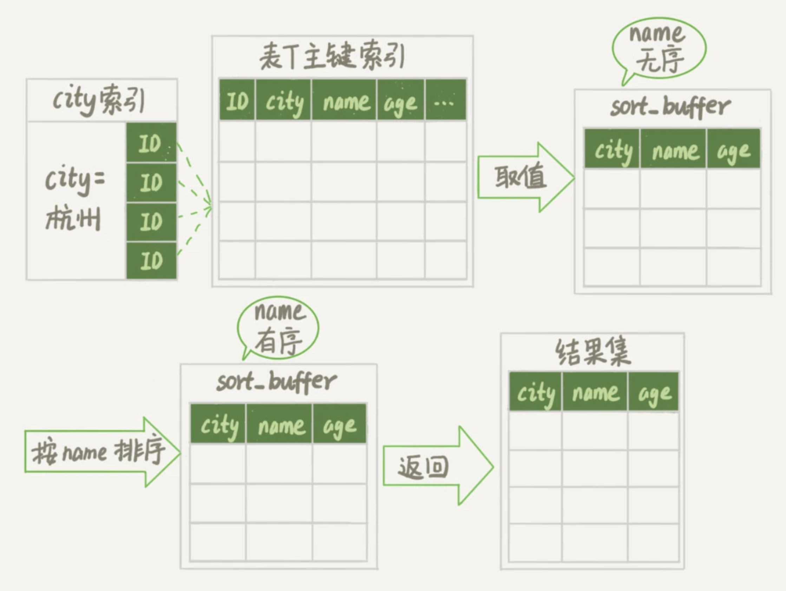
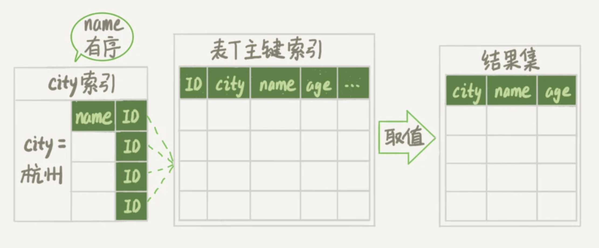
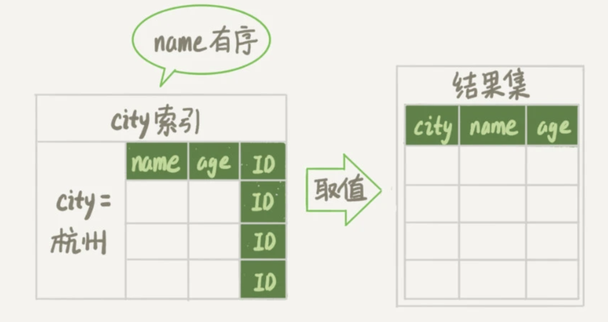

# MySQL 的逻辑架构图


*MySQL 的逻辑架构图*


+ MySQL 可以分为 Server 层和存储引擎层两部分：
  + Server 层，主要做的是 MySQL 功能层面的事情：
    + 包括连接器、查询缓存、分析器、优化器、执行器等；
    + 涵盖 MySQL 的大多数核心服务功能，以及所有的内置函数（如日期、时间、数学和加密函数等）；
    + 所有跨存储引擎的功能都在这一层实现，比如存储过程、触发器、视图等。
  + 引擎层，负责存储相关的具体事宜：
    + 存储引擎层负责数据的存储和提取；
    + 其架构模式是插件式的，支持 InnoDB、MyISAM、Memory 等多个存储引擎；
    + InnoDB 从 MySQL 5.5.5 版本开始成为了默认存储引擎；
    + 可以通过指定存储引擎的类型来选择别的引擎，比如在 create table 语句中使用 engine=memory 来指定使用内存引擎创建表；
    + 不同存储引擎的表数据存取方式不同，支持的功能也不同。


## 一条 SQL 查询语句的执行

```mysql
SELECT * FROM T WHERE ID=10；
```

+ 连接器

  + 连接器负责跟客户端建立连接、获取权限、维持和管理连接；

  + 连接命令：

    ```shell
    mysql -h$ip -P$port -u$user -p
    ```

    + 如果用户名密码认证通过，连接器会到权限表里面查出你拥有的权限。之后，这个连接里面的权限判断逻辑，都将依赖于此时读到的权限；
    + 一个用户成功建立连接后，即使你用管理员账号对这个用户的权限做了修改，也不会影响已经存在连接的权限。修改完成后，只有再新建的连接才会使用新的权限设置；

  + 数据库里面，长连接是指连接成功后，如果客户端持续有请求，则一直使用同一个连接；

  + 短连接则是指每次执行完很少的几次查询就断开连接，下次查询再重新建立一个。

+ 查询缓存

  + MySQL 拿到一个查询请求后，会先到查询缓存看看，之前是不是执行过这条语句；

  + 如果你的查询能够直接在这个缓存中找到 key（查询的语句），那么这个 value（查询的结果）就会被直接返回给客户端；

  + 如果语句不在查询缓存中，就会继续后面的执行阶段，执行完成后，执行结果会被存入查询缓存中；

  + [MySQL 8.0 版本直接将查询缓存的整块功能删掉了](https://mysqlserverteam.com/mysql-8-0-retiring-support-for-the-query-cache/)；

    + 查询缓存的失效非常频繁，只要有对一个表的更新，这个表上所有的查询缓存都会被清空；

    + 对于更新压力大的数据库来说，查询缓存的命中率会非常低，除非你的业务就是有一张静态表，很长时间才会更新一次；

    + 可以显式指定某条查询语句进行缓存：

      ```mysql
      SELECT SQL_CACHE * FROM T WHERE ID=10；
      ```

+ 分析器

  + 分析器先会做 “词法分析”；
    + 由多个字符串和空格组成的一条 SQL 语句，MySQL 需要识别出里面的字符串分别是什么，代表什么。
  + 然后做 “语法分析”；
    + 根据词法分析的结果，语法分析器会根据语法规则，判断输入的这个 SQL 语句是否满足 MySQL 语法。

+ 优化器

  + 在表里面有多个索引的时候，决定使用哪个索引；
  + 或者在一个语句有多表关联（join）的时候，决定各个表的连接顺序；

+ 执行器

  + 开始执行的时候，要先判断一下你对这个表 T 有没有执行查询的权限，如果没有，就会返回没有权限的错误；
  + 如果有权限，就打开表继续执行；
  + 打开表的时候，执行器就会根据表的引擎定义，去使用这个引擎提供的接口；


## 一条 SQL 更新语句的执行

```mysql
UPDATE T SET c=c+1 WHERE ID=2;
```

+ 连接器
  + 连接数据库。
+ 查询缓存
  + 把表 T 上所有缓存结果都清空。
+ 分析器
  + 通过词法和语法解析知道这是一条更新语句。
+ 优化器
  + 决定要使用 ID 这个索引；
+ 执行器
  + 负责具体执行，ID 是主键，引擎直接用树搜索找到这一行；
  + 然后更新；
  + 写日志。


## WAL 技术

Write-Ahead Logging，它的关键点就是先写日志，再写磁盘。

也就是 MySQL 里的日志模块。


### redo log

+ 当有一条记录需要更新的时候，InnoDB 引擎就会先把记录写到 redo log里面，并更新内存，这个时候更新就算完成了；
+ 同时，InnoDB 引擎会在适当的时候，将这个操作记录更新到磁盘里面，而这个更新往往是在系统比较空闲的时候完成；
+ InnoDB 的 redo log 是固定大小的，从头开始写，写到末尾就又回到开头循环写；
+ 有了 redo log，InnoDB 就可以保证即使数据库发生异常重启，之前提交的记录都不会丢失，这个能力称为 crash-safe。


### binlog

+ redo log 是 InnoDB 引擎特有的日志，而 Server 层也有自己的日志，称为 binlog；


**redo log 与 binlog 的不同：**

+ redo log 是 InnoDB 引擎特有的，binlog 是 MySQL 的 Server 层实现的，所有引擎都可以使用；
+ redo log 是物理日志，记录的是“在某个数据页上做了什么修改”，binlog 是逻辑日志，记录的是这个语句的原始逻辑，比如“给 ID=2 这一行的 c 字段加 1 ”；
+ redo log 是循环写的，空间固定会用完，binlog 是可以追加写入的，“追加写”是指 binlog 文件写到一定大小后会切换到下一个，并不会覆盖以前的日志。


**更新时具体的日志操作：**

+ 执行器先找引擎取 ID=2 这一行；
+ 如果 ID=2 这一行所在的数据页本来就在内存中，就直接返回给执行器，否则，需要先从磁盘读入内存，然后再返回；
+ 执行器拿到引擎给的行数据，把这个值加上 1，比如原来是 N，现在就是 N+1，得到新的一行数据，再调用引擎接口写入这行新数据；
+ 引擎将这行新数据更新到内存中，同时将这个更新操作记录到 redo log 里面，此时 redo log 处于 prepare 状态；
+ 然后告知执行器执行完成了，随时可以提交事务；
+ 执行器生成这个操作的 binlog，并把 binlog 写入磁盘；
+ 执行器调用引擎的提交事务接口，引擎把刚刚写入的 redo log 改成 commit 状态，更新完成。


**将 redo log 的写入拆成了 prepare 和 commit 两个步骤，这就是"两阶段提交"：**

+ redo log 和 binlog 都可以用于表示事务的提交状态，而两阶段提交就是让这两个状态保持逻辑上的一致；
+ 在恢复、备份、扩容数据库时保证主从数据库一致。


# 事务

+ 在 MySQL 中，事务支持是在**引擎层**实现的；
+ 不是所有的引擎都支持事务，比如 MySQL 原生的 MyISAM 引擎就不支持事务，这也是 MyISAM 被 InnoDB 取代的重要原因之一。


## MVCC

+ 数据库的多版本并发控制：同一条记录在系统中可以存在多个版本；
+ 对于 “可重复读”，每条记录在更新的时候都会同时记录一条回滚操作，记录上的最新值通过回滚操作，都可以得到前一个状态的值；
+ 什么时候删除回滚操作：
  + 系统会判断，当没有事务再需要用到这些回滚日志时，回滚日志会被删除；
  + 也就是当系统里没有比这个回滚日志更早的 read-view 的时候。
+ 为什么尽量不要使用长事务：
  + 长事务意味着系统里面会存在很老的事务视图；
  + 由于这些事务随时可能访问数据库里面的任何数据，所以这个事务提交之前，数据库里面它可能用到的回滚记录都必须保留，这就会导致大量占用存储空间；
  + 在 MySQL 5.5 及以前的版本，回滚日志是跟数据字典一起放在 ibdata 文件里的，即使长事务最终提交，回滚段被清理，文件也不会变小；
  + 长事务还占用锁资源，也可能拖垮整个库。


# 锁

+ MySQL 的行锁是在**引擎层**由各个引擎自己实现的；
+ 但并不是所有的引擎都支持行锁，比如 MyISAM 引擎就不支持行锁，不支持行锁意味着并发控制只能使用表锁，对于这种引擎的表，同一张表上任何时刻只能有一个更新在执行，这就会影响到业务并发度；
+ InnoDB 是支持行锁的，这也是 MyISAM 被 InnoDB 替代的重要原因之一。


# 索引

+ 在 MySQL 中，索引是在**存储引擎层**实现的，没有统一的索引标准；
+ 不同存储引擎的索引的工作方式并不一样；
+ 即使多个存储引擎支持同一种类型的索引，其底层的实现也可能不同。


## 索引模型

+ 索引的出现是为了提高查询效率，但是实现索引的方式却有很多种，也就有了索引模型的概念；
+ 三种常见的数据结构：哈希表、有序数组和搜索树；
+ 跳表、LSM 树等数据结构现如今也被用于引擎设计中。


### 哈希表

+ 哈希表是一种以 key-value 存储数据的结构，只要输入待查找的键即 key，就可以找到其对应的值即 Value
+ 哈希的思路很简单，把值放在数组里，用一个哈希函数把 key 换算成一个确定的位置，然后把 value 放在数组的这个位置；
+ 有时，多个 key 值经过哈希函数的换算，会出现同一个值的情况，处理这种情况的一种方法是，拉出一个链表；

+ 哈希索引不是有序的，增加新的数据时速度会很快，但同时做区间查询的速度是很慢的；
+ 哈希表这种结构适用于只有等值查询的场景，比如 Memcached 及其他一些 NoSQL 引擎。


### 有序数组

+ 有序数组在等值查询和范围查询场景中的性能就都非常优秀；
+ 有序数组查询效率很高，用二分法就可以快速得到；
+ 但更新数据效率很低，因为往中间插入一个记录就必须得挪动后面所有的记录，成本太高；
+ 有序数组索引只适用于静态存储引擎。


### 搜索树

+ 二叉树是搜索效率最高的，但是实际上大多数的数据库存储却并不使用二叉树，因为索引不止存在内存中，还要写到磁盘上；
+ N 叉树由于在读写上的性能优点，以及适配磁盘的访问模式，已经被广泛应用在数据库引擎中了；

+ B+ 树能够很好地配合磁盘的读写特性，减少单次查询的磁盘访问次数。


### InnoDB 的索引模型

+ 在 InnoDB 中，表是根据主键顺序以索引的形式存放的，这种存储方式的表称为索引组织表；
+ InnoDB 使用了 B+ 树索引模型，数据都是存储在 B+ 树中的；
+ 每一个索引在 InnoDB 里面对应一棵 B+ 树；
+ 根据叶子节点的内容，索引类型分为主键索引（聚集索引）和非主键索引（非聚集索引、二级索引）；
  + 如果是主键查询方式，则只需要搜索主键索引这棵 B+ 树；
  + 如果普通索引查询方式，则需要先搜索非主键索引树，再到主键索引树搜索一次。这个过程称为**回表**；
  + 基于非主键索引的查询需要多扫描一棵索引树，因此在应用中应该尽量使用主键查询。


## 覆盖索引

+ 假设有这么一个表结构：

  ```mysql
  create table T (
  ID int primary key,
  k int NOT NULL DEFAULT 0, 
  s varchar(16) NOT NULL DEFAULT '',
  index k(k))
  engine=InnoDB;
  
  insert into T values(100,1, 'aa'),(200,2,'bb'),(300,3,'cc'),(500,5,'ee'),(600,6,'ff'),(700,7,'gg');
  ```

+ 如果查询语句是：

  ```mysql
  select * from T where k between 3 and 5;
  ```

  + 读了 k 索引树的 3 条记录（3、5、6），回表了两次（300、500）；
  + 在这个例子中，由于查询结果所需要的数据只在主键索引上有，所以不得不回表。

+ 如果查询语句是：

  ```mysql
  select ID from T where k between 3 and 5;
  ```

  + 只需要查 ID 的值，而 ID 的值已经在 k 索引树上了，因此可以直接提供查询结果，不需要回表；
  + 也就是说，在这个查询里面，索引 k 已经“覆盖了”我们的查询需求，我们称为覆盖索引。

+ 由于覆盖索引可以减少树的搜索次数，显著提升查询性能，使用覆盖索引是一个常用的性能优化手段；

+ 联合索引可以在查询时用到覆盖索引，不再需要回表查整行记录，减少语句的执行时间；

+ 但索引字段的有维护成本，因此在建立冗余索引来支持覆盖索引时需要权衡。


## 最左前缀原则

+ B+ 树这种索引结构，可以利用索引的“最左前缀”，来定位记录；
+ 在建立联合索引时需要合理安排索引内的字段顺序：
  + 如果通过调整顺序，可以少维护一个索引，那么这个顺序往往就是需要优先考虑采用的：
    + 例如当已经有了 (a,b) 这个联合索引后，一般就不需要单独在 a 上建立索引了。

  + 第二需要考虑空间：
    + 例如 name 字段一般比 age 字段大的 ，可以创建一个（name,age) 的联合索引和一个 (age) 的单字段索引。


## 索引下推

+ 在 MySQL 5.6 之前，只能从联合索引的第一个索引开始一个个回表，到主键索引上找出数据行，再对比字段值；
+ MySQL 5.6 引入了索引的下推优化， 可以在索引遍历过程中，对索引中包含的字段先做判断，直接过滤掉不满足条件的记录，减少回表次数。


## 唯一索引 vs 普通索引

+ 早业务代码已经保证不会写入重复数据的时候，可以用普通索引替换唯一索引；
+ 在一些“归档库”的场景，可以考虑使用普通索引，因为归档数据已经是确保没有唯一键冲突了。


### 查询过程

```mysql
# id = k * 100
select id from T where k=5
```

+ 这个查询语句在索引树上查找的过程，先是通过 B+ 树从树根开始，按层搜索到叶子节点；
+ 业务能保证 k 是全局唯一的：
  + 如果 k 是普通索引，查找到满足条件的第一个记录 (5,500) 后，需要查找下一个记录，直到碰到第一个不满足 k=5 条件的记录；
  + 如果 k 是唯一索引，由于索引定义了唯一性，查找到第一个满足条件的记录后，就会停止继续检索；
  + 这两种查询方式的性能差异微乎其微。
+ InnoDB 的数据是按数据页为单位来读写的，当需要读一条记录的时候，并不是将这个记录本身从磁盘读出来，而是以页为单位，将其整体读入内存，需要翻页的概率很小。对于普通索引来说，要多做的那一次“查找和判断下一条记录”的操作，就只需要一次指针寻找和一次计算。


### 更新过程

**change buffer** 

+ 写入过程：
  + 当需要更新一个数据页时，如果数据页在内存中就直接更新；
  + 如果这个数据页还没有在内存中的话，在不影响数据一致性的前提下，InnoDB 会将这些更新操作缓存在 change buffer 中，这样就不需要从磁盘中读入这个数据页了；
  + 在下次查询需要访问这个数据页的时候，将数据页读入内存，然后执行 change buffer 中与这个页有关的操作，通过这种方式就能保证这个数据逻辑的正确性；
+ change buffer 在内存中有拷贝，也会被写入到磁盘上；
+ 将 change buffer 中的操作应用到原数据页，得到最新结果的过程称为 merge；
  + 访问这个数据页会触发 merge；
  + 系统有后台线程会定期 merge；
  + 在数据库正常关闭的过程中，也会执行 merge 操作。
+ 什么条件下可以使用 change buffer：
  + 只有普通索引可以使用；
  + 对于唯一索引来说，所有的更新操作都要先判断这个操作是否违反唯一性约束，因此必须要将数据页读入内存才能判断，已经读入到内存了，则会直接更新内存，不会使用 change buffer；
  + 对于写多读少的业务来说，页面在写完以后马上被访问到的概率比较小，此时 change buffer 的使用效果最好，这种业务模型常见的就是账单类、日志类的系统；
  + 一个业务的更新模式是写入之后马上会做查询，将更新先记录在 change buffer，但之后由于马上要访问这个数据页，会立即触发 merge 过程，这样随机访问 IO 的次数不会减少，反而增加了 change buffer 的维护代价。
+ change buffer 中的任何操作也会写入 redo log 中。


```mysql
insert into t(id,k) values(id1,k1),(id2,k2);
```

+ 要更新的目标页在内存中：
  + 对于唯一索引来说，找到 3 和 5 之间的位置，判断到没有冲突，插入这个值，语句执行结束；
  + 对于普通索引来说，找到 3 和 5 之间的位置，插入这个值，语句执行结束；
  + 这样看来，普通索引和唯一索引对更新语句性能影响的差别，只是一个判断，只会耗费微小的 CPU 时间。
+ 要更新的目标页不在内存中：
  + 对于唯一索引来说，需要将数据页读入内存，判断到没有冲突，插入这个值，语句执行结束；
  + 对于普通索引来说，则是将更新记录在 change buffer，语句执行就结束了；
  + 将数据从磁盘读入内存涉及随机 IO 的访问，是数据库里面成本最高的操作之一，change buffer 因为减少了随机磁盘访问，所以对更新性能的提升是会很明显的。


## 索引选择

+ 选择索引是**优化器**的工作；
+ 优化器选择索引的目的，是找到一个最优的执行方案，并用最小的代价去执行语句；
+ 优化器会结合扫描行数、回表次数、是否使用临时表、是否排序等因素进行综合判断；
+ 可以使用 `explain` 关键字查看语句的执行情况；
+ 可以使用 `force index(key)` 强制选择索引：
  + MySQL 会根据词法解析的结果分析出可能可以使用的索引作为候选项，然后在候选列表中依次判断每个索引需要扫描多少行；
  + 如果 force index 指定的索引在候选索引列表中，就直接选择这个索引，不再评估其他索引的执行代价。


扫描行数是怎么判断的？

+ MySQL 在真正开始执行语句之前，并不能精确地知道满足这个条件的记录有多少条，而只能根据统计信息来估算记录数；

+ 可以根据以下语句结果中的 Cardinality 查看索引的区分度：

  ```mysql
  SHOW INDEX FROM <table>;
  ```

  + 一个索引上不同的值越多，这个索引的区分度就越好；
  + 一个索引上不同的值的个数，我们称之为 “基数” cardinality，这个基数越大，索引的区分度越好；

+ MySQL 在计算基数的时候使用的采样统计方式（全表扫描消耗高），因此该数值不够精确；

+ 当数据表的变更超过一定行数时，会自动触发重新做一次索引统计；

+ 可以使用以下命令重新统计索引信息：

  ```mysql
  analyze table <table>;
  ```


## 前缀索引

+ MySQL 支持前缀索引的，可以定义字符串的一部分作为索引；

  + 如果创建索引的语句不指定前缀长度，那么索引就会默认包含整个字符串。

  + ```mysql
    alter table SUser add index index1(email);
    alter table SUser add index index2(email(6));
    ```

+ 前缀索引占用空间更小，但可能会增加额外的记录扫描次数，但定义好长度就可以做到既节省空间，又不用额外增加太多的查询成本；

+ 前缀索引无法使用覆盖索引，因为系统并不确定前缀索引的定义是否截断了完整信息。


# count

在不同的 MySQL 引擎中，count(*) 有不同的实现方式；

+ MyISAM 引擎把一个表的总行数存在了磁盘上，因此执行 count(*) 的时候会直接返回这个数，效率很高；
+ InnoDB 引擎执行 count(*) 的时候，需要把数据一行一行地从引擎里面读出来，然后累积计数。InnoDB 不跟 MyISAM 一样也把数字存起来，因为即使是在同一个时刻的多个查询，由于多版本并发控制 MVCC 的原因，InnoDB 表“应该返回多少行”也是不确定的。


count(*)、count(主键 id)、count(字段) 和 count(1) 等不同用法的性能：

+ count() 是一个聚合函数，对于返回的结果集，一行行地判断，如果 count 函数的参数不是 NULL，累计值就加 1，否则不加，最后返回累计值；
+ 对于 count(主键 id) 来说，InnoDB 引擎会遍历整张表，把每一行的 id 值都取出来，返回给 server 层。server 层拿到 id 后，判断是不可能为空的，就按行累加；
+ 对于 count(1) 来说，InnoDB 引擎遍历整张表，但不取值。server 层对于返回的每一行，放一个数字“1”进去，判断是不可能为空的，按行累加；
+ 对于 count(字段) 来说：
  + 如果这个“字段”是定义为 not null 的话，一行行地从记录里面读出这个字段，判断不能为 null，按行累加；
  + 如果这个“字段”定义允许为 null，那么执行的时候，判断到有可能是 null，还要把值取出来再判断一下，不是 null 才累加。
+ 对于 count(*) 来说，专门做了优化，不取值。肯定不是 null，按行累加；
+ 按照效率排序的话，count(字段) < count(主键 id) < count(1) ≈ count(*) 


# order by

事例背景：

```mysql
# 建表语句
CREATE TABLE `t` (
  `id` int(11) NOT NULL,
  `city` varchar(16) NOT NULL,
  `name` varchar(16) NOT NULL,
  `age` int(11) NOT NULL,
  `addr` varchar(128) DEFAULT NULL,
  PRIMARY KEY (`id`),
  KEY `city` (`city`)
) ENGINE=InnoDB;

# 查询语句
select city,name,age from t where city='杭州' order by name limit 1000;
```

+ 当 MySQL 判断需要排序时，会给每个线程分配一块内存用于排序，称为 sort_buffer。


## 全字段排序

+ 查询步骤如下：
  + 
  + 初始化 sort_buffer，确定放入 name、city、age 这三个字段；
  + 从索引 city 找到第一个满足 city='杭州’ 条件的主键 id；
  + 到主键 id 索引取出整行，取 name、city、age 三个字段的值，存入 sort_buffer 中；
  + 从索引 city 取下一个记录的主键 id；
  + 重复步骤 3、4 直到 city 的值不满足查询条件为止；
  + 对 sort_buffer 中的数据按照字段 name 做快速排序；
  + 按照排序结果取前 1000 行返回给客户端。
+ “按 name 排序”这个动作，可能在内存中完成，也可能需要使用外部排序，这取决于排序所需的内存和参数 sort_buffer_size；
+ sort_buffer_size 是 MySQL 为排序开辟的内存 sort_buffer 的大小，可以通过 `show global variables like 'sort_buffer_size';` 语句查询；
+ 如果要排序的数据量小于 sort_buffer_size，排序就在内存中完成。但如果排序数据量太大，内存放不下，则不得不利用磁盘临时文件辅助排序；
+ 外部排序一般使用归并排序算法。可以简单理解为，MySQL 将需要排序的数据分成 N 份，每一份单独排序后存在这些临时文件中，然后把这 N 个有序文件再合并成一个有序的大文件。


## rowid 排序

+ 如果查询单行很大，sort_buffer 里面要放的字段数太多，这样内存里能够同时放下的行数很少，要分成很多个临时文件，排序的性能会很差；
+ max_length_for_sort_data，是 MySQL 中专门控制用于排序的行数据的长度的一个参数，如果单行的长度超过这个值，MySQL 就认为单行太大，要换一个算法，会采用 rowid 排序；
+ 查询步骤如下：
  + 
  + 初始化 sort_buffer，确定放入两个字段，即 name 和 id；
  + 从索引 city 找到第一个满足 city='杭州’条件的主键 id；
  + 到主键 id 索引取出整行，取 name、id 这两个字段，存入 sort_buffer 中；
  + 从索引 city 取下一个记录的主键 id；
  + 重复步骤 3、4 直到不满足 city='杭州’条件为止；
  + 对 sort_buffer 中的数据按照字段 name 进行排序；
  + 遍历排序结果，取前 1000 行，并按照 id 的值回到原表中取出 city、name 和 age 三个字段返回给客户端。
+ 最后的“结果集”是一个逻辑概念，实际上 MySQL 服务端从排序后的 sort_buffer 中依次取出 id，然后到原表查到 city、name 和 age 这三个字段的结果，不需要在服务端再耗费内存存储结果，是直接返回给客户端的；
+ 无论是 rowid 方式还是全字段方式，都需要先把查询到的结果全部放在内存或硬盘中，再使用相关算法进行排序。


全字段排序 VS rowid 排序

+ 如果内存够，就要多利用内存，尽量减少磁盘访问；
+ 如果 MySQL 实在是担心排序内存太小，会影响排序效率，才会采用 rowid 排序算法，这样排序过程中一次可以排序更多行，但是需要再回到原表去取数据；
+ 如果 MySQL 认为内存足够大，会优先选择全字段排序，把需要的字段都放到 sort_buffer 中，这样排序后就会直接从内存里面返回查询结果了，不用再回到原表去取数据。


## 添加联合索引

+ 并不是所有的 order by 语句，都需要排序操作的，MySQL 之所以需要生成临时表，并且在临时表上做排序操作，其原因是原来的数据都是无序的；

+ 创建一个 city 和 name 的联合索引：

  ```mysql
  alter table t add index city_user(city, name);
  ```

+ 查询步骤如下：

  + 
  + 从索引 (city,name) 找到第一个满足 city='杭州’条件的主键 id；
  + 到主键 id 索引取出整行，取 name、city、age 三个字段的值，作为结果集的一部分直接返回；
  + 从索引 (city,name) 取下一个记录主键 id；
  + 重复步骤 2、3，直到查到第 1000 条记录，或者是不满足 city='杭州’条件时循环结束。


## 借用覆盖索引

+ 使用覆盖索引，索引上的信息足够满足查询请求，不需要再回到主键索引上去取数据；

+ 创建一个 city、name 和 age 的联合索引：

  ```mysql
  alter table t add index city_user_age(city, name, age);
  ```

+ 查询步骤如下：

  + 
  + 从索引 (city,name,age) 找到第一个满足 city='杭州’条件的记录，取出其中的 city、name 和 age 这三个字段的值，作为结果集的一部分直接返回；
  + 从索引 (city,name,age) 取下一个记录，同样取出这三个字段的值，作为结果集的一部分直接返回；
  + 重复执行步骤 2，直到查到第 1000 条记录，或者是不满足 city='杭州’条件时循环结束。


# Reference

[极客时间：MySQL 实战 45 讲](https://time.geekbang.org/column/article/67888) 
