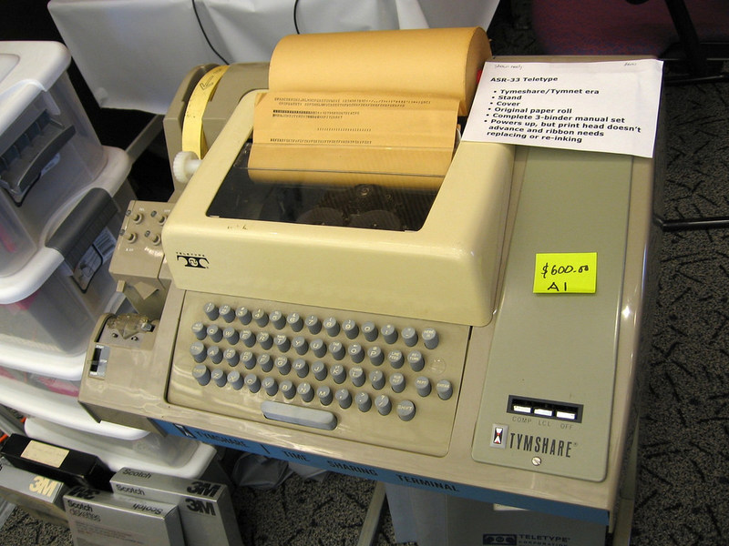
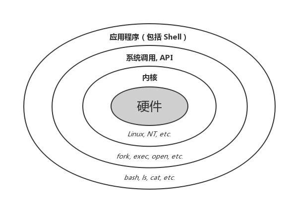

# 终端

终端——人与机器交互的接口


## 终端的发展

在最开始，终端的概念是这样的：是一种硬件，是一种**输入输出设备**，用于和计算机**交换信息**。



第一个 Unix 终端：电传打字机

> 计算机曾经非常昂贵且巨大，这些笨重的计算机通常被安置在单独的房间内，而操作计算机的人们坐在另外的房间里，通过某些设备与计算机进行交互。
>
> 早期的终端一般是一种叫做 **电传打字机** (Teletype) 的设备，Unix 的创始人 Ken Thompson 和 Dennis Ritchie 想让 Unix 成为一个多用户系统，但当时所有的计算机设备都非常昂贵，而且键盘和主机是集成在一起的，根本没有独立的键盘。最终他们找到了 ASR-33 电传打字机，虽然电传打字机原本的用途是在电报线路上收发电报，但是它既有可以发送信号的键盘，又能把接收到的信号打印在纸带上，完全可以作为人机交互设备使用，并且价格低廉。于是，他们把很多台 ASR-33 连接到计算机上，让每个用户都可以在终端登录并操作主机。
>
> 就这样，他们创造了计算机历史上第一个真正的多用户操作系统 Unix，而电传打字机就成为了第一个 Unix 终端。


**终端的工作**是：用户通过终端输入命令，终端将命令传入计算机，执行后，并把结果输入到终端上显示，其本身并不提供运算处理功能。

**现在**：计算机硬件一体化程度越来越高，硬件质量也越来越强，输入输出设备完全没必要单独用一个硬件和计算机进行交换信息了，取而代之使用软件终端和计算机进行交互信息。

这就是**终端模拟器 (Terminal Emulator)**，也就是我们现在所讨论的**终端**。除了它不是硬件，它符合终端的概念和工作流程。

一个终端模拟器的标准工作流程是这样的：

1. 捕获你的键盘输入；
2. 将输入发送给命令行程序（程序会认为这是从一个真正的终端设备输入的）；
3. 拿到命令行程序的输出结果（STDOUT 以及 STDERR）；
4. 调用图形接口（比如 X11），将输出结果渲染至显示器。

举个例子，下面这些软件都是终端：

+ GNU/Linux：gnome-terminal、Konsole；
+ macOS：Terminal.app、iTerm2；
+ Windows：Win32 控制台、ConEmu 。


##  iTerm2

现在我们大多使用的是 iTerm2 终端，为什么呢？iTerm2 有以下优势：

+ 支持真彩色，Terminal 只支持 256；

  + [判断终端色彩支持情况的方法](https://gaomf.cn/2017/01/16/Terminal_Color/) 

  + 判断是否支持真彩色，直接脚本：

    ```bash
    awk 'BEGIN{
        s="/\\/\\/\\/\\/\\"; s=s s s s s s s s;
        for (colnum = 0; colnum<77; colnum++) {
            r = 255-(colnum*255/76);
            g = (colnum*510/76);
            b = (colnum*255/76);
            if (g>255) g = 510-g;
            printf "\033[48;2;%d;%d;%dm", r,g,b;
            printf "\033[38;2;%d;%d;%dm", 255-r,255-g,255-b;
            printf "%s\033[0m", substr(s,colnum+1,1);
        }
        printf "\n";
    }'
    ```

+ 支持分割窗格视图，一屏开多个窗口，同步操作查日志

+ 支持搜索并突出显示所有找到的单词

+ 样式美观好看，能半透明下拉浮层，输入的同时看到背景文字, 不占屏幕空间

+ 迭代周期短，Terminal 的迭代周期是年，目前 iTerm2 最新版本是 3.4.3 (OS 10.14+)，电脑内置的 Terminal 版本是 2.10

+ 通过 brew 可以快速跟新 iTerm2。


## 安装 iTerm2 

+ 使用 [brew](https://formulae.brew.sh/cask/iterm2#default) 安装十分简单：`brew install --cask iterm2` 


## 配置 iTerm2 

+ 更改配色：在选项 iTerm2 --〉Preferences --〉Profiles --〉Color 中修改，如果想要导入配色，在右下角 Color Presets --〉Import 导入。推荐一个配色方案：https://draculatheme.com/iterm/
+ 更改背景透明度：在选项 iTerm2 --〉Preferences --〉Profiles --〉Window --〉Transparency 中修改


# Shell

Shell——提供用户界面的程序


## Shell 的定义

操作系统有一个叫做 **内核** (Kernel) 的东西，它管理着整台计算机的硬件，是现代操作系统中最基本的部分。但是，内核处于系统的底层，不能让普通用户随意操作的。

因此需要一个专门的程序，它接受用户输入的命令，帮助我们与内核沟通，最后让内核完成我们的任务。这个提供用户界面的程序被叫做 **Shell** (壳层)。


> 
>
> 其实 Shell 只是提供了一个用户操作系统的入口，我们一般是通过 Shell 去调用其他各种各样的应用程序，最后来达成我们的目的。比如说我们想要知道一个文件的内容，我们会在 Shell 中输入命令 `cat foo.txt`，然后 Shell 会帮我们运行 `cat` 这个程序，`cat` 再去调用内核提供的 `open` 等系统调用来获取文件的内容。虽然并不是 Shell 直接去与内核交互，但广义上可以认为是 Shell 提供了与内核交互的用户界面。
>
> shell是最外的一层的接收用户操作，像一层壳一样裹在整个调用过程中，所以被称为 壳。


Shell 通常可以分为两种：**命令行 Shell** 与 **图形 Shell**。

常见或历史上知名的命令行 Shell 有：

- 适用于 Unix 及类 Unix 系统：
  - **sh** (Bourne shell)，最经典的 Unix shell；
  - **bash** (Bourne-Again shell)，目前绝大多数 Linux 发行版的默认 shell；
  - **zsh** (Z shell)，功能强大的 shell；
  - **fish** (Friendly interactive shell)，专注于易用性与友好用户体验的 shell；
- Windows 下的 **cmd.exe** (命令提示符) 与 **PowerShell**。


输入 `cat /etc/shells` 可以查看本机上的所有shell

+ /bin/sh：第一个流行的 shell 是由 Steven Bourne 发展出来的，为了纪念他所以就称为 Bourne shell ，或直接简称为 sh 。现已经被 /bin/bash 所取代；
+ /bin/csh：后来另一个广为流传的 shell 是由柏克莱大学的 Bill Joy 设计依附于 BSD 版的 Unix 系统中的 shell ，这个 shell 的语法有点类似 C 语言，所以才得名为 C shell ，简称为 csh 。现已经被 /bin/tcsh 所取代；
+ /bin/bash：Linux 默认的 shell，主要兼容于 sh ，并且依据一些使用者需求，而加强的 shell 版本；
+ /bin/dash：bash 的精简版
+ /bin/ksh：Kornshell 由 AT&T Bell lab. 发展出来的，兼容于 bash；
+ /bin/tcsh：整合 C Shell ，提供更多的功能；
+ /bin/zsh：基于 ksh 发展出来的，功能更强大的 shell


不同 shell 的区别主要是两方面：

- 脚本语言语法有差异
- 功能、外观、自定义美化上有差异


切换：

+ 比如切换bash，直接输入`bash`，即可切换到bash环境下，输入 `exit`，复原默认 shell 环境。


## zsh

现在我们大多使用的是 zsh，为什么呢？

它集成了所有现有 shell 的思想并增加了许多独到的功能，为程序员创建了一个全功能的高级 shell。zsh 具有三大功能：改进的 shell 选项处理、shell兼容性模式以及可加载模块。其中，可加载模块是shell设计中最先进的功能。zsh 的独到之处在于它允许扩展 shell 中的内建命令，这为许多不同的应用程序提供了大量的快速工具。[^1](#1)

与 bash 兼容，除此外还扩展了更多功能，例如：

+ 色彩高亮，不是正则判断出来的，是真的检查你的输入是否正确，一个个字母的敲命令，前面都是红色的，如果敲对了最后一个字母的话，你会看到整条命令连着前面的都变成了白色，代表你敲对了；
+ 命令提示：是基于你的历史命令数据库进行分析的，随着你输入的命令越来越多，提示将会越来越准确和顺手，在使用时随着你动态输入完每一个字母不断修正变化；
+ 智能补全：缩写路径补全、命令参数补全；
+ 快速跳转：`cd -` 命令会列出本次登陆后去过的最近几次路径；
+ 热键绑定：可以设置一键打开编辑器，或者一键帮你输入某常用命令的一部分。例如设置 `bindkey -s '\e;' 'ls -l\n'` ，通过键盘输入 `control + [ + ;` 可以快速调用 `ls -l` 命令；

+ 只要使用 zsh 插件管理器进行配置，就可以定制属于自己的 zsh。


## 终端与 Shell 的区别

一般来说，终端干的活儿是从用户这里接收输入（键盘、鼠标等输入设备），扔给 Shell，然后把 Shell 返回的结果展示给用户（比如通过显示器）。而 Shell 干的活儿是从终端那里拿到用户输入的命令，解析后交给操作系统内核去执行，并把执行结果返回给终端。

- 终端将用户的键盘输入转换为控制序列（除了字符以外的按键，比如 `左方向键` → `^[[D`），Shell 则解析并执行收到的控制序列（比如 `^[[D` → `将光标向左移动`）；
- 不过也有例外，比如终端在接收到 Ctrl + C 组合键时，不会把这个按键转发给当前的程序，而是会发送一个 `SIGINT` 信号（默认情况下，这会导致进程终止）。其他类似的特殊组合键有 Ctrl-Z 与 Ctrl-\ 等，可以通过 `stty -a` 命令查看当前终端的设置。
- 我们可以在终端窗口中上下翻页查看过去的输出内容，这完全是终端提供的特性，与 Shell 没有关系
- 命令提示符 (Prompt) 是一个完全的 Shell 概念，与终端无关
- 行编辑、输入历史与自动补全等功能是由 Shell 提供的，不过终端也能自己实现这些功能
- 终端中的复制粘贴功能（Shift + Insert 或者鼠标右键等）基本上都是由终端提供的。不过 Shell 以及其他命令行程序也可以提供自己的复制粘贴机制（例如 vim）


# Inference

[1] <span id = "1">Linux命令行与shell脚本编程大全——23章：使用其他 Shell</span> 


# External Links

[命令行界面 (CLI)、终端 (Terminal)、Shell、TTY，傻傻分不清楚？](https://segmentfault.com/a/1190000016129862) 

[是什么让你选择了 iTerm2 ？自带的 Terminal 不好么？](https://v2ex.com/t/589083)

[What is the difference between iTerm2 and Terminal?](https://apple.stackexchange.com/questions/25143/what-is-the-difference-between-iterm2-and-terminal)

[iTerm2-Features](https://iterm2.com/features.html) 

[鸟哥的 Linux 私房菜——系统的合法 shell 与 /etc/shells 功能](http://cn.linux.vbird.org/linux_basic/0320bash.php#bash_shells) 

[为什么说 zsh 是 shell 中的极品？](https://www.zhihu.com/question/21418449/answer/300879747)