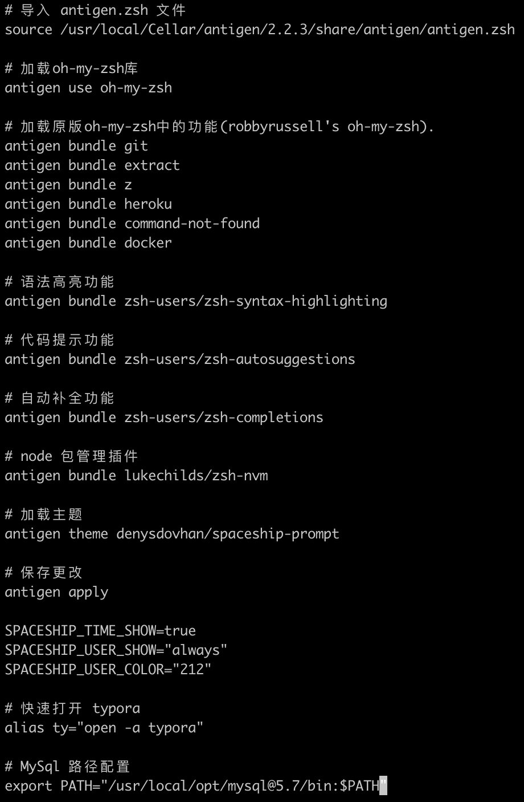

# 插件管理器

之前已经谈到，通过配置插件可以对 zsh 进行扩展，但是 zsh 本身没有一个很好的机制来获取、安装、更新以及卸载插件，因此需要使用 zsh 插件管理器进行管理，现在市面上比较流行的 zsh 插件管理器有：

+ Oh My Zsh：是一个配置框架，其中嵌入了许多插件与主题，我们可以轻松的打开或关闭它们。

  + Oh My Zsh is an open source, community-driven framework for managing your Zsh configuration.
  + 提供的插件 👉 [oh-my-zsh-plugins](https://github.com/ohmyzsh/ohmyzsh/wiki/Plugins) 
  + 提供的主题 👉 [oh-my-zsh-thems](https://github.com/ohmyzsh/ohmyzsh/wiki/Themes)

+ Antigen：是一小组功能，能管理 zsh 的插件。

  + Antigen is a small set of functions that help you easily manage your shell (zsh) plugins, called bundles. 
  + 大多数 Zsh 插件以 git 存储库的形式发布。 Antigen 允许我们简单地指定远程存储库路径，然后它将自动进行获取，并在首次运行时安装。 Antigen 还为我们提供了轻松更新和删除插件的命令
  + Antigen 可以加载 oh-my-zsh 主题和插件，并将自动克隆它们
  + 使用时需保证 zsh 的版本不低于 4.3.11
  + 一些插件、主题 👉 [awesome-zsh-plugins](https://github.com/unixorn/awesome-zsh-plugins) 

# Antigen

既然 Oh My Zsh 可以实现插件管理了，为什么还要使用 Antigen 呢：

+ 一般来说，由不同的作者在单个存储库中开发的不同的插件很难维护；
  + oh-my-zsh 中有一些非常出色的插件和实用程序，但是将它们全部存储在一个仓库中并不能很好地扩展，因此需要一种更好的插件管理方式，基于此 Antigen 诞生了；

+ Antigen 可以从各种 github 存储库中提取 oh-my-zsh 样式的插件，不仅如此，Antigen 还可以从别的开发者那直接获取插件和脚本，无需等待它们作为拉取请求提交给 oh-my-zsh；
  + 例如使用 `zsh-autosuggestions` 插件，在 oh-my-zsh 中需要手动下载、配置两步，而在 Antigen 中只需要手动配置，会自动帮我们下载；

+ Antigen还可以通过一个命令快速切换提示主题；
  + 例如 `antigen theme candy` ，这个的修改仅针对当前一次会话中，除非在 `.zshrc` 中修改；
  + 例如可以频繁切换主题看样式而不用重启终端（candy、robbyrussell、agnoster、cloud）、可以适用插件；

+ 在更换电脑，重新配置本地开发环境时，Oh My Zsh 需要重新下载一些二进制文件，而 Antigen 只需要导出配置文件即可。

## 安装 Antigen

使用 [brew](https://formulae.brew.sh/formula/antigen#default) 安装特别简单：`brew install antigen` ，之后编写配置文件 `.zshrc` 即可。

## 插件推荐

+ [git](https://github.com/ohmyzsh/ohmyzsh/tree/master/plugins/git)
  + 提供一些 git 命令缩写，例如 `gb` 
  + 提供一些函数，例如 `git_current_user_name` 

+ [extract](https://github.com/ohmyzsh/ohmyzsh/tree/master/plugins/extract) 
  + 功能强大的解压插件，所有类型的文件解压一个命令 `x` 全搞定，再也不需要去记 `tar` 后面到底是哪几个参数了
  + 例如 `x  Sourcetree_4.0.2_236.zip` 
+ [z](https://github.com/ohmyzsh/ohmyzsh/tree/master/plugins/z) 
  + 强大的目录自动跳转命令，会记忆你曾经进入过的目录，用模糊匹配快速进入你想要的目录
  + 例如 `z notebook` 
+ [web-search](https://github.com/ohmyzsh/ohmyzsh/tree/master/plugins/web-search) 
  + 提供了在命令行搜索网页的功能，支持百度，必应、谷歌（自己负责科学上网）等。用法是搜索引擎+需要搜索的内容，然后电脑会打开默认浏览器进行搜索。
  + 例如 `google rust` 
+ [history](https://github.com/ohmyzsh/ohmyzsh/tree/master/plugins/history) 
  + 查看历史输入所有命令，在终端输入 `h` 即可
+ [command-not-found](https://github.com/ohmyzsh/ohmyzsh/tree/master/plugins/command-not-found) 
  + 如果找不到命令会提供建议安装的软件包
+ [docker](https://github.com/ohmyzsh/ohmyzsh/tree/master/plugins/docker) 
  + 增强 docker 的自动补全功能，类似的插件还有 [pip](https://github.com/ohmyzsh/ohmyzsh/tree/master/plugins/pip) 、[lein](https://github.com/ohmyzsh/ohmyzsh/tree/master/plugins/lein) 、[heroku](https://github.com/ohmyzsh/ohmyzsh/tree/master/plugins/heroku) 等等
+ d
  + 查看最近跳转目录，输入d之后可以查看最近跳转的目录，最近跳转目录都会有对应的编号，比如0，1，2等，直接输入编号就可以跳转至最近跳转的目录。
+ [zsh-syntax-highlighting](https://github.com/zsh-users/zsh-syntax-highlighting) 
  + 语法高亮功能
+ [zsh-autosuggestions](https://github.com/zsh-users/zsh-autosuggestions) 
  + 代码提示功能，记录历史输入的所有命令并在输入前几个字母的时候显示历史命令所谓建议
+ [zsh-completions](https://github.com/zsh-users/zsh-completions) 
  + 自动补全功能，用以增强 zsh 的补全功能
+ [zsh-nvm](https://github.com/lukechilds/zsh-nvm) 
  + node.js 版本管理插件，更多信息查看另一份文档

+ 虽然 oh-my-zsh 提供了很多插件，但是大量的插件会拖慢打开的速度，因此只安装常用的就好了。

## 配置文件

`.zshrc` 是 zsh 的配置文件，以我的配置为例，里面的配置主要分为以下部分：

+ 把 antigen 中的全部环境变量加入 `source` 字段后，避免出现 ‘zsh: command not found: xxx’ 的报错。可以通过 `brew list antigen` 查看 antigen 安装路径；
+ 将 oh-my-zsh 添加到 antigen 中，这样 antigen 能直接使用 oh-my-zsh 的插件和主题；
+ 直接引入 oh-my-zsh 的插件；
+ 从 git 仓库中引入其他的插件，`antigen bundle remote-repo/url` ；
  + 例如， `zsh-users/zsh-completions` ，`zsh-users/zsh-autosuggestions` 实际上指向的 `github.com/zsh-users/zsh-completions` 和 `github.com/zsh-users/zsh-autosuggestions` ；
  + Github 可以自动推算，如果存储库位于其他域下，则只需指定该域即可；

+ 指定要使用的主题；
+ 保存更改；
+ 设置显示时间、用户名，并且配置用户名的颜色是猛男粉；

如果配置文件有修改，需要重启终端才能生效，或者直接运行 `source ~/.zshrc` 命令。

头一次运行会安装一些依赖包，稍等两分钟，以后再进入就瞬间进入了。

## 小知识

+ rc：
  + 它是 runcomm 的缩写，即名词 run command（运行命令）的简写；
  + rc 是任何脚本类文件的后缀，这些脚本通常在程序的启动阶段被调用。

+ .bashrc：
  + 是当 Linux 的 bash shell 启动后所运行的脚本；
  + .bashrc的前缀 `.` 是一个命名标准，它被设计用来在用户文件中隐藏那些用户指定的特殊文件；
  + `ls` 命令默认情况下不会列出此类文件，`rm` 默认情况下也不会删除它们；
  + 许多程序在启动时，都需要 rc 后缀的初始文件或配置文件。

# External Links

[Zsh + Antigen + Oh my Zsh = A Beautiful, Powerful, and Robust Shell](https://levelup.gitconnected.com/zsh-antigen-oh-my-zsh-a-beautiful-powerful-robust-shell-ca5873821671) 

[oh my zsh](https://ohmyz.sh/) 

[antigen](https://github.com/zsh-users/antigen) 

[zsh 启动速度慢的终极解决方案](https://zhuanlan.zhihu.com/p/98450570)

[升级你的 Terminal，让 Salesforce 开发更高效](http://blog.meginfo.com.cn/upgrade-your-terminal-for-salesforce-development/) 

