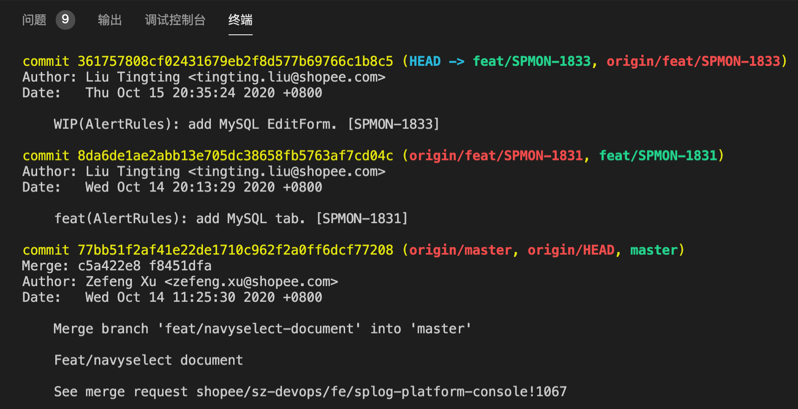
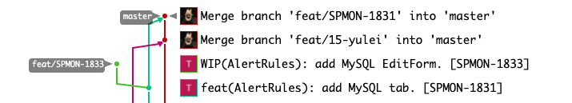

### 新分支/原有分支已经合并进 master

+ 更新
  + 方法一，当前分支
    + git pull --rebase origin master
  + 方法二：切换分支
    + git check out master
    + git pull
    + git checkout newbranch
    + git rebase master
+ 提交
  + git push


### 提交 request 的分支，且 master 更新内容没有冲突

+ 本地分支 git push
+ 远程 request 单提示当前落后 commit，点击 rebase


+ 远程 request 单提示当前落后 commit，点击 rebase
+ 本地分支 git pull origin
+ git push


### 提交 request 的分支，且 master 更新内容有冲突

+ git reset --hard 「目标 commit 前一个 commitID 」
+ git cherry-pick 「之后修改的 commitID」


### 本地 master 混乱时

+ `git checkout -b x` 
  + Switched to a new branch 'x'
+ `git branch -D master` 
  + Deleted branch master (was **e3206b0e**).
  + Switched to a new branch 'master'
+ `git checkout master` 
  + Branch 'master' set up to track remote branch 'master' from 'origin'. 
+ `git pull` 
  + Already up to date.
+ `git log` 
  + commit **3b9dabd6**5ea31ce95ce0483ea079a1522bd226ab (HEAD -> master, origin/master, origin/HEAD)
+ `git branch` 
+ `git branch -D x` 
+ 可以看到，删除的本地的 master 是 e3206b0e ，重新拉取的 master 是 3b9dabd6 。一些迷操作让本地的 master 脱离了远程的 master ，造成了一系列的错误

 

## rebase

> 它的原理是首先找到这两个分支（即当前分支 `experiment`、变基操作的目标基底分支 `master`） 的最近共同祖先 `C2`，然后对比当前分支相对于该祖先的历次提交，提取相应的修改并存为临时文件， 然后将当前分支指向目标基底 `C3`, 最后以此将之前另存为临时文件的修改依序应用。

+ 首先在自己的分支里进行开发，当开发完成时你需要先将你的代码变基到 `origin/master` 上，然后再向主项目提交修改。 这样的话，该项目的维护者就不再需要进行整合工作，只需要快进合并便可。

  + ```console
    $ git checkout experiment
    $ git rebase master
    First, rewinding head to replay your work on top of it...
    Applying: added staged command
    ```

  + ```console
    $ git checkout master
    $ git merge experiment
    ```


+ git rebase --abort 会放弃合并，回到rebase操作之前的状态，之前的提交的不会丢弃；

  git rebase --skip 则会将引起冲突的commits丢弃掉（慎用！！）；

  git rebase --continue 合并冲突，结合"git add 文件"命令一起用与修复冲突，提示开发者，一步一步地有没有解决冲突。（fix conflicts and then run "git rebase --continue"）

+ 例子

  + 在 `master` 分支上拉了 `1831` 分支，在 `1831` 分支上又拉了 `1833` 分支，两个分支分别 commit

  + 实际上，`1833` push 之后有既有 `1831` 的 commit 也有 `1833` 的 commit

  + 之后，`1831` 分支被合并到了 `master` 分支上，此时本地代码还没有 pull

  + 

  + 

  + ```console
    ➜ git checkout master
    ➜ git pull --rebase
    ➜ git checkout feat/SPMON-1833
    ➜ git rebase master
    ➜ git push -f 
    ```

  + 

  + 


merge 是所有的冲突都出现

rebase 是按照单个 commit 依次出现


master 切分支

merge release

提交到 master


https://blog.csdn.net/WPwalter/article/details/80371264
