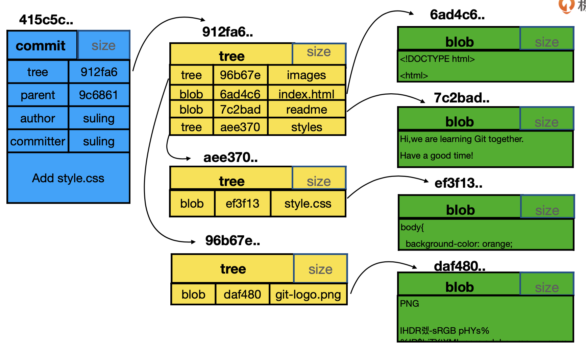
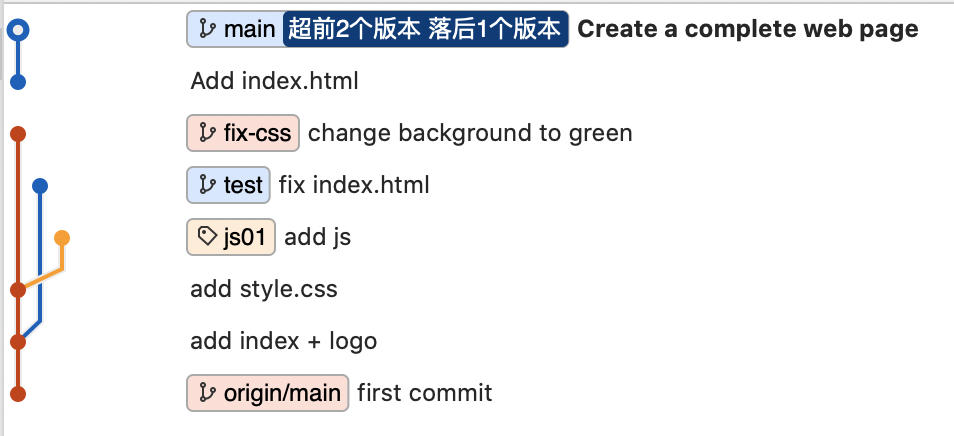
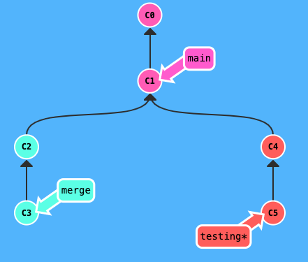
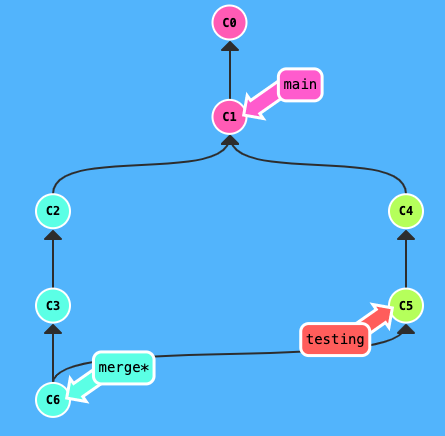
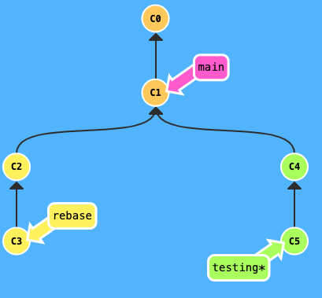
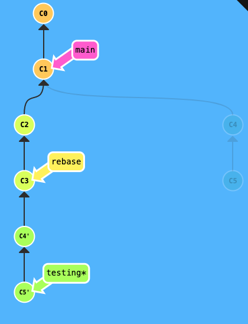

# 基础操作

## 创建 Git 仓库

### 初始化

+ 把当前路径的项目代码纳入 Git 管理：

  ```bash
  git init
  ```

+ 新建项目的同时直接用 Git 管理：

  ```bash
  git init <repo>
  cd <repo>
  ```
  
  + 会在当前路径下创建和项目名称同名的文件夹。

+ 新建一个裸仓库的项目：

  ```bash
  git init --bare <repo> 
  ```

  + 一般会将裸仓库命名为 `repo.git`；
  + 使用 `--bare` 参数初始化的仓库不包含工作区，只有 *.git* 目录，但是将 *.git* 目录中的文件都平铺出来；
  + 裸仓库一般情况下是作为远端的中心仓库而存在，只保存历史提交的版本信息，不保存文件；
  + 参考阅读：[What is a bare git repository?](https://www.saintsjd.com/2011/01/what-is-a-bare-git-repository/)


### 克隆

+ 项目被拷贝到当前目录下的同名目录中：

  ```bash
  git clone <url>
  ```

+ 项目被拷贝到当前目录下的指定目录中：

  ```bash
  git clone <url> <repo>
  ```

+ 拷贝项目的裸仓库：

  ```bash
  git clone --bare
  ```

  

### 关联远程仓库

+ 查看配置的远程仓库使用的 git 保存的简写和对应的 URL：

  ```bash
  git remote -v
  ```

+ 添加简写为 shortname（一般为 origin） 地址为 url 的远程仓库：

  ```bash
  git remote add <shortname> <url>
  ```

+ 删除简写为 shortname 的远程仓库：

  ```bash
  git remote remove <shortname>
  ```

+ 从远程仓库拉取：

  ```bash
  git fetch <shortname>
  ```

  

### *.git* 文件夹

在创建完一个 git 项目之后，在当前文件夹内会自动生成一个 *.git* 文件夹

+ *HEAD* 文件：保存当前工作分支的指向，例如 ref: refs/heads/master；

+ *config* 文件：保存当前配置，包含 core、remote、branch、user 信息；

+ *refs* 文件夹：保存所有的 branchs、tags、origin 等等；

+ *objects* 文件夹：
  
  + 查看类型：
    
    ```bash
    git cat-file -t <hash>
    ```
    
  + git 中主要有三个对象类型：commit、tree、blob：
    
    + 
    + 一个 commit 只会对应一个 tree ，tree 里面保存的是当前 commit 的快照；
    + tree 里面也可以包含多个 tree，表示文件夹；
    + tree 里面也可以包含多个 blob，指的是具体的某一个文件。blob 和文件名一点关系都没有，只要文件中的内容相同，在 git 的眼里就是唯一的一个 blob，可以节约存储空间；
    
  + 查看内容：
  
    ```bash
    git cat-file -p <hash>
    ```


### *.gitignore* 文件

+ `/` 
  + 加了表示这个**文件夹下**的所有文件都不纳入 git 版本管理中；
  + 不加表示符合这个名字的**文件**，以及这个**文件夹下**的所有文件都不纳入 git 版本管理中；


## Git 的三种状态

+ `modified` 已修改；
  + 表示修改了文件，但还没保存到数据库中。
+ `staged` 已暂存；
  + 表示对已修改文件的当前版本做了标记，使之包含在下次提交的快照中。
+ `committed` 已提交；
  + 表示数据已保存在本地数据库中。


### 文件的状态

查询当前文件状态：

```bash
git status
```

+ ```bash
  On branch master
  Your branch is up-to-date with 'origin/master'.
  nothing to commit, working directory clean
  ```

  + 所有已跟踪文件在上次提交后未被更改；
  + 当前目录下没有出现处于跟踪状态的新文件；
  + 分支同远程服务器上对应的分支没有偏离。

+ ```bash
  Untracked files:
    (use "git add <file>..." to include in what will be committed)
  ```

  + 存在未跟踪的文件，一般是新建了文件。

+ ```bash
  Changes to be committed:
    (use "git restore --staged <file>..." to unstage)
  ```

  + 文件被跟踪并处于暂存状态，一般是 add 后。

+ ```bash
  Changes not staged for commit:
    (use "git add <file>..." to update what will be committed)
  (use "git restore <file>..." to discard changes in working directory)
  ```

  + 跟踪文件的内容发生变化，一般是修改了文件。

+ ```bash
  Your branch is ahead of 'origin/main' by 1 commit.
    (use "git push" to publish your local commits)
  ```

  + 在此之前存在 commit 还没有 push 到远端仓库。


### 基本的 Git 工作流程

+ 在**工作区**中修改文件；
+ 将下次提交的更改选择性暂存，只会将更改的部分添加到**暂存区**；
+ 找到暂存区的文件，将快照永久性存储到 **Git 目录**。


### 跟踪-增删改查

+ 查看文件状态：
  
  ```bash
  git status
  ```
  
+ 对比工作区和暂存区所含文件的差异：
  
  ```bash
  git diff
  ```
  
  + `git diff --cached`：暂存区和 HEAD 所含文件的差异
  + `git diff <file>`：某个具体的文件差异；
  + `git diff <commitID01> <commitID02>`：输出 commitID01 对比 commitID02 的更改；
  + `git diff HEAD HEAD^1`：输出当前对比上一次 commit 的更改；
  + `git diff <branch1> <branch2>`：比较分支之间的差异。
  
+ 开始跟踪新文件、把已经跟踪的文件放到暂存区、把有冲突的文件标记为已解决状态：
  
  ```bash
  git add <fileName>
  ```
  
  + `git add -u`：把已经被跟踪过的文件一起放到暂存区；
  + `git add .`：把所有文件一起放到暂存区；
  
+ 删除 *fileName* 文件，不用添加状态可以直接 commit：
  
  ```bash
  git rm <fileName>
  ```
  
  + `git rm --cached <fileName>`：删除 XXX 文件的跟踪但保留在本地；
  + `git rm --f <fileName>`：删除 XXX 文件的跟踪并删除本地文件，不可逆。
  
+ 更改文件名：
  
  ```bash
  git mv readme readme.md
  ```
  
  + 将 readme 文件名变更为 readme.md，这个命令不用 add 可以直接 commit。
  
+ 提交修改：
  
  ```bash
  git commit -m ‘<message description>’
  ```
  
  + `git commit -m -a ‘message’`：通过多一个 `-a` 会自动把所有已经跟踪过的文件暂存起来一并提交，跳过 add 的步骤，但不利于检查，不推荐；
  + `git commit --amend -m 'message'`：覆盖前一次的 commit。
  
+ 查看提交历史：
  
  ```bash
  git log
  ```
  
  + `git log --oneline`：查看 commit 简洁信息；
  + `git log -n2`：查看最近的 2 条 commit 信息；
  + `git log --all`：查看所有分支的 commit 信息；
  + `git log --graph`：查看 commit 图形界面。


## 配置命令

+ 查看所有配置以及配置所在文件：
  
  ```bash
  git config --list --show-origin
  ```
  
+ config 的三个作用域：
  + `--global`：对当前用户所有仓库有效；
  + `--local`：只对某个仓库有效，缺省时等同于 local，--local 只能在仓库中使用；
  + `--system`：对系统所有登陆的用户有效，基本不用；
  
+ 设置电脑上全局的 config：
  
  ```bash
  git config --global user.name "LiuTeiTei"
  git config --global user.email "LiuTeiTei@email.com"
  ```
  
  + 初始化用户名和邮箱地址，不可更改。
  
+ 在某个项目的根目录中可以设置局部的配置：
  
  ```bash
  git config user.name "LiuTeiTei"
  git config user.email "LiuTeiTei@email.com"
  ```
  
+ 使用 `ohmyzsh` 中的插件 `git`：
  
  ```bash
  git_current_user_name
  # git config --local user.name
  
  git_current_user_email
  # git config --local user.email
  ```


## 获得帮助

```bash
git help <verb>
```


# 本地操作

## commit 操作

### 初次 commit

```bash
git commit -m ‘message’
```

+ `git commit -m -a ‘message’` ：通过多一个 `-a` 会自动把所有已经跟踪过的文件暂存起来一并提交，跳过 add 的步骤，但不利于检查，不推荐。


### 修改 commit

如果是 push 之后对 commit 修改，再次 push 的时候需要加上 `-f` 参数。


#### 修改最新 commit

```bash
git commit --amend
```

+ 进入编辑页面；
+ `git commit --amend -m 'message'`：直接用新的 messge 覆盖前一次的 messge。


#### 修改最旧 commit

```bash
git rebase -i --root
```

+ 进入编辑页面，会显示出来第一条到最后一条的所有 commit 信息。


#### 修改老旧 commit

```bash
git rebase -i <commitID-father>
```

+ 利用 rebase 命令进行变基操作，适用于本地分支，还没有推送到远程分支；

+ 这里的 `<commitID-father>` 是想要修改的 message 的父级 commitID；
+ 之后会进入一个交互界面，将想要修改的 message 前面的 `pick` 改成 `r`；
+ reword 表示使用这个 commit，但是修改 message；
+ 保存并退出之后，会进入修改 msaage 的交互界面，修改保存并退出；

+ ```bash
  git rebase -i 567c5ef
  
  [detached HEAD aa9372b] add a refering project
   Date: Thu Jan 7 20:40:59 2021 +0800
   2 files changed, 20 insertions(+)
  Successfully rebased and updated refs/heads/main.
  ```

  + 最后一行说明修改成功；
  + 先分离头指针改完后，指针再回到之前指向的分支。


### 合并 commit

#### 合并连续多个 commit

```bash
git rebase -i <commitID-father>
```

+ 这里的 `<commitID-father>` 是想要合并的、最前面的 message 的父级 commitID；
+ 之后会进入一个交互界面，将想要合并的 message 前面的 `pick` 改成 `s`；
+ squash 表示使用这个 commit，但是会合并到前面的 message；
+ 保存并退出之后，会进入一个交互界面，说明为什么要进行本次的 commit 合并，输入语句会作为新的 message，修改保存并退出；

+ ```bash
  git rebase -i 80c2dcba70bc3e
  
  [detached HEAD 94c297c] Create a complete web page
   Date: Thu Jan 7 20:20:46 2021 +0800
   4 files changed, 134 insertions(+)
   create mode 100644 images/git-logo.png
   create mode 100644 index.html
   create mode 100644 js/script.js
   create mode 100644 styles/style.css
  Successfully rebased and updated refs/heads/main.
  ```

  + 最后一行说明修改成功；
  + 先分离头指针改完后，指针再回到之前指向的分支，之后的 commitID 都会发生变化。


#### 合并间断多个 commit

```bash
git rebase -i <commitID-father>
```

+ 这里的 `<commitID-father>` 是想要合并的、最前面的 message 的父级 commitID；

  + 如果想要变动的 commit 是最早提交的，再之前没有 commit-father ，进入交互页面后手动填写这个 commitID，`pick <commitID>`，message 可以不写。

+ 之后会进入一个交互界面，将想要合并的 message 前面的 `pick` 改成 `s` ，并放在一起；

  + 比如现在是这样的 commit 顺序：

    ```bash
    git log --oneline
    
    39904e1 (HEAD -> main) change background to green
    94c297c Create a complete web page
    80c2dcb (origin/main) first commit
    ```
  
  + 想要将第一个和最后一个合并：
  
    ```bash
    git rebase -i 80c2dcb
    
    pick 94c297c Create a complete web page
    pick 39904e1 change background to green
    ```

  + 手动添加最早的 commitID：
  
    ```bash
    pick 80c2dcb
    pick 94c297c Create a complete web page
    pick 39904e1 change background to green
    ```

  + 合并的 commit 需要放在一起，整理顺序并更改：
  
    ```bash
    pick 80c2dcb
    s 39904e1 change background to green
    pick 94c297c Create a complete web page
    ```

  + 此时会跳出提示信息：
  
    ```bash
    The previous cherry-pick is now empty, possibly due to conflict resolution.
    If you wish to commit it anyway, use:
    
        git commit --allow-empty
    
    Otherwise, please use 'git cherry-pick --skip'
    interactive rebase in progress; onto 80c2dcb
    Last command done (1 command done):
       pick 80c2dcb
    Next commands to do (2 remaining commands):
       squash 39904e1 change background to green
       pick 94c297c Create a complete web page
    You are currently rebasing branch 'main' on '80c2dcb'.
    
    nothing to commit, working tree clean
    Could not apply 80c2dcb...
    ```

  + 看一下此时的文件状态：
  
    ```bash
    git status
    
    interactive rebase in progress; onto 80c2dcb
    Last command done (1 command done):
       pick 80c2dcb
    Next commands to do (2 remaining commands):
       squash 39904e1 change background to green
       pick 94c297c Create a complete web page
      (use "git rebase --edit-todo" to view and edit)
    You are currently rebasing branch 'main' on '80c2dcb'.
      (all conflicts fixed: run "git rebase --continue")
    
    nothing to commit, working tree clean
    ```
  
  + 按照提示信息进行操作，出现修改 message 的交互界面：
  
    ```bash
    git rebase --continue
    # This is a combination of 2 commits.
    # This is the 1st commit message:
    
    first commit
    
    # This is the commit message #2:
    
    change background to green
    ```
  
  + 保留之前的 messge 信息，说明为什么要进行本次的 commit 合并，输入语句会作为新的 message：
  
    ```bash
    # This is a combination of 2 commits.
    Add index.html
    # This is the 1st commit message:
    
    first commit
    
    # This is the commit message #2:
    
    change background to green
    ```
  
  + 修改保存并退出，出现最后一句表示合并成功：
  
    ```bash
    git rebase --continue
    
    [detached HEAD 53ef7e2] Create a complete web page
     4 files changed, 74 insertions(+)
     create mode 100644 images/git-logo.png
     create mode 100644 index.html
     create mode 100644 js/script.js
    Successfully rebased and updated refs/heads/main.
    ```
  
  + 查看修改后的 commit 流程：
  
    ```bash
    $ git log --oneline
    
    53ef7e2 (HEAD -> main) Create a complete web page
    d919482 Add index.html
    ```

+ 可能会出现这样的 git 分支图，出现了两个完全独立的 branch：


## 贮藏与清理

+ 贮藏：
  
  ```bash
  git stash
  ```
  
  + `git stash push`：切换分支的时候不想提交修改，将新的贮藏推送到栈上；
  + `git stash -u`：包括没有未跟踪的文件；
  
+ 查看贮藏：
  
  ```bash
  git stash list
  ```
  
+ 应用贮藏：
  
  ```bash
  git stash apply stash@{n}
  ```
  
  + 通过名字指定贮藏的工作重新应用，或者 `git stash apply` 不指定一个贮藏，Git 认为指定的是最近的贮藏；
  + 比如使用 `git stash apply stash@{1}` ，就可以把版本号为 `stash@{1}` 的备份取出，不会删除对应的 stash.0 为最新版本。
  
+ 从堆栈上移除的贮藏：
  
  ```bash
  git stash drop stash@{n}
  ```
  
+ 清空 git 栈：
  
  ```bash
  git stash clear
  ```
  
+ 应用贮藏然后立即从栈上扔掉它：
  
  ```bash
  git stash pop
  ```


## 回退操作

+ 显示所有操作：
  
  ```bash
  git reflog
  ```
  
+ 对暂存区的内容进行修改：
  
  ```bash
  git reset
  ```
  
  + `git reset HEAD`：取消暂存区内的所有修改，修改代码仍然保留，让暂存区恢复成和 HEAD 保持一致，相当于 VSCode 左侧源代码管理的 `-` 功能；
  + `git reset HEAD -- <file>`：取消暂存区内 file 文件的修改，修改代码仍然保留；
  + `HEAD^` 表示上一版本 ，`HEAD^^` ，也可以写成 `HEAD~1` ， `HEAD~2` ，这里还可以跟 commitId；
  + `git reset --soft HEAD^`：撤回上一次 commit 操作，修改代码仍然保留；
    + `--mixed`  
      + 不删除工作空间改动代码，撤销 commit，并且撤销 `git add .` 操作；
      + 这个为默认参数，`git reset --mixed HEAD^` 和 `git reset HEAD^` 效果是一样的。
    + `--soft  `
      + 默认值，不删除工作空间改动代码，撤销 commit，不撤销 `git add . ` 操作。
    + `--hard`
      + 删除工作空间改动代码，撤销 commit ，撤销 `git add . ` 操作；
      + 注意完成这个操作后，就恢复到了上一次的commit状态。**慎用！！修改的代码会消失**；
      + `git reset --hard <commitID>` 表示暂存区、工作区均回退到这条 commitID 之后的状态，最新的 commit 记录是这条 commitID。
  
+ 对工作区的内容进行修改：
  
  ```bash
  git checkout
  ```
  
  + `git checkout -- <file>`：丢弃工作区里面的 file 这个文件的修改代码。


## 分支管理

### 查看分支信息

+ 查看已有分支和当前指向：
  
  ```bash
  git branch
  ```
  
  + `git branch -av`：查看信息包含远端仓库的分支信息。
  
+ 查看各个分支当前所指的对象：
  
  ```bash
  git log --oneline --decorate
  ```
  
+ 查看远程分支和本地分支的对应关系：
  
  ```bash
  git remote show origin
  ```


### 创建新分支

+ 创建一个 「newBranchName」 新分支：
  
  ```bash
  git branch <newBranchName>
  ```
  
+ 切换到 「newBranchName」 分支：
  
  ```bash
  git checkout <newBranchName>
  ```
  
+ 创建一个新分支后立即切换过去：
  
  ```bash
  git checkout -b <newBranchName>
  ```
  
  + `git checkout -b <newBranchName> commitID`：后面还可以加上 commitID 表示基于当前分支的哪条 commit 创建新的分支；
  + `git checkout -b <newBranchName> <exitBranchName>`：后面还可以加上 exitBranchName 表示基于哪个分支创建新的分支；
  + `git checkout commitID`：后面直接跟 commitID 会产生分离头指针。


### 分支改名

+ 本地分支改名：
  
  ```bash
  git branch -m <oldName> <newName>
  ```
  
+ 远程分支改名：
  
  ```bash
  # 重命名远程分支对应的本地分支
  git branch -m <oldName> <newName>
  # 删除远程分支
  git push --delete <origin> <oldName>
  # 上传新命名的本地分支
  git push origin <newName>
  # 把修改后的本地分支与远程分支关联
  git branch --set-upstream-to origin/<newName>
  ```


### detached HEAD 分离头指针

当 git checkout 后面跟的参数是一个 commitID 的时候，就会造成分离头指针：

+ 这个 HEAD 没有和任何分支绑定，在这上面进行的任何操作都有遗失的风险，切换到别的分支后这个上面的 commit 会被当作垃圾被清理掉；

+ 但是分离头指针可以作为实验，如果想要保留上面的 commit 创建新分支即可，如果不想保留直接切换到别的分支就可以丢弃，不需要额外的删除操作：

  ```bash
  git checkout 5578009976
  Note: switching to '5578009976'.
  
  You are in 'detached HEAD' state. You can look around, make experimental
  changes and commit them, and you can discard any commits you make in this
  state without impacting any branches by switching back to a branch.
  
  If you want to create a new branch to retain commits you create, you may
  do so (now or later) by using -c with the switch command. Example:
  
    git switch -c <new-branch-name>
  
  Or undo this operation with:
  
    git switch -
  
  Turn off this advice by setting config variable advice.detachedHead to false
  
  HEAD is now at 5578009 add style.css
  ```

+ 提交 commit 后的 log 日志中，最新的 commit 只有 HEAD 指向而没有分支信息。


### 合并分支

#### merge

+ 将 `testing` 分支合并回你的 `master` 分支
  + `git chekout master` 
  + `git merge testing` 
  + 
  + 
  + `git merge <branch> --allow-unrelated-histories` ：允许两个独立的分支/树进行合并

#### rebase

+ 将 `testing` 分支合并到你的 `master` 分支

  + `git chekout testing` 
  + `git rebase master`  
  + 
  + 

  

#### merge 和 rebase 的区别

+ rebase 可以保证 commit 历史是一条笔直的线，但是之前的 commitId 会发生变化；
+ 在有他人操作的集成分支上禁止使用 `rebase` 修改历史（变基行为），如果要有修改的话，应该是新建分支修改，以免其他已经拉到本地的同事无法 push；
+ [git merge的三种操作merge, squash merge, 和rebase merge](https://www.jianshu.com/p/ff1877c5864e) 


### 删除分支

+  删除本地分支：
  
  ```bash
  git branch <branchName>
  ```
  
  + `git branch -d <branchName>`：关闭此项任务，并删除这个分支；
  + `git branch -D <branchName>`：如果是没有 merge 的分支，需要使用 `-D` 参数。
  
+ 删除远程分支：
  
  ```bash
  git push origin -d <branchName>
  ```
  
+ 在本地删除远程已经删除过的分支：

  ```bash
  git remote prune origin
  ```


# 远端操作

## 拉取操作

+ 把远端的分支拉取到本地：
  
  ```bash
  git fetch
  ```
  
  + 仅仅是把远端的分支拉取到本地，不会和本地的分支产生关联；
  + 后面还可以跟 shortName 和 branchName；
  + 有冲突的话需要 merge 或者 rebase 。
  
+ 把远端的分支拉取到本地并 merge：
  
  ```bash
  git pull
  ```
  
  + 做了两件事，首先 fetch 了远端仓库，然后把本地和远端分支做 merge 操作。


## 推送操作

+ 将 master 分支推送到远程仓库 origin：
  
  ```bash
  git push origin master
  ```
  
  + `git push -f`：覆盖前一次的 push；
  + 在有他人操作的集成分支上禁止使用 `-f`。
  


## 协作操作

+ 不同人修改了不同文件：可以直接 `merge` or `rebase`；

+ 不同人修改了相同文件不同区域：可以直接 `merge` or `rebase`；

+ 不同人修改了相同文件同一区域：

  ```bash
  git pull --rebase origin master
  ```

  + 前一个人修改完后已经合入 master，后一个人提交到 master 时被拒绝；
  + 提示存在冲突，在文件中修改后，重新提交。

+ 一人变更文件名另一人变更文件内容：

  + 前一个人修改完后已经合入 master，后一个人提交到 master 时被拒绝；

  + `git pull` 之后不用解决冲突；

  + git 可以智能识别文件名的变更，不需要解决冲突；

  + 用 `git pull` 的话某些场景会多一个 commit message。


+ 不同人修改了相同文件的文件名：

  + 前一个人修改完后已经合入 master，后一个人提交到 master 时被拒绝；

  + `git pull` 之后提示存在冲突；

  + 修改文件名后的文件都存在，进行取舍后，重新提交。


## cherry pick

```bash
git cherry-pick <commitID>
git push
```


# 其他操作

+ [删除Git仓库所有历史提交记录，成为一个干净的仓库](https://www.caorui.net/blog/103676337255874560.html) 
+ [清空github仓库,而不是删除重新创建](https://www.jianshu.com/p/bbd782b575bc) 


# References

[What is a bare git repository?](https://www.saintsjd.com/2011/01/what-is-a-bare-git-repository/) 