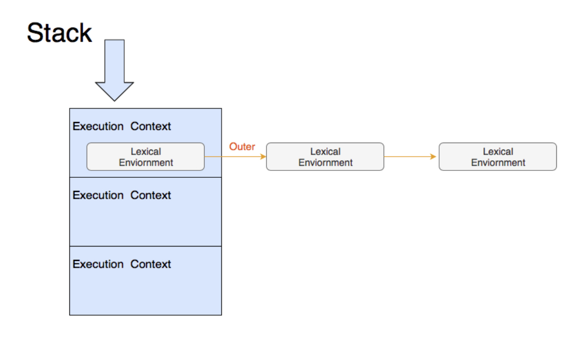

# 函数

## 函数与对象

函数是第一类对象，是一等公民，除了全局 JavaScript 代码（脚本、模块）是在页面构建的阶段执行的，其他的所有代码都将在一个个函数内执行。

对象可以实现：

- 通过字面量来创建；
- 赋值给变量、数组项，或其他对象的属性；
- 作为参数传递给函数；
- 作为函数的返回值；
- 具有动态创建和分配的属性。

函数也可以实现上面的功能。其中**作为参数传递给函数**也就是回调函数，将某个函数作为参数传入另一个函数，传入的函数会在应用程序执行的未来某个时间点才执行。

**函数实际上就是对象**，每个函数都是 Function 类型的实例，而且都与其他引用类型一样具有属性和方法。唯一的特殊之处在于函数是可调用的，函数会被调用以便执行某项动作。


## 函数类型

在JavaScript中，函数有几种类型：

1. 函数声明 Function Declaration

   ```js
   function functionName() {
     // 函数体
   }
   ```

2. 函数表达式 Function Expression

   ```js
   const functionName = function() {
     // 函数体
   };
   ```

3. 箭头函数 Arrow Function

   ```js
   const functionName = () => {
     // 函数体
   };
   ```

4. 构造函数 Constructor Function

   ```js
   const functionName = new Function('a','b','return a + b')
   ```

   + 以字符串形式动态构造一个函数，这样得到的函数是动态生成的；
   + 不推荐使用这种方式定义函数，因为这种语法会导致解析两次代码，：解析常规 JavaScript 代码；解析传入构造函数中的字符串。比较影响性能。

5. 类 Class

   ```js
   class ClassName() {
     // 构造函数体
   }
   ```

6. 方法 Method

   ```js
   const object = {
     methodName: function() {
       // 方法体
     }
   };
   ```

7. 异步函数，上述函数加上 async 关键字

   ```js
   async function functionName(){
       // 函数体
   }
   const functionName = async () => {
       // 函数体
   }
   ```


### 函数声明 VS 函数表达式

**对函数名的要求不同**

函数声明，强制性的 function 开头，其后紧接着强制性的函数名。

+ 因为作为一个单独的 JavaScript 语句，函数声明必须独立；
+ 一个函数的基本要求是它应该能够被调用，所以它必须具有一种被引用的方式，于是唯一的方式就是通过它的名字；
+ 由于函数是对象，因此函数名实际上是一个指向函数对象引用的指针，不会与某个函数绑定。

函数表达式，函数名可选。

+ 因为函数表达式是其他 JavaScript 表达式的一部分，所以存在除了函数名之外调用它们的替代方法，例如匿名函数，通常与立即执行函数（Immediately Invoked Function Expression，IIFE）一起调用：

  ```js
  (function() {
    // 函数体
  })();
  ```

+ 因为 function 关键字后面没有标识符，匿名函数的 name 属性是空字符串；

+ 匿名函数的函数表达式一定要用 `()` 包裹起来，否则 JavaScript 解析器在处理时会认为它在处理一个函数声明，而每个函数声明必须有一个名字，所以程序执行到这里会报错。

+ 除了加括号还有一些其他的声明方式，不管是加括号，还是使用一元操作符的方式区分函数表达式和函数声明，这些做法都是在向 JavaScript 解析器指明它处理的是表达式，而不是函数声明语句

  ```js
  (function () {}())      //不常用
  void function () {}();  //推荐
  +function () {}();
  -function () {}();
  !function () {}();
  ~function () {}();
  ```


**加载顺序不同**

JavaScript 解析器在向执行环境中加载数据时，会率先读取函数声明进行预解析，并使其在执行任何代码之前可以访问。

至于函数表达式，则必须等到解析器执行到它所在的代码行，才会真正被解释执行。

```js
// 报错，Uncaught TypeError: sum is not a function
sum(10,10);
const sum = function(num1, num2) {
  return num1 + num2;
}

// 成功，20
sum(10,10);
function sum (num1, num2) {
  return num1 + num2;
}
```


## 函数参数

函数参数分为实参 argument 和形参 parameter：

- 形参：定义函数时所列举的变量；
- 实参：调用函数时所传递给函数的值。


隐式的函数参数，会被静默地传递给函数，并且可以像函数体内显式声明的参数一样被正常访问：

+ this 表示被调用函数的上下文对象；
+ arguments 数表示函数调用过程中传递的所有参数。


注意，arguments 参数不是 JavaScript 数组，仅是一个类数组的结构。有 length 属性，也可以通过数组下标的方式访问到每一个元素，但无法使用数组的方法。

arguments 还有个 arguments.callee 属性，该属性是一个指针，指向拥有这个 arguments 对象的函数。这在函数的名称是未知时很有用。

但是，这是因为早期版本的 JavaScript 不允许使用命名函数表达式，无法传递一个递归函数表达式。为了解决这个问题提出了 arguments.callee 方案。不过这实际上是一个非常糟糕的解决方案，无法实现内联和尾递归，而且还会造成递归调用时获取到不同的 this 值这个问题。后来，ES3 通过允许命名函数表达式解决这些问题。因此严格模式下，ES5 禁止使用 arguments.callee()。


# 执行上下文

## 闭包

**闭包是函数**

闭包是指有权访问另一个函数作用域中的变量的函数。闭包其实只是一个绑定了执行环境的函数。

闭包内的函数不仅可以在创建的时刻访问这些变量，而且当闭包内部的函数执行时，还可以更新这些变量的值。闭包不是在创建的那一时刻的状态的快照，而是一个真实的状态封装，只要闭包存在，就可以对变量进行修改。


**闭包的缺点**

使用闭包时，所有的信息都会存储在内存中，直到 JavaScript 引擎确保这些信息不再使用、可以安全地进行垃圾回收，或页面卸载时，才会清理这些信息。


## 函数作用域

在 JavaScript 标准中，使用私有属性 [[Environment]] 为函数保存定义时的上下文。

当函数执行时，会创建一条新的执行环境记录，记录的外层词法环境（outer lexical environment）会被设置成函数的 [[Environment]]。这个动作就是切换上下文。

JavaScript 用一个栈来管理执行上下文，这个栈中的每一项又包含一个链表。当函数调用时，会入栈一个新的执行上下文，函数调用结束时，执行上下文被出栈。




# this

## this 运行行为

### 普通函数

```js
function showThis(){
    console.log(this);
}

const o = {
    showThis: showThis
}

showThis();   // global
o.showThis(); // o
```

**对于普通函数而言，调用函数时使用的引用，决定了函数执行时刻的 this 值**

+ 对于声明函数、函数表达式、方法这类普通函数而言，this 值由`调用它所使用的引用`决定；
+ 获取函数的表达式时，实际上返回的并非函数本身，而是一个 Reference 类型。当做一些运算时，Reference 类型会被解引用，获取真正的值来参与运算。


### 箭头函数

```js
const showThis = () => {
    console.log(this);
}

const o = {
    showThis: showThis
}

showThis(); // global
o.showThis(); // global
```

**对于箭头函数而言， this 值在创建函数时已经被确定，它指向的是箭头函数所在上下文的 this 值，而不是调用箭头函数时的对象或者函数**

+ 箭头函数的 this 值在定义时确定，并且在函数的整个生命周期内保持不变，不论用什么引用来调用它，都不影响它的 this 值；
+ 与其他函数类型不同，箭头函数没有自己的 this 绑定，它会继承外部作用域的 this 值；
+ 箭头函数无法通过 `call()`、`apply()` 或 `bind()` 改变其 this 值。


### 类函数

```js
class C {
    showThis() {
        console.log(this);
    }
}
const o = new C();
const showThis = o.showThis;

showThis(); // undefined
o.showThis(); // o
```

**对于类函数中定义的方法而言，this 严格按照调用时传入的值，可能为 null 或者 undefined**

+ 构造函数默认是严格模式。


## this 行为机制

在 JavaScript 标准中，使用私有属性 [[thisMode]] 为函数保存 this。

[[thisMode]] 私有属性有三个取值：

+ global：表示当 this 为 undefined 时，取全局对象，对应了普通函数；
+ lexical：表示从上下文中找 this，这对应了箭头函数；
+ strict：当严格模式时使用，this 严格按照调用时传入的值，可能为 null 或者 undefined。

构造函数中定义的普通函数方法的行为跟普通函数有差异，恰恰是因为 class 设计成了默认按 strict 模式执行。

函数创建新的执行上下文中的词法环境记录时，会根据 [[thisMode]] 来标记新纪录的 [[ThisBindingStatus]] 私有属性。代码执行遇到 this 时，会逐层检查当前词法环境记录中的 [[ThisBindingStatus]]，当找到有 this 的环境记录时获取 this 的值。

这样的规则的实际效果是，嵌套的箭头函数中的代码都指向外层 this：

```js
const o = {}
o.foo = function foo(){
    console.log(this);
    return () => {
        console.log(this);
        return () => console.log(this);
    }
}

o.foo()()(); // o, o, o
```


## 操作 this 的内置函数

Function.prototype.call 和 Function.prototype.apply 可以指定函数调用时传入的 this 值，作用是一样的，只是传参方式有区别：

```js
function showThis(a, b, c){
    console.log(this);
    console.log(a + b + c);
}
showThis(1, 2, 3);                // global, 6
showThis.call({}, 1, 2, 3);       // {}, 6
showThis.apply({}, [1, 2, 3]);    // {}, 6
```


Function.prototype.bind 可以创建一个新函数，这个函数的 this 值固定了参数：

```js
const newShowThis = showThis.bind({}, 1, 2, 3);
newShowThis(1, 2, 3);    // {}, 6
```


注意：call、bind 和 apply 用于不接受 this 的函数类型如箭头、class 不会报错，可以传参但无法改变 this。


# Reference

+ [Front-End-Basics: JavaScript 函数](https://docs.chenfangxu.com/javascript/utility/javascript-function.html) 
+ [重学前端（十九）JavaScript 执行（三）：你知道现在有多少种函数吗？](https://qiankunpingtai.cn/article/1570152384374) 