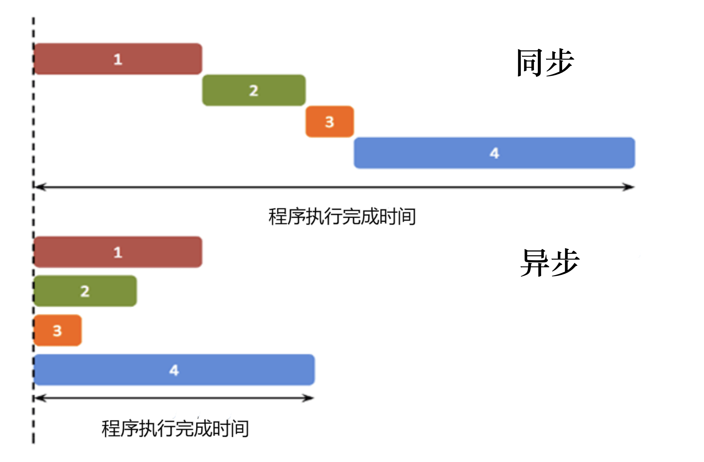

## 基本概念

### 同步与异步



+ **同步：是指步骤在一个控制流序列中按顺序执行。**
  + Synchronization sync
  + 同步是指，一个进程在执行某个请求的时候，如果该请求需要一段时间才能完成，那么这个进程将会一直等待下去，直到收到返回信息才继续执行下一个请求。
  + 就是发出一个功能调用时，在没有得到结果之前，该调用就不返回或继续执行后续操作。
  + 同步就是必须一件一件事做，等前一件做完了才能做下一件事。
  + 同步是阻塞模式。
  + 例子：[simple-sync.html](https://mdn.github.io/learning-area/javascript/asynchronous/introducing/simple-sync.html)

+ **异步：是不保证同步的概念。**
  + Asynchronous async
  + 异步是指，进程不需要一直等下去，就可以继续执行下一个请求，不用等待其他请求的结束。
  + 当一个异步过程调用发出后，调用者在没有得到结果之前，就可以继续执行后续操作。
    + 当这个调用完成后，**一般通过状态、通知和回调来通知调用者**。
      + 状态：即监听被调用者的状态（轮询），调用者需要每隔一定时间检查一次，效率会很低。
      + 通知：当被调用者执行完成后，发出通知告知调用者，无需消耗太多性能。
      + 回调：与通知类似，当被调用者执行完成后，会调用调用者提供的回调函数。
      + 例如：B/S 模式中的 ajax 请求，具体过程是：客户端发出 ajax 请求 -> 服务端处理 -> 处理完毕执行客户端回调，在客户端（浏览器）发出请求后，仍然可以做其他的事。
    + 对于异步调用，调用的返回并不受调用者控制。
  + 异步是非阻塞模式
  + 例子：[simple-sync-worker.html](https://mdn.github.io/learning-area/javascript/asynchronous/introducing/simple-sync-worker.html)

+ **区别**
  + 同步和异步最大的区别就是，请求发出后，是否需要等待结果，才能继续执行其他操作。
  + 同步没有充分利用计算机的计算能力，尤其是在计算机普遍都有多核CPU的时代。
  + 异步的执行效率更高。
  + 通常来说，程序都是顺序执行，同一时刻只会发生一件事。如果一个函数依赖于另一个函数的结果，它只能等待那个函数结束才能继续执行，从用户的角度来说，整个程序才算运行完毕。
  + 这是令人沮丧的体验，没有充分利用计算机的计算能力 — 尤其是在计算机普遍都有多核CPU的时代，坐在那里等待毫无意义，你完全可以在另一个处理器内核上干其他的工作，同时计算机完成耗时任务的时候通知你。这样你可以同时完成其他工作，这就是**异步编程**的出发点。你正在使用的编程环境（就web开发而言，编程环境就是web浏览器）负责为你提供异步运行此类任务的API。
  + 同步编程是指一个代码块中语句顺序执行，每个语句的执行结果在语句执行完毕后是可以马上得到预期的结果。而异步编程是指虽然语句被顺序执行了，但是期望的实际执行结果并不能在当下得到。


### 进程和线程

+ **进程（Process）：**

  + 是操作系统中的一个基本概念，它包含着一个运行程序所需要的资源；
  + 一个正在运行的应用程序在操作系统中被视为一个进程，**进程可以包括一个或多个线程**；
  + 进程之间是相对独立的，一个进程无法访问另一个进程的数据（除非利用分布式计算方式），一个进程运行的失败也不会影响其他进程的运行；
  + 进程可以理解为一个程序的基本边界，是应用程序的一个运行例程，是应用程序的一次动态执行过程。

+ **线程（Thread）：**

  + 是进程中的基本执行单元，是操作系统分配 CPU 资源的基本单位；
  + 在进程入口执行的第一个线程被视为这个进程的主线程；
  + 多个线程共享内存，从而极大地提高了程序的运行效率；
  + 线程主要是由 CPU 寄存器、调用栈和线程本地存储器（Thread Local Storage，TLS）组成的。CPU寄存器主要记录当前所执行线程的状态，调用栈主要用于维护线程所调用到的内存与数据，TLS主要用于存放线程的状态信息。

+ **区别**

  + 进程和线程的主要差别在于它们是不同的操作系统资源管理方式。
    + 进程有独立的地址空间，一个进程崩溃后，在保护模式下不会对其它进程产生影响；
    + 而线程只是一个进程中的不同执行路径。线程有自己的堆栈和局部变量，但线程之间没有单独的地址空间，一个线程死掉就等于整个进程死掉；
    + 所以多进程的程序要比多线程的程序健壮，但在进程切换时，耗费资源较大，效率要差一些；
    + 但对于一些要求同时进行并且又要共享某些变量的并发操作，只能用线程，不能用进程。
    + 简而言之,一个程序至少有一个进程,一个进程至少有一个线程.
  + 线程的划分尺度小于进程，使得多线程程序的并发性高。
  + 进程在执行过程中拥有独立的内存单元，而多个线程共享内存，从而极大地提高了程序的运行效率。
  + 线程在执行过程中与进程还是有区别的。
    + 每个独立的进程有一个程序运行的入口、顺序执行序列和程序的出口。
    + 但是线程不能够独立执行，必须依存在应用程序中，由应用程序提供多个线程执行控制。
  + 从逻辑角度来看，**多线程的意义在于一个应用程序中，有多个执行部分可以同时执行**。但操作系统并没有将多个线程看做多个独立的应用，来实现进程的调度和管理以及资源分配。这就是进程和线程的重要区别。


### 阻塞与非阻塞

阻塞和非阻塞这两个概念与程序（线程）等待消息通知（无所谓同步或者异步）时的状态有关。也就是说阻塞与非阻塞主要是程序（线程）等待消息通知时的状态角度来说的。

阻塞和非阻塞关注的是程序在等待调用结果（消息，返回值）时的状态。

+ 阻塞调用：是指调用结果返回之前，当前线程会被挂起。调用线程只有在得到结果之后才会返回。

+ 非阻塞调用：指在不能立刻得到结果之前，该调用不会阻塞当前线程。


### 阻塞/非阻塞和同步/异步的区别

同步/异步关注的是消息通知的机制，而阻塞/非阻塞关注的是程序（线程）等待消息通知时的状态。

**同步阻塞**：小明一直盯着下载进度条，到 100% 的时候就完成。

- 同步体现在：等待下载完成通知。
- 阻塞体现在：等待下载完成通知过程中，不能做其他任务处理。

**同步非阻塞**：小明提交下载任务后就去干别的，每过一段时间就去瞄一眼进度条，看到 100% 就完成。

- 同步体现在：等待下载完成通知。
- 非阻塞体现在：等待下载完成通知过程中，去干别的任务了，只是时不时会瞄一眼进度条。【小明必须要在两个任务间切换，关注下载进度】

**异步阻塞**：小明换了个有下载完成通知功能的软件，下载完成就“叮”一声。不过小明不做别的事，仍然一直等待“叮”的声音。

- 异步体现在：下载完成“叮”一声通知。
- 阻塞体现在：等待下载完成“叮”一声通知过程中，不能做其他任务处理。

**异步非阻塞**：仍然是那个会“叮”一声的下载软件，小明提交下载任务后就去干别的，听到“叮”的一声就知道完成了。

- 异步体现在：下载完成“叮”一声通知。
- 非阻塞体现在：等待下载完成“叮”一声通知过程中，去干别的任务了，只需要接收“叮”声通知即可。【软件处理下载任务，小明处理其他任务，不需关注进度，只需接收软件“叮”声通知，即可】

也就是说，同步/异步是“下载完成消息”通知的方式（机制），而阻塞/非阻塞则是在等待“下载完成消息”通知过程中的状态（能不能干其他任务），在不同的场景下，同步/异步、阻塞/非阻塞的四种组合都有应用。

所以，综上所述，同步和异步仅仅是关注的消息如何通知的机制，而阻塞与非阻塞关注的是等待消息通知时的状态。也就是说，同步的情况下，是由处理消息者自己去等待消息是否被触发，而异步的情况下是由触发机制来通知处理消息者，所以在异步机制中，处理消息者和触发机制之间就需要一个连接的桥梁。在小明的例子中，这个桥梁就是软件“叮”的声音。


## 异步编程实现方案

JavaScript学习指南中说：js 对异步式编程的支持有三个阶段，callback阶段，promise阶段，generator阶段。

```js
// 假定有两个函数f1和f2，后者等待前者的执行结果。
f1();
f2();
```


### Callback

```js
function f1(callback){
  setTimeout(function () {  
    // f1的任务代码  
    callback();  
  }, 1000); 
}

f1(f2);
```

```js
function loadAsset(url, type, callback) {
  let xhr = new XMLHttpRequest();
  xhr.open('GET', url);
  xhr.responseType = type;

  xhr.onload = function() {
    callback(xhr.response);
  };

  xhr.send();
}

function displayImage(blob) {
  let objectURL = URL.createObjectURL(blob);

  let image = document.createElement('img');
  image.src = objectURL;
  document.body.appendChild(image);
}

loadAsset('coffee.jpg', 'blob', displayImage);
```


+ 回调函数的本质就是函数，只不过是作为参数传递给那些在后台执行的其他函数。当那些后台运行的代码结束，就调用callbacks函数，通知你工作已经完成。
+ 当我们把回调函数作为一个参数传递给另一个函数时，仅仅是把回调函数定义作为参数传递过去，回调函数并没有立刻执行，回调函数会在包含它的函数的某个地方异步执行，包含函数负责在合适的时候执行回调函数。
+ 回调函数用途广泛，他们不仅仅可以用来控制函数的执行顺序和函数之间的数据传递，还可以根据环境的不同，将数据传递给不同的函数，所以对下载好的资源，你可以采用不同的操作来处理
+ 不是所有的回调函数都是异步的，回调函数是为了在异步调用后接着处理。
+ 异步式编程的实现需要回调函数的支持，但是回调函数不一定是异步式编程。异步式编程的回调阶段，回调函数作为参数传递给另一个A函数，如果A函数有异步的支持，那么就是异步式编程，如果A函数没有异步的支持，那么就是普通的回调。

**优点：**

+ 简单、容易理解和部署

**缺点：**

+ 不利于代码的阅读和维护，各个部分之间高度耦合，流程会很混乱
+ 回调地狱，不能用 try catch 捕获错误，不能 return

回调地狱的根本问题在于：

- 缺乏顺序性： 回调地狱导致的调试困难，和大脑的思维方式不符
- 嵌套函数存在耦合性，一旦有所改动，就会牵一发而动全身，即（**控制反转**）
- 嵌套函数过多的话，很难处理错误


### EventListen

```js
// https://api.jquery.com/on/
function f1(){
  setTimeout(function () {
    // f1的任务代码  
    f1.trigger('done');  
  }, 1000);  
}
  
f1.on('done', f2);
```

```js
const buttonElement = document.getElementById('btn');

// Add a handler for the 'click' event by providing a callback function.
// Whenever the element is clicked, a pop-up with "Element clicked!" will
// appear.
buttonElement.addEventListener('click', function (event) {
  alert('Element clicked through function!');
});

// 由于兼容性原因，一个带有 handleEvent 函数属性的对象也可以达到相同的效果。
buttonElement.addEventListener('click', {
  handleEvent: function (event) {
    alert('Element clicked through handleEvent property!');
  }
});
```


+ 采用事件驱动模式。
+ 任务的执行不取决于代码的顺序，而取决于某个事件是否发生。

**优点：**

+ 比较容易理解
+ 可以绑定多个事件，每个事件可以指定多个回调函数
+ 可以去耦合，有利于实现模块化

**缺点：**

+ 整个程序都要变成事件驱动型，运行流程会变得很不清晰


### Publish-Subscribe

```js
// https://api.jquery.com/jQuery.Callbacks/#pubsub
jQuery.subscribe("done", f2);

function f1(){
  setTimeout(function () { 
    // f1的任务代码 
    jQuery.publish("done");
  }, 1000); 
}

jQuery.unsubscribe("done", f2);
```


+ 事件监听的 "事件"，完全可以理解成 "信号"。
+ 我们假定，存在一个 "信号中心"，某个任务执行完成，就向信号中心 "发布"（publish）一个信号，其他任务可以向信号中心 "订阅"（subscribe）这个信号，从而知道什么时候自己可以开始执行。这就叫做 "发布/订阅模式"（publish-subscribe pattern），又称 "观察者模式"（observer pattern）。
+ 首先，f2 向 "信号中心" jQuery 订阅 "done" 信号；jQuery.publish("done") 的意思是，f1 执行完成后，向 "信号中心" jQuery 发布 "done" 信号，从而引发 f2 的执行；此外，f2 完成执行后，也可以取消订阅（unsubscribe）。

**优点：**

+ 这种方法的性质与 "事件监听" 类似，但是明显优于后者。因为我们可以通过查看 "消息中心"，了解存在多少信号、每个信号有多少订阅者，从而监控程序的运行。


### 定时器

+ 在一段时间间隔过后异步执行代码，或者重复异步执行代码块，直到您告诉它停止为止。
+ 在 `setTimeout()` 调用执行之前或 `setInterval()` 迭代之间可以（并且经常会）运行其他代码。根据这些操作的处理器密集程度，它们可以进一步延迟异步代码，因为任何异步代码仅在主线程可用后才执行（换句话说，当调用栈为空时）。
+ 这些函数设置的异步代码实际上在主线程上运行（在其指定的计时器过去之后），所以繁重的回调（尤其是那些操纵 DOM 的回调）会在不注意的情况下降低页面的速度。

#### setTimeout()

在指定的时间后异步执行一段代码。

+ 指定的时间（或延迟）不能保证在指定的确切时间之后执行，而是最短的延迟执行时间。在主线程上的堆栈为空之前，传递给这些函数的回调将无法运行。
+ 因此，像 `setTimeout(fn, 0)` 这样的代码将在堆栈为空时立即执行，而不是立即执行。如果执行类似 `setTimeout(fn, 0)` 之类的代码之后立即运行从 1 到 100亿 的循环之后，回调将在几秒后执行。 

#### setInterval()

以固定的时间间隔，重复异步执行一段代码。

+ 可以递归调用 setTimeout() 来实现 setInterval() 的效果，但两者之间有细微的差别：

  + ```js
    let i = 1;
    
    setTimeout(function run() {
      console.log('setTimeout', i);
      i++;
      setTimeout(run, 100);
    }, 100);
    
    
    // *===================== 分割线 =====================* //
    
    
    let j = 1;
    
    setInterval(function run() {
      console.log('setInterval', j);
      j++
    }, 100);
    ```

  + 递归 `setTimeout()` 保证执行之间的延迟相同，例如在上述情况下为 100ms。 代码将运行，然后在它再次运行之前等待 100ms，因此无论代码运行多长时间，间隔都是相同的。

  + 使用 `setInterval()` 的示例有些不同。 我们选择的间隔包括执行我们想要运行的代码所花费的时间。假设代码需要 40ms 才能运行，然后间隔最终只有 60ms。

  + 当递归使用 `setTimeout()` 时，每次迭代都可以在运行下一次迭代之前计算不同的延迟。 换句话说，第二个参数的值可以指定在再次运行代码之前等待的不同时间。

  + 当你的代码有可能比你分配的时间间隔，花费更长时间运行时，最好使用递归的 `setTimeout()` ，这将使执行之间的时间间隔保持不变，无论代码执行多长时间，你不会得到错误。

#### requestAnimationFrame()

setInterval() 的现代版本，在浏览器下一次重新绘制显示之前异步执行指定的代码块，从而允许动画在适当的帧率下运行，而不管它在什么环境中运行。

+ requestAnimationFrame() 是一个专门的循环函数，旨在浏览器中高效运行动画

+ 它是针对 `setInterval()` 遇到的问题创建的，比如 `setInterval()` 并不是针对设备优化的帧率运行，有时会丢帧。还有即使该选项卡不是活动的选项卡或动画滚出页面等问题 。

+ ```js
  function draw() {
     // Drawing code goes here
     requestAnimationFrame(draw);
  }
  
  draw();
  ```

  + 要定义一个函数，在其中更新动画 (例如，移动精灵，更新乐谱，刷新数据等)，然后调用它来开始这个过程。在函数的末尾，以 `requestAnimationFrame()` 传递的函数作为参数进行调用，这指示浏览器在下一次显示重新绘制时再次调用该函数。
  + 这个操作连续运行， 因为 `requestAnimationFrame()` 是递归调用的。

+ 如果要执行某种简单的常规DOM动画，CSS 动画可能更快，因为它们是由浏览器的内部代码计算而不是 JavaScript 直接计算的。但是，如果您正在做一些更复杂的事情，并且涉及到在 DOM 中不能直接访问的对象(例如 2D Canvas API 或这个 WebGL objects)，`requestAnimationFrame()` 在大多数情况下是更好的选择。

+ `requestAnimationFrame()` 不需要指定时间间隔，会尽其所能利用现有资源提升帧速率，在当前条件下尽可能快速平稳地运行。

+ 传递给 `requestAnimationFrame()` 函数的实际回调也可以被赋予一个参数（一个时间戳值），表示自 `requestAnimationFrame()` 开始运行以来的时间。

  + ```js
    let startTime = null;
    
    function draw(timestamp) {
        if(!startTime) {
          startTime = timestamp;
        }
    
       currentTime = timestamp - startTime;
    
       // Do something based on current time
    
       requestAnimationFrame(draw);
    }
    
    draw();
    
    ```

  + 它允许在特定的时间以恒定的速度运行，而不管设备有多快或多慢。


### Promise

```js
function f1(){
  var dfd = $.Deferred(); 

  setTimeout(function () { 
    // f1的任务代码    
    dfd.resolve();  
  }, 500);
  
  return dfd.promise;  
}

f1().then(f2);
```

```js
fetch('products.json')
.then(function (response) {
  return response.json()
}).then(function (json) {
  products = json
  initialize()
}).catch(function (err) {
  console.log('Fetch problem: ' + err.message)
})
```


+ Promise 是一个对象，代表操作的中间状态 —— 正如它的单词含义 '承诺' ，它保证在未来可能返回某种结果。虽然 Promise 并不保证操作在何时完成并返回结果，但是它保证当结果可用时，你的代码能正确处理结果，当结果不可用时，你的代码同样会被执行，来优雅的处理错误。
  + 创建 promise 时，它既不是成功也不是失败状态。这个状态叫作 **pending**（待定）。
  + 当 promise 返回时，称为 **resolved**（已解决）。
  + 一个成功 resolved 的 promise 称为 **fullfilled**（**实现**）。它返回一个值，可以通过将 `.then()` 块链接到 promise 链的末尾来访问该值。` .then()` 块中的执行程序函数将包含 promise 的返回值。
  + 一个不成功 **resolved** 的 promise 被称为 **rejected**（**拒绝**）。它返回一个原因（**reason**），一条错误消息，说明为什么拒绝 promise。可以通过将 `.catch()` 块链接到 promise 链的末尾来访问此原因。
+ 像 promise 这样的异步操作被放入事件队列中，事件队列在主线程完成处理后运行，这样它们就不会阻止后续 JavaScript 代码的运行。排队操作将尽快完成，然后将结果返回到 JavaScript 环境。
+ promises 与旧式 callbacks 有一些相似之处。它们本质上是一个返回的对象，您可以将回调函数附加到该对象上，而不必将回调作为参数传递给另一个函数。
+ 每次调用 `.then()` 都会创建一个新的 promise。

**与回调函数相比的优点：**

+ 可以使用多个 `then()` 操作将多个异步操作链接在一起，并将其中一个操作的结果作为输入传递给下一个操作。这种链式调用的方式使得程序流程清晰可见
+ Promise 总是严格按照它们放置在事件队列中的顺序调用，保证每个操作在运行之前等待先前的操作完成，不用担心是否错过了某个事件。每个 `.then()` 块返回一个新的 promise，当 `.then()` 块运行完毕时它会解析。
+ 只需要末尾的一个 `.catch()` 块来处理所有错误，它不会阻塞主线程。

**与事件监听器的差异：**

+ 一个 promise 只能成功或失败一次。它不能成功或失败两次，并且一旦操作完成，它就无法从成功切换到失败，反之亦然。
+ 如果 promise 成功或失败并且你稍后添加成功/失败回调，则将调用正确的回调，即使事件发生在较早的时间。
+ `.then()` 每次使用时只运行一次，而事件监听器可以多次调用。

**缺点**

+ 无法取消 Promise
+ 错误需要通过回调函数捕获。不能和 try catch 一起使用。
+ 不能使用 return，因为 then 块默认会向下顺序执行，return 是不能中断的，可以通过 throw 来跳转至 catch 实现中断。


JS两大特点：单线程和非阻塞
单线程: JS引擎是基于单线程(Single-threaded)事件循环的概念构建的。同一时刻只运行一个代码块在执行，与之相反的是像JAVA和C++等语言，它们允许多个不同的代码块同时执行。对于基于线程的软件而言，当多个代码块同时访问并改变状态时，程序很难维护并保证状态不出错。
非阻塞: 当代码需要进行一项异步任务（无法立刻返回结果，需要花一定时间才能返回的任务，如I/O事件）的时候，主线程会挂起（pending）这个任务，然后在异步任务返回结果的时候再根据一定规则去执行相应的回调。非阻塞通过事件循环机制Event Loop实现。


## 使用异步的场景

+ 很多网页API特性使用异步代码，特别是从外部的设备上获取资源，譬如，从网络获取文件，访问数据库，从网络摄像头获得视频流，或者向VR头罩广播图像。

+ 在最基本的形式中，JavaScript是一种同步的、阻塞的、单线程的语言，在这种语言中，一次只能执行一个操作。但web浏览器定义了函数和API，允许我们当某些事件发生时不是按照同步方式，而是异步地调用函数(比如，时间的推移，用户通过鼠标的交互，或者获取网络数据)。这意味着您的代码可以同时做几件事情，而不需要停止或阻塞主线程。

  

  异步还是同步执行代码，取决于我们要做什么。

  

  有些时候，我们希望事情能够立即加载并发生。例如，当将一些用户定义的样式应用到一个页面时，您希望这些样式能够尽快被应用。

  但是，如果我们正在运行一个需要时间的操作，比如查询数据库并使用结果填充模板，那么最好将该操作从主线程中移开使用异步完成任务。随着时间的推移，您将了解何时选择异步技术比选择同步技术更有意义。


## 参考博文

[15分钟读懂进程线程、同步异步、阻塞非阻塞、并发并行](https://www.cnblogs.com/mhq-martin/p/9035640.html) 

[JS 异步编程六种方案](https://juejin.cn/post/6844903760280420366) 

[MDN - 在 JavaScript 中通过 queueMicrotask() 使用微任务](https://developer.mozilla.org/zh-CN/docs/Web/API/HTML_DOM_API/Microtask_guide) 

[MDN - 事件循环](https://developer.mozilla.org/zh-CN/docs/Web/JavaScript/Event_loop) 