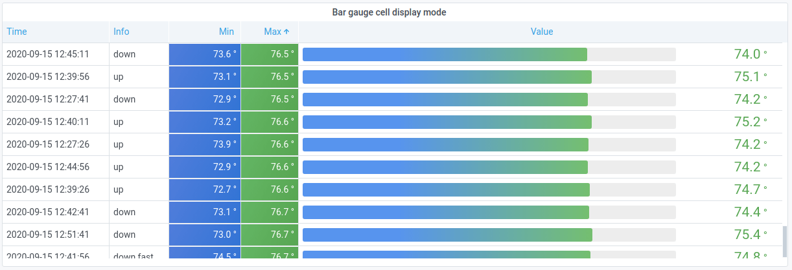

# Grafana 是什么

Grafana 是一个通用的可视化工具、一个监控仪表系统，不仅仅适用于展示时间序列数据，还可以展示日志数据、 SQL 等其他数据。

Grafana 能够查询、展示、告警和分析指标，不在意这些指标存储在何处，由谁提供。

### 特性

+ Visualize：快速灵活的可视化以及多种选择，使用户可以以任何方式可视化数据；
+ Alerting：直观定义重要指标的告警规则；
+ Unify：将数据整合在一起获得更好的上下文，在同一张图中混合使用不同的数据源；
+ Open：完全开源、充满活力的社区；
+ Extend：支持各式各样的插件；
+ Collaborate：将所有人聚集在一起，并在团队之间共享数据和仪表板。

### 为什么选择 Grafana

通过 Prometheus 内置的 Console Template 组件允许用户通过 Go 模板语言创建任意的控制台界面，并且能通过 Prometheus Server 对外提供访问路径，解决了查询结果无法持久化的问题。虽然能满足一定的可视化需求，但也只是对 Pronetheus 基本能力的补充。并且其使用成本高，用户需要学习和了解 Go Template 模板语言，而且支持的图表化类型非常有限，管理也存在一定的成本。Grafana 能完美解决这些问题，并且具有更丰富、更强大的功能。

+ 开源、社区活跃；
+ 上手快速、操作简单；
+ 支持多种数据源和多种可视化界面；
+ 扩展性强，使用插件的方式添加其他数据源和丰富的可视化界面
+ 实现了对 PromQL 的完整支持；
+ 在权限上有组织、团队、角色的划分，通过在 Dashboard 和 Panel 设置中配置相应权限，使用户查看所需要的资源；将权限分配给 Team 可以简化管理；
+ 在一个可视化界面中混用多种数据源；
+ 可视化界面样式丰富，图形美观，色彩多样，暴露许多配置项，使可视化界面更加丰富多变，实现更多的可视化定制的能力；
+ 强大的告警规则配置和展示功能。

# 基本概念

### 数据源（Data Source）

为 Grafana 提供数据的对象称为数据源。目前，Grafana官方提供了对 Prometheus，Graphite，OpenTSDB，InfluxDB，Elasticsearch等系统的数据支持，在 3.0 版本后可以使用插件的方式添加其他数据源。对于 Grafana 管理员而言，只需要将这些对象以数据源的形式添加到 Grafana 中，Grafana 便可以轻松的实现对这些数据的可视化工作。更多数据源及插件的支持请看链接 👉 [Plugins of data sources](https://grafana.com/grafana/plugins?type=datasource&utm_source=grafana_add_ds)  

### 仪表盘（Dashboard）

通过 Data Source 定义好可视化的数据来源之后，最重要的事情就是实现数据的可视化。在 Grafana 中，通过 Dashboard 来组织和管理我们的数据可视化图表。

在一个 Dashboard 中最基本的可视化单元为一个 Panel，每个 Panel 是完全独立的，因此在一个 Dashboard 中可以包含来自多个数据源的 Panel。除了 Panel 以外，在 Dashboard 页面中用户还可以定义一个 Row 来组织和管理一组相关的 Panel。除了 Panel 和 Row 这些对象以外，Grafana还允许用户为 Dashboard 定义 Templating variables，实现与用户动态交互的 Dashboard 页面。

Grafana 通过 JSON 数据结构管理了整个 Dasboard ，因此 Dashboard 有多种共享方式，共享十分便利。

Dashboard 可以被标记，可以属于某个 Organization，对于某个 Organization 可以实现 Dashboard 的快速搜索和访问。在 Grafana 中可以创建多个 Organization，其中User 可以属于一个或多个不同的 Organization， 在不同的Organization下可以为 User 赋予不同的权限， 从而可以有效的根据企业组织架构定义整个管理模型。

社区提供了许多精美的 Dashboards，详细信息查看链接 👉 [Dashboards](https://grafana.com/grafana/dashboards) 

### 面板（Panel）

Grafana 通过插件的形式提供了多种 Panel 的实现，例如趋势图，热力图等，用户还可通过插件安装更多类型的 Panel 面板，Panel 通过这些类型展示可视化数据。

通过 Panel 的查询编辑器可以为每个 Panel 设置数据源，数据源的不同也会造成数据查询方式的不同。例如，如果以 Prometheus 作为数据源，那在查询编辑器中实际上使用的是查询语句时 PromQL，Panel 从特定的Prometheus 中查询出相应的数据，并且将其可视化。

### 组织、团队、用户、角色

TODO

https://grafana.com/docs/grafana/latest/permissions/

# 创建

### 添加 Data Sources

+ 从侧边栏的设置中（也就是标号1处）进入 Grafana 的设置页面；

+ 在标号2处可以查看当前项目中已经配置的数据源；

+ 在标号3处可以为项目添加新的数据源并进行配置，在此处可以查看数据源的支持类型及插件，选择欲添加的类型，填写 Name、 URL 等信息后点击 `Save & Test` ;

  

+ 如果成功链接数据源，出现绿色提示框，如果链接数据源失败，会出现红色提示框；

  

  

+ 同种类型的数据源可以添加多次。

### 创建 Dashboard

+ 点击首页侧边栏的 `+` 键，可以快速创建一个新的 Dashboard；或者点击 `+` 键中 Create 下的 `Dashboard` 选项也可以创建一个空白 Dashboard。

+ 点击 `Folder` 选项，填写 name 后可以创建一个文件夹，一个文件夹下可以创建多个 Dashboard。当有存在许多 Dashboard，或者不同组织使用相同 Dashboard 时，文件夹可以非常便利的对 Dashborads 进行组合和分组管理。
+ 点击 `Import` 选项，可以导入 Dashboard 模版。可以选择从本地导入 JSON 文件，也可以在社区中选择符合需求的开源模版，通过 URL 或者 ID 直接导入。

简单介绍下 Dashboard 头部 UI

+ 标记1是标题，展示当前页面显示的 Dashboard 的标题，如果当前 Dashboard 属于某个文件夹下，还没拼接文件夹的标题。点击能切换到其他 Dashboard 页面；
+ 标记2是收藏，能收藏当前的 Dashboard，在 Grafana 首页会展示在 Starred dashboards 中；
+ 标记3是分享，能快速创建当前 Dashboard 链接并分享；
+ 标记4是添加按钮，在当前 Dashboard 中新增 Panel；
+ 标记5是保存键，保存对当前 Dashboard 的修改，并且可以额外记录修改信息；
+ 标记6是设置，可以修改 Dashboard 的标题、描述信息、标签、所属文件夹、时间范围、刷新间隔选择、权限等信息；
+ 标记7可以全屏展示当前 Dashboard，第一次点击收起侧边栏，第二次点击收起头部，按键 `esc` 可退出全屏；
+ 标记8是时区选择器，可以选择当前 Dashboard 中所有 Panel 数据展示的时间段；
+ 标记9能扩大时间范围；
+ 标记10是刷新按钮，能刷新当前 Dashboard 中所有的 Panel，也能设置自动刷新时间。

### 创建 Panel

+ 进入预添加 Panel 的 Dashboard 界面；
+ 点击界面右上角的 图标，会在页面顶部生成一个空 Panel；
+ 点击新建 Panel 的 `Add new panel` 按钮进入编辑页面，设置好标题、描述、数据源、数据查询语句、可视化图形后，基础配置完成；
+ 点击右上角的 `Save` 按钮，弹出文字输入框，可以在其中填写这次改变的描述信息便于后期查看，也可以直接点击保存按钮；
+ 至此，一个基础的 Panel 就创建完毕，可以在相应 Dashboard 中进行查看；
+ 点击新建 Panel 的 `Add new panel` 下的 `Convert to row` 按钮可以新建一个 Row，可以将任意 Panel 移动进 Row 中进行分类和折叠，点击 Row 旁边的设置按钮可以进行命名等操作。

### 快速操作

在 Dashbaord 页面中关于 Panel 的快速操作：

+ 长按 Panel 标题可随意拖拽该面板，将其放置在任何位置；
+ 长按 Panel 右下角可进行拉伸，改变该面板的显示大小；
+ 点击 Panel 左下角图例的颜色图标，可以快速切换颜色，或改变 y 轴显示方向；
+ 点击 Panel 左下角图例的名称，可以仅显示当前选中数据，隐藏其他数据；
+ 点击 Panel 左下角图例的名称同时按下 `shift` 按键，可以隐藏选中数据，显示其他数据；
+ 鼠标悬浮在 Panel 标题上同时按下 `E` 按键，可快速进入该 Panel 的编辑页面；
+ 鼠标悬浮在 Panel 标题上同时按下 `V` 按键，可快速进入该 Panel 的全屏页面。

# Panel 详细介绍

Panel 是 Grafana 中最基本的可视化单元，每个 Panel 都提供了对应数据源查询编辑器，让用户可以从数据源中查询出想要的监控数据，并以可视化的方式展示出来。

Panel 的编辑页面主要由四个部分组成：Header、Visulization Preview、Bottom Pane、Side Pane。接下来分别对每个部分进行详细介绍。

### 头部（Header）

左侧展示了当前 Panel 所属的 Dashboard 标题信息，以及Panel 本身标题信息。

最左侧的返回按钮可返回当前 Dashboard。

右侧的四个按钮功能分别是：

+ setting：点击会进入当前 Dashboard 设置界面；
+ Discard：放弃距上一次保存为止的所有修改；
+ Save：第一次点击弹出文字输入框，再次点击才完成保存，页面继续停留在 Panel 编辑页面；
+ Apply：不会弹出文字输入框直接保存，并且跳转到所属 Dashborad 页面。

### 可视化预览（Visulization Preview）

该部分包括了视野选项、时区选择器、刷新按钮以及视图预览。

视野选项有三个按钮：

+ Fill：视图预览会填充预览部分中的所有可用空间；
+ Fit：视图预览会填充预览部分中的所有可用空间，但保留面板的纵横比；
+ Exact：视图预览的大小与 Dashboard 上展示的一致，如果没有足够的可用空间会按比例进行缩小以保留宽高比。

时区选择器和刷新按钮与 Dashboard 页面的功能一致。

视图预览包含当前 Panel 的标题、数据视图预览等信息。

### 底部窗格（Bottom Pane）

这个部分主要对 Panel 进行数据查询、转换、告警设置。

##### 查询页（Query Tab）

Query 定义了 Panel 如何从数据源获取数据用以可视化数据。Panel 会根据当前数据源类型加载不同的 Query 界面，以数据源选择 Prometheus 为例，加载出的 Query 页面如图所示：

任意数据源加载出的 Query 界面都有图中圈出的四个部分：Data source selector、Query options、Query inspector 以及 Query editor list。

+ Data source selector：

  数据源选择器点开后是一个下拉菜单，里面展示了在 Grafana 中添加的所有数据源类型，从中选择一个作为当前 Panel 的数据源。

  
  
  除了手动添加的数据源外，Grafana 还自带了三种默认数据源：
    + Grafana：是个内置数据源，产生一组随机的数据，主要用于测试可视化和运行实验。
    + Dashboard：可选择当前 Panel 所在 Dashborad 中另外 Panel 的结果集
    + Mixed：用于需要从多个数据源中查询和渲染数据的场景。当选择这个数据源时，Grafana 允许用户为每个查询语句单独定义数据源。

+ Query options：

  点击该选项对选择的数据源进行设置，修改的配置项仅适用于当前 Panel

  

  主要有五个配置：

  + Max data points：可展示的最多数据点，默认是图表的宽度。如果查询返回的数据点超过该设置值，则数据将会被合并。主要是为了提高性能、平滑曲线；
  + Min interval：最小间隔，默认是数据源抓取数据的频率。将其设置成比数据源抓取数据频率更大的时间，可以得到颗粒度更粗且功能良好的数据展示；
  + Interval：按照时间进行汇总或分组的间隔，Grafana 会自动计算一个适当的间隔，并且可以将其用作模板化查询中的变量；
  + Relative time：相对时间范围，设置以后右上角的时区选择器将失效。通过设置该属性可以在 Dashborad 中展示不同时间区域的 Panel，不会跟随 Dashbaord 的时区选择器变化，会在面板的右上角显示设置的时间段；
  + Time shift：时移，仅适用于相对时间范围，设置后时区选择器将失效。可以在相对时间范围之上往前移动时间轴。

+ Query inspector

  点击该选项可以展开调试工具，能看查看当前 Panel 的数据查询请求与响应。

  

  更多的信息参考链接 👉 [Inspect a panel](https://grafana.com/docs/grafana/latest/panels/inspect-panel/) 

+ Query editor list

  每个查询语句都可以折叠成一行，并按照字母 A、B、C等进行标识。对每一行查询语句都可以进行如下操作：

  + ：复制当前查询，并快速创建一条新查询；
  + ：隐藏当前查询，Grafana 不会将隐藏的查询发送到数据源；
  + ：删除当前查询，会永久删除，但是可以通过恢复为之前 Panel 来找回；
  + ：重排查询，其顺序就是查询顺序，根据查询顺序也可以调整视觉效果。

  

  每个查询语句都有独立的查询编辑器，对于Prometheus 数据源而言查询编辑器可以进行以下设置：

  + 
  + Metics：定义呈现的数据。Grafana 提供了对 PromQL 的完整支持，因此这里也可以直接使用 PromQL 进行查询；
  + Legend：定义每条数据的图例信息。支持通过模板的方式，根据数据的标签动态生成图例名称，例如，`{{hostname}}` 将替换图例为主机名的标签值；
  + Min step：控制 Prometheus 查询数据时的最小步长。可以减少从 Prometheus 返回的数据量，解决当查询的样本数据量非常大时导致的渲染图表性能问题；
  + Resolution：控制 Grafana 自身渲染的数据量。例如值为1/2时，Grafana 会将 Prometeus 返回的两个样本数据合并成一个点。该值越小可视化的精确性越高，反之可视化的精度越低；
  + Format：定义如何格式化 Prometheus 返回的样本数据。这里提供了3个选项：
    + Time Series：用于 Graph 面板；
    + Table：用于 Tabel 面板；
    + Heatmap：用于 Heatmap 面板。
  + Instant：
  + 最后的按钮点击跳转到相应的数据源页面，此处会跳转到 Prometheus 运行的端口页面。

  

  点击左下角的 `+ Query` 按钮可以创建一个空的查询语句，每个 Panel 最大能包含 26 条查询语句。

##### 转换页（Transform Tab）

将查询结果传递给可视化之前，Tansformations 会对其进行处理。Tansformations 能重命名字段、将单独的时间序列连接在一起、在查询中进行数学运算等等。在数个 Dashborad 或多个 Query 的情况下，能大大提高 Panel 重用其他 Panel 查询结果的性能。

需要注意的是，Tansformations 是 Grafana 7.0 beta 的性能，将来可能会发生变化。

更多的信息参考链接 👉 [Transformations](https://grafana.com/docs/grafana/latest/panels/transformations/) 

##### 告警页（Alert Tab）

Alerts 能立即识别系统出现的问题，通过快速识别意外问题能最大程度减少系统中断。

Alerts 由两部分组成：

+ 告警规则：规定告警在何时触发；
+ 通知渠道：告警信息以怎样的方式进行传递。

目前只有 Graph 支持告警。更多的信息参考链接 👉 [Create alerts](https://grafana.com/docs/grafana/latest/alerting/create-alerts/) 

### 侧边窗格（Side Pane）

这个部分几乎包含了 Panel 的所有可视化样式，注意，选择的可视化界面不一样也会造成侧边窗口配置的变化。

Grafana 提供了多种可视化界面适应不同数据类型，还可以通过插件的方式安装更多丰富的可视化界面。Grafana 内置提供的可视化界面有：

##### Graph：趋势图

Graph 是最常用的 Panel 展示，Graph 可以渲染为一条线，一条点的路径或一系列条形图。这种类型的图具有足够的通用性，几乎可以显示任何时间序列数据。适用于 Prometheus 中 Gauge 和 Counter 类型监控指标的监控数据可视化。

Graph 可以设置 Alert、Transform、Field、Overrides 以及 Thresholds。

Graph 还可以对 Display、Series overrides、Axes、Legend、Time regions 进行配置，实现更多可视化定制的能力：

+ Display

  这些选项用于设置当前图标的展示形式、样式以及交互提示行为，使图像样式更加丰富

  

  + Bars：将数据展示为柱状体
  + Lines：将数据展示为曲线，默认是1
  + Lines width：设置曲线的宽度
  + Staircase：将相邻点绘制成阶梯状
  + Area fill：曲线下方区域颜色填充的透明度，默认是1，0表示没有
  + Fill gradient：曲线下方区域颜色填充的渐变度，默认是0，表示没有颜色渐变
  + Point：为每个数据画点标记
  + Alert thresholds：在面板上显示告警阈值和区域
  + Stack：每个时间序列都堆叠在另一个之上
  + Null value：当时间序列中有一个间隙（表示存在一个或多个空值）面板如何展示，有三个选项
    + connected：跳过间隙并连接到下一个非空值。
    + null：截断并展示这个间歇
    + null as zero：在面板中显示为 0 值
  + Mode：当鼠标移动道图形时，提示框中的显示模式，有两个选项：
    + All series：显示所有的时间序列信息
    + Single：只显示鼠标悬浮位置的时间序列信息
  + Sort order：如果选择的模式时 All series，悬浮提示框中对当前时间的序列数据大小进行排序，有三个选项：
    + None：不排序，按照系列的图例名称排序
    + Increasing：按照数值递增的方式从上往下排列
    + decreasing：按照数值递减的方式从上往下排列

+ Series overrides

  可以使当前图表中的特定时间序列以不同的形式展示，为指定的时间序列单独设置自定义的 Display 配置，从而让其以不同的样式展示。

   

  + Alias or regex：在此处指定为哪个或哪些时间序列单独设置 Display 选项，下拉菜单中有所有时间序列名称，也可以通过正则表达式进行匹配。
  + +：点击添加选择一种样式以用于该时间序列的展示，可以添加多种样式：
    + Bars：将数据展示为柱状体
    + Lines：将数据展示为曲线
    + Line fill：曲线下方区域颜色填充的透明度
    + Fill gradient：曲线下方区域颜色填充的渐变度
    + Lines width：设置曲线的宽度
    + Null point mode：当时间序列中有一个或多个空值时曲线如何展示
    + Fill below to：两条时间序列之间的填充样式
    + Staircase line：将相邻点绘制成阶梯状
    + Dashes：将数据展示为点线
    + Hidden Series：隐藏该数据
    + Dash Length：点线的长度
    + Dash Space：点线的间隔
    + Point：为每个数据画点标记
    + Point Radius：点标记的半径
    + Stack：设置该数据的堆栈组
    + Color：设置该数据的显示颜色
    + Y-axis：设置该数据 y 轴的显示位置
    + Z-index：设置该数据的层级关系
    + Transform：将数据转换为负值以显示在 y 轴下方
    + Legent：控制该时间序列是否在图例中显示
    + Hide in tootip：控制该时间序列是否在悬浮提示框中显示

+ Axes

  可以控制图的X轴和Y轴相关表现行为

  

  + Left Y/Right Y
    + Show：是否显示 Y 轴
    + Unit：默认情况下，Y 轴会直接显示当前样本的值，通过该属性可以自动格式化样本值
    + Scale：Y 值的比例、线性或对数
    + Y-Min：Y 值的最小值
    + Y-Max：Y 值的最大值
    + Decimals：Y值的小数位数
    + Label：Y 轴的标题
  + Y-Axes
    + Align：按值对齐左右Y轴
    + Level：当 Align 被选择时可以设置，按值对齐左右Y轴，默认从0开始
  + X-Axis
    + Show：是否显示 X 轴
    + Mode：改变图形的显示模式。常用的 Time 模式。
      + Time：X 轴表示时间并且按时间分组
      + Series：X 轴表示数据系列而不是时间，Y 轴仍表示数值大小
        + Value：Y 轴显示的值的聚合类型，默认是总和
      + Histogram：将图形转换成直方图
        + Buckets：对数据进行分组的 bucket 数量
        + X-Min：从直方图中筛选出低于此最小限制的值
        + X-Max：从直方图中筛选出高于此最小限制的值

+ Legend

  控制图例在图形中的表现方式：

  

  + Options：图例的显示方式及展示位置
    + Show：是否显示图例
    + As Table：将图例以表格的形式显示
    + To the right：将图例展示在图形右侧
    + Width：当图例展示在右侧时的最小宽度
  + Values：图例后显示的数值类型
    + Min：所有值中的最小值
    + Max：所有值中的最大值
    + Avg：所有值的平均值
    + Current：当前值
    + Total：所有值之和
    + Decimals：显示数值的小数点位数
  + Hide series：当值是特殊值时隐藏图例
    + With only nulls：当没有值时隐藏图例
    + With only zeroes：当值是0时隐藏图例

+ Time regions 

  能够使某一段时间的数据高亮，所有配置的时间区域均指UTC时间。

  

##### Heatmap：热图

适用于 Prometheus 中 Histogram 类型监控指标的监控数据可视化。Heatmap Panel 可以自动对 Histogram 类型的监控指标分布情况进行计划，获取到每个区间范围内的样本个数，并且以颜色的深浅来表示当前区间内样本个数的大小。而图形的高度，则反映出当前时间点样本分布的离散程度。

更多的信息参考链接 👉 [Heatmap](https://grafana.com/docs/grafana/latest/panels/visualizations/heatmap/)

##### Stat：状态图

状态图侧重于展示系统当前状态而非变化趋势，可以通过 Thresholds 和 Overrides 属性改变数值或背景的颜色。

在以下场景中比较适合使用 Stat：

+ 当前系统中所有服务的运行状态；
+ 当前基础设施资源的使用量；
+ 当前系统中某些事件发生的次数或者资源数量。

更多的信息参考链接 👉 [Stat panel](https://grafana.com/docs/grafana/latest/panels/visualizations/stat-panel/)

##### Gauge：仪表盘

仪表盘是一个单值面板，可以为每个系列，列或行重复一个仪表。

##### Bar gauge：柱状图

柱状图通过将每个字段减小为单个值来简化数据，用户可以设置如何减少。柱状图根据查询返回的系列数、行数或列数显示一个或多个条柱子。

##### Table：表格

Table 非常灵活，支持时间序列、表格、注释和原始 JSON 数据等多种模式。Table 还提供日期格式、值格式和着色选项。

更多的信息参考链接 👉 [Table panel](https://grafana.com/docs/grafana/latest/panels/visualizations/table/#table-panel)

##### Text：文本

可以为 Dashboard 制作信息和描述。

在 Mode 选项中，可以选择使用 markdown 格式还是 HTML 格式渲染文本，然后在下面的框中输入内容。

##### Alert list：告警列表

展示 Dashboards 的告警，通过配置列表能展示当前状态或最近状态变更。 

##### Dashboard list：仪表盘列表

显示指向其他仪表盘的动态链接，可以配置成加星标的仪表盘、最近查看的仪表盘、搜索查询以及仪表盘标签。

在每次加载仪表盘时，此面板都会查询仪表盘列表，始终提供最新结果。

##### News：资讯

该面板显示一个 RSS feed，默认展示 Grafana 库博客中的文章，除了 RSS 外不接受其他参数查询。

##### Logs：日志

显示支持日志的数据源的日志行，例如 Elastic，Influx 和 Loki。通常在 Graph 旁边使用此面板来显示相关进程的日志输出。

除此以外，不同的可视化界面共有的设置有：

##### Setting

面板基本信息设置，该部分主要有两个部分：

+ Panel title：Panel 的标题；
+ Description：Panel 的描述，会显示在当前 Panel 的左上角描述中。

##### Links

可以在面板添加链接跳转到其他页面，会显示在面板视图的左上角。

##### Repeat options

复制这个面板中所有设置的变量。在编辑模式下不可见，需要返回到 Dashboard，然后更新变量或重新。

其他没有讲到的选项有：

##### Thresholds

可以根据用户定义的参数设置数据文本或背景的颜色。

当可视化图形选择 Graph、Stat、Gauge、Table 以及 Bar gauge 时可以配置该选项。

更多的信息参考链接 👉 [Thresholds](https://grafana.com/docs/grafana/latest/panels/thresholds/) 

# 分享

### Share Dashboard

点击 Dashboard 右上角的分享按钮，可以打开 Dashboard 分享面板

+ Link：链接。可以直接获取指向当前 Dashboard 的链接，其中可选是否包含当前选定的时间范围、模板变量以及主题色等；
+ Snapshot：快照。一种公开共享 Dashboard 的即时方式，创建时将删除查询（度量、模板和注释）和面板链接等敏感数据，只留下可见度量数据和系列名称，任何拥有链接的人都可以访问仪表板快照。可以配置名称和有效时间，如果指标的手机需要很长时间，则可能需要配置超时值。可以将快照保存在本地，也可以发布在 [snapshot.raintank.io](http://snapshot.raintank.io/) 上；
+ Export：导出。可以导出 Dashboard，包含布局、变量、样式、数据源、查询等参数。

### Share Panel

点击 Panel 中间的分享按钮，可以打开 Panel 分享面板

+ Link：链接。同 Dashboard 的 Link；
+ Snapshot：快照。同 Dashboard 的 Snapshot；
+ Embed：嵌入。创建一段 html 代码，可以粘贴并包含在另一个网页中。除非启用了匿名访问，否则查看该页面的用户需要登录到 Grafana 以加载图形。

### Link

可以使用链接在常用的 Dashboard 之间进行导航，或者创建指向其他 Dashboards、Panels 以及 外部网站的快照。Grafana 支持 Dashboard 链接、Panel 链接和数据链接：

+ 如果包含 Dashboard 中大部分 Panel，使用 Dashboard 链接；

+ 如果深入到某个特定 Panel，使用 Panel 链接；

+ 如果深入到某个特定的数据系列，或者单一的测量，使用数据链接；

+ 如果要链接到外部网站，使用 Dashboard 链接或 Panle 链接。

在链接中拼接或改变 ` from` 、`to` 、`refresh` 、`time` 、`time.window` 、`theme` 这些查询参数可以控制 Dashboard 或者 Panel 的时间范围，以及主题颜色。

# Grafana 侧边栏功能

在 Grafana 页面侧边栏有一些功能快捷入口：

### Search

在该页面可以通过名字快速检索 Dashboard 并跳转，也可以通过标签进行筛选。

### Creat

主要是创建 Dashboard：

+ Dashborad：创建 Dashborad；
+ Floder：创建文件夹；
+ Import：导入 Dashborad。

### Dashboards

主要进行关于 Dashboard 的管理：

+ Home：快速跳转到主页；
+ Manage：Dashboard 管理页面。在该页面可以创建文件夹、创建 Dashboard、导入 Dashborad、移动 Dashboards 到某个文件夹、批量删除 Dashboards、跳转到某个文件夹页面（管理该文件夹的权限、修改文件夹名字），只有管理者能够创建、编辑、删除文件夹；
+ Playlists：显示列表。是按顺序显示的 Dashboards 列表，可以用来建立情况感知，或向团队和访问者展示指标。更多的信息参考链接 👉 [Playlists](https://grafana.com/docs/grafana/latest/dashboards/playlist/) ；
+ Snapshots：快照。如果分享 Dashboard 或 Panel 时选择以快照的形式分享并保存在本地，可以在该页面查看并管理所有的快照分享。

### Explore

在该页面会忽略所有的 Dashboard 和 Panel 的配置选项，专注于数据查询，用户得到有效查询数据后再考虑创建 Dashborad。

更多的信息参考链接 👉 [Explore](https://grafana.com/docs/grafana/latest/explore/)

### Alerting

只有管理者具有这些功能

+ Alert Rules：查看所有 Graph Panel 设置的告警规则；
+ Notification channels：添加或编辑通知渠道。

更多的信息参考链接 👉 [Create alerts](https://grafana.com/docs/grafana/latest/alerting/create-alerts/) 

### Configuration

只有管理者具有这些功能

+ Data Sources：数据源管理和添加；
+ Users：查看当前组织下所有的用户，邀请已存在的用户进入当前组织，修改用户权限；
+ Teams：加入、删除团队，向团队中添加、移除当前组织下用户。将权限分配给 Team 可以简化管理，只有管理者能够管理 Teams；
+ Plugins：查看项目插件；
+ Preferences：界面的偏好设置，可以改变组织名称、页面的主题色、首页展示的 Dashboard 以及时区设置等；
+ API Keys：管理 API Token，能给其他应用提供只读 API 通道。

### Server Admin

只有管理者具有这些功能

+ Users：查看所有的用户，添加、删除用户，开启、禁用用户、编辑用户权限和所属组织；
+ Orgs：添加组织，删除组织下的成员，修改组织下成员权限。所有的 Dashboard 都属于一个确切的组织，只有该组织下的团队和成员才能查看或操作，Grafana支持多个组织以支持各种各样的部署模型，包括使用单个 Grafana 实例为多个潜在的不可信组织提供服务；
+ Settings：展示 Grafana 的设置；
+ Stats：查看有关 Grafana 服务器的有用统计信息；
+ Upgrade：升级 Grafana。

### User

+ 第一行：如果当前用户从属于多个组织，则可以切换组织；

+ Preferences：编辑用户信息，修改用户个人 Grafana 配置，查看所属团队、组织等信息；
+ Change Password：更改当前用户密码；
+ Sign out：退出登陆；

### Help

+ Documentation：快速跳转至 Grafana 官方文档；
+ Support：快速跳转至 Grafana 产品介绍网页；
+ Community：快速跳转至 Grafana 交流社区；
+ Keyboard shortcuts：显示 Grafana 快捷键。

# 配置

Grafana 有许多配置选项，可以在 `.ini` 配置文件中指定，也可以使用环境变量指定。可以在侧边栏的 Server Admin 的 Settings 查看当前 Grafana 实例的配置。

配置选项主要分为：

+ app_mode：Grafana 模式，有 production 和 development 两种选择；
+ instance_name：设置 Grafana 服务器实例的名称，用于日志记录、内部度量和聚类信息；
+ [path]、[security]、[server]、[database]、[remote_cache]、[dataproxy]、[analytics]、[security]、[snapshots]、[dashboards]、[users]、[auth]、[smtp]、[emails]、[log]、[quota]、[alerting]、[annotations]、[explore]、[metrics]、[grafana]、[tracing.jaeger]、[external]、[rendering]、[panels]、[plugins]、[enterprise]、[feature_toggles]、[date_formats]。

详细配置信息查看链接 👉 [Dashboards](https://grafana.com/docs/grafana/latest/administration/configuration) 

# Time range controls

TODO

https://grafana.com/docs/grafana/latest/dashboards/time-range-controls/#time-range-controls

# 本地开启 Grafana 服务

按照 [官方指引](https://github.com/grafana/grafana/blob/master/contribute/developer-guide.md) 可以在本地快速搭建一个 Grafana 服务：

+ 下载二进制文件
  +  `git clone https://github.com/grafana/grafana.git` ：在终端中下载 git 仓库中的 Grafana 文件
  + `cd grafana` ：进入下载的文件夹
  + 注意：下载前本地安装有 `go` 最新版本和 `node` 14 版本
  + 注意：不要使用 `go-get` 下载 Grafana 。最近版本的 Go 与 Grafana 存储库不兼容
+ 启动前端服务
  + `yarn install --pure-lockfile` ：安装依赖
  + `yarn start` ：启动
  + 更改代码后可以不用重启前端服务
+ 启动后端服务
  + `make run` ：启动
  + 如果出现 ‘Are you having problems with [too many open files](https://github.com/grafana/grafana/blob/master/contribute/developer-guide.md#troubleshooting)?’ 报错
    + `ulimit -a` ：查看允许打开多少文件（一般是 512）
    + `ulimit -S -n 2048` ：增大允许打开的文件数
    + `find ./conf ./pkg ./public/views | wc -l` ：所需的文件数可能因环境而异，要确定 `make run` 需要打开的文件数可以运行这个命令
  + 当配置文件修改后需要重启后端服务

+ 网页访问
  + 默认情况下可通过 http://localhost:3000/ 进行访问
  + 访问端口可通过配置文件中 [server] 类的 `http_port` 进行修改

# Docker 开启

TODO

# 在外部网站中嵌入 Panel

获取分享链接：

+ 在欲分享的 Panel 处，点击上方中间的分享按钮，打开分享面板；
+ 选择 Embed 选项；
+ 可以选择直接分享当前选定的时间范围、模板变量以及主题色，也可以利用查询字段手动拼接 URL；
+ 粘贴下方文本框代码至外部网站或本地代码中。

修改 Grafana 配置文件

+ 虽然 Grafana 提供了嵌入的方法，但在配置文件中相应的选项处于禁用状态，需要手动开启；
+ 在配置文件中找到 [security] 类中的 `allow_embedding` 字段，将其改写为 true，就能允许浏览器在 `<frame>`、`<iframe>`、`<embed>` 或 `<object>` 中渲染 Grafana；
+ 在配置文件中找到 [auth.anonymous] 类中的 `enabled` 字段，将其改写为 true，开启匿名访问。
  + 默认情况下，查看该页面的用户需要登录到 Grafana 才能正常加载图形，除非开启 Grafana 的匿名访问
  + 但开启匿名访问有一定的安全隐患

## 英语术语

+ Time series databases    时间序列
+ Logging & document databases    日志
+ Distributed tracing    分布式追踪
+ Templating variables    模板参数

## External Links

[官方文档](https://grafana.com/docs/grafana/latest/) 

[Grafana基础：集成方法之页面跳转](https://blog.csdn.net/liumiaocn/article/details/104047254) 

[Grafana基础：集成方法之页面嵌入](https://blog.csdn.net/liumiaocn/article/details/104047314)

