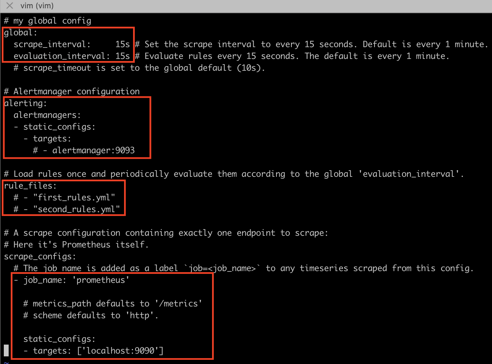
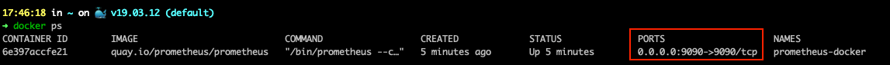
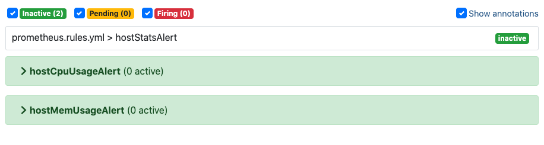
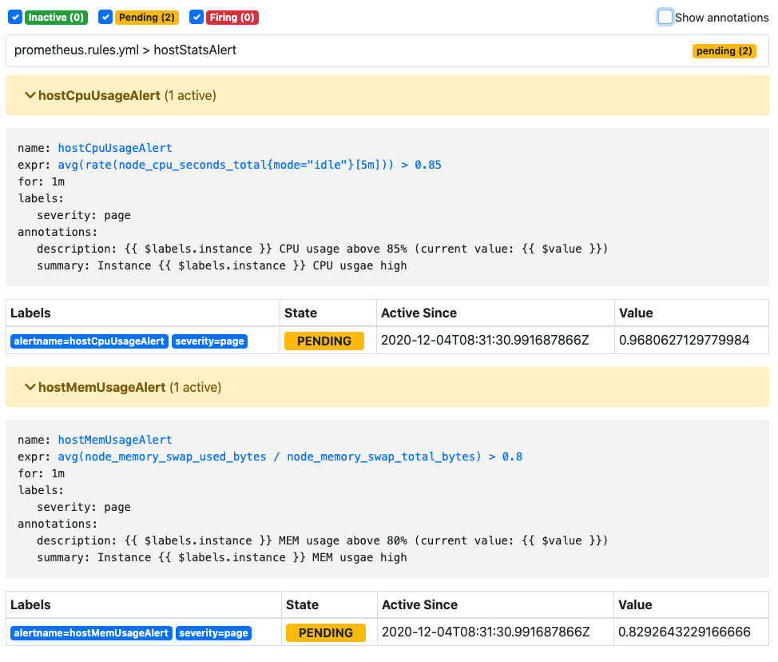
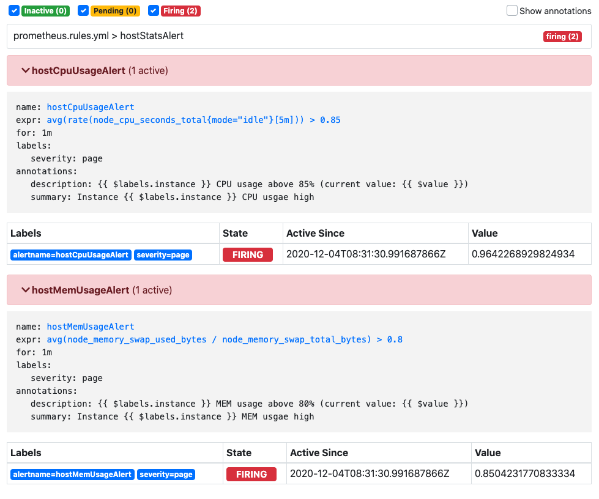

# 术语单词

+ metric	指标

+ time series data	时间序列数据
+ 
+ query language    查询语句
+ intermediary gateway
+ service discovery    服务发现
+ metric   指标
+ label    标签
+ sample    样本
+ pre-compiled binaries    预编译二进制文件
+ Instant vector    瞬时向量
+ Range vector    区间向量


# 安装 Promitheus

## 二进制包安装

参考 [FIRST STEPS WITH PROMETHEUS ](https://prometheus.io/docs/introduction/first_steps/)

> Prometheus 基于 Golang 编写，编译后的软件包不依赖于任何的第三方依赖。用户只需要下载对应平台的二进制包，解压并且添加基本的配置即可正常启动 Prometheus Server。


### 下载

在 [Download the latest release](https://prometheus.io/download) 上下载最新的压缩包，放在目标文件夹中：

```bash
$ tar xvfz prometheus-*.*-amd64.tar.gz
$ cd prometheus-2.23.0.darwin-amd64
```

解压压缩包，进入文件夹。Prometheus server 是一个叫做 `prometheus` 的单独的二进制文件，所以我们可以直接运行它，看是否输出类似下面的版本好验证安装成功否：

```bash
$ ./prometheus --version
prometheus, version 2.23.0 (branch: HEAD, revision: 26d89b4b0776fe4cd5a3656dfa520f119a375273)
  build user:       root@37609b3a0a21
  build date:       20201126-11:04:25
  go version:       go1.15.5
  platform:         darwin/amd64
```


### 配置

```bash
$ ls -a
$ vim prometheus.yml
```

可以看到下载的文件夹中有个 `prometheus.yml` 文件，这个是解压后默认的 Prometheus 配置文件，其中关键的配置项是如下这些部分：



有四个主要部分： `global` 、`alerting` 、 `rule_files` 和 `scrape_configs` 。

+ `global` ：这个部分是 Prometheus Server 的全局配置；
  +  `scrape_interval` 设置 Prometheus 抓取目标的频率，可以为单独的目标重写； 
  + `evaluation_interval` 设置 Prometheus 判定规则的频率，Prometheus 利用规则创建出新的时间序列数据用于告警。
+ `alerting` ：这个部分是 Alertmanager 的配置项；
+ `rule_files` ：这个部分用于让 Prometheus Server 运行的具体告警规则；
+ `scrape_configs` ：这个部分用于设置 Prometheus 监控的数据源，在默认的配置中设置的是监控 Prometheus Server 自身，默认指标从  `/metrics` 路径上获取，所以会抓取 http://localhost:9090/metrics 网址的数据。

+ 更多的配置属性参考链接 👉 [configuration documentation](https://prometheus.io/docs/operating/configuration) 


### 启动

```bash
$ ./prometheus --config.file=prometheus.yml
```

+ 启动 Prometheus 服务；
+ 在浏览器中输入 [http://localhost:9090](http://localhost:9090/) 打开 Prometheus；
+ 打开 http://localhost:9090/metrics 查看 metrics endpoint。


### 使用

在 Prometheus 的可视化界面的搜索框输入 `promhttp_metric_handler_requests_total` 可以看到有三条数据；

+ 这些数据是 Prometheus Server 请求 `/metrics` 的总次数，按照配置来说每 15s 增加一次，如果刷新 `/metrics` 也会增加一次；
+ 这三条数据的 metric 名称都是 promhttp_metric_handler_requests_total，但是通过不同的 label 进行区分。

如果只想查询 label 为 code="200" 的 metric 结果，在搜索框输入 `promhttp_metric_handler_requests_total{code="200"}`。

如果想查看这个 metirc 返回几条时间序列，在搜索框输入 `count(promhttp_metric_handler_requests_total)`，结果为3，实际上确实有三条数据。

更多的搜索语言参考链接 👉 [expression language documentation](https://prometheus.io/docs/querying/basics/) 


## Docker 安装

参考 [INSTALLATION](https://prometheus.io/docs/prometheus/latest/installation/) 

> 对于Docker用户，直接使用 Prometheus 的镜像即可启动 Prometheus Server

### 绑定本地配置文件

之前直接启动的方式没有暴露 Prometheus 的配置文件，为了更加方便地编写其配置，可以在 Docker 启动时绑定本地编写的配置文件。假设我们在端口 9100 启动了一个 Node Exporter，设置 Prometheus 抓取数据的时间周期为 5s，并且绑定了一个告警规则配置文件 `prometheus.rules.yml` 。Prometheus 的配置文件编写如下所示：

```bash
# vim prometheus.yml
global:
  scrape_interval:     15s 
  evaluation_interval: 15s 

alerting:
  alertmanagers:
  - static_configs:
    - targets:

rule_files:
  - 'prometheus.rules.yml'

scrape_configs:
  - job_name: 'prometheus'
    static_configs:
    - targets: ['localhost:9090']
  - job_name: 'node'
    scrape_interval: 5s
    static_configs:
    - targets: ['192.168.99.100:9100']
      labels:
        group: 'production'
```

+ 这里 targets 定义的前缀是容器 IP，这样才能访问到映射的主机端口号。
+ <font color=EE4D2D>**为什么 prometheus 自身的数据可以直接用 localhost 映射呢？其余的用 localhost 映射会出错？**</font> 
  + Docker 与本地主机是隔离的，如果抓取的 target 是从其他端口获取的话需要做特殊处理，或者抓取数据的实例也需要运行在 Docker 中。


### 启动

```bash
$ docker run --name prometheus-docker -d -p 9090:9090 prom/prometheus
6e397accfe21e305de7332be11c634ae062bc5ea40901c25c0bdd7cbb9eedded
```

这里运行了 `quay.io/prometheus/prometheus` 镜像，并给其命名为 `prometheus-docker`。

`-p 9090:9090` 的命令是将本地机器的 9090 端口映射到容器的 9090 端口，即本地机器的 9090 端口的流量会映射到容器的 9090 端口，可以在通过浏览器访问到容器。




这里注意，因为是在 docker-machine 内启动的，类似于在虚拟机上启动的 docker，这里的 ip 映射的是宿主机的 ip ，也就是 docker-machine 的 ip，因此 `-p` 后面分配的端口号直接是 `9090:9090`， 而不是 `127.0.0.1:9090:9090`，这样就能把宿主机的端口映射到 9090。

也可以直接使用 `quay.io/prometheus/prometheus` 镜像。


**Docker 启动一个 Node Exporter 服务**

```bash
docker run -d \
  --name node-exporter \
  -p 9100:9100 \
  prom/node-exporter
```


**Docker 启动一个 Prometheus 服务并绑定本地配置文件**

```bash
docker run -d \
    --name prometheus-docker \
    -p 9090:9090 \
    -v /Users/xxx/prometheus.yml:/etc/prometheus/prometheus.yml \
    prom/prometheus
```


### 使用

查询宿主机的 ip 和服务的 ip，拼接后在浏览器中输入 [http://192.168.99.100:9090](http://192.168.99.100:9090) 就可以打开 Prometheus 视图：

```bash
$ docker-machine ip default
192.168.99.100

$ docker port prometheus-docker
9090/tcp -> 0.0.0.0:9090
```


启动服务、重启服务、查看服务状态、停止服务、删除服务：

```bash
$ docker start prometheus-docker
$ docker start prometheus-docker
$ docker stats prometheus-docker
$ docker stop prometheus-docker
$ docker rm prometheus-docker
```


查询是否能正常抓取 node exporter 的数据

```bash
# 在 Prometheus Web 页面输出 up 后出来的结果
Element	                                                          Value
up{group="production",instance="192.168.99.100:9100",job="node"}	1
up{group="production",instance="localhost:9100",job="node"}	      0
up{instance="localhost:9090",job="prometheus"}	                  1
```


# 使用 Node Exporter

参考 [MONITORING LINUX HOST METRICS WITH THE NODE EXPORTER](https://prometheus.io/docs/guides/node-exporter/#node-exporter-metrics) 

> 在Prometheus的架构设计中，Prometheus Server 并不直接服务监控特定的目标，其主要任务负责数据的收集、存储、并且对外提供数据查询支持。因此为了能够能够监控到某些东西，如主机的 CPU 使用率，我们需要使用到 Exporter。
>
> Exporter 可以是一个相对开放的概念，其可以是一个独立运行的程序独立于监控目标以外，也可以是直接内置在监控目标中。只要能够向 Prometheus 提供标准格式的监控样本数据即可。

这里利用 Node Exporter 采集主机的运行指标，介绍 Promethesu 如何接入 Exporter。Node Exporter 同样采用 Golang 编写，并且不存在任何的第三方依赖，只需要下载，解压即可运行。


## 下载

在 [Download the latest release](https://prometheus.io/download/#node_exporter) 上下载最新的压缩包，放在目标文件夹中：

```bash
$ tar node_exporter-*.*-amd64.tar.gz
$ cd node_exporter-*.*-amd64
$ ./node_exporter --version
```

解压压缩包，进入文件夹。Node Exporter 是一个叫做 `node_exporter` 的单独的二进制文件，所以我们可以直接运行它，看是否输出类似下面的版本好验证安装成功否：

```bash
node_exporter, version 1.0.1 (branch: HEAD, revision: 3715be6ae899f2a9b9dbfd9c39f3e09a7bd4559f)
  build user:       root@4c8e5c628328
  build date:       20200616-12:52:07
  go version:       go1.14.4
```


## 修改 Prometheus 配置

```bash
scrape_configs:
  # Here it's Prometheus itself.
  - job_name: 'prometheus'
    static_configs:
    - targets: ['localhost:9090']
  # 采集 node exporter 的监控数据
  - job_name: 'node'

    # Override the global default and scrape targets from this job every 5 seconds.
    scrape_interval: 5s

    static_configs:
    - targets: ['localhost:8080', 'localhost:8081']
      labels:
        group: 'production'

    - targets: ['localhost:8082']
      labels:
        group: 'canary'
```

为了让 Prometheus 获取 Node Exporter 提供的 metrics，需要在 `prometheus.yml` 中配置监听的端口，设置数据抓取地址和频率。

稍后我们将启动三个 Node Exporter 服务，其中假设 8080 和 8081 的数据是产品数据，8082 的数据是 canary 实例 。每个 job 能配置内部的属性覆盖全局的属性，可以拥有多个 labels。


## 启动 Node Exporter

一般情况下启动 Node Exporter 可直接输入命令 `$ ./node_exporter` ，默认在 `9090` 端口运行。也可以通过 `--web.listen-address` 指令修改运行端口：

```bash
# Start 3 example targets in separate terminals:
$ ./node_exporter --web.listen-address 127.0.0.1:8080
$ ./node_exporter --web.listen-address 127.0.0.1:8081
$ ./node_exporter --web.listen-address 127.0.0.1:8082
```

成功启动 Node Exporter 在 http://localhost:XXXX/metrics 开始运行并暴露 metircs，此时 Prometheus 能够抓取数据。


```bash
# HELP node_cpu_seconds_total Seconds the cpus spent in each mode.
# TYPE node_cpu_seconds_total counter
node_cpu_seconds_total{cpu="0",mode="idle"} 113276.18
node_cpu_seconds_total{cpu="0",mode="nice"} 0
node_cpu_seconds_total{cpu="0",mode="system"} 16165.76
node_cpu_seconds_total{cpu="0",mode="user"} 16059.61
# HELP node_load1 1m load average.
# TYPE node_load1 gauge
node_load1 1.84521484375
```

每个监控指标都会有一段说明文字：

+ `HELP` 用于解释当前指标的含义，例如 cpu0 上某个进程占 CPU 的总时间；例如当前主机在一分钟内的负载情况；
+ `TYPE` 说明当前指标的数据类型，例如 cpu 占用时间是只增不减的指标，counter 类型与其实际含义一致；例如系统当前的负载情况会随系统资源的使用而变化，gauge 类型与其实际含义一致。

+ 根据物理主机系统的不同还有其他指标

  + node_boot_time：系统启动时间
  + node_cpu：系统 CPU 使用量
  + node_disk**：磁盘 IO
  + node_filesystem**：文件系统用量
  + node_load1：系统负载
  + node_memory**：内存使用量
  + node_network**：网络带宽
  + node_time：当前系统时间
  + go_*：node exporter中 go  相关指标
  + process_*：node exporter自身进程相关运行指标


## 启动 Prometheus

```bash
$ ./prometheus --config.file=./prometheus.yml
```

通过 [http://localhost:9090](http://localhost:9090/) 可以看到 Prometheus 的可视化界面，输入 up 后能查询到四条数据，可以看到每条数据对应的端口号、job_name 和 label，查询结果为 1 就表示正常，0 则表示异常。


为了采集主机的监控样本数据，我们在主机上安装了一个 Node Exporter 程序，该程序对外暴露了一个用于获取当前监控样本数据的 HTTP 访问地址。

这样的一个程序称为 Exporter，Exporter 的实例称为一个 Target。

Prometheus 通过轮询的方式定时从这些 Target 中获取监控数据样本，并且存储在数据库当中。


# 使用 Alerting 

编写 `prometheus.rules.yml` 文件：

```bash
groups:
- name: hostStatsAlert
  rules:
  - alert: hostCpuUsageAlert
    expr: avg (rate(node_cpu_seconds_total{mode="idle"}[5m])) > 0.85
    for: 1m
    labels:
      severity: page
    annotations:
      summary: "Instance {{ $labels.instance }} CPU usgae high"
      description: "{{ $labels.instance }} CPU usage above 85% (current value: {{ $value }})"
  - alert: hostMemUsageAlert
    expr: avg (node_memory_swap_used_bytes/node_memory_swap_total_bytes) > 0.80
    for: 1m
    labels:
      severity: page
    annotations:
      summary: "Instance {{ $labels.instance }} MEM usgae high"
      description: "{{ $labels.instance }} MEM usage above 80% (current value: {{ $value }})"
```


为了能够让 Prometheus 能启用定义的告警规则，我们需要在 Prometheus 全局配置文件中通过 **rule_files** 指定一组告警规则文件的访问路径，Prometheus 启动后会自动扫描这些路径下规则文件中定义的内容，并且根据这些规则计算是否向外部发送通知：

```bash
rule_files:
- 'prometheus.rules.yml'
```


默认情况下 Prometheus 会每分钟对这些告警规则进行计算，如果用户想定义自己的告警计算周期，则可以通过全局配置中的 `evaluation_interval` 属性来覆盖默认的计算周期。

可以在 http://localhost:9090/rules 中看到定义好的规则及其状态，在 http://localhost:9090/alerts 中看到告警及其活动状态。

Prometheus 首次检测到满足触发条件后，相应规则会显示有一条告警处于活动状态：



在 1 分钟内（前面设置告警规则等待时间 for 为 1m）告警状态为PENDING：



如果1分钟后告警条件持续满足，则会实际触发告警并且告警状态为FIRING：



