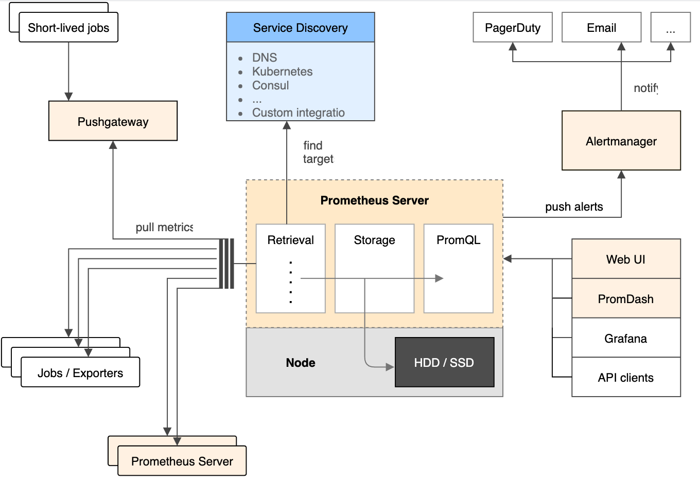
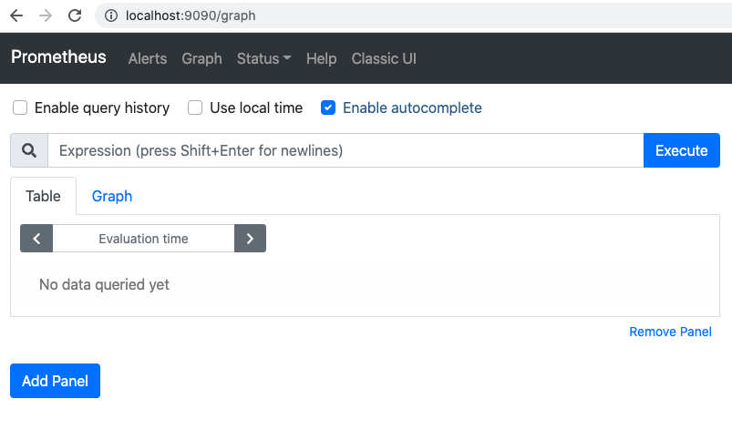

# Terminology

+ metric	指标
+ label	标签
+ sample	样本
+ time series	时间序列
+ TSDB - time series database 	时序数据库
+ query language	查询语句
+ intermediary gateway
+ service discovery	服务发现
+ pre-compiled binaries	预编译二进制文件
+ instant vector	瞬时向量
+ range vector	区间向量


# 简介

## 发展历史

Prometheus 是一个开源的、集**监控和告警于一体**的工具包：

+ Prometheus 受启发于 Google 的 Brogmon 监控系统；
+ 2012 年开始由前 Google 工程师在 Soundcloud 以开源软件的形式进行研发，2015 年对外发布早期版本；
+ 2016 年5月继 Kubernetes 之后成为第二个正式加入 CNCF 基金会的项目，同年 6 月发布 1.0 正式版本；
+ 2017 年底发布了基于全新存储层的2.0版本，能更好地与容器平台、云平台配合。


## 特性

+ 多维数据模型
  + 所有采集的监控数据均以 metric 的形式保存在内置的时间序列数据库当中；
  + 所有的样本除了基本的指标名称以外，还包含一组用于描述该样本特征的标签。

+ PromQL 强大的数据查询语言
  + 通过 PromQL 可以实现对监控数据的查询、聚合等操作；
  + 同时 PromQL 也被应用于数据可视化（如Grafana）以及告警当中。

+ 不存在任何的第三方依赖
  + Prometheus 核心部分只有一个单独的二进制文件，唯一需要的就是本地磁盘，因此不会有潜在级联故障的风险。

+ Prometheus 数据采集基于 Pull 模型进行设计；
+ 将内部网络的监控数据主动 Push 到 Gateway 当中；
+ 可以通过静态配置管理监控目标，也可以配合使用服务发现的方式动态管理监控目标，并从这些监控目标中获取数据；
+ 有多种可视化图形界面。


## 优势

+ Prometheus 现在是一个独立的开源项目，独立于任何公司进行维护，不依赖其他平台；
+ Prometheus 的开发者和用户社区非常活跃，截止到目前为止在 GitHub 上有 30k+ 的关注量；
+ Prometheus 的安装和使用非常方便，上手快，并且能够非常方便对其进行扩展，后期维护便利；
+ Prometheus 的基本原理是通过 HTTP 协议周期性抓取被监控组件的状态，任意组件只要提供对应的 HTTP 接口就可以接入监控，不需要任何 SDK 或者其他的集成过程；
+ Prometheus 支持白盒监控和黑盒监控，能对监控指标进行长期趋势分析，能进行故障分析与定位，能进行对照分析，能数据可视化，能进行告警，提高了告警监控可观测性；
+ Prometheus 颠覆了传统监控系统的测试和告警模型，形成了基于中央化的规则计算、统一分析和告警的新模型，拥有易于管理、能监控服务的内部状态、拥有强大的数学模型和查询语言、通过功能分区和联邦集群进行扩展、易于集成、支持可视化、开放等优点；
+ Prometheus Server 的联邦集群能力可以使其从其他的 Prometheus Server 实例中获取数据，因此在大规模监控的情况下，可以通过联邦集群以及功能分区的方式对 Prometheus Server 进行扩展。


## 适用场景

+ **Prometheus 适用于记录文本格式的时间序列**，它既适用于以机器为中心的监控，也适用于高度动态的面向服务架构的监控，对多维数据收集和查询的支持有特殊优势。

+ Prometheus 的数据是按一定时间采集的，更多关注系统的运行瞬时状态以及趋势，即使有少量数据没有采集也在可许范围内。**因此 Prometheus 不适合对数据要求百分百准确的项目**，例如审计项目。


# 基础架构



+ Prometheus Server 定期从配置好的 Jobs 或者 Exporters 中拉 metrics，或者接收来自 Pushgateway 发过来的 metrics，或者从其他的 Prometheus Server 中拉 metrics，或者通过服务发现拉 metrics 数据；
+ Prometheus Server 在本地存储收集到的 metrics，并运行已定义好的告警规则，记录新的时间序列或者向 Alertmanager 推送告警信息；
+ Alertmanager 根据配置文件，对接收到的告警信息进行处理，发出告警；
+ 通过内置的 Web UI ，或者外接如 Grafana 的其他工具，进行监控数据可视化。


## 核心组件

+ [Prometheus Server](https://github.com/prometheus/prometheus) ：负责实现对监控数据的获取，存储以及查询。
  + Prometheus Server 可以通过静态配置管理监控目标，也可以配合使用服务发现的方式动态管理监控目标，并从这些监控目标中获取数据；
  + Prometheus Server 本身就是一个时序数据库，能将采集到的监控数据按照时间序列的方式存储在本地磁盘当中；
  + Prometheus Server 对外提供了自定义的 PromQL 语言，实现对数据的查询以及分析；
  + Prometheus Server 内置的 Express Browser UI 可以直接通过 PromQL 实现数据的查询以及可视化；
  + Prometheus Server 的联邦集群能力可以使其从其他的 Prometheus Server 实例中获取数据，因此在大规模监控的情况下，可以通过联邦集群以及功能分区的方式对 Prometheus Server 进行扩展。
+ [Client Libraries](https://prometheus.io/docs/instrumenting/clientlibs/) ：查询和上报数据，对接 Prometheus Server。
  + 可以用来生成自定义的 Exporters 的库；
  + 为需要监控的服务生成相应的 metrics 并暴露给 Prometheus Server。当 Prometheus Server 来拉取数据时，直接返回实时状态的 metrics。
+ [Push Gateway](https://github.com/prometheus/pushgateway) ：短期的监控数据上报。
  + 当网络无法直接满足 Prometheus Server 与 Exporter 进行直接通信时，就可以利用 PushGateway 来进行中转。通过 PushGateway 将内部网络的监控数据主动推送到 Gateway 当中。而 Prometheus Server 则可以采用同样拉取的方式从 PushGateway 中获取到监控数据。
  + 主要用于短期 jobs，由于这类 jobs 存在时间较短，可能在 Prometheus 来拉取之前就消失了。为此类似的短期 jobs 可以直接向 Prometheus server 端推送它们的 metrics。这种方式主要用于服务层面的 metrics，对于机器层面的 metrices，需要使用 Node Exporter。
+ [Exporters](https://prometheus.io/docs/instrumenting/exporters/) ：向 Prometheus 提供监控样本数据的程序。
  + Exporter 将监控数据采集的端点通过 HTTP 服务的形式暴露给 Prometheus Server，Prometheus Server 通过访问该 Exporter提供的 Endpoint 端点，即可获取到需要采集的监控数据。
  + 从运行方式来讲可以分为直接采集和间接采集；从来源来讲可以分为社区提供和用户自定义。
+ [Alertmanager](https://github.com/prometheus/alertmanager) ：告警通知管理
  + 在 Prometheus Server 中支持基于 PromQL 创建告警规则，如果满足 PromQL 定义的规则，则会产生一条告警，而告警的后续处理流程则由 AlertManager 进行管理，可以去除重复数据、分组、路由分发、发出报警。
  + 在 AlertManager 中我们可以与邮件，Slack 等等内置的通知方式进行集成，也可以通过 Webhook 自定义告警处理方式。
+ 其他支持工具等


# 数据类型

## 时间序列数据

Prometheus 会将所有采集到的样本数据以时间序列 time-series 的方式保存在内存数据库中，并且定时保存到硬盘上：

```
  ^
  │   . . . . . . . . . . . . . . . . .   . .   node_cpu{cpu="cpu0",mode="idle"}
  │     . . . . . . . . . . . . . . . . . . .   node_cpu{cpu="cpu0",mode="system"}
  │     . . . . . . . . . .   . . . . . . . .   node_load1{}
  │     . . . . . . . . . . . . . . . .   . .  
  v
    <------------------ 时间 ---------------->
```

+ 可以将 time-series 理解为一个以时间为 Y 轴的数字矩阵；
+ time-series 是按照时间戳和值的序列顺序存放的，称之为向量 vector；
+ time-series 通过指标名称 metrics name 和一组标签 label set 作为唯一标识来命名。


在 time-series 中的每一个点称为一个样本 sample，样本由以下三部分组成：

```
<--------------- metric ---------------------><-timestamp -><-value->
http_request_total{status="200", method="GET"}@1434417560938 => 94355
http_request_total{status="200", method="GET"}@1434417561287 => 94334

http_request_total{status="404", method="GET"}@1434417560938 => 38473
http_request_total{status="404", method="GET"}@1434417561287 => 38544

http_request_total{status="200", method="POST"}@1434417560938 => 4748
http_request_total{status="200", method="POST"}@1434417561287 => 4785
```

+ metric 指标：metric name 和描述当前样本特征的 label sets；

  + metric name：可以反映被监控样本的含义；

    + 例如 http_request_total 表示当前系统接收到的HTTP请求总量。

  + label：可以反映当前样本的特征维度；

    + 例如 `http_request_total{status="200", method="GET"}` 表示请求方式为 GET 、状态码为 200 的 HTTP 请求总量 ；

    + 通过这些维度 Prometheus 可以对样本数据进行过滤，聚合等。

  + 在 Prometheus 的底层实现中指标名称实际上是以 `__name__=<metric name>` 的形式保存在数据库中：

    ```js
    api_http_requests_total{method="POST", handler="/messages"}
    // 等价于
    {__name__="api_http_requests_total"，method="POST", handler="/messages"}
    ```

+ timestamp 时间戳：一个精确到毫秒的时间戳；

- value 样本值：一个 float64 的浮点型数据表示当前样本的值；


## metric 类型

为了便于理解和区分这些监控指标之间的差异，Prometheus 定义了 4 种不同的 metric 类型：

+ Counter 计数器

  + 只增不减，除非系统发生重置；

  + 例如 http_requests_total，node_cpu 指标；

  + 可以在应用程序中记录某些事件发生的次数，可以轻松的了解该事件产生速率的变化：

    ```js
    // 获取 HTTP 请求量的增长率
    rate(http_requests_total[5m])
    // 当前系统中访问量前 10 的 HTTP 地址
    topk(10, http_requests_total)
    ```

+ Gauge 仪表盘

  + 可增可减；

  + 例如 node_memory_MemFree、node_memory_MemAvailable 指标；

  + 侧重于反应系统的当前状态，可以获取样本在一段时间返回内的变化情况：

    ```js
    // 计算 CPU 温度在 2 个小时内的差异
    delta(cpu_temp_celsius{host="zeus"}[2h])
    // 预测系统磁盘空间在 4 个小时之后的剩余情况
    predict_linear(node_filesystem_free{job="node"}[1h], 4 * 3600)
    ```

+ Summary 摘要

  + 用于统计和分析样本的分布情况；
  + 例如 prometheus_tsdb_wal_fsync_duration_seconds 指标；
  + 例如为了区分系统 API 调用的平均响应时间是平均的慢还是长尾的慢（个别请求特别慢拉低平均值），最简单的方式就是按照请求延迟的范围进行分组。

+ Histogram 直方图

  + 用于统计和分析样本的分布情况；
  + 例如 prometheus_tsdb_compaction_chunk_range_bucket 指标；
  + 主要用于表示一段时间范围内对数据进行采样，并能够对其指定区间以及总数进行统计，例如请求持续时间，响应大小等等。

+ Summary VS Histogram

  + Histogram 直接反应在不同区间内样本的个数，而 Summary 可以指定在客户端统计的分位数；
  + Histogram 可以通过 histogram_quantile() 函数是在服务器端计算的分位数，而 Sumamry 的分位数则是直接在客户端计算完成；
  + 因此对于分位数的计算而言，Summary 在通过 PromQL 进行查询时有更好的性能表现，而 Histogram 则会消耗更多的资源。反之对于客户端而言 Histogram 消耗的资源更少。


## 任务和实例

+ Instance 实例：每一个暴露监控样本数据的 HTTP 服务称为一个实例，一般对应一个进程；

  + 例如在当前主机上运行的 Node Exporter可以被称为一个实例。

+ job 任务：一组相同目的的实例的集合称为一个任务，保证其可扩展性和可靠性；

  + 例如，下面表示一个含有四个重复实例的任务：

    ```bash
    - job: api-server
        - instance 1: 1.2.3.4:5670
        - instance 2: 1.2.3.4:5671
        - instance 3: 5.6.7.8:5670
        - instance 4: 5.6.7.8:5671
    ```

  + 除了静态配置每一个任务的采集实例地址外，Prometheus 还支持与 DNS、Consul、E2C、Kubernetes等进行集成实现自动发现实例，并从这些实例上获取监控数据。

+ 自动生成标签：Prometheus 在采集数据的同时，为了区分数据源，会自动在时序的基础上添加标签：`job` （数据源从属的配置文件中的任务名称）和 `instance` （数据源地址的 host 和 port 片段）；

  + 如果其中任一标签已经在此前采集的数据中存在，那么将会根据 `honor_labels` 配置文件设置选项来决定新标签。

+ 自动生成时序：对每一个实例而言，Prometheus 按照以下时序来存储所采集的数据样本：

  + `up{job="<job-name>", instance="<instance-id>"}` ：1 表示该实例正常工作，0 表示该实例故障，可以有效应用于监控该实例是否正常工作；
  + `scrape_duration_seconds{job="<job-name>", instance="<instance-id>"}` ：拉取数据的时间间隔；
  + `scrape_samples_post_metric_relabeling{job="<job-name>", instance="<instance-id>"}` ：采用重定义标签操作后仍然剩余的样本数；
  + `scrape_samples_scraped{job="<job-name>", instance="<instance-id>"}` ：从该数据源获取的样本数；
  + `scrape_series_added{job="<job-name>", instance="<instance-id>"}` ：该数据源中新序列的大概数量（v2.10 版本新特性）。


# Client Libraries

Promethues 提供一些库帮助用户根据实际项目需求自定义 Exporter。这些库为需要监控的服务生成相应的 metrics 并暴露给 Prometheus Server。当 Prometheus Server 拉去数据时，直接返回实时状态的 metrics。

+ 官方提供的库有：
  + 支持 Golong 语言的 [client_golang](https://github.com/prometheus/client_golang) 
  + 支持 Java 语言的 [client_java](https://github.com/prometheus/client_java)
  + 支持 Python 语言的 [client_python](https://github.com/prometheus/client_python)
  + 支持 Ruby 语言的 [client_ruby](https://github.com/prometheus/client_ruby) 
+ 此外，一些常用的第三方库有：
  + 支持 C 语言的 [prometheus-client-c](https://github.com/digitalocean/prometheus-client-c)
  + 支持 C++ 语言的 [prometheus-cpp](https://github.com/jupp0r/prometheus-cpp)
  + 支持 Node.js 语言的 [prom-client](https://github.com/siimon/prom-client)
  + 支持 PHP 语言的 [prometheus_client_php](https://github.com/PromPHP/prometheus_client_php)

除了在社区中查找已有的库，也可以按照[官方指引](https://prometheus.io/docs/instrumenting/writing_clientlibs/)自定义库。


# Exporter

广义上讲所有可以向 Prometheus 提供监控样本数据的程序都可以被称为一个 Exporter。而 Exporter 的一个实例称为 target。

例如 Prometheus 通过轮询的方式定期从这些 target 中获取样本数据：


**Exporter 的运行方式有两种**

- 间接采集，独立使用：

  - 以 Node Exporter 为例，由于操作系统本身并不直接支持 Prometheus，同时用户也无法通过直接从操作系统层面上提供对 Prometheus 的支持，因此用户只能通过 Prometheus 提供的 Client Library 编写该监控目标的监控采集程序，独立运行一个程序，通过操作系统提供的相关接口，将系统的运行状态数据转换为可供 Prometheus 读取的监控数据；
  - 除了 Node Exporter 以外，比如 MySQL Exporter、Redis Exporter 等都是通过这种方式实现的。这些Exporter 程序扮演了一个中间代理人的角色。
- 直接采集，集成到应用中：
  - 直接内置了用于向 Prometheus 暴露监控数据的端点；
  - 为了能够更好的监控系统的内部运行状态，有些开源项目如 Kubernetes，ETCD 等直接在代码中使用了Prometheus 的 Client Library，提供了对 Prometheus 的直接支持；
  - 这种方式打破了监控的界限，让应用程序可以直接将内部的运行状态暴露给 Prometheus，适合于一些需要更多自定义监控指标需求的项目。


**Exporter 的来源有两种**

+ 社区提供：Prometheus 社区提供了丰富的 Exporter 实现。除了之前提过的监控主机状态的 Node Exporter，社区还提供了其他各类第三方 Exporter，涵盖了从基础设施，中间件以及网络等各个方面的监控功能，这些 Exporter 可以实现大部分通用的监控需求。其中有官方提供的，也有社区捐赠的，常用的有：
  + 容器监控：[cadvisor](https://github.com/google/cadvisor) 
  + MySQL运行状态监控：[mysqld_exporter](https://github.com/prometheus/mysqld_exporter)
  + 网络监控：[blackbox_exporter](https://github.com/prometheus/blackbox_exporter)
  + Java 虚拟机监控：[jmx_exporter](https://github.com/prometheus/jmx_exporter)

  + 更多 Exporters 参考链接 [Third-party exporters](https://prometheus.io/docs/instrumenting/exporters/) 

+ 用户自定义：除了直接使用社区提供的 Exporter 程序以外，用户还可以基于 Prometheus 提供的 Client Library 创建自己的 Exporter 程序，按照[官方指引](https://prometheus.io/docs/instrumenting/writing_exporters/)自定义库。


# PromQL

PromQL 是 Prometheus 自定义的一套强大的数据查询语言，除了使用监控指标作为查询关键字以为，还内置了大量的函数，帮助用户进一步对时序数据进行处理。

通过 PromQL 可以非常方便的对数据进行查询，过滤，以及聚合，计算等操作。

通过这些丰富的表达书语句，监控指标不再是一个单独存在的个体，而是一个个能够表达出正式业务含义的语言。


## 基础使用

  + 可以直接使用监控指标名称查询，此时查询的是该指标下的所有时间序列：
    + 例如直接查询 `http_requests_total`，等同于 `http_requests_total{}`，该表达式会返回指标名称为 http_requests_total 的所有时间序列。

  + 支持用户根据时间序列的标签匹配模式来对时间序列进行过滤，目前主要支持四种匹配模式：`=`，`!=`， `=~`， `!~` ：
    + 例如 `http_requests_total{environment=~"staging|testing|development",method!="GET"}` 表示查询 environment 等于 staging 或者 testing 或者 development 的，并且排除 method 是 GET 的所有 http_requests_total 时间序列。

  + 通过时间范围选择器 `[]` 进行时间范围定义，可查询区间向量（不加查询的是瞬时向量），支持单位有：`ms` ，`s`，`m`，`h`，`d`，`w`，`y`：
    + 例如 `http_requests_total{}[5m]` 会返回查询到的时间序列中最近 5 分钟的所有样本数据。

  + 通过 `offset` 关键字进行时间位移操作，查询某一时段前的数据：
    + 例如 `http_request_total{}[1d] offset 1d` 表示查询昨天一天的区间内的样本数据。


## 操作符

可以对时间序列数据进行二次加工，主要有：
+ 数学运算符：包括 `+`，`-`，`*`，`/`，`%`，`^`；
+ 布尔运算符：包括 `==`，`!=`，`>`，`<`，`>=`，`<=`；
+ 逻辑运算符：包括 `and`，`or`，`unless`。


## 聚合操作

这些操作符作用域瞬时向量，可以将瞬时表达式返回的样本数据进行聚合，形成一个新的时间序列。

+ 聚合操作符包括：`sum`，`min`，`max`，`avg`，`group`，`stddev`，`stdvar`，`count`，`count_values`，`bottomk`，`topk`，`quantile`。

  + 例如查询整个应用的 HTTP 请求总量，可以使用表达式 `sum(http_requests_total)`。

+ `without` 用于从计算结果中移除列举的标签，而保留其它标签。

  + 例如查询除 instance 之外的 HTTP 请求总量，可以使用表达式 `sum(http_requests_total) without (instance)`。

+ `by` 用于从计算结果中保留列举的标签，而移除其它标签。

  + 例如之前的例子还可以写成 `sum by (application, group) (http_requests_total)`。


## 内置函数

可以对时序数据进行更加丰富的处理，常用的内置函数有：

  + `rate(v range-vector) `：计算在单位时间内样本数据的平均增长速率。
    + 例如 `rate(http_requests_total{job="api-server"}[2m])` 可以计算最近两分钟内的 HTTP 请求增加速率，`rate(node_cpu_seconds_total{mode="system"}[2m])` 通过 CPU 使用时间近似计算CPU的利用率。
  + `increase(v range-vector)`：计算在单位时间内样本数据的增长量。
    + 例如 `increase(node_cpu[2m])/120` 和 `rate(node_cpu[2m])` 计算结果一致。
  + `predict_linear(v range-vector, t scalar)` ：预测时间序列在 t 秒后的值，只能用于 gauges 类型。
    + 例如基于2小时的样本数据预测主机可用磁盘空间的是否在4个小时候被占满可以使用表达式 `predict_linear(node_filesystem_free{job="node"}[2h], 4 * 3600) < 0` 。
  + 更多内置函数参考链接 [Functions](https://prometheus.io/docs/prometheus/latest/querying/functions/) 


# Alerting

Prometheus 的告警在架构中被划分为两个部分：

+ 在 Prometheus Server 中定义告警规则并向 Alertmanager 传递告警；
+ 通过 Alertmanager 组件管理传递来的告警。

Prometheus 中的告警规则允许用户基于 PromQL 表达式定义告警触发条件，Prometheus Serve 对这些触发规则进行周期性计算，当满足触发条件后则会触发告警通知。

默认情况下，用户可以通过 Prometheus 的 Web 界面查看这些告警规则以及告警的触发状态。当 Promthues 与 Alertmanager 关联之后，可以将告警发送到外部服务如 Alertmanager 中，并通过 Alertmanager 可以对这些告警进行进一步的处理。


## Alerting Rules

Prometheus 通过事先编写好的 `.rules.yml` 规则配置文件周期性地执行一段 PromQL，若满足条件则产生新的时间序列形成告警。 

一个 `prometheus.rules.yml` 文件的例子：

```bash
groups:
- name: hostStatsAlert
  rules:
  - alert: hostCpuUsageAlert
    expr: avg (rate(node_cpu_seconds_total{mode="idle"}[5m])) > 0.85
    for: 1m
    labels:
      severity: page
    annotations:
      summary: "Instance {{ $labels.instance }} CPU usgae high"
      description: "{{ $labels.instance }} CPU usage above 85% (current value: {{ $value }})"
  - alert: hostMemUsageAlert
    expr: avg (node_memory_swap_used_bytes/node_memory_swap_total_bytes) > 0.80
    for: 1m
    labels:
      severity: page
    annotations:
      summary: "Instance {{ $labels.instance }} MEM usgae high"
      description: "{{ $labels.instance }} MEM usage above 80% (current value: {{ $value }})"
```


在 Prometheus 中，可以通过 Group（告警组）对一组相关的告警进行统一定义。一条告警规则主要由以下几部分组成：

+ 告警名称 name：用户需要为告警规则命名；

+ 告警规则 rule：实际上主要由 PromQL 进行定义，当 PromQL 查询结果持续多长时间后出发告警；

  + alert：告警规则的名称。
  + expr：基于PromQL表达式告警触发条件，用于计算是否有时间序列满足该条件。
  + for：评估等待时间，可选参数。用于表示只有当触发条件持续一段时间后才发送告警。在等待期间新产生告警的状态为pending。
  + labels：自定义标签，允许用户指定要附加到告警上的一组附加标签。
  + annotations：用于指定一组附加信息，比如使用 `summary` 描述告警的概要信息，`description` 描述告警的详细信息，annotations 的内容在告警产生时会一同作为参数发送到 Alertmanager，Alertmanager 的 UI 也会根据这两个标签值，显示告警信息。


## Recording Rules

通过 PromQL 可以实时对 Prometheus 中采集到的样本数据进行查询，聚合以及其它各种运算操作。

而在某些 PromQL 较为复杂且计算量较大时，直接使用 PromQL 可能会导致 Prometheus 响应超时的情况。这时需要一种能够类似于后台批处理的机制能够在后台完成这些复杂运算的计算，对于用户而言只需要查询这些运算结果即可。

Prometheus 通过 Recoding Rule 支持这种后台计算的方式，可以实现对复杂查询的性能优化，提高查询效率。

通过 Recoding Rule 使用户可以预先计算经常需要或计算量大的表达式，并将其结果保存为一组新的时间序列。这样，查询预先计算的结果通常比每次需要原始表达式都要快得多。

更多信息参考链接 [Recording Rules](https://prometheus.io/docs/practices/rules/) 


## Alertmanager

Alertmanager 作为一个独立的组件，可以对这些告警信息进行进一步的处理：

+ 分组 Grouping：将相似的告警信息合并成一个通知。
  + 例如，当集群中有数百个正在运行的服务实例，并且为每一个实例设置了告警规则。假如此时发生了网络故障，可能导致大量的服务实例无法连接到数据库，结果就会有数百个告警被发送到Alertmanager。作为用户，可能希望能够在一个通知中就能查看哪些服务实例收到影响。这时可以按照服务所在集群或者告警名称对告警进行分组，将这些告警内聚在一起成为一个通知。

+ 抑制 Inhibition：某一告警发出后，可以停止重复发送由此告警引发的其它告警。
  + 例如，当集群不可访问时触发了一次告警，通过配置 Alertmanager 可以忽略与该集群有关的其它所有告警，这样可以避免接收到大量与实际问题无关的告警通知。

+ 静默 Silences：在给定时间内对告警进行静默处理。
+ 用户行为 Client Behavior：Alertmanager 对用户行为有特殊要求，仅适用于 Prometheus 不用于发送警报的高级用例。
+ 高可用 Hight Availability：支持创建高可用性群集。

Alertmanager 提供了多种内置第三方告警通知方式：

+ 邮件
+ Generic Webhooks
+ 即时通讯软件（如：Slack、WeChat）
+ 移动应用消息推送（如：Pushover）
+ 自动化运维工具（如：PagerDuty、OpsGenie、VictorOps）

更多配置相关知识参考链接 [github: alertmanager](https://github.com/prometheus/alertmanager) 


# 可视化

可视化是监控的核心目标之一，Prometheus 可以使用自带的 Web Console 查询和展示数据，也可以使用 Grafana 来查询和展现数据。


## Prometheus WEB



Prometheus 内置了页面展示，可以进行任何 PromQL 查询和调试工作；

Prometheus WEB 界面除了展示图表，还能查询其他的信息：

+ 在 Alerts 菜单中查看当前 Prometheus 下的所有告警规则，以及其当前所处的活动状态；

+ 在 Status 中查看 Prometheus 的状态和配置，例如：
  + Configuration 选项中查看 Prometheus 的配置
  + Rules 选项中查看规则配置及其运行状态
  + Target 选项中查看当前所有的任务以及每个任务对应的实例信息


## Console Template

Prometheus WEB 界面虽然能查询数据，但这些查询结果都是临时的，无法持久化。

为解决这个问题 Prometheus 内置了一个简单的解决方案 `Console Template` ，它允许用户通过 Go 模板语言创建任意的控制台界面，并且通过 Prometheus Server 对外提供访问路径。具体使用参考链接 [Console Templates](https://prometheus.io/docs/visualization/consoles/)。


## Grafana

Prometheus 自带的 `Console Template` 界面比较简单，如果有更复杂的展示需求，可以使用 Grafana。Grafana 的数据源能够完美兼容 Prometheus 数据，不需安装额外的插件。


# References

+ [Prometheus DOC OVERVIEW](https://prometheus.io/docs/introduction/overview/) 
+ [Prometheus DOC CONCEPTS](https://prometheus.io/docs/concepts/) 
+ [Prometheus DOC QUERYING PROMETHEUS](https://prometheus.io/docs/prometheus/latest/querying/basics/) 
+ [prometheus-book Prometheus 简介](https://yunlzheng.gitbook.io/prometheus-book/parti-prometheus-ji-chu/quickstart/why-monitor) 
+ [prometheus-book 理解时间序列](https://yunlzheng.gitbook.io/prometheus-book/parti-prometheus-ji-chu/promql/what-is-prometheus-metrics-and-labels) 
+  [prometheus-book Metrics类型](https://yunlzheng.gitbook.io/prometheus-book/parti-prometheus-ji-chu/promql/prometheus-metrics-types) 
+  [prometheus-book Exporter是什么](https://yunlzheng.gitbook.io/prometheus-book/part-ii-prometheus-jin-jie/exporter/what-is-prometheus-exporter) 
+ [初探--prometheus调研](https://www.cnblogs.com/chenmingming0225/p/12072149.html) 
