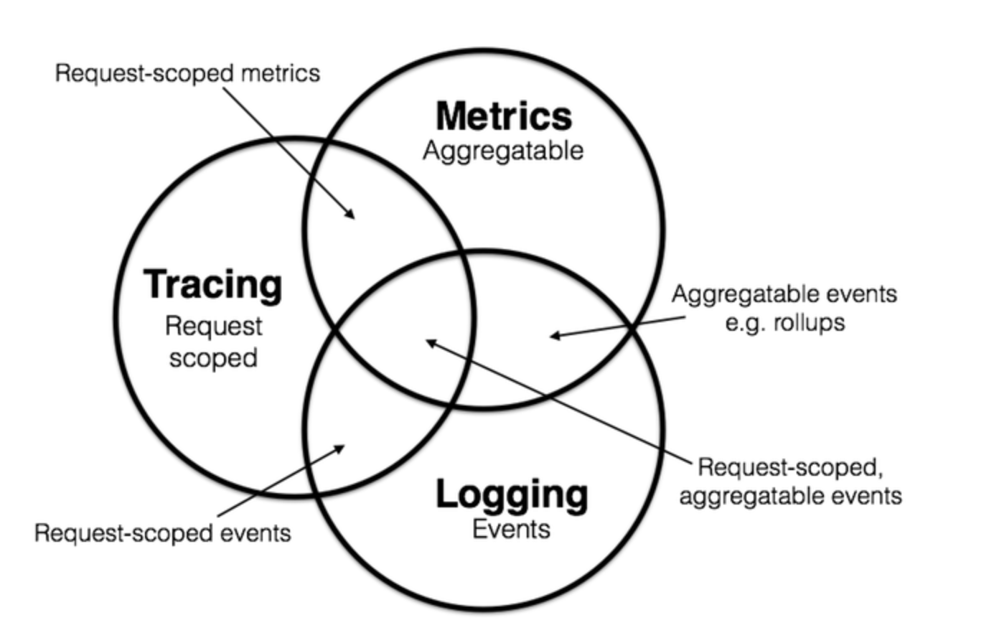

# 可观测性

>  可观测性指系统可以由其外部输出推断其内部状态的程度。——[wiki: Observability](https://en.wikipedia.org/wiki/Observability)

## 作用

可观测性对于软件系统的开发、运维和业务运行都具有重要的作用。

它可以帮助快速排查和解决故障，优化系统性能，提高运维效率，并提供对业务运行的洞察和决策支持：

+ 故障排查和故障预防：可观测性技术可以帮助快速定位和解决系统中的故障和问题。通过详细的日志记录、跟踪和监控，可以追踪请求的路径、查找错误和异常，并快速进行故障排查。此外，通过对系统行为的持续监控，可以及早发现潜在的问题，并采取预防措施，从而提高系统的稳定性和可靠性。
+ 性能优化和容量规划：可观测性技术可以帮助评估系统的性能，并发现潜在的性能瓶颈。通过监控关键指标和性能指标，可以了解系统的资源利用率、响应时间和吞吐量等。这些信息可以帮助进行性能优化，识别瓶颈并采取相应的优化措施。此外，通过对系统的可观测性进行分析，可以预测容量需求，合理规划系统的扩展和资源分配。
+ 运维和维护效率：可观测性技术可以提高系统的可维护性和运维效率。通过良好的日志记录和跟踪，可以更轻松地理解系统的行为和状态，快速定位问题并进行修复。监控可以帮助及时发现异常情况和潜在的故障，并采取相应的措施。这些都有助于减少系统的停机时间，提高运维效率，并降低运维成本。
+ 业务洞察和决策支持：通过对系统的可观测性进行分析，可以获得对业务运行的洞察和理解。通过分析日志、跟踪和监控数据，可以发现业务流程中的瓶颈、用户行为模式和趋势。这些信息可以帮助做出更好的决策，优化业务流程，并提供更好的用户体验。

还可以：

+ 能够随时随地了解系统的行为、性能和运行状况，以便为最终用户提供最佳体验。
+ 可以通过告警机制，及时感知系统出问题，减少对用户的影响。
+ 当系统出现问题时，能够快速检测问题，有效排查并快速修复，缩短了平均解决时间。
+ 了解系统中一些关键指标的发展趋势，以便及早作出预判响应。

## 三大基础

图片来自 [Metrics, tracing, and logging](https://peter.bourgon.org/blog/2017/02/21/metrics-tracing-and-logging.html) 

### metrics

> Metrics are aggregatable: they are the atoms that compose into a single logical gauge, counter, or histogram over a span of time. 

将系统中某类信息进行统计聚合，监控系统的运行状态：

+ 及时发现问题：当某些指标到达预警值时可以自动触发告警，通知相关责任人员及时介入；
+ 预测容量需求；
+ 进行性能优化。

基于 metrics 搭建的系统的基本流程是收集指标数据、存储指标数据、通过可视化和告警方式将数据呈现给用户：

+ 目标系统指标数据收集（Collecting Metrics）：这一方面涉及到收集系统的各种指标数据。
  + 指标可以是关于系统资源利用率、性能、错误率、吞吐量等方面的数据；
  + 收集指标数据可以使用各种手段，如监控代理、日志记录、传感器等。这些数据收集的方式可以根据系统的特点和需求进行选择和配置；
  + 例如 Prometheus 官方提供的 [node-exporter](https://www.volcengine.com/docs/6731/177137) 主要用来采集 Linux 类型节点的相关信息和运行指标，例如主机的 CPU、内存、Load、Filesystem、Network 等。
+ 指标数据存储（Storing Metrics）：收集到的指标数据需要进行存储，以便后续的分析和查询。
  + 指标数据存储可以采用各种存储和数据库技术，如时间序列数据库、关系型数据库、NoSQL数据库等；
  + 存储指标数据时，需要考虑数据的持久性、可扩展性和查询性能等方面的需求。
+ 数据可视化和告警（Visualization and Alerting）：将指标数据转化为可视化的图表和仪表盘，以便用户能够直观地了解系统的状态和性能。
  + 数据可视化可以使用各种工具和技术，如数据可视化库、仪表盘工具、报表等。
  + 同时，度量系统还可以设置告警规则，当指标数据达到或超过预设的阈值时，触发告警通知，以便及时采取措施解决问题。

### logging

>  Logging deals with discrete events.

记录系统运行期间发生过的时间随机、状态离散的离散事件，记录事件发生的时间和事件发生时系统上下文的一些有效信息，可以包括关键操作的日志、错误日志、调试日志等。

基于 logging 搭建的系统的基本流程是收集、存储和分析日志，帮助用户了解系统的行为和状态，发现问题并进行故障排查：

+ 收集日志（Log Collection）：这一方面涉及到从各个系统和组件中收集日志数据。
  + 日志可以是系统生成的事件、状态变化、错误信息、警告和其他相关信息；
  + 收集日志可以通过各种方式，如日志代理、日志收集器、日志聚合器等；
  + 这些工具可以从不同的源（如应用程序、操作系统、网络设备）中获取日志数据，并将其传输到中央存储位置。
+ 存储日志（Log Storage）：收集到的日志数据需要进行存储，以便后续的访问、检索和分析。
  + 存储日志可以使用各种存储技术，如文件系统、数据库、分布式存储系统等；
  + 存储日志时需要考虑数据的持久性、可扩展性和查询性能等方面的需求。
+ 分析日志（Log Analysis）：分析日志是对存储的日志数据进行处理和解释，以获取有关系统行为、性能和问题的洞察。
  + 日志分析可以包括搜索、过滤、聚合、关联和可视化等操作；
  + 通过分析日志，可以发现潜在的问题、故障和性能瓶颈，从而进行故障排查、性能优化、合规性和安全审计等工作。

### tracing

> Tracing deals with information that is request-scoped. 

记录请求通过系统时所经过的路径：

+ 对于单体应用来说基本上指的是程序调用栈追踪；
+ 对于分布式系统来说一个请求通常要经过若干个服务节点，此时的追踪是记录请求所经过的每一个服务节点的调用轨迹。

分布式跟踪系统的基本流程是收集、存储和展示数据，帮助用户了解分布式系统的请求流程、性能瓶颈和故障点，从而进行系统优化和故障排查：

+ 数据收集（Data Collection）：这一方面涉及从分布式系统中收集跟踪数据。
  + 跟踪数据包括请求的传播路径、服务间的调用关系、请求的处理时间等信息；
  + 数据收集可以通过在系统中插入跟踪代码或使用代理来实现，这些跟踪代码或代理会在请求经过系统的不同组件时记录相关数据。
+ 数据存储（Data Storage）：收集到的跟踪数据需要进行存储，以便后续的分析和查询。
  + 数据存储可以使用各种存储技术，如分布式数据库、时间序列数据库等；
  + 存储跟踪数据时需要考虑数据的持久性、可扩展性和查询性能等方面的需求。
+ 数据展示（Data Presentation）：数据展示是将跟踪数据转化为可视化的图表、仪表盘或其他形式的展示，以便用户能够直观地了解系统的请求流程和性能。
  + 数据展示可以使用各种工具和技术，如跟踪可视化工具、仪表盘工具等；
  + 通过数据展示，用户可以追踪请求的路径、识别性能瓶颈和瓶颈的原因，并进行性能优化和故障排查。

# Other References

+ [可观测性介绍](https://blog.csdn.net/u010657094/article/details/129002080) 
+ [THE THREE PILLARS OF OBSERVABILITY: LOGS, METRICS, AND TRACES](https://www.crowdstrike.com/cybersecurity-101/observability/three-pillars-of-observability/) 
+ [Monitoring and Observability in DevOps: A Comprehensive Guide](https://medium.com/@Wicultylearningsolution/monitoring-and-observability-in-devops-a-comprehensive-guide-593c7fc0c904) 