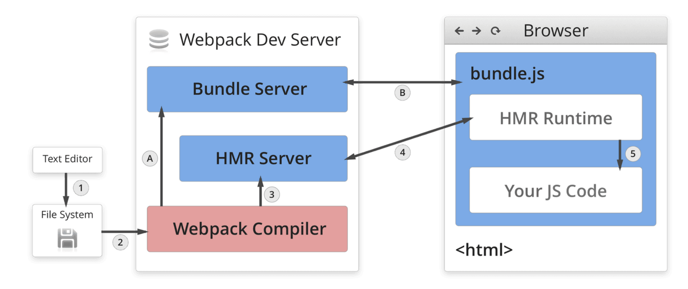

# 安装 webpack

首先需要确保安装了 Node.js 和 Yarn

```bash
# 初始化项目
mkdir trainee-webpack
cd trainee-webpack

# 安装包依赖
npm init -y
yarn add webpack webpack-cli --save-dev

# 确认安装版本
./node_modules/.bin/webpack -v
```


# 运行 webpack

+ 手动运行：

  + 安装后可以进入到目录中调用；

  + ```bash
    ./node_modules/.bin/webpack
    ```

+ 指令运行：

  + 模块局部安装会在 *node_modules/.bin* 目录创建软链接，*package.json* 可以直接读取到 *./bin* 下的命令，所以可以直接通过 webpack 指令运行；

  + ```bash
    yarn webpack
    ```

  + 也可以写成构建指令；

  + ```js
    // package.json
    {
      ...
      "scripts": {
        "build": "webpack"
      },
      ...
    }
      
    // bash
    yarn build
    ```


# 核心概念

## entry

+ 指示 webpack 应该使用哪个模块，来作为构建其内部依赖图的开始；

+ 进入入口起点后，webpack 会找出有哪些模块和库是入口起点的直接和间接依赖；

+ 默认值是 `./src/index.js`，但可以通过在 *webpack.config.js* 中配置 entry 属性，来指定一个或多个不同的入口起点；

+ 单入口：

  ```js
  module.exports = {
    entry: './src/index.js'
  }
  ```

+ 多入口：

  ```js
  module.exports = {
    entry: {
      app: './src/app.js',
      adminApp: './src/adminApp.js'
    }
  }
  ```


## output

+ 指示 webpack 在哪里输出它所创建的 bundle，以及如何命名这些文件;

+ 主要输出文件的默认值是 `./dist/main.js`，其他生成文件默认放置在 `./dist` 文件夹中；

+ 单输出：

  ```js
  const path = require('path')
  
  module.exports = {
    entry: './src/index.js',
    output: {
      path: path.resolve(__dirname, 'dist'),
      filename: 'bundle.js'
    },
    mode: 'production'
  }
  ```

+ 多输出，通过占位符确保文件名称的唯一：

  ```js
  const path = require('path')
  
  module.exports = {
    entry: {
      app: './src/app.js',
      adminApp: './src/adminApp.js'
    },
    output: {
      path: path.resolve(__dirname, 'dist'),
      filename: '[name].js'
    },
    mode: 'production'
  }
  ```


## loader

+ webpack 开箱即用只支持 JavaScript 和 JSON 文件；

+ 通过 loader 让 webpack 能够去处理其他类型的文件，并将它们转换为有效模块，以供应用程序使用，以及被添加到依赖图中；

+ 本身是一个函数，接受源文件作为参数，返回转换后的结果；

+ 在指定时，`test` 参数指定匹配规则，`use` 参数指定使用的 loader 名称：

  ```js
  module.exports = {
    module: {
      rules: [
        {test: /\.txt$/, use: 'raw-loader'}
      ]
    }
  }
  ```

+ loader 的调用是链式调用，调用顺序是从右到左。


## plugin

+ 用于 bundle 文件的优化、资源管理、环境变量注入等；

+ 作用于整个构建过程；

+ 使用 `new` 操作符创建一个插件实例：

  ```json
  const HtmlWebpackPlugin = require('html-webpack-plugin')
  
  module.exports = {
    plugins: [new HtmlWebpackPlugin({ template: './src/index.html' })]
  }
  ```


## mode

+ 用来制定当前构建环境，默认值是 `production`；

+ 设置 mode 可以使用 webpack 内置的函数：

  + development：
    + 会将 `DefinePlugin` 中 `process.env.NODE_ENV` 的值设置为 `development`；
    + 为模块和 chunk 启用有效的名；
    + 默认开启 `NamedChunksPlugin` 和 `NameModulesPlugin`。
  + production：
    +  会将 `DefinePlugin` 中 `process.env.NODE_ENV` 的值设置为 `production`；
    + 为模块和 chunk 启用确定性的混淆名称；
    + 默认开启 `FlagDependencyUsagePlugin`，`FlagIncludedChunksPlugin`，`ModuleConcatenationPlugin`，`NoEmitOnErrorsPlugin` 和 `TerserPlugin`。
  + none：
    + 不使用任何默认优化选项。

+ 使用 `mode` 参数来指定：

  ```js
  module.exports = {
    mode: 'production'
  }
  ```


# 常用解析

## 解析 ECMAScript 6

使用 `babel-loader` 和 `@babel/preset-env` 配置：

```js
// zsh
yarn add @babel/core @babel/preset-env babel-loader -D

// webpack.config.js
module.exports = {
  module: {
    rules: [
      {
        test: /\.js$/,
        use: 'babel-loader'
      }
    ]
  }
}

// .babelrc
{
  "presets": [
    "@babel/preset-env",
  ]
}
```


## 解析 React JSX

使用 `@babel/preset-react` 配置：

```javascript
// zsh
yarn add react react-dom @babel/preset-react -D

// .babelrc
{
  "presets": [
    "@babel/preset-react",
  ]
}
```

如果出现 [SyntaxError: /Users/tingtingliu/Develop/my-project/trainee-demos/webpack/src/search.js: Support for the experimental syntax 'jsx' isn't currently enabled](https://stackoverflow.com/questions/63005011/support-for-the-experimental-syntax-jsx-isnt-currently-enabled) 报错，需要改一下配置，<font color=EE4D2D>**原因还需要分析**</font>：

```js
// webpack.config.js
module.exports = {
  module: {
    rules: [
      {
        test: /\.js$/,
        loader: 'babel-loader',
        options: { presets: ['@babel/preset-env', '@babel/preset-react'] },
      }
    ]
  }
}
```


## 解析 CSS

`css-loader` 用于加载 *.css* 文件，并且转换成 commonjs 对象；

`style-loader` 将样式通过 `<style>` 标签插入在 head 中；

```js
// zsh
yarn add style-loader css-loader -D 

// webpack.config.js
module.exports = {
  module: {
    rules: [
      {
        test: /\.css$/,
        use: ['style-loader', 'css-loader']
      }
    ]
  }
}
```

因为 loader 的调用顺序是从右到左，所以一定是先使用 `style-loader` 再使用 `css-loader`。


## 解析 Less

`less-loader` 用于将 less 转换成 css：

```js
// zsh
yarn add less less-loader -D 

// webpack.config.js
module.exports = {
  module: {
    rules: [
      {
        test: /\.less/,
        use: ['style-loader', 'css-loader', 'less-loader']
      }
    ]
  }
}
```

这种方式编译后的 css 已经在 head 中，不会有单独的 css 文件，可以使用 `mini-css-extract-plugin` 将 css 提取成独立的文件，注意 `style-loader` 和 `mini-css-extract-plugin` 功能互斥的：

```js
// zsh
yarn add mini-css-extract-plugin -D 

// webpack.config.js
const MiniCssExtractPlugin = require('mini-css-extract-plugin')

module.exports = {
  module: {
    rules: [
      {
        test: /\.less/,
        use: [MiniCssExtractPlugin.loader, 'css-loader', 'less-loader']
      }
    ]
  },
  plugins: [
    new MiniCssExtractPlugin(),
  ],
}
```


## 解析图片

`file-loader` 用于处理文件：

```js
// zsh
yarn add file-loader -D 

// webpack.config.js
module.exports = {
  module: {
    rules: [
      {
        test: /\.(png|svg|jpg|gif)$/,
        use: ['file-loader']
      }
    ]
  }
}
```


## 解析字体

`file-loader` 也可以用于处理字体：

```js
// webpack.config.js
module.exports = {
  module: {
    rules: [
      {
        test: /\.(woff|woff2|eot|ttf|otf)$/,
        use: ['file-loader']
      }
    ]
  }
}
```

`url-loader` 也可以用于处理图片和字体，可以设置较小资源自动 base64，并入原文件：

```js
// zsh
yarn add url-loader -D 

// webpack.config.js
module.exports = {
  module: {
    rules: [
      {
        test: /\.(png|svg|jpg|gif)$/,
        use: [{
          loader: 'url-loader',
          options: {
            limit: 10240
          }
        }]
      }
    ]
  }
}
```

两者之间的比较：

```bash
# file-loader 打包后
$ asset 9e66c565cc62c5d6c3e927d0eb5979ad.png 3.97 KiB [emitted] [immutable] [from: src/images/logo.png] (auxiliary name: search)
$ asset search.js 144 KiB [emitted] [minimized] (name: search) 1 related asset

# url-loader 打包后
$ asset search.js 150 KiB [emitted] [minimized] (name: search) 1 related asset
```


# 文件监听

## webpack 中的文件监听

+ 文件监听是在发现源码发生改变时，自动重新构建出新的输出文件：

  + 按照设置的轮询频率，不间断的询问系统指定文件是否发生变化；

  + 根据文件的**最后编辑时间**是否发生变化来判断文件文件；

  + 某个文件发生了变化，不会立刻高数监听者，而是先缓存起来，等待 aggregateTimeout；

  + 更新的输出文件会存储在磁盘中。

+ webpack 开启监听模式有两种方式：

  + 命令行参数，在启动 webpack 命令时，带上 `--watch` 参数：

    ```json
    // package.json
    {
       "scripts": {
        "build-watch": "webpack --watch"
      }
    }
    ```

  + 配置参数，在配置 *webpack.config.js* 中设置 `watch:true` 参数：

    ```js
    // webpack.config.js
    module.exports = {
      mode: 'production',
      watch: true,
      watchOptions: {
        ignored: /node_modules/,
        aggregateTimeout: 300,
        poll: 1000,
      }
    }
    ```

    + watch：是否开启文件监听，默认 false；
    + ignored：不监听的文件或文件夹，支持正则匹配，默认为空；
    + aggregateTimeout：等待时间，默认 300ms；
    + poll：轮询频率，默认 1000/s。

+ 但无论是哪种方式，都需要手动刷新浏览器。


## WDS 热更新

+ WDS 无需手动刷新浏览器；

+ WDS 不会输出文件，而是存放在内存中，构建速度会更快。

+ `webpack-dev-server` + `HotModuleReplacePlugin`：

  ```js
  // zsh
  yarn add webpack-dev-server -D
  
  // package.json
  {
     "scripts": {
      "dev": "webpack-dev-server --config webpack.dev.js --ope"
    }
  }
  
  // webpack.dev.js
  module.exports = {
    mode: 'development',
    plugins: [
      new webpack.HotModuleReplacementPlugin()
    ],
    devServer: {
      static: './dist',
      hot: true
    }
  }
  ```

  + `--open`：每次构建完成后自动开启浏览器；


**原理**



+ bundle.js：构建输出的文件

+ Webpack Compiler：将 JS 源代码编译成 bundle.js 文件；

+ HMR Server：将热更新的文件输出给 HMR Runtime；

+ Bundle Server：提供文件在浏览器的访问；
  + 一般情况下编译好的 bundle.js 文件在浏览器中是以文件目录的方式访问；
  + Bundle Server 使文件可以通过服务器的方式访问，例如 localhost。

+ HMR Runtime：将文件注入到浏览器，更新文件的变化；
  + 在开发的打包阶段会将 HMR Runtime 注入到浏览器端的 bundle.js 中；
  + 通过浏览器的 bundle.js 与服务器建立 websocket 连接；
  + 通过 websocket 监听文件的变化从而进行更新。

+ 整体过程：

  + 启动阶段：1-->2-->A-->B
    + 源代码通过 Webpack Compiler 进行编译打包；
    + 编译后的文件传输给 Bundle Server；
    + Bundle Server 让浏览器以 server 的方式访问文件；

  + 更新阶段： 1-->2-->3-->4
    + File System 监听文件的变化，通过 Webpack Compiler 进行编译；
    +  编译后的文件传输给 HMR Server；
    + HMR Server 识别哪些文件发生改变，以 json 的格式进行传输，通知 HMR Runtime；
    + HMR Runtime 更新代码。


参考阅读：

+ [webpack-HMR](https://webpack.docschina.org/concepts/hot-module-replacement/) 
+ [轻松理解webpack热更新原理](https://juejin.cn/post/6844904008432222215) 
+ [第 70 题： 介绍下 webpack 热更新原理，是如何做到在不刷新浏览器的前提下更新页面](https://github.com/Advanced-Frontend/Daily-Interview-Question/issues/118) 


## WDM 热更新

+ WDM 将 webpack 输出的文件传输给服务器；

+ 适用于灵活的定制场景；

+ `webpack-dev-middleware` + `node-server`：

  ```js
  const express = require('express')
  const webpack = require('webpack')
  const webpackDevMiddleware = require('webpack-dev-middleware')
  
  const app = express()
  const config = require('./webpack.config.js')
  const compiler = webpack(config)
  
  app.use(webpackDevMiddleware(compiler, {
    publicPath: config.output.publicPath
  }))
  
  app.listen(3000, function() {
    console.log('Example app listening on port 3000!\n')
  })
  ```


# 文件指纹

+ 打包后输出的文件名后缀；

+ 一般用于版本管理，浏览器的缓存与更新。

+ 颗粒度依次变细：

  + Hash：与整个项目构建相关，只要文件有修改 hash 值就会变动；

  + Chunkhash：与 webpack 打包的 chunk 相关，不同的 entry 会生成不同的 chunkhash；

  + Contenthash： 与文件具体内容相关，文件内容发生变化 contenthash 才会变化；


+ JS 文件，设置 output 的 filename，使用 **chunkhash**：

  ```js
  // webpack.prod.js
  module.exports = {
    output: {
      path: path.resolve(__dirname, 'dist'),
      filename: '[name]_[chunkhash:8].js'
    },
  }
  ```

+ CSS 文件，设置 `css-minimizer-webpack-plugin` 的 filename，使用 **contenthash**：

  ```js
  // webpack.prod.js
  const CssMinimizerPlugin = require('css-minimizer-webpack-plugin')
  
  module.exports = {
    plugins: [
      new MiniCssExtractPlugin({
        filename: '[name]_[contenthash:8].css'
      }),
    ],
  }
  ```

+ 文件类型，设置 `file-loader` 和` url-loader` 的 name，使用 **contenthash**，参数名 [hash] 和 [contenthash] 都是文件内容的 hash：

  ```js
  // webpack.prod.js
  module.exports = {
    module: {
      rules: [
        {
          test: /\.(png|svg|jpg|gif)$/,
          use: [{
            loader: 'url-loader',
            options: {
              limit: 10240,
              name: 'image/[name]_[hash:8].[ext]'
            }
          }]
        },
        {
          test: /\.(woff|woff2|eot|ttf|otf)$/,
          use: [{
            loader: 'file-loader',
            options: {
              name: 'font/[name]_[hash:8].[ext]'
            }
          }]
        }
      ]
    },
  }
  ```


# 文件压缩

+ JS 文件，内置了 `uglifyjs-webpack-plugin` 插件，会自动压缩文件；

+ CSS 文件，使用  `css-minimizer-webpack-plugin` 插件压缩：

  ```js
  // zsh
  yarn add css-minimizer-webpack-plugin -D
  
  // webpack.prod.js
  const CssMinimizerPlugin = require('css-minimizer-webpack-plugin')
  
  module.exports = {
    optimization: {
      minimizer: [new CssMinimizerPlugin()],
    },
  }
  ```

+ HTML 文件，使用 `html-webpack-plugin` 插件压缩：

  ```js
  // zsh
  yarn add html-webpack-plugin -D
  
  // webpack.prod.js
  const HtmlWebpackPlugin = require('html-webpack-plugin')
  
  module.exports = {
    plugins: [
      new HtmlWebpackPlugin({
        template: './public/search.html',
        filename: 'search.html',
      }),
    ],
  }
  ```


# 构建文件目录清理

+ 通过指令删除：

  ```json
  // package.json
  {
    "scripts": {
      "build": "rm -rf ./dist && webpack --config webpack.prod.js",
    }
  }
  ```

+ 通过包删除：

  ```json
  // package.json
  {
    "scripts": {
      "build": "rimraf ./dist && webpack --config webpack.prod.js",
    }
  }
  ```

+ 通过 [`clean-webpack-plugin`](https://github.com/johnagan/clean-webpack-plugin) 插件删除： 

  ```js
  // zsh
  yarn add clean-webpack-plugin -D
  
  // webpack.prod.js
  const { CleanWebpackPlugin } = require('clean-webpack-plugin')
  
  module.exports = {
    plugins: [
      new CleanWebpackPlugin(),
    ],
  }
  ```

  + 默认删除 output 指定的输出目录，因此无需关注文件夹名；
  + 删除时删除的是文件夹中的所有文件，而不是整个文件夹。


# CSS 特性增强

## 自动补齐 CSS3 前缀

+ 一些浏览器版本对 CSS3 的样式支持不太友好，需要加上前缀，通过 `postcss-loader` + [`autoprefixer`](https://github.com/postcss/autoprefixer#browsers) 可以进行前缀自动补全;

+ `autoprefixer` 插件依据 https://caniuse.com 进行判断；

+ 用法：

  ```js
  // zsh
  yarn add postcss-loader autoprefixer -D
  
  // webpack.prod.js
  const autoprefixer = require('autoprefixer')
  
  module.exports = {
    module: {
      rules: [
        {
          test: /\.less$/,
          use: [MiniCssExtractPlugin.loader, 'css-loader', 'less-loader',
            {
              loader: 'postcss-loader',
              options: {
                postcssOptions: {
                  plugins: [autoprefixer({ grid: 'autoplace' })]
                }
              }
            }
          ]
        },
      ]
    },
  }
  
  // .browserslistrc
  last 2 version
  > 1%
  ie 8-10
  ```

+ 补全效果：

  ```less
  // befor
  .autoplacement-example {
    display: grid;
    grid-template-columns: 1fr 1fr;
    grid-template-rows: auto auto;
    grid-gap: 20px;
  }
  
  // after
  .autoplacement-example {
    display: -ms-grid;
    display: grid;
    -ms-grid-columns: 1fr 20px 1fr;
    grid-template-columns: 1fr 1fr;
    -ms-grid-rows: auto 20px auto;
    grid-template-rows: auto auto;
    grid-gap: 20px;
  }
  .autoplacement-example > *:nth-child(1) {
    -ms-grid-row: 1;
    -ms-grid-column: 1;
  }
  .autoplacement-example > *:nth-child(2) {
    -ms-grid-row: 1;
    -ms-grid-column: 3;
  }
  .autoplacement-example > *:nth-child(3) {
    -ms-grid-row: 3;
    -ms-grid-column: 1;
  }
  .autoplacement-example > *:nth-child(4) {
    -ms-grid-row: 3;
    -ms-grid-column: 3;
  }
  ```


## CSS px 自动转换成 rem

+ 借助 [`postcss-px-to-viewport`](https://github.com/evrone/postcss-px-to-viewport) 插件；

+ 页面渲染时计算根元素的 font-size 值可以借助 [viewport](https://www.runoob.com/css/css-rwd-viewport.html) 配置；

+ 用法：

  ```js
  // html
  <head>
    <meta name="viewport" content="width=device-width, initial-scale=1.0">
  </head>
  
  // zsh
  yarn add postcss-px-to-viewport -D
  
  // webpack.prod.js
  const postCssPxToViewport = require('postcss-px-to-viewport')
  module.exports = {
    module: {
      rules: [
        {
          test: /\.less$/,
          use: [
            MiniCssExtractPlugin.loader,
            'css-loader',
            'less-loader',
            {
              loader: 'postcss-loader',
              options: {
                postcssOptions: {
                  plugins: [
                    postCssPxToViewport({ 
                      viewportWidth: 750,
                      unitPrecision: 5,
                      minPixelValue: 1,
                    })
                  ]
                }
              }
            },
          ]
        },
      ]
    },
  }
  ```

+ 参考阅读：

  + [移动端适配方案 viewport](https://juejin.cn/post/6844903926450356231)
  + [移动端布局之postcss-px-to-viewport（兼容vant）](https://www.cnblogs.com/zhangnan35/p/12682925.html) 


# 资源内联

+ 在代码层面上，可以通过资源内联实现：

  + 页面框架的初始化脚本；
  + 上报相关打点；
  + CSS 内联避免页面闪动；

+ 在请求层上上，可以通过资源内联实现：

  + 减少 HTTP 网络请求数；
  + 小图片或者字体内联（url-loader）；

+ 通过 `raw-loader` 内联 html：

  ```html
  <!-- zsh -->
  yarn add raw-loader -D
  
  <!-- meta.html -->
  <meta charset="UTF-8">
  <meta http-equiv="X-UA-Compatible" content="IE=edge">
  <meta name="viewport" content="width=device-width, initial-scale=1.0">
  <meta name="format-detection" content="telephone=no">
  <title>This is a title</title>
  
  <!-- index.html -->
  ...
  <head>
    <%=require('raw-loader!./meta.html').default%>
  </head>
  ...
  ```

+ 通过 `raw-loader` 内联 js：

  ```html
  <!-- index.html -->
  ...
  <head>
    <script>
      <%=require('raw-loader!babel-loader!../src/hello-webpack.js').default%>
    </script>
  </head>
  ...
  ```

+ 通过 `style-loader` 或者 `html-inline-css-webpack-plugin` 内联 css；

+ 在 webpack 5 之后可以使用 [Asset Modules](https://webpack.js.org/guides/asset-modules/#root) 来代替：

  ```js
  // webpack.prod.js
  module.exports = {
    module: {
      rules: [
        {
          test: /\.(png|svg|jpg|gif)$/,
          type: 'asset/resource',
          generator: {
            filename: 'images/[name]_[hash:8][ext][query]'
          }
        }
      ]
    }
  }
  ```


# 多页面应用打包

+ 多页网站，多页应用，MPA：每一次页面跳转的时候，后台服务器都会返回一个新的 html 文档；

+ 每个页面对应一个 entry 以及一个 htmlWebpackPlugin；

+ 可以借助 `glob.sync` 动态增加：

  ```js
  // webpack.prod.js
  const glob = require('glob')
  
  const setMPA = () => {
    const entry = {}
    const htmlWebpackPlugins = []
  
    const entryFiles = glob.sync(path.join(__dirname, './src/*/index.js'))
    entryFiles.forEach((entryFile) => {
      const match = entryFile.match(/src\/(.*)\/index.js/)
      const pageName = match && match[1]
  
      entry[pageName] = `./${match[0]}`
      htmlWebpackPlugins.push(
        new HtmlWebpackPlugin({
          template: path.join(__dirname, `src/${pageName}/public/index.html`),
          filename: `${pageName}.html`,
          chunks: [pageName],
        })
      )
    })
  
    return {
      entry,
      htmlWebpackPlugins,
    }
  }
  
  const { entry, htmlWebpackPlugins } = setMPA()
  
  module.exports = {
    entry: entry,
    plugins: [...].concat(htmlWebpackPlugins)
  }
  ```


# source map

+ 打包过后的代码为压缩代码，可以通过 source map 定位到源代码；

+ 建议是开发环境时开启，线上环境关闭；

+ 线上排查问题的时候可以将 source map 上传到错误监控系统定位；

+ 关键字：

  + eval：使用 eval 包裹模块代码；
  + source-map：产生 *.map* 文件；
  + cheap：不包含列信息；
  + inline：将 *.map* 作为 DataURI 嵌入，不单独生成 *.map* 文件；
  + module：包含 loader 的 source map；

+ 使用 [devtool](https://webpack.docschina.org/configuration/devtool/) 关键字来设置 source map 的具体类型：

  ```js
  // webpack.dev.js
  module.exports = {
    devtool: 'source-map',
  }
  ```


# 提取公共资源

## HtmlWebpackExternalsPlugin

+ 将类似于 react、react-dom 的基础库通过 CDN 引入，不打入 bundle 中；

+ 构建完之后的 *.js* 文件体积会骤减；

+ 借助 [`html-webpack-externals-plugin`](https://github.com/mmiller42/html-webpack-externals-plugin#readme) 插件分离基础库：

  ```js
  // zsh
  yarn add html-webpack-externals-plugin -D
  
  // webpack.prod.js
  const HtmlWebpackExternalsPlugin = require('html-webpack-externals-plugin')
  
  module.exports = {
    plugins: [
      new HtmlWebpackExternalsPlugin({
        externals: [
          {
            module: 'react',
            entry: 'https://unpkg.com/react@18/umd/react.production.min.js',
            global: 'React',
          },
          {
            module: 'react-dom',
            entry: 'https://unpkg.com/react-dom@18/umd/react-dom.production.min.js',
            global: 'ReactDOM',
          },
        ],
      })
    ]
  }
  
  // index.html
  <head>
    <script crossorigin src="https://unpkg.com/react@18/umd/react.production.min.js"></script>
    <script crossorigin src="https://unpkg.com/react-dom@18/umd/react-dom.production.min.js"></script>
  </head>
  ```


## SplitChunksPlugin

+ Webpack 4 开始内置了 [SplitChunksPlugin](https://webpack.docschina.org/plugins/split-chunks-plugin#root)，用于代替 CommonsChunkPlugin；

+ 其中 chunks 参数可以进行配置：

  + async：默认，分离异步引入的库；
  + initial：分离同步引入的库；
  + all：分离所有引入的库。

+ 默认行为：

  ```js
  // webpack.prod.js
  module.exports = {
    optimization: {
      splitChunks: {
        chunks: 'async',
        minSize: 20000,
        minRemainingSize: 0,
        minChunks: 1,
        maxAsyncRequests: 30,
        maxInitialRequests: 30,
        enforceSizeThreshold: 50000,
        cacheGroups: {
          defaultVendors: {
            test: /[\\/]node_modules[\\/]/,
            priority: -10,
            reuseExistingChunk: true,
          },
          default: {
            minChunks: 2,
            priority: -20,
            reuseExistingChunk: true,
          },
        },
      },
    },
  };
  ```

+ 分离基础库：

  ```js
  // webpack.prod.js
  module.exports = {
    optimization: {
      splitChunks: {
        chunks: 'all',
        cacheGroups: {
          vender: {
            test: /(react|react-dom)/,
            name: 'vender',
          },
        }
      }
    },
  }
  ```

+ 分离公共文件：

  ```js
  // webpack.prod.js
  module.exports = {
    optimization: {
      splitChunks: {
        chunks: 'all',
        cacheGroups: {
          commons: {
            minSize: 0,
            minChunks: 2,
            name: 'commons',
          },
        }
      }
    },
  }
  ```

  

# 后期优化

## Tree Shaking

[`tree shaking`](https://webpack.docschina.org/guides/tree-shaking/) 是一个术语，通常用于移除源码上下文中的未引用代码（DCE-Dead Code Elimination）。


**DCE 定义**

+ 不会被执行的代码，不可到达的代码，例如：

  ```javascript
  if (false) {
    ...
  }
  ```

+ 代码执行的结果不会被用到；

+ 代码智慧影响死变量，只写不读。


**webpack 中原理**

+ 在运行过程中静态分析模块之间的导入导出；
  + CommonJs 类的语法支持动态引入，无法静态分析，因此无法实现 Tree Shaking；
  + ESM 要求所有的导入导出语句只能出现在模块顶层，且导入导出的模块名必须为字符串常量，因此可以进行静态分析。
+ 确定 ESM 模块中哪些导出值未曾其它模块使用；
  +  ESM 下模块之间的依赖关系是高度确定的，从代码字面量中推断出哪些模块值未曾被其它模块使用。
+ 删除；


**webpack 中使用**

+ 使用 ESM 规范编写模块代码，CommonJs 语法不支持；
+ 函数需要没有副作用；
+ Webpack 2 之后在 production 模式下默认开启；


参考阅读：

+ [Webpack 原理系列九：Tree-Shaking 实现原理](https://juejin.cn/post/7002410645316436004#heading-4) 
+ [webpack tree shaking 不生效的坑](https://juejin.cn/post/7052901120209289246) 


## Scope Hoisting

**为什么需要优化**

没有开启时，webpack 进行模块转换时：

+ 转换后的模块会带上一层包裹；
+ import 会被转换成 `__webpack_require__`；
+ export 会被转换成 `__webpack_exports__`；

webpack 的模块机制：

+ webpack 打包出来的是一个匿名闭包；
+ 其中 modules 是一个数组，每一项是一个模块初始化函数；
+ 使用 `__webpack_require__()` 加载模块，返回 `module.exports`；
+ 通过 `__webpack_require__(__webpack_require__.x = 0)` 启动程序。

这就导致：

+ 大量作用域包裹代码形成闭包，模块越多体积越大；
+ 运行代码时创建的函数作用域变多，内存开销变大。


**原理**

+ 分析出模块之间的依赖关系，尽可能将打散的模块合并到一个函数中；
  + 前提是不能造成代码冗余，因此只有那些被引用了一次的模块才能被合并。
+ 将所有模块的代码按照引用顺序放在一个函数作用域里，适当重命名一些变量以防止变量名冲突；
  + 动态的模块引入无法准确分析引入顺序。


**webpack 中使用**

+ 使用 ESM 规范编写模块代码，CommonJs 语法不支持；

+ 模块只被引用一次；

+ Webpack 2 可以通过手动引入 [ModuleConcatenationPlugin](https://webpack.docschina.org/plugins/module-concatenation-plugin) 来实现：

  ```js
  module.exports = {
    plugin: [new webpack.optimize.ModuleConcatenationPlugin()]
  }
  ```

+ Webpack 3 之后在 production 模式下默认开启。


## 动态 import

**[代码分隔](https://webpack.docschina.org/guides/code-splitting/#dynamic-imports)**

- webpack 支持将代码库分隔成 chunks，当代码运行到需要的地方再进行加载；
- 适用于：
  - 抽离公共代码到一个共享块；
  - 脚本懒加载，使初始下载的代码更小，首屏加载更快。

使用 [`@babel/plugin-syntax-dynamic-import`](https://babeljs.io/docs/en/babel-plugin-syntax-dynamic-import#working-with-webpack-and-babelpreset-env) 插件实现 ES6 语法的[动态导入](https://developer.mozilla.org/zh-CN/docs/Web/JavaScript/Reference/Statements/import#%E7%A4%BA%E4%BE%8B)：

- 以 [JSONP](https://www.cnblogs.com/soyxiaobi/p/9616011.html) 的形式进行插入；

- 使用时才去发请求加载引入的模块；

- 使用：

  ```js
  // zsh
  yarn add @babel/plugin-syntax-dynamic-import -D
  
  // .babelrc
  {
    "plugins": ["@babel/plugin-syntax-dynamic-import"],
  }
  
  // index.html
  <head>
    <script crossorigin src="https://unpkg.com/react@18/umd/react.production.min.js"></script>
    <script crossorigin src="https://unpkg.com/react-dom@18/umd/react-dom.production.min.js"></script>
  </head>
  
  // index.js
  loadComponent () {
    import('./dynamicImport.js').then((Text) => {
      this.setState({
        Text: Text.default
      })
    })
  }
  
  // dynamicImport.js
  import React from 'react'
  export default () => (<div>Dynamic Import</div>)
  ```

