# Style 操作

## 动态修改样式

+ 动态设置元素的类名：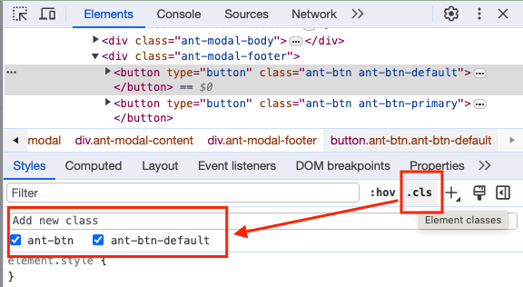
+ 强制显示元素的伪类：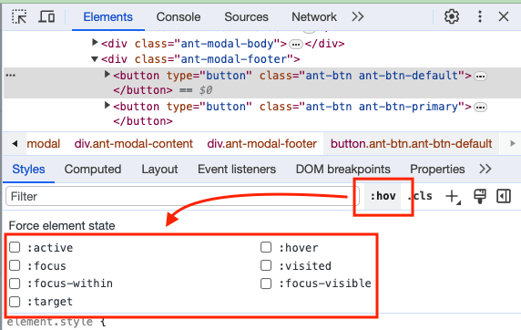

## 样式定位

+ 定位生效样式：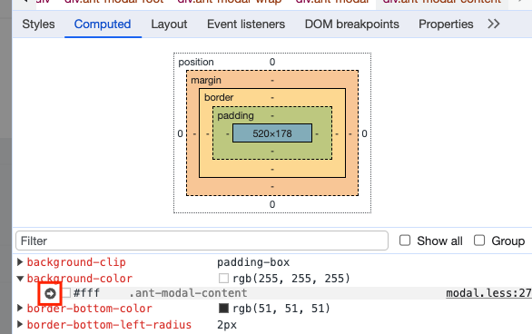

## 选择器

+ 颜色选择器：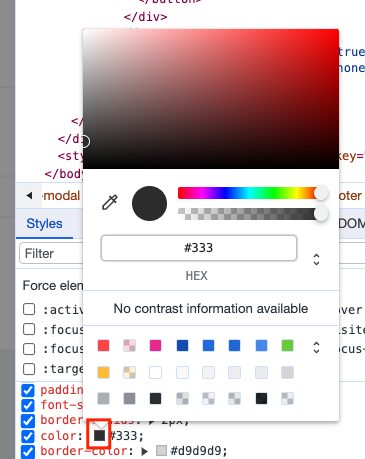
+ 阴影选择器：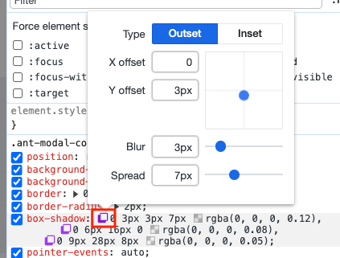

# DOM 操作

## 网页可视化

+ 设置 document.body.contentEditable = "true"
+ 设置 document.designMode = "on"

# Console 操作

## 复制

+ 复制对象到粘贴板：
  + 先将 console 的变量右键 “store as global variable”；
  + 在调用 copy(xxx)

## 不同等级
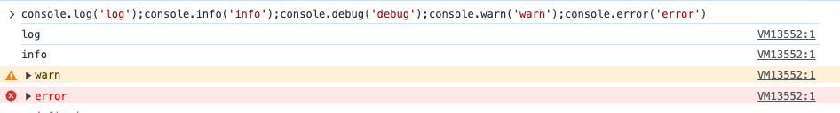

  + `log`
  + `info`
  + `warn`
  + `error`
  + `debug`

## 占位符

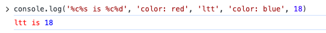

+ `%o` - 对象占位符
+ `%s` - 字符串占位符
+ `%d` - 数字占位符
+ `%s` - 样式占位符

## 结构化

+ `dir`：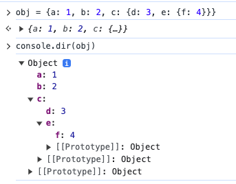
+ `table`：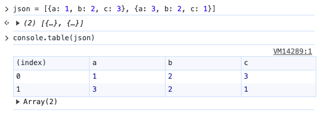

## 信息输出

+ `count`：打印调用次数，一般用在循环或递归函数中 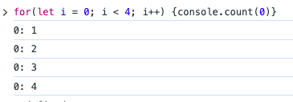
+ `assert`：断言工具 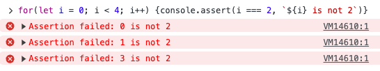
+ `trace`：打印调用栈信息 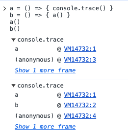
+ `time`：打印代码执行时间，一般用于性能优化和监控 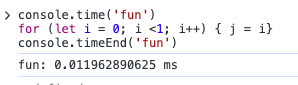
+ `memory`：打印浏览器内存使用情况 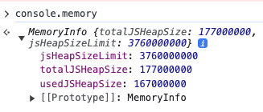
+ `clear`：清空控制台输出

# Reference

+ [细数那些不为人知的 Chrome DevTools 骚操作](https://zhuanlan.zhihu.com/p/401550174)
+ [Mastering JS console.log like a Pro](https://javascript.plainenglish.io/mastering-js-console-log-like-a-pro-1c634e6393f9)