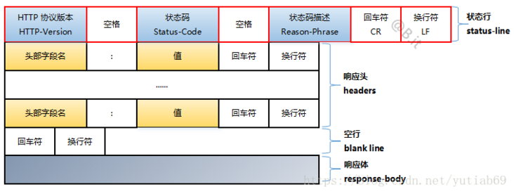

## 请求与响应结构

### HTTP 请求报文

+ 一般格式：

+ 示例：

  ```http
  POST /search HTTP/1.1  
  Accept: image/gif, image/x-xbitmap, image/jpeg, image/pjpeg, application/vnd.ms-excel, application/vnd.ms-powerpoint, application/msword, application/x-silverlight, application/x-shockwave-flash, */*  
  Referer: <a href="http://www.google.cn/">http://www.google.cn/</a>  
  Accept-Language: zh-cn  
  Accept-Encoding: gzip, deflate  
  User-Agent: Mozilla/4.0 (compatible; MSIE 6.0; Windows NT 5.1; SV1; .NET CLR 2.0.50727; TheWorld)  
  Host: <a href="http://www.google.cn">www.google.cn</a>  
  Connection: Keep-Alive  
  Cookie: PREF=ID=80a06da87be9ae3c:U=f7167333e2c3b714:NW=1:TM=1261551909:LM=1261551917:S=ybYcq2wpfefs4V9g; NID=31=ojj8d-IygaEtSxLgaJmqSjVhCspkviJrB6omjamNrSm8lZhKy_yMfO2M4QMRKcH1g0iQv9u-2hfBW7bUFwVh7pGaRUb0RnHcJU37y-FxlRugatx63JLv7CWMD6UB_O_r  
  
  hl=zh-CN&source=hp&q=domety
  ```

### HTTP 响应报文

+ 一般格式：

+ 示例：

  ```http
  HTTP/1.1 200 OK
  Date: Sat, 31 Dec 2005 23:59:59 GMT
  Content-Type: text/html;charset=ISO-8859-1
  Content-Length: 122
  
  ＜html＞
  ＜head＞
  ＜title＞Wrox Homepage＜/title＞
  ＜/head＞
  ＜body＞
  ＜!-- body goes here --＞
  ＜/body＞
  ＜/html＞
  ```

  


## 首部字段分类

+ 当 HTTP 报文首部中出现一个以上具有相同首部字段名时，根据浏览器内部逻辑进行处理：有些浏览器优先处理第一次出现的，有些浏览器优先处理最后一次出现的。

### 4 种类型

+ 通用首部字段 General Header Fields：请求报文和响应报文都会使用。
+ 请求首部字段 Request Header Fields：从客户端往服务器端发送请求报文中所使用的字段，用于补充请求的附加信息、客户端信息、对响应内容相关的优先级等内容。
+ 响应首部字段 Response  Header Fields：由服务器端向客户端返回响应报文中所使用的字段，用于补充响应的附加信息、服务器信息，以及对客户端的附加要求等信息。
+ 实体首部字段 Entity Header Fields：包含在请求报文和响应报文中的实体部分所使用的首部，用于补充内容的更新时间等与实体信息相关的信息。

### 行为分类

HTTP 首部字段将定义成缓存代理和非缓存代理两种行为

+ 端到端首部 End-to-end Header
  + 此类别的首部会转发给请求/响应对应的最终接受目标，且必须保存在由缓存生成的响应中，另外规定它必须被转发。
+ 逐步首部 Hop-by-hop Header
  + 此类别的首部只对单次转发有效，会因通过缓存或代理而不再转发。
  + 在 HTTP/1.1 中，除了以下 8 个首部字段之外，其他所有字段都属于端到端首部
    + Connection
    + Keep-Alive
    + Proxy-Authenticate
    + Proxy-Authorization
    + Trailer
    + TE
    + Transfer-Encoding
    + Upgrade


## 首部字段详解

### 操作缓存

+ Cache-Control，通用首部字段
+ Age，响应首部字段
  + 告知客户端，源服务器在多久前创建了响应。
  + `Age: 600` 
+ Expires，实体首部字段
  + 告知客户端，资源失效的日期。
  + `Expires: Wed, 04 Jul 2012 08:26:05 GMT` 
+ Last-Modified，实体首部字段
  + 告知客户端，资源最终修改日期
  + `Last-Modified: Wed, 04 Jul 2012 08:26:05 GMT` 
+ ETag，响应首部字段
  + 告知客户端，资源实体标识。
+ Vary，响应首部字段
  + 源服务器会向代理服务器传达关于本地缓存使用方法的命令
  + `Vary: Accept-Language` 


### 控制连接

+ Connection，通用首部字段
  + 控制不再转发给代理的首部字段
    + `Connection：不再转发的首部字段名` 
    + `Connection: Upgrade`
  + 管理持久连接
    + `Connection: close`
    + `Connection: Keep-Alive` 
+ Location，响应首部字段
  + 将响应接收方引导至某个与请求 URI 位置不同的资源。
  + 配合 3XX Redirection 状态码使用。
+ Retry-After
  + 告知客户端应该在多久之后再次发送请求。
  + 配合 503 Service Unavailble 或者 3XX Redirection 状态码使用。
  + `Retry-After: 120` 


### 代理认证

+ Authorization，请求首部字段
  + 告知服务器，用户代理的认证信息（证书值）。
  + 一般，想要通过服务器认证的用户代理会在接收到返回的 401 状态码后，把首部字段 Authorization 加入请求中。
+ WWW-Authenticate，响应首部字段
  + 用于 HTTP 访问认证，告知客户端，适用于访问请求 URI 所指定资源的**认证方案**和带参数提示的质询。
  + `WWW-Authenticate: Basic realm="Usagidesign Auth"` 
+ Proxy-Authorization，请求首部字段
  + 接收到从代理服务器发来的认证质询时，客户端会发送包含该首部字段的请求，以告知服务器认证所需要的信息。
+ Proxy-Authenticate，响应首部字段
  + 把由代理服务器所要求的认证信息发送给客户端
  + `Proxy-Authenticate: Basic realm="Usagidesign Auth"` 
+ Form，请求首部字段
  + 告知服务器，使用用户代理的用户的电子邮件地址。
  + `Form: info@hackr.jp` 
+ User-Agent，请求首部字段
  + 可能因代理不同，将电子邮件地址记录在该字段中。
  + 告知服务器，创建请求的浏览器和用户代理名称等细信息。
  + `User-Agent: Mozilla/5.0 (Macintosh; Intel Mac OS X 10_15_6) AppleWebKit/537.36 (KHTML, like Gecko) Chrome/89.0.4389.90 Safari/537.36` 
+ Host，请求首部字段
  + 告知服务器，请求的资源所处的互联网主机名和端口号。
  + 如果相同的 IP 地址下部署运行多个域名，依赖该字段进行区分。
  + `Host: ` 若服务器未指定主机名，直接发送一个空值即可。
+ Referer，请求首部字段
  + 告知服务器，请求的原始资源的 URI
  + 当直接在浏览器的地址栏输入 URI 时，出于安全考虑，不会发送该首部字段。
+ Server，响应首部字段
  + 告知客户端，当前服务器上安装的 HTTP 服务器应用程序信息。
  + `Host: Apache/2.2.6 (Unix) PHP/5.2.5` 
+ Max-Forwards，请求首部字段
  + 使用 TRACE 或 OPTIONS 方法时，告知服务器，转发几次后不再进行转发，而是直接返回响应。
  + 可以对以那台服务器为终点的传输路径的通信状况有所把握。
  + `Max-Forward: 2` 
+ Allow，实体首部字段
  + 通知客户端能够支持 Request-URI 指定资源的所有 HTTP 方法。
  + `Allow: GET, HEAD` 


### 内容协商 - Content Negotiation

以下都是请求首部字段

+ Accept
  + 通知服务器，用户代理能够处理的**媒体类型**及媒体类型的相对优先级。
  + 使用 type/subtype 形式，使用 q 额外表示权重值。
  + `Accept: text/html,application/xhtml+xml,application/xml;q=0.9,*/*;q=0.8` 
  + 媒体类型
    + 文本文件：text/html, text/plain, text/css ...... application/xhtml+xml, appliaction/xml ......
    + 图片文件： image/jpeg, image/gif, image/png ......
    + 视频文件：video/mpeg, video/quicktime ......
    + 应用程序使用的二进制文件：application/octet-stream, application/zip ......
+ Accept-Charset
  + 通知服务器，用户代理支持的**字符集**及字符集的相对优先顺序
  + `Accept-Charset: iso-8859-5, unicode-1-1;q=0.8` 
+ Accept-Language
  + 通知服务器，用户代理能够处理的**自然语言集**及自然语言集的相对优先顺序
  + `Accept-Language: zh-cn,zh;q=0.7,en-us,en;q=0.3` 
+ Accept-Encoding
  + 通知服务器，用户代理支持的**内容编码**及内容编码的优先级顺序。
  + `Accept-Encoding: gzip, default` 
+ TE
  + 告知服务器，客户端能够处理响应的**传输编码**方式及相对优先级。
  + `TE: gzip, defaulte;q=0.5`
  + `TE: trailers` ：还可以指定伴随 trailer 字段的分块传输编码的方式。
+ Content-Language
+ Server-driven Negotiation：服务器驱动协商
+ Agent-driven Negotiation：客户端驱动协商
+ Transport Negotiation：透明协商


### MIME类型

一下都是实体首部字段

+ Content-Encoding
  + 告知客户端，服务器对实体的主体部分选用的**内容编码**方式。
  + `Content-Encoding: gzip` 
+ Content-Language
  + 告知客户端，实体主体使用的**自然语言**。
  + `Content-Language: zh-CN` 
+ Content-Length
  + 表明实体主体部分的**大小**。
  + `Content-Length: 15000` 
+ Content-Location
  + 给出与报文主体部分相应的 URI。
  + `Content-Location: http://www.hackr.jp/index-ja.html` 
+ Content-MD5
  + 是一串由 MD5 算法生成的值，目的在于检查报文主体在传输过程中是否保持完整，以及确认传输是否到达。
+ Content-Range

+ Content-Type：
  + 说明实体主体内对象的**媒体类型**。
  + `Content-Type: text/html; charst=UTF-8` 
  + `application/json` ：
  + `application/pdf` ：
  + HTTP 协议中采纳了多部份对象集合，发送的一份报文主体内可含有多类型主体，通常是在图片或者文本上传的时候使用。
    + `multipart/form-data` ：在 Web 表单文件上传时使用
    + `mutipart/byteranges` ：
    + `multipart/form-data` ：


### 条件请求 - If-XXX

> 服务器接收到附带条件的请求后，只有判断指定条件为真时，才会执行请求

以下都是请求首部字段

+ If-Match
  + 会告知服务器匹配资源所用的实体标记 ETag 值。
  + 服务器会对比 If-Match 的字段值和资源的 ETag 值，仅当两者一致时才会执行请求。否则返回 412 Precondition Faild 状态码。
  + `If-Mtach: *` 表示，服务器可以忽略 ETag 值，只要资源存在就处理请求。

+ If-Modified-Since

  + 会告知服务器，若 If-Modified-Since 字段值早于资源的更新时间，则希望能处理该请求。
  + 如果在指定 If-Modified-Since 之后请求的资源没有更新过，则返回 304 Not Modified 状态码。
  + `If-Modified-Since: Thu, 15 Apr 2004 00:00:00 GMT` 

+ If-None-Match

  + 和 If-Match 作用相反
  + 在 GET 和 HEAD 方法中使用该字段可获取最新的资源。

+ If-Range

  + 会告知服务器，若指定的 If-Range 字段值（ETag 值或者时间）和请求资源的 ETag 值或时间相一致时，则作为范围请求处理。否则，返回全体资源。

  + 和 Range 字段搭配使用

  + ```http
    GET /index.html
    If-Range: "123456"
    Range: bytes=5001-10000
    ```

+ If-Unmodified-Since

  + 作用和 If-Modified-Since 相反
  + 告知服务器，指定的请求资源只有在字段值内指定的日期时间之后，没有更新的情况下，才能处理请求。否则返回 412 Precondition Faild 状态码。


### 范围请求 - Rang Request

+ 请求字段：`Range`；响应字段：`Content-Range`
+ `Range: bytes=5001-10000` ：请求 5001 ～ 10000 字节
  + `Content-Range: bytes 5001-10000/10000` 
+ `Range: bytes=5001-` ：请求 5001字节之后全部的
+ `Range: bytes=0-3000, 5000-7000` ：请求开始～ 3000 字节和 5000 ～ 7000 字节多重范围
+ 针对范围请求，响应会返回状态码为 206 Partial Content 的响应报文；对于多重范围的范围请求，响应会在首部字段 Content-Type 标明 multipart/byterangs 后返回响应报文；如果服务器无法响应范围请求，则会返回状态码 200 OK 和完整的实体内容。


### Cookie 服务

> Cookie 的工作机制是用户识别及状态管理

+ Set-Cookie，响应首部字段
  + 当服务器准备开始管理客户端的状态时，会事先告知各种信息。
+ Cookie，请求首部字段
  + 告知服务器，当客户端想获得 HTTP 状态管理支持时，就会在请求中包含从服务器接收到的 Cookie。