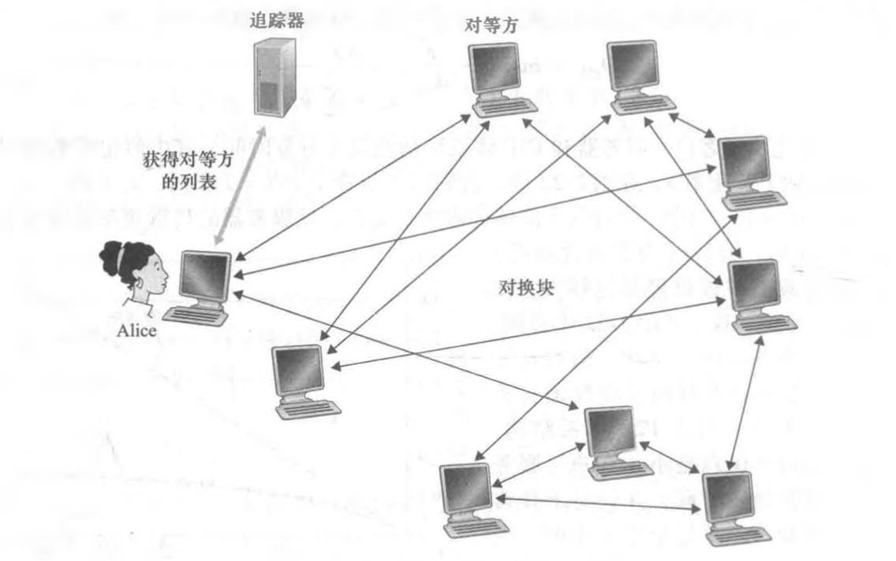
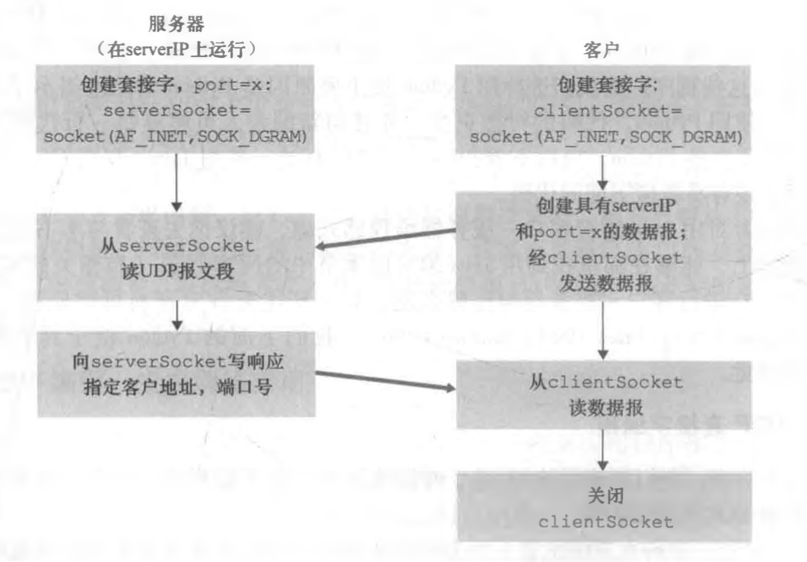
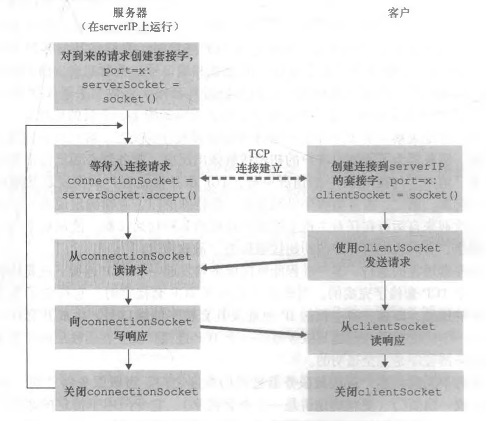
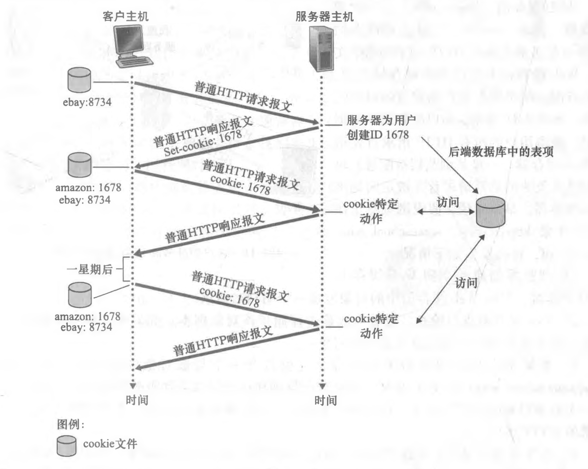
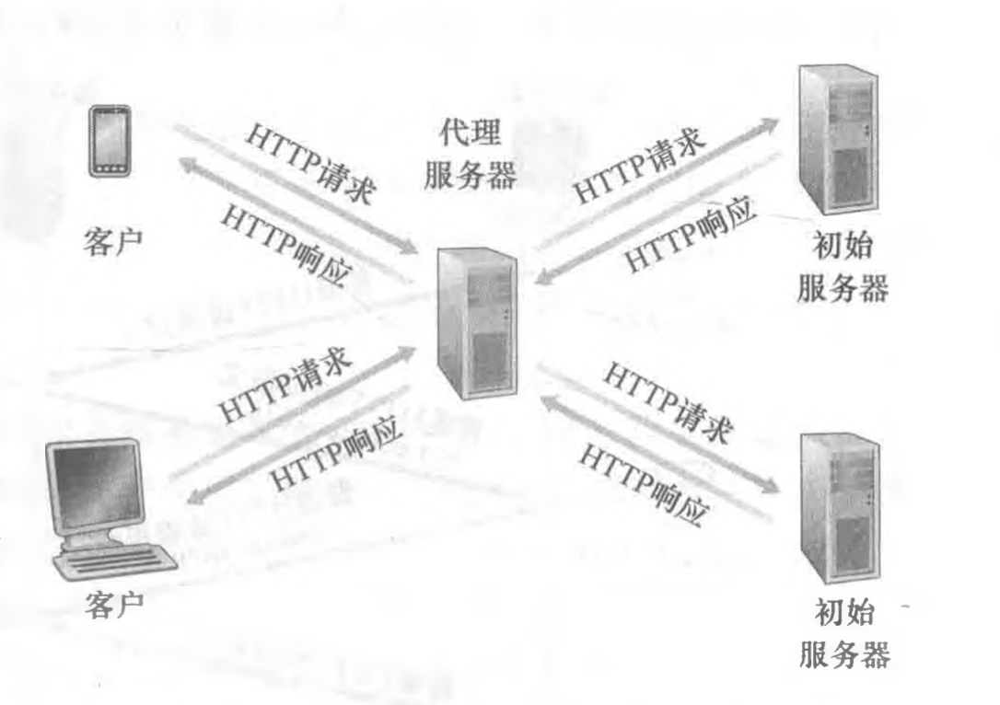
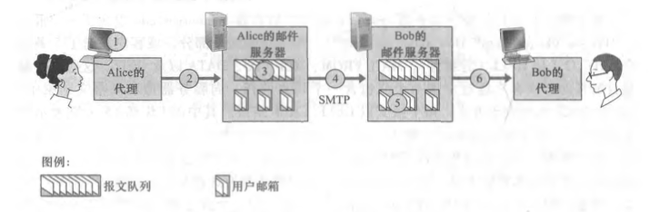
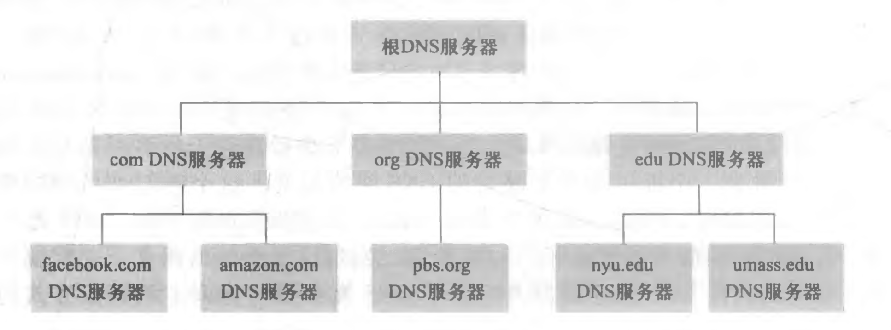
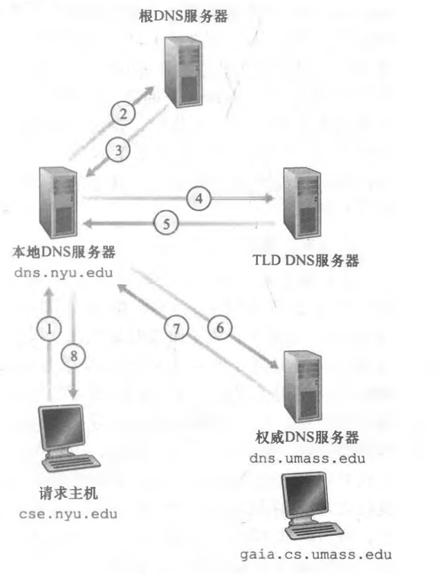
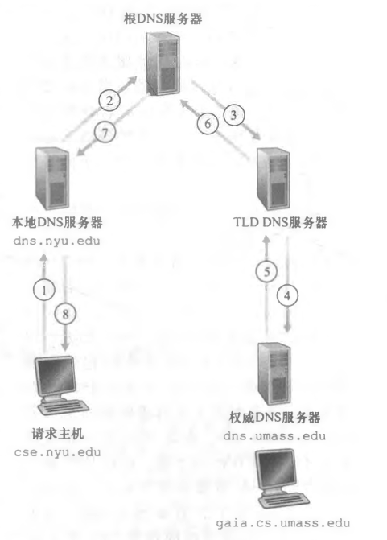

## 应用程序体系结构

application architecture

+ 客户-服务器体系结构（client-server architecture）
  + 有一个总是打开的主机称为**服务器**，它服务于来自许多其他称为**客户**的主机的请求。
  + 客户相互之间不直接通信。
  + 服务器具有固定的、周知的地址。
+ 对等（P2P）体系结构（P2P architecture）
  + 应用程序在间断连接的主机对之间使用直接通信，这些主机对被称为**对等方**。
  + 自扩展性。


### P2P 文件分发

使用P2P体系结构，对总是打开的基础设施服务器有最小的（或者没有）依赖。与之相反，成对间歇连接的主机 （称为对等方）彼此直接通信。这些对等方并不为服务提供商所拥有，而是受用户控制的桌面计算机和膝上计算机。


#### 优势

考虑单一服务器向大量主机分发一个大文件：

+ 在客户-服务器文件分发中，该服务器必须向每个对等方发送该文件的一个副本，即服务器承受了极大的负担，并且消耗了大量的服务器带宽。
+ 在P2P文件分发中，每个对等方能够向任何其他对等方重新分发它已经收到的该文件的任何部分，从而在分发过程中协助该服务器。


#### BitTorrent

目前最为流行的P2P文件分发协议是BitTorren。

+ **洪流 - torrent**：参与一个特定文件分发的所有对等方的集合；
+ **块 - chunk**：在一个洪流中的对等方彼此下载等长度的文件块，典型的块长度为256KB；
  + 当一个对等方首次加入一个洪流时，它没有块。随着时间的流逝，它累积了越来越多的块。
  + 当它下载块时，也为其他对等方上载了多个块。
  + 一旦某对等方获得了整个文件，它也许离开洪流，或留在该洪流中并继续向其他对等方上载块。
  + 同时，任何对等方可能在任何时候仅具有块的子集就离开该洪流，并在以后重新加入该洪流中。
+ **追踪器 - tracker**：每个洪流具有一个基础设施节点。
  + 当一个对等方加入某洪流时，它向追踪器注册自己，并周期性地通知追踪器它仍在该洪流中。
  + 以这种方式，追踪器跟踪参与在洪流中的对等方。
  + 一个给定的洪流可能在任何时刻具有数以百计或数以千计的对等方。


#### 分发流程



*图：用BitTorrent分发文件*

+ 当一个新的对等方 Alice 加入该洪流时，追踪器随机地从参与对等方的集合中选择对等方的一个子集（为了具体起见，设有 50 个对等方），并将这 50 个对等方的 IP 地址发送给 Alice。
+ Alice 持有对等方的这张列表，试图与该列表上的所有对等方创建并行的 TCP 连接。我们称所有这样与 Alice 成功地创建一个 TCP 连接的对等方为 “邻近对等方”（在图中，Alice 显示了仅有三个邻近对等方，通常，她应当有更多的对等方)。
+ 随着时间的流逝，这些对等方中的某些可能离开，其他对等方（最初50个以外的）可能试图与 Alice 创建 TCP 连接。因此一个对等方的邻近对等方将随时间而波动。
+ 在任何给定的时间，每个对等方将具有来自该文件的块的子集，并且不同的对等方具 有不同的子集。Alice 周期性地（经 TCP 连接）询问每个邻近对等方它们所具有的块列表。如果Alice具有 L 个不同的邻居，她将获得 L个块列表。有了这个信息，Alice 将对她当前还没有的块发出请求（仍通过TCP连接）。
+ 因此在任何给定的时刻，Alice 将具有块的子集并知道它的邻居具有哪些块。利用这些信息，Alice 将做出两个重要决定。第一，她应当从她的邻居请求哪些块呢？第二，她应当向哪些向她请求块的邻居发送块？
+ 在决定请求哪些块的过程中，Alice 使用一种称为**最稀缺优先（rarest Erst）**的技术。
  + 这种技术的思路是，针对她没有的块在她的邻居中决定最稀缺的块（最稀缺的块就是那些在她的邻居中副本数量最少的块），并首先请求那些最稀缺的块。这样，最稀缺块得到更为迅速的重新分发，其目标是（大致地）均衡每个块在洪流中的副本数量。
+ 为了决定她响应哪个请求，BitTorrent 使用了一种机灵的**对换算法**：
  + Alice 根据当前能够以最高速率向她提供数据的邻居，给出其优先权。特别是，Alice 对于她的每个邻居都持续地测量接收到比特的速率，并确定以最高速率流入的 4 个邻居。每过 10 秒，她重新计算该速率并可能修改这 4 个对等方的集合。
  + 每过 30 秒，她也要随机地选择另外一个邻居并向其发送块。我们将这个被随机选择的对等方称为 Bob。
  + 每过 30 秒，Alice 将随机地选择一名新的对换伴侣并开始与那位伴侣进行对换。
+ BitTorrent 还有一些有趣的机制： 包括片（小块）、流水线、随机优先选择、残局模型和反怠慢。


## 套接字

套接字是应用进程和运输层协议之间的接口。

在发送端的应用程序将报文推进该套接字。在该套接字的另一侧，运输层协议负责从接受进程的套接字得到该报文。

运行在不同机器上的进程彼此通过向套接字发送报文来进行通信。

**其中作为服务器角色的机器，在客户发送其报文之前，必须作为一个进程正在运行。**

+ 每个进程好比是一座房子，该进程的套接字则好比是一扇门。
+ 应用程序位于房子中门的一侧；运输层位于该门朝外的另一侧。
+ 应用程序开发者在套接字的应用层一侧可以控制所有东西；然而，它几乎无法控制运输层一侧。


### 网络应用

典型的网络应用是由一对程序（即客户程序和服务器程序）组成的，它们位于两个不同的端系统中。

当运行这两个程序时，创建了一个客户进程和一个服务器进程，同时它们通过从套接字读出和写入数据在彼此之间进行通信。

开发者创建一个网络 应用时，其主要任务就是编写客户程序和服务器程序的代码。

网络应用程序有两类：

+ 由协议标准中所定义的操作的实现，如一个 RFC 或某种其他标准文档。
  + 这样的应用程序有时称为“开放”的，因为定义其操作的这些规则为人们所共知。
  + 对于这样的实现，客户程序和服务器程序必须遵守由该 RFC 所规定的规则。
  + 今天许多网络应用程序涉及客户和服务器程序间的通信，这些程序都是由独立的程序员开发的。例如，谷歌 Chrome 浏览器与 Apache Web 服务器通信，BitTorrent 客户与 BitTorrent 跟踪器通信。
+ 专用的网络应用程序，由客户和服务器程序应用的应用层协议没有公开发布在某 RFC 中或其他地方。
  + 某单独的开发者（或开发团队）产生了客户和服务器程序，并且该开发者用他的代码完全控制该代码的功能。
  + 但是因为这些代码并没有实现一个开放的协议，其他独立的开发者将不能开发出和该应用程序交互的代码。

**在网络应用程序研发阶段，开发者必须最先做的一个决定是，应用程序是运行在 TCP 上还是运行在 UDP 上。**


### UDP 套接字

#### 使用 UDP 套接字的两个通信进程之间的交互

+ 在发送进程能够将数据分组推出套接字之门之前，必须**先将目的地址附在该分组之上**。
  + 该目的地址是由目的主机的 IP 地址和目的地套接字的端口号组成的。
  + 因为一台主机可能运行许多网络应用进程，每个进程具有一个或多个套接字，所以在目的主机指定特定的套接字也是必要的。
  + 当生成一个套接字时，就为它分配一个称为端口号（port number）的标识符。
+ 在该分组传过发送方的套接字之后，因特网将使用该目的地址通过因特网为该分组选路到接收进程的套接字。
+ 当分组到达接收套接字时，接收进程将通过该套接字取回分组，然后检查分组的内容并采取适当的动作。
+ 其中：
  + 发送方的源地址也是由源主机的 IP 地址和源套接字的端口号组成，该源地址也要附在分组之上。
  + 将源地址附在分组之上通常并不是由 UDP 应用程序代码所为，而是由底层操作系统自动完成的。


#### python 小例子

假设需要完成以下操作：

+ 客户从其键盘读取一行字符（数据）并将该数据向服务器发送。
+ 服务器接收该数据并将这些字符转换为大写。
+ 服务器将修改的数据发送给客户。 
+ 客户接收修改的数据并在其监视器上将该行显示出来。

着重显示了客户和服务器的主要与套接字相关的活动，两者通过 UDP 运输服务进行通信：



**Python 小程序**

+ ```python
  // UDPClient.py
  
  form socket import *
  serverName = 'hostname'
  serverPort = 12000
  clientSocket = socket(AF_INET, SOCK_DGRAM)
  message = raw_input('Input lowercase sentence:') 
  clientSocket.sendto(message.encode(), (serverName, serverPort))
  modifiedMessage, serverAddress = clientsocket.recvfrom(2048)
  print(modifiedMessage.decode())
  clientSocket.close()
  
  
  // UDPServer.py
  form socket import *
  serverPort = 12000
  serverSocket = socket(AF_INET, SOCK_DGRAM)
  serverSocket.bind(('', serverPort))
  print('The server is ready to receive')
  whil True:
    message, clientAddress = serverSocket.recvfrom(2048)
    modifiedMessage = message.decode().upper()
    serverSocket.sendto(modifiedMessage.encode(), clientAddress)
  ```

  

### UDP 套接字

#### 使用 UDP 套接字的两个通信进程之间的交互

+ 与 UDP 不同，TCP 是一个面向连接的协议。这意味着在客户和服务器能够开始互相发送数据之前，它们**先要握手和创建一个 TCP 连接**。
  + TCP 连接的一端与客户套接字相联系，另一端与服务器套接字相联系。
  + 当创建该 TCP 连接时，我们将其与客户套接字地址 （IP 地址和端口号）和服务器套接字地址（IP 地址和端口号）关联起来。
  + 使用创建的 TCP 连接，当一侧要向另一侧发送数据时，它只需经过其套接字将数据丢进 TCP 连接。这与 UDP 不同，UDP 服务器在将分组丢进套接字之前必须为其附上一个目的地地址。
+ 与在 UDP 中的情况一样，TCP 服务器在客户试图发起接触前必须作为进程运行起来。
+ TCP 服务器程序必须具有一扇特殊的门，更精确地说是一个特殊的套接字，该门欢迎来自运行在任意主机上的客户进程的某种初始接触。使用房子与门来比喻进程与套接字，有时我们将客户的初始接触称为 **“欢迎之门”**。
+ 随着服务器进程的运行，客户进程能够向服务器发起一个 TCP 连接。这是由客户程序通过创建一个 TCP 套接字完成的。当该客户生成其 TCP 套接字时，它指定了服务器中的欢迎套接字的地址，即服务器主机的 IP 地址及其套接字的端口号。生成其套接字后，该客户发起了一个三次握手并创建与服务器的一个 TCP 连接。发生在运输层的三次握手，对于客户和服务器程序是完全透明的。
+ 在三次握手期间，客户进程敲服务器进程的欢迎之门。当该服务器“听”到敲门声 时，它将生成一扇新门（更精确地讲是一个新套接字），它专门用于特定的客户。在我们下面的例子中，欢迎之门是一个称为 serverSocket 的 TCP 套接字对象；它是专门对客户进行连接的新生成的套接字，称为连接套接字。


**欢迎套接字 和 连接套接字**

+ 欢迎套接字：这是所有要与服务器通信的客户的起始接触点；
+ 连接套接字：这是随后为与每个客户通信而生成的套接字。
+ 从应用程序的观点来看，客户套接字和服务器连接套接字直接通过一根管道连接。客户进程可以向它的套接字发送任意字节，并且 TCP 保证服务器进程能够按发送的顺序接收（通过连接套接字）每个字节。TCP 因此在客户和服务器进程之间提供了可靠服务。此外，就像人们可以从同 一扇门进和出一样，客户进程不仅能向它的套接字发送字节，也能从中接收字节；类似地，服务器进程不仅从它的连接套接字接收字节，也能向其发送 字节。
+ 


#### python 小例子




**Python 小程序**

+ ```python
  // TCPClient.py
  
  form socket import *
  serverName = 'hostname'
  serverPort = 12000
  clientSocket = socket(AF_INET, SOCK_STREAM)
  clientSocket.connect((serverName, serverPort))
  sentence = raw_input('Input lowercase sentence:') 
  clientSocket.send(sentence.encode())
  modifiedSentence = clientsocket.recv(1024)
  print('From Server: ', modifiedSentence.decode())
  clientSocket.close()
  
  
  // UDPServer.py
  form socket import *
  serverPort = 12000
  serverSocket = socket(AF_INET, SOCK_STREAM)
  serverSocket.bind(('', serverPort))
  serverSocket.listen(1)
  print('The server is ready to receive')
  whil True:
    connectionSocket, addr = serverSocket.accept()
    sentence = connectionSocket.recv(1024).decode()
    capitalizedSentence = sentence.upper()
    connectionSocket.send(capitalizedSentence.encode())
    connectionSocket.close()
  ```

  


## 应用层协议

应用层协议只是网络应用的一部分，是非常重要的一部分，但不是全部。


### 协议定义内容

应用层协议定义了运行在不同端系统上的应用程序进程如何相互传递报文。定义了：

+ 交换的报文类型，例如请求报文和响应报文。
+ 各种报文类型的语法，例如报文中的各个字段以及这些字段是如何描述的。
+ 字段的语义，这些字段中的信息的含义。
+ 确定一个进程何时以及如何发送报文，对报文进行响应的规则。


### HTTP 

HyperText Transfer Protocol - 超文本传输协议

+ HTTP 由两个程序实现，一个**客户程序**和一个**服务器程序**。因为 Web 浏览器实现了 HTTP 的客户端，所以在 web 环境中也可以使用**浏览器**来表示客户。
+ 客户程序和服务器程序运行在不同的端系统中，通过交换 HTTP 报文进行会话。HTTP 定义了交换报文的结构，以及客户和服务器进行报文交换的方式。
+ HTTP 使用 TCP 作为它的支撑运输协议。HTTP 客户首先发起一个与服务器的 TCP 连接，一旦连接建立，该浏览器和服务器进程就可以通过套接字接口访问 TCP。
+ HTTP 是一个**无状态协议**。
+ Web 使用了**客户-服务器应用程序体系结构**。Web 服务器总是打开的，具有一个固定的 IP 地址，且它服务于可能来自数以百万计的不同浏览器的请求。
+ HTTP 与浏览器如何解释一个 Web 页面毫无关系，HTTP 规范仅定义了在 HTTP 客户程序与 HTTP 服务器程序之间的通信协议。


#### 非持续连接和持续连接

**非持续连接 non-persistent connection**

+ 每个 TCP 连接在服务器发送一个对象后关闭，该连接不为其他的对象而持续。
+ 缺点：
  + 必须为每一个请求的对象建立和维护一个全新的连接：对于每个这样的连接，在客户和服务器中都要分配 TCP 的缓冲区和保持 TCP 变量，这给 Web 服务器带来了严重的负担，因为一台 Web 服务器可能同时服务于数以百计不同的客户的请求。
  + 每个对象经受两倍 RTT 的交互时延，一个 RTT 用于创建 TCP，另一个用于请求和接受一个对象。
  + 等待对未决请求的回答。

**持续连接 persistent connection**

+ 在相同的客户和服务器之间，后续的请求和响应报文能够通过相同的连接进行传送。
+ HTTP/2 允许在相同连接中多个请求和回答交错，并增加了在该连接中优化 HTTP 报文请求和回答的机制。


#### HTTP 报文格式

<font color=EE4D2D>**TODO**</font>


#### 用户与服务器的交互：cookie

HTTP 服务器是无状态的，这简化了服务器的设计，并且允许工程师们去开发可以同时处理数以千计的 TCP 连接的高性能 Web 服务器。但一个 Web 站点通常希望能够识别用户，为此，HTTP 使用了 cookie。

**cookie 技术的四个组件：**



+ 在 HTTP 响应报文中的一个 cookie 首部行：`Set-cookie: XXXX` ；
+ 在 HTTP 请求报文中的一个 cookie 首部行：`cookie: XXXX` ；
+ 在用户端系统中保留一个 cookie 文件，并由用户的浏览器管理；
+ 位于 Web 站点的一个后端数据库。


#### Web 缓存

Web 缓存器（Web cache）也叫**代理服务器**（proxy server）。

**请求交互流程**：



+ 浏览器创建一个到 Web 缓存器的 TCP 连接，并向 Web 缓存器中的对象发送一个 HTTP 请求；
+ Web 缓存器进行检查，查看本地是否存储了该对象副本。如果有，Web 缓存器就向客户浏览器用 HTTP 响应报文返回该对象；
+ 如果 Web 缓存器中没有该对象，它就打开一个与该队对象的初始服务器的 TCP 连接。Web 缓存器则在这个缓存器到服务器的 TCP 连接上发送一个该对象的 HTTP 请求。在收到该请求后，初始服务器向该 Web 缓存器发送具有该对象的 HTTP 响应；
+ 当 Web 缓存器接受到该对象时，它在本地存储空间存储一份副本，并向客户的浏览器用 HTTP 响应报文发送该副本，通过现有的客户浏览器和 Web 缓存器之间的 TCP 连接。

**在因特网上部署 Web 缓存器的优势**：

+ Web 缓存器能大大减少对客户请求的响应时间，特别是当客户与初始服务器之间的瓶颈带宽远低于客户与 Web 缓存器之间的瓶颈带宽时更是如此。
+ Web 缓存器能大大减少一个机构的接入链路到因特网的通信量。通过减少通信量，该机构（如一家公司或者一所学校）就不必急于增加带宽，因此降低了费用。
+ Web 缓存器能从整体上大大减少因特网上的 Web 流量，从而改善了所有应用的性能。


### SMTP

Simple Mail Transfer Protocol - 简单邮件传输协议

+ 因特网电子邮件系统有三个主要组成部分：用户代理（user agent）、邮件服务器（mail server）、简单邮件传输协议（SMTP）。
+ SMTP 由两个程序实现：运行在发送方邮件服务器的客户端，和运行在接收方邮件服务器的服务器端。每台邮件服务器上既运行 SMTP 的客户端，也运行 SMTP 的服务器端。当一个邮件服务器向其他邮件服务器发送邮件时，它就表现为 STMP 的客户；当邮件服务器从其他邮件服务器上接受邮件时，它就表现为一个 SMTP 的服务器。

#### 发送邮件的交互



+ Alice 调用她的邮件代理程序并提供 Bob 的邮件地址，撰写报文，然后指示用户代理发送该报文；
+ Alice 的用户代理把报文发给她的邮件服务器，在那里该报文被放在报文队列中；
+ 运行在 Alice 的邮件服务器上的 STMP 客户端发现了报文队列中的这个报文，它就创建一个到运行在 Bob 的邮件服务器上的 SMTP 服务器的 TCP 连接；
+ 在经过一些初始 SMTP 握手后，SMTP 客户通过该 TCP 连接发送 Alice 的报文；
+ 在 Bob 的邮件服务器上，SMTP 的服务器端接受该报文。BOb 的邮件服务器然后将该报文放在 Bob 的邮箱中；
+ 在 Bob 方便的时候，他调用用户代理阅读该报文。

**STMP 如何将一个报文从发送邮件服务器传送到接受邮件服务器**：

+ SMTP与人类面对面交往的行为方式有许多类似性。
+ 首先，客户 SMTP（运行在发送邮件服务器主机上）在 25 号端口建立一个到服务器 SMTP（运行在接收邮件服务器主机上）的 TCP 连接。
+ 如果服务器没有开机，客户会在稍后继续尝试连接。
+ 一旦连接建立，服务器和客户执行某些应用层的握手，就像人们在互相交流前先进行自我介绍一样，SMTP的客户和服务器在传输信息前先相互介绍。在 SMTP 握手的阶段，SMTP 客户指示发送方的邮件地址（产生报文的那个人）和接收方的邮件地址。一旦该 SMTP 客户和服务器彼此介绍之后，客户发送该报文。
+ SMTP 能依赖 TCP 提供的可靠数据传输无差错地将邮件投递到接收服务器。该客户如果有另外的报文要发送到该服务器，就在该相同的TCP连接上重复这种处理；否则，它指示TCP关闭连接。


#### 和 HTTP 对比

相同点：

+ 这两个协议都用于从一台主机向另一台主机传送文件，HTTP 从 Web 服务器向 Web 客户（通常是一个浏览器）传送文件（也称为对象），SMTP 从一个邮件服务器向另一个邮件服务器传送文件（通常是电子邮件报文）。
+ 这两个协议都是建立在 TCP 连接上的，且都使用持续连接。

不同点：

+ HTTP 主要是一个**拉协议**，某些人在 Web 服务器上装载信息，用户使用 HTTP 从该服务器拉取这些信息，TCP 连接是由想要接受文件的机器发起的。SMTP 主要是一个**推协议**，由发送邮件服务器把文件推向接受邮件服务器，TCP 连接是由要发送该文件的机器发送的。
+ SMTP 要求每个报文采用 **7 比特 ASCII 码格式**，这是因为 SMTP 问世的时间比HTTP要长得多，在 20 世纪 80 年代早期，当时传输能力不足，没有人会通过电子邮件发送大的附件或是大的图片、声音或者视频文件。如果某报文包含了非 7 比特 ASCII 字符（如具有重音的法文字 符）或二进制数据（如图形文件），则该报文必须按照 7 比特 ASCII 码进行编码。HTTP数据则不受这种限制。
+ SMTP 一般不使用中间邮件服务器发送邮件，即使这两个邮件服务器位于地球的两端也是这样，特别是，如果Bob 的邮件服务器没有开机，该报文会保留在 Alice 的邮件服务器上并等待进行新的尝试，这意味着邮件并不在中间的某个邮件服务器存留。而 HTTP 有 Web 缓存器。
+ 还有个重要区别是如何处理一个既包含文本又包含图形（也可能是其他媒体类型）的文档。HTTP 把每个对象封装到它自己的 HTTP 响应报文中, 而 SMTP 则把所有报文对象放在一个报文之中。


#### 邮件访问协议

在 20 世纪 90 年代早期之前，Bob 是通过登陆到服务器主机，并直接在该主机上运行一个邮件阅读程序来阅读他的邮件的。在此之后直到今日，邮件访问使用了一种**客户 - 服务器体系结构**，即典型的用户通过在用户端系统上运行的客户程序来阅读电子邮件，这里的端系统可能是办公室的PC、便携机或者是智能手机。通过在本地主机上运行邮件客户程序，用户享受一系列丰富的特性，包括查看多媒体报文和附件的能力。

假设 Bob（接收方） 在其本地 PC 上运行用户代理程序，考虑在他的本地 PC 上也放置一个邮件服务器是自然而然的事。在这种情况下，Alice 的邮件服务器就能直接与 Bob 的 PC 进行对话了。然而这种方法会有一个问题：因为邮件服务器管理用户的邮箱，并且运行 SMTP 的客户端和服务器端。如果 Bob 的邮件服务器位于他的 PC 上，那么为了能够及时接收可能在任何时候到达的新邮件，他的 PC 必须总是不间断地运行着并一直保持在线。这对于许多因特网用户而言是不现实的。相反，**典型的用户通常在本地 PC 上运行一个用户代理程序，而它访问存储在总是保持开机的共享邮件服务器上的邮箱**。该邮件服务器与其他用户共享，并且通常由用户的 ISP 进行维护（如大学或公司）。


**为什么需要邮件访问协议？**


实际上，**SMTP 被设计成将电子邮件从一台主机推到另一台主机**。然而通常 Alice 的用户代理和 Bob 的邮件服务器之间并没有一个直接的 SMTP 对话。相反，Alice 的用户代理用 SMTP 将电子邮件报文推入她的邮件服务器，接着她的邮件服务器（作为一个 SMTP 客户）再用 SMTP 将该邮件中继到 Bob 的邮件服务器。**为什么该过程要分成两步呢？**主要是因为不通过 Alice 的邮件服务器进行中继，Alice 的用户代理将没有任何办法到达一个不可达的目的地接收服务器。通过首先将邮件存放在自己的邮件服务器中，Alice 的邮件服务器可以重复地尝试向 Bob 的邮件服务器发送该报文，如每 30 分钟一次，直到 Bob 的邮件服务器变得运行为止。

但是有一个问题需要解决：像 Bob 这样的接收方，如何通过运行其本地 PC上 的用户代理，获得位于他的某 ISP 的邮件服务器上的邮件呢？值得注意的是 Bob 的用户代理不能使用 SMTP 得到报文，因为**取报文是一个拉操作，而 SMTP 协议是一个推协议**。通过引入一个特殊的邮件访问协议来解决这个难题，该协议将 Bob 邮件服务器上的 报文传送给他的本地 PC。


**目前有一些流行的邮件访问协议：**

+ POP3
  + 第三版的邮局协议（Post Office Protocol - Version 3）
  + 由 RFC 1939 进行定义
  + 当用户代理（客户）打开了一个到邮件服务器（服务器）端口 110上的 TCP 连接后，POP3 就开始工作了。随着建立 TCP 连接，POP3 按照三个阶段进行工作：**特许、事务处理以及更新**。
    + 在第一个阶段即特许阶段（authorization），用户代理发送（以明文形式）用户名和口令以鉴别用户；
    + 在第二个阶段即事务处理阶段，用户代理取回报文；同时在这个阶段用户代理还能进行如下操作：对报文做删除标记，取消报文删除标记，以及获取邮件的统计信息；
    + 在第三个阶段即更新阶段，它出现在客户发出了 quit 命令之后，目的是结束该 POP3 会话；这时，该邮件服务器删除那些被标记为删除的报文。
  + 命令
    + 特许阶段有两个主要的命令：user < user name > 和 pass < password > ；
    + 事务处理阶段用户代理仅使用四个命令 list、retr、de­le 和 quit。
  + 事务处理过程
    + 使用POP3的用户代理通常被用户配置为**下载并删除**或者**下载并保留**方式。
    + POP3 用户代理发岀的命令序列取决于用户代理程序被配置为这两种工作方式的哪一种。
    + 使用下载并删除方式存在的问题是，邮件接收方 Bob 可能是移动的，可能希望从多个不同的机器访问他的邮件报文，如果Bob最先是在他办公室的 PC 上收取了一条邮件，那么晚上当他在家里时，通过他的便携机将不能再收取该邮件。
    + 使用下载并保留方式，用户代理下载某邮件后，该邮件仍保留在邮件服务器上。这时，Bob 就能通过不同的机器重新读取这些邮件。
  + 状态保留
    + 在用户代理与邮件服务器之间的 POP3 会话期间，**该 POP3 服务器保留了一些状态信息**，特别是记录了哪些用户报文被标记为删除了。
    + 然而，POP3 服务器**并不在 POP3 会话过程中携带状态信息**。会话中不包括状态信息大大简化了 POP3 服务的实现。
+ IMAP
  + 因特网邮件访问协议（Internet Mail Access Protocal）
  + 由 RFC 350 进行定义
  + 因为 **POP3 协议没有给用户提供任何创建远程文件夹并为报文指派文件夹的方法**，IMAP 能解决这个问题。
    + IMAP 服务器把每个报文与一个文件夹联系起来；当报文第一次到达服务器时，它与收件人的 INBOX 文件夹相关联。收件人则能够把邮件移到一个新的、用户创建的文件夹中，阅读邮件，删除邮件等。
    + IMAP 协议为用户提供了创建文件夹以及将邮件从一个文件夹移动到另一个文件夹的命令。
    + IMAP 还为用户提供了在远程文件夹中查询邮件的命令，按指定条件去查询匹配的邮件。
    + 值得注意的是，与 POP3不同，**IMAP 服务器维护了 IMAP 会话的用户状态信息**，例如，文件夹的名字以及哪些报文与哪些文件夹相关联。
  + IMAP 的另一个重要特性是**它具有允许用户代理获取报文某些部分的命令**。
    + 例如，一 个用户代理可以只读取一个报文的报文首部，或只是一个多部分MIME报文的一部分。
    + 当用户代理和其邮件服务器之间使用低带宽连接（如一个低速调制解调器链路）的时候， 这个特性非常有用。使用这种低带宽连接时，用户可能并不想取回他邮箱中的所有邮件， 尤其要避免可能包含如音频或视频片断的大邮件。
+ HTTP
  + 超文本传输协议（HyperText Transfer Protocol）
  + 使用这种服务，用户代理就是普通的浏览器，用户和他远程邮箱之间的通信则通过 HTTP 进行。
    + 当一个收件人（如Bob）想从他的邮箱中访问一个报文时，该电子邮件报文从 Bob 的邮件服务器发送到他的浏览器，使用的是 HTTP 而不是 POP3 或者 IMAP 协议；
    + 当发件人（如Alice）要发送一封电子邮件报文时，该电子邮件报文从 Alice 的浏览器发送到她的邮件服务器，使用的是 HTTP 而不是SMTP；
    + 然而，Alice 的邮件服务器在与其他的邮件服务器之间发送和接收邮件时，仍然使用的是 SMTP。


#### 电子邮件协议：

应用于因特网电子邮件的一些协议：

+ SMTP 用来将邮件从发送方的邮件服务器传输到接收方的邮件服务器；
+ SMTP 也用来将邮件从发送方的用户代理传送到发送方的邮件服务器；
+ 如 POP3 这样的邮件访问协议用来将邮件从接收方的邮件服务器传送到接收方的用户代理。


### DNS

Domain Name System - 域名系统

DNS 协议运行在 UDP 之上，使用 53 号端口。

DNS 服务器通常是运行 BIND ( Berkeley Internet Name Domain) 软 件 [BIND 2012 ] 的 UNIX 机器。

DNS由 RFC 1034 和 RFC 1035 定义，并且在几个附加的 RFC 中进行了更新。

#### DNS 提供的服务

识别主机有两种方式，通过主机名或者IP地址。人们喜欢便于记忆的主机名标识方式，而路由器则喜欢定长的、有着层次结构的 IP 地址。为了折中这些不 同的偏好，我们需要一种能进行主机名到 IP 地址转换的目录服务。这就是 DNS 的主要任务。

DNS 是：

+ 一个由分层的DNS服务器（DNS Server）实现的分布式数据库；
+ 一个使得主机能够查询分布式数据库的应用层协议。

**DNS 协议是应用层协议**：

+ 使用**客户-服务器模式**运行在通信的端系统之间；
+ 在通信的端系统之间通过下面的端到端运输协议来传送 DNS 报文。
+ DNS 不同于其他应用层协议的是，DNS 不是一个直接和用户打交道的应用，DNS 是为因特网上的用户应用程序以及其他软件提供一种核心功能，即将主机名转换为其背后的IP地址。

**DNS 提供的其他服务**：

+ 主机别名 - host aliasing：有着复杂主机名的主机能拥有一个或者多个别名。
+ 邮件服务器别名 - mail server aliasing：电子邮件应用程序可以调用 DNS，对提供的主机名别名进行解析，以获得该主机的规范主机名及其 IP 地址。
+ 负载分配 - load distribution：DNS 也用于在冗余的服务器（如冗余的Web服务器等）之间进行负载分配。


#### DNS 作用流程

考虑运行在某用户主机上的一个浏览器（即一个 HTTP  客户）请求URL www. someschool. edu/index. html 页面时会发生什么现象。为了使用户的主机能够将一个 HTTP 请求报文发送到 Web 服务器 www. someschool. edu，该用户主机必须获得 www. someschool. edu 的 IP 地址。其做法如下：

+ 同一台用户主机上运行着 DNS 应用的客户端；
+ 浏览器从上述 URL 中抽取岀主机名 www. someschool. edu，并将这台主机名传给DNS应用的客户端；
+ DNS 客户向 DNS 服务器发送一个包含主机名的请求，所有的 DNS 请求和回答报文使用 UDP 数据报经端口  53 发送；
+ 经过若干毫秒到若干秒的时延后，DNS 客户最终会收到一份回答报文，其中含有对应于该主机名的 IP 地址；
+ 一旦浏览器接收到来自 DNS 的该 IP 地址，它能够向位于该 IP 地址 80 端口的 HTTP 服务器进程发起一个 TCP 连接。

想获得的 IP 地址通常就缓存在一个附近的 DNS 服务器中，这有助于减少 DNS 的网络流量和 DNS 的平均时延。


#### 分布式数据库

**简单设计的缺陷：**

DNS 的一种简单设计是在因特网上只使用一个 DNS 服务器，该服务器包含所有的映射。在这种集中式设计中，客户直接将所有查询直接发往单一的 DNS 服务器，同时该 DNS 服务器直接对所有的查询客户做出响应。

但它不适用于当今的因特网，因为因特网有着数量巨大并持续增长的主机。这种集中式设计的问题包括:

+ 单点故障（a single point of failure）：如果该 DNS 服务器崩溃，整个因特网随之瘫痪；
+ 通信容量（traffic volume）：单个 DNS 服务器不得不处理所有的 DNS 査询(用于为上亿台主机产生的所有HTTP请求报文和电子邮件报文服务)。
+ 远距离的集中式数据库（distant centralized database）：单个 DNS 服务器不可能 “邻近” 所有查询客户。如果我们将单台 DNS 服务器放在纽约市，那么所有来自澳大利亚的查询必须传播到地球的另一边，中间也许还要经过低速和拥塞的链路。 这将导致严重的时延。 
+ 维护（maintenance）：单个 DNS 服务器将不得不为所有的因特网主机保留记录。 这不仅将使这个中央数据库庞大，而且它还不得不为解决每个新添加的主机而频繁更新。

总的来说，在单一 DNS 服务器上运行集中式数据库完全没有可扩展能力。因此，DNS 采用了分布式的设计方案。


**分布式层次结构**



*图：部分DNS服务器的层次结构* 

+ 模拟这 3 种类型的DNS服务器交互的方式，假定一个 DNS 客户要决定主机名 www. amazon.com 的 IP 地址。粗略说来，将发生 下列事件：
  + 客户首先与根服务器之一联系，它将返回顶级域名 com 的 TLD 服务器的 IP 地址；
  + 该客户则与这些 TLD 服务器之一联系，它将为 amazon.com 返回权威服务器的 IP 地址；
  + 最后，该客户与 amazon.com 权威服务器之一联系，它为主机名 www. amazon.com 返回其IP地址。
+ 根 DNS 服务器：**提供 TLD 服务器的 IP 地址**。
  + 有 400 多个根名字服务器遍及全世界，这些根名字服务器由 13 个不同的组织管理。
+ 顶级域 DNS 服务器（Top-Level Domain，TLD）：**提供权威 DNS 服务器的 IP 地址**。
  + 对于每个顶级域（如 com、org、net、edu 和 gov）和所有国家的顶级域（如 uk、fr、ca 和 jp）都有 TLD 服务器（或服务器集群）。
+ 权威 DNS 服务器：**提供主机名字映射的 IP 地址**。
  + 在因特网上具有公共可访问主机（如 Web 服务器和邮件服务器）的每个组织机构必须提供公共可访问的 DNS 记录，这些记录将这些主机的名字映射为 IP 地址。
  + 一个组织机构的权威 DNS 服务器收藏了这些 DNS 记录。
  + 一个组织机构能够选择实现它自己的权威 DNS 服务器以保存这些记录；另一种方法是，该组织能够支付费用，让这些记录存储在某个服务提供商的一个权威 DNS 服务器中。
  + 多数大学和大公司实现和维护它们自己基本和辅助（备份）的权威 DNS 服务器。
+ 本地 DNS 服务器（local DNS server）。
  + 一个本地 DNS 服务器并不属于该服务器的层次结构，但它对 DNS 层次结构是至关重要的。
  + 每个 ISP（如一个居民区的 ISP 或一个机构的 ISP）都有一台本地 DNS 服务器（也叫默认名字服务器）。
  + 当主机与某个 ISP 连接时，该 ISP 提供一台主机的 IP 地址，该主机具有一台或多台其本地 DNS 服务器的IP 地址。
  + 主机的本地 DNS 服务器通常 “邻近” 本主机。对某机构 ISP 而言，本地 DNS 服务器可能就与主机在同一个局域网中；对于某居民区 ISP 来说，本地 DNS 服务器通常与主机相隔不超过几台路由器。
  + 当主机发岀 DNS请求时，该请求被发往本地 DNS 服务器，它起着代理的作用，并将该请求转发到 DNS 服务器层次结构中。


#### DNS 服务器交互



*图：各种DNS服务器的交互*

假设主机 cse. nyu. edu 想知道主机 gaia. cs. umass. edu 的 IP 地址。同时假设纽约大学（NYU）的 cse. nyu. edu 主机的本地 DNS 服务器为 dns. nyu. edu，并且 gaia. cs. umass. edu 的权威 DNS 服务器为 dns. umass. eduo。

+ 主机 cse. nyu. edu 首先向它的本地 DNS 服务器 dns. nyu. edu 发送一个 DNS 查询报文。该查询报文含有被转换的主机名 gaia. cs. umass. eduo；
+ 本地 DNS 服务器将该报文转发到根 DNS 服务器；
+ 该根 DNS 服务器注意到其 edu 前缀并向本地 DNS 服务器返回负责 edu 的 TLD 的 IP 地址列表；
+ 该本地 DNS 服务器则再次向这些 TLD 服务器之一发送查询报文；
+ 该 TLD 服务器注意到 umass. edu 前缀，并用权威 DNS 服务器的 IP 地址进行响应，该权威 DNS 服务器是负责马萨诸塞大学的 dns. umass. eduo；
+ 最后，本地 DNS 服务器直接向 dns.umass. edu 重发查询报文，dns. umass. edu 用 gaia. cs. umass. edu 的 IP 地址进行响应。

注意到在本例中，为了获得 一台主机名的映射，共发送了 8 份 DNS 报文：4 份查询报文和 4 份回答报文。

这个例子假设了 TLD 服务器知道用于主机的权威 DNS 服务器的 IP 地址。一般而言，这种假设并不总是正确的。相反，TLD 服务器只是知道中间的某个 DNS 服务器，

该中间DNS服务器依次才能知道用于该主机的权威DNS服务器。

+ 假设马萨诸塞大学有一台用于本大学的 DNS 服务器，它称为 dns. umass. eduo。同时假设该大学的每个系都有自己的 DNS 服务器，每个系的 DNS 服务器是本系所有主机的权威服务器；
+ 在这种情况下，当中间 DNS 服务器 dns.umass. edu 收到了对某主机的请求时，该主机名是以 cs.umass.edu结尾，它向 dns. nyu. edu 返回 dns. cs. umass. edu 的 IP 地址，后者是所有以 cs. umass. edu 结尾的主机的权威服务器；
+ 本地 DNS 服务器 dns. nyu. edu 则向权威 DNS 服务器发送查询，该权威 DNS 服务器向本地 DNS 服务器返回所希望的映射，该本地服务器依次向请求主机返回该映射；
+ 在这个例子中，共发送了 10 份 DNS 报文。


**递归查询（recursive query）和迭代查询（iterative query）**

+ 从 cse. nyu. edu 到 dns. nyu. edu 发出的查询是递归查询，因为该查询以自己的名义请求 dns. nyu. edu 来获得该映射。
+ 后继的 3 个查询是迭代查询，因为所有的回答都是直接返回给 dns. nyu. eduo。
+ 从理论上讲，任何 DNS 查询既可以是迭代的也能是递归的。
+ 实践中，查询通常遵上面的查询模式：**从请求主机到本地 DNS 服务器的查询是递归的，其余的查询是迭代的**。
+ 递归查询：




#### DNS 缓存

DNS caching

能够改善时延性能并减少在因特网上到处传输的 DNS 报文数量。

+ 在一个请求链中，当某 DNS 服务器接收一个 DNS 回答（例如，包含某主机名到 IP 地址的映射）时，它能将映射缓存在本地存储器中。

+ 如果在 DNS服务器中缓存了一台「主机名/IP地址」对，另一个对相同主机名的查询到达该 DNS 服务器时，该 DNS 服务器就能够提供所要求的 IP 地址，即使它不是该主机名的权威服务器。

+ 由于主机和主机名与 IP 地址间的映射并不是永久的，DNS 服务器在一段时间后（通常设置为两天）将丢弃缓存的信息。

  

#### DNS 记录

共同实现 DNS 分布式数据库的所有 DNS 服务器存储了资源记录（Resource Record，RR），RR 提供了主机名到 IP 地址的映射。每个 DNS 回答报文包含了一条或多条 RR。

资源记录是一个包含了下列字段的 4 元组：

```
Name, Value, Type, TTL
```

+ TTL 是该记录的生存时间，它决定了资源记录应当从缓存中删除的时间。

+ Name 和 Value 的值取决于 Type：

  + 如果 Type = A，则 Name 是主机名，Value 是该主机名对应的 IP 地址。

    + 因此，一条类型为 A 的资源记录提供了标准的主机名到IP地址的映射。
    + 例如 `relay. bar.foo.com, 145.37.93.126, A` 就是一条类型 A 记录。
  + 如果 Type=NS，则 Name 是个域（如 foo. com），而 Value 是个知道如何获得该域中主机 IP 地址的权威 DNS 服务器的主机名。
    + 这个记录用于沿着查询链来路由 DNS 查询。
    + 例如 `foo.com, cins.foo.com, NS` 就是一条类型为NS的记录。
  + 如果 Type=CNAME，则 Value 是别名为 Name 的主机对应的规范主机名。
    + 该记录能够向査询的主机提供一个主机名对应的规范主机名。
    + 例如 `foo.com, relay1.bar.foo.com, CNAME` 就是一条 CNAME 类型的记录。
  + 如果 Type = MX，则 Value 是个别名为 Name 的邮件服务器的规范主机名。
    + MX 记录允许邮件服务器主机名具有简单的别名。
    + 例如 `foo.com, mail.bar.foo.com, MX` 就是一条MX记录。
    + 值得注意的是，通过使用 MX 记录，一个公司的邮件服务器和其他服务器（如它的 Web 服务器）可以使用相同的别名。
    + 为了获得邮件服务器的规范主机名，DNS客户应当请求一条 MX 记录；而为了获得其他服务器的规范主机名，DNS客户应当请求 CNAME 记录。
  
+ 一般构造

  + 如果一台 DNS 服务器是用于某特定主机名的权威 DNS 服务器，那么该 DNS 服务器会有一条包含用于该主机名的类型 A 记录，即使该DNS服务器不是其权威DNS服务器，它也可能在缓存中包含有一条类型 A 记录；
  + 如果服务器不是用于某主机名的权威服务器, 那么该服务器将包含一条类型 NS 记录，该记录对应于包含主机名的域，它还将包括一条类型 A 记录，该记录提供了在 NS 记录的 Value 字段中的 DNS 服务器的IP地址。
  + 举例来说，假设一台 edu TLD 服务器不是主机 gaia. cs. umass. edu 的权威 DNS 服务器，则该服务器将包含一条包括主机 cs. umass. edu 的域记录，如 （umass. edu, dns. umass. edu, NS）；该 edu TLD 服务器还将包含一条类型 A 记录，如（dns. umass. edu, 128. 119. 40.111, A），该记录将名字 dns.umass. edu 映射为一个 IP 地址。

+ 示例

  + 使用 nslookup 程序可以从正在工作的主机直接向某些 DNS 服务器发送一个 DNS 查询报文。

  + ```bash
    $ nslookup www.baidu.com
    Server:		10.12.2.4
    Address:	10.12.2.4#53
    
    Non-authoritative answer:
    www.baidu.com	canonical name = www.a.shifen.com.
    Name:	www.a.shifen.com
    Address: 163.177.151.110
    Name:	www.a.shifen.com
    Address: 163.177.151.109
    
    $ nslookup www.a.shifen.com
    Server:		10.12.2.4
    Address:	10.12.2.4#53
    
    Non-authoritative answer:
    Name:	www.a.shifen.com
    Address: 163.177.151.109
    Name:	www.a.shifen.com
    Address: 163.177.151.110
    
    
    $ nslookup 10.12.2.4
    Server:		10.12.2.4
    Address:	10.12.2.4#53
    
    4.2.12.10.in-addr.arpa	name = CNDC06.cn.corp.seagroup.com.
    ```


### CDN

Content Distribution Network - 内容分发


#### 因特网视频

+ 视频是一系列的图像，通常以一种恒定的速率（如每秒 24 或 30 张图像）来展现。

+ 一幅未压缩、数字编码的图像由像素阵列组成，其中每个像素是由一些比特编码来表示亮度和颜色。

+ 视频的一个重要特征是它能够被压缩，因而可用比特率来权衡视频质量。比特率越高，图像质量越好，用户的总体视觉感受越好。


**HTTP 流**

+ 在 HTTP 流中，视频只是存储在 HTTP 服务器中作为一个普通的文件，每个文件有一个特定的 URL。
+ 当用户要看该视频时，客户与服务器创建一个 TCP 连接并发送对该 URL 的 HTTP GET 请求。
+ 服务器则以底层网络协议和流量条件允许的尽可能快的速率，在一个 HTTP 响应报文中发送该视频文件。
+ 在客户一侧，字节被收集在客户应用缓存中。一旦该缓存中的字节数量超过预先设定的门限，客户应用程序就开始播放，特别是，流式视频应用程序周期性地从客户应用程序缓存中抓取帧，对这些帧解压缩并且在用户屏幕上展现。
+ 因此，流式视频应用接收到视频就进行播放，同时缓存该视频后面部分的帧。
+ 但它具有严重缺陷，即所有客户接收到相同编码的视频。


**DASH**

Dynamic Adaptive Streaming over HTTP - 经HTTP的动态适应性流

+ 在 DASH 中，视频编码为几个不同的版本，其中每个版本具有不同的比特率，对应于不同的质量水平。
+ 客户动态地请求来自不同版本且长度为几秒的视频段数据块。
+ DASH 允许客户使用不同的以太网接入速率流式播放具有不同编码速率的视频；允许客户自由地在不同的质量等级之间切换。
+ 使用 DASH 后，每个视频版本存储在 HTTP 服务器中，每个版本都有一个不同的 URL。HTTP 服务器也有一个告示文件（manifest file），为每个版本提供了一个 URL 及其比特率。
+ 客户首先请求该告示文件并且得知各种各样的版本。然后客户通过在 HTTP GET 请求报文中对每块指定一个URL 和一个字节范围，一次选择一块。在下载块的同时，客户也测量接收带宽并运行一个速率决定算法来选择下次请求的块。


#### 内容分发网

**单一的大规模数据中心**

在数据中心中存储其所有视频，并直接从该数据中心向世界范围的客户传输流式视频。但有三个缺陷：

+ 如果客户远离数据中心，服务器到客户的分组将跨越许多通信链路并很可能通过许多 ISP，其中某些 ISP 可能位于不同的大洲。如果这些链路之一提供的吞吐量小于视频消耗速率，端到端吞吐量也将小于该消耗速率，给 用户带来恼人的停滞时延；
+ 流行的视频很可能经过相同的通信链路发送许多次。这不仅浪费了网络带宽，因特网视频公司自己也将为向因特网反复发送相同的字节而向其ISP运营商（连接到数据中心）支付费用；
+ 一个单点故障，如果数据中心或其通向因特网的链路崩溃，它将不能够分发任何视频流了。


**内容分发网**

CDN 管理分布在多个地理位置上的服务器，在它的服务器中存储视频（和其他类型的 Web 内容，包括文档、图片和音频）的副本，并且所有试图将每个用户请求定向到一个将提供最好的用户体验的 CDN位 置。

+ 专用 CDN - private CDN：它由内容提供商自己所拥有，例如谷歌的 CDN 分发 YouTube 视频和其他类型的内容；
+ 第三方 CDN - third-party CDN：它代表多个内容提供商分发内容，例如 Akamai，Limelight 和 Level-3。


CDN通常采用两种不同的**服务器安置原则**：

+ 深入：通过在遍及全球的接入 ISP 中部署服务器集群来深入到 ISP 的接入网中。其目标是靠近端用户，通过减少端用户和 CDN 集群之间（内容从这里收到）链路和路由器的数量，从而改善了用户感受的时延和吞吐量。因为这种高度分布式设计，维护和管理集群的任务成为挑战。
+ 邀请做客：通过在少量（例如 10 个）关键位置建造大集群来邀请到 ISP 做客。这些 CDN 通常将它们的集群放置在因特网交换点（IXP）。与深入设计原则相比，邀请做客设计通常产生较低的维护和管理开销，可能以对端用户的较高时延和较低吞吐量为代价。

一旦 CDN 的集群准备就绪，它就可以跨集群复制内容。CDN可能不希望将每个视频的副本放置在每个集群中，因为某些视频很少观看或仅在某些国家中流行。

事实上，**许多 CDN 没有将视频推入它们的集群，而是使用一种简单的拉策略**：如果客户向一个未存储该视频的集群请求某视频，则该集群检索该视频（从某中心仓库或者从另一个集群），向客户流式传输视频时的同时在本地存储一个副本。类似于因特网缓存，当某集群存储器变满时，它删除不经常请求的视频。


#### CDN 操作

当用户主机中的一个浏览器指令检索一个特定的视频（由URL标识）时，CDN 必须截获该请 求，以便能够：

+ 确定此时适合用于该客户的 CDN 服务器集群；
+ 将客户的请求重定向 到该集群的某台服务器。

假定一个内容提供商 NetCinema，雇佣了第三方 CDN 公司 KingCDN 来向其客户分发视频。在 NetCinema 的  Web 网页上，它的每个视频都被指派了一个 URL，该 URL 包括了字符串 “video” 以及该视频本身的独特标识符；例如，转换器可以指派为 http://video.netcinema.com/6Y7B23Vo 


*图：DNS 将用户的请求重新定向到一台 CDN 服务器*

+ 用户访问位于 NetCinema 的 Web 网页；
+ 当用户点击链接 http://video.netcinema.com/6Y7B23V 时，该用户主机发送了一个对于 video.netcinema.com 的 DNS 请求。
+ 用户的本地 DNS 服务器（LDNS）将该 DNS 请求中继到一台用于 NetCinema 的权威 DNS 服务器，该服务器观察到主机名 video.netcinema.com中的字符串 “video”。为了将该 DNS 请求移交给 KingCDN，NetCinema权威 DNS 服务器并不返回一个IP地址，而是向 LDNS返回一个 KingCDN 域的主机名，如a1105.kingcdn.com。
+ 从这时起，DNS请求进入了 KingCDN 专用 DNS 基础设施。用户的 LDNS 则发送第 二个请求，此时是对 a1105.kingcdn.com的 DNS 请求，KingCDN 的 DNS 系统最终向 LDNS 返回 KingCDN 内容服务器的 IP 地址。所以正是在这里，在 KingCDN 的 DNS 系统中，指定了 CDN 服务器。客户将能够从这台服务器接收到它的内容。
+ LDNS 向用户主机转发内容服务 CDN 节点的 IP 地址。
+ 一旦客户收到 KingCDN 内容服务器的 IP 地址，它与具有该 IP 地址的服务器创建了一条直接的 TCP 连接，并且发出对该视频的 HTTP GET 请求。如果使用了 DASH，服务器将首先向客户发送具有 URL 列表的告示文件，每个 URL 对应视频的每个版本，并且客户将动态地选择来自不同版本的块。


#### 集群选择策略

任何 CDN 部署，其核心是**集群选择策略（cluster selection strategy）**，即动态地将客户定向到 CDN 中的某个服务器集群或数据中心的机制。

+ 一种简单的策略是指派客户到**地理上最为邻近（geographically closest）**的集群。
  + 使用商用地理位置数据库每个 LDNS IP 地址都映射到一个地理位置。当从一个特殊的 LDNS 接收到一个 DNS 请求时，CDN 选择地理上最为接近的集群。
  + 对于众多用户来说能够工作得相当，但对于某些客户，该解决方案可能执行的效果差，因为就网络路径的长度或跳数而言，地理最邻近的集群可能并不是最近的集群。
  + 这种简单的策略忽略了时延和可用带宽随因特网路径时间而变化，总是为特定的客户指派相同的集群。
+ 为了基于当前流量条件为客户决定最好的集群，CDN 能够对其集群和客户之间的时延和丢包性能执行周期性的**实时测量（real-time measurement）**。
  + CDN 能够让它的每个集群周期性地向位于全世界的所有 LDNS 发送探测分组。
  + 缺点是许多 LDNS 被配置为不会响应这些探测。


**学习案例**

Netflix

+ Netflix 不需要将 DNS 重定向来将特殊的客户连接到一台 CDN 服务器，而是直接告知该客户使用一台特定的 CDN 服务器；
+ Netflix CDN 使用推高速缓存而不是拉高速缓存：内容在非高峰时段的预定时间被推入服务器，而不是在高速缓存未命中时动态地被推入。

YouTube

+ 谷歌使用拉高速缓存和的 DNS 重定向。在大部分时间，谷歌的集群选择策略将客户定向到某个集群，使得客户与集群之间的 RTT 是最低的。然而，为了平衡流经集群的负载，有时客户被定向（经DNS）到一个更远的集群。
+ YouTube 应用 HTTP 流，经常使少量的不同版本为一个视频可用，每个具有不同的比特率和对应的质量等级。YouTube 没有应用适应性流（例如 DASH），而要求用户人工选择一个版本。

看看

+ 使用 P2P 交付而不是客户 - 服务器交付，经因特网大规模地按需提供视频，允许服务提供商极大地减少其基础设施和带宽成本。
+ 在大多数场合，客户请求来自 CDN 服务器的内容的开头部分, 并且并行地从对等方请求内容。当 P2P 总流量满足视频播放时，该客户将从 CDN 停止流 并仅从对等方获得流。但如果 P2P 流的流量不充分，该客户重新启动 CDN 连接并且返回到混合 CDN-P2P 流模式。以这种方式，看看能够确保短启动时延，与此同时最小地依赖成本高的基础设施服务器和带宽。


## 习题

https://www.cnblogs.com/tanshaoshenghao/p/10650864.html

+ 网络体系结构与应用程序体系结构之间有什么区别？
  + 网络体系结构是指将通信过程组织成多个层次，例如五层互联网体系结构。
  + 应用程序体系结构是由应用程序开发人员设计的，它决定了应用程序的广泛结构，例如客户机-服务器或P2P。
+ 为什么 HTTP、SMTP 及 POP3 都运行在 TCP，而不是 UDP 上？
  + 与这些协议相关的应用程序要求以正确的顺序接收所有应用程序数据，并且不存在间隔。
  + TCP 提供此服务，而 UDP 不提供此服务。
+ 假定 Alice 使用一个基于 Web的 电子邮件账户（例如 Hotmail 或 Gmail）向 Bob 发报文，而 Bob 使用 POP3 从他的邮件服务器访问自己的邮件。讨论该报文是如何从 Alice 主机到 Bob 主机的。
  + Alice 使用 Web 电子邮件账户向 Bob 发送报文时, Alice 的浏览器（也就是 Alice 的用户代理）通过 HTTP 连接到 Alice 的邮件服务器, 并把报文传送到该邮件服务器上；
  + 然后 Alice 的邮件服务器通过 SMTP 连接到 Bob 的邮件服务器（基于TCP），并把邮件报文传送到 Bob 的邮件服务器中；
  + Bob使用它的用户代理（主机），通过 POP3 协议访问自己的邮件服务器，并以下载保存或下载删除的方式获得 Alice 发来的邮件报文。