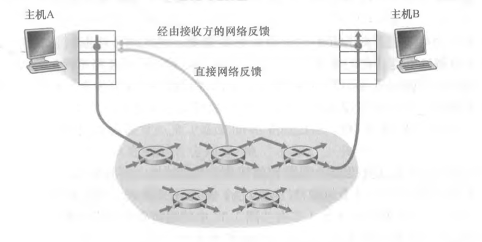

## 运输层服务

运输层为运行在不同主机上的应用进程提供直接的通信服务起着至关重要的作用：

+ 运输层协议为运行在不同主机上的应用进程之间提供了逻辑通信（logic communica­ tion）功能。
+ 从应用程序的角度看，通过逻辑通信，运行不同进程的主机好像直接相连一样；实际上，这些主机也许位于地球的两侧，通过很多路由器及多种不同类型的链路相连。
+ 应用进程使用运输层提供的逻辑通信功能彼此发送报文，而无须考虑承载这些报文的物理基础设施的细节。


### 运输层和网络层的关系

网络层提供了**主机之间的逻辑通信**，而运输层为**运行在不同主机上的进程之间提供了逻辑通信**。

+ 运输层协议是在端系统中而不是在路由器中实现的：

  + 在发送端，运输层将从发送应用程序进程接收到的报文转换成运输层分组，该分组被称为运输层报文段；
    + 实现的方法可能是将应用报文划分为较小的块，并为每块加上一个运输层首部以生成运输层报文段。
    + 然后，在发送端系统中，运输层将这些报文段传递给网络层，网路层将其封装成网络层分组（即数据报）并向目的地发送。
    + 网络路由器仅作用于该数据报的网络层字段，它们不检查封装在该数据 报的运输层报文段的字段。
  + 在接收端，网络层从数据报中提取运输层报文段，并将该报文段向上交给运输层。
    + 运输层则处理接收到的报文段，使该报文段中的数据为接收应用进程使用。

+ 运输层协议只工作在端系统中。

  + 在端系统中， 运输层协议将来自应用进程的报文移动到网络边缘（即网络层），反过来也是一样，但对

    有关这些报文在网络核心如何移动并不作任何规定。

    中间路由器既不处理也不识别运输层加在应用层报文的任何信息。

+ 运输协议能够提供的服务常常受制于底层网络层协议的服务模型。

  + 如果网络层协议无法为主机之间发送的运输层报文段提供时延或带宽保证的话，运输层协议也就无法为进程之间发送的应用程序报文提供时延或带宽保证。

+ 即使底层网络协议不能在网络层提供相应的服务，运输层协议也能提供某些服务。

  + 即使底层网络协议是不可靠的，也就是说网络层协议会使分组丢失、篡改和冗余，运输协议也能为应用程序提供可靠的数据传输服务。
  + 即使网络层不能保证运输层报文段的机密性，运输协议也能使用加密来确保应用程序报文不被入侵者读取。


### 对应用程序提供的服务

运输层最低限度必须提供一种复用/分解服务，以便在网络层与正确的应用级进程之间传递数据。

一个运输层协议能够为调用它的应用程序提供以下服务：

+ 可靠数据传输
+ 吞吐量
+ 定时
+ 安全性


## 运输层协议

因特网为应用程序提供两个运输层协议，UDP 和 TCP。

为因特网创建一个新的应用时，首先要抉择使用 UDP 还是 TCP，每个协议为它们调用的应用程序提供了不同的服务集合。

### TCP 服务

Transmission Control Protocol - 传输控制协议

+ **面向连接的服务**：
  + 在应用层数据报文开始流动之前，TCP 让客户和服务器互相交换运输层控制信息。这个所有的**握手过程**提醒客户和服务器，让它们为大量分组的到来做好准备。
  + 在握手阶段，一个 **TCP 连接**就在两个进程的套接字之间建立了。
  + 这条连接时**全双工**的，即连接双方的进程可以在此连接上同时进行报文收发。
  + 当应用程序结束报文发送时，必须拆除该连接。
+ **可靠的数据传送服务**：
  + 无差错、按适当顺序交付所有发送的数据，没有字节的丢失和冗余。
+ **拥塞控制机制**：
  + 当发送方和接受方之间的网络出现拥塞时，该机制会抑制发送进程（客户或服务器）。
  + 不一定能为通信进程带来直接好处，但能为因特网带来整体好处。

### UDP 服务

User Data Protocol - 用户数据报协议

+ UDP 是一种不提供不必要服务的**轻量级运输协议**。仅提供最小服务。
+ 无连接、不可靠数据传输服务、不包括拥塞控制机制。

### SSL 服务

Secure Sockets Layer - 安全套接字层

+ 无论是 TCP 还是 UDP 都没有提供任何加密机制，所以因特网界已经研制了 **TCP 的加强版本**，称为 SSL。
+ 用 SSL 加强后的 TCP 不仅能够做传统的 TCP 所能做的一切，而且提供了关键的进程到进程的安全性服务，包括**加密**、**数据完整性**和**端点鉴别**。
+ SSL 不是第三种因特网运输协议，而是一种对 TCP 的加强，这种强化是在应用层上实现的。


## 多路复用和多路分解

**在本环节中，将 TCP 和 UDP 的分组统称为*报文段*，将网络层分组称为*数据段*。**

UDP 和 TCP 最基本的责任是，将两个端系统间 IP 的交付服务扩展为运行在端系统上的两个进程之间的交付服务。


**将主机间交付扩展到为运行在主机上的应用程序提供进程到进程的交付服务，被称为运输层的多路复用（trasnport-layer multiplexing）和多路分解（demultiplexing）**。

+ 在目的主机，运输层从紧邻其下的网络层接收报文段。运输层负责将这些报文段中的数据交付给在主机上运行的适当应用程序进程。
+ 在接收主机中的运输层实际上并没有直接将数据交付给进程，而是将数据交给了一个中间的套接字。
+ 由于在任一时刻，在接收主机上可能有不止一个套接字，所以每个套接字都有唯一的标识符。标识符的格式取决于它是 UDP 还是 TCP 套接字。
+ **多路分解：**将运输层报文段中的数据交付到正确的套接字的工 作称为多路分解。
+ **多路复用：**在源主机从不同套接字中收集数据块，并为每个数据块封装上首部信息（这将在以后用于分解）从而生成报文段，然后将报文段传递到网络层，所有这些工作称为多路复用。


**主机中实际工作流程：**

+ 运输层多路复用要求：
  + 套接字有唯一标识符
  + 每个报文段有特殊字段来指示该报文段所要交付到的套接字。
  + 这些特殊字段是**源端口号字段**（source port number field）和**目的端口号字段**（destination port number field）。
+ 在主机上的每个套接字能够分配一个端口号，当报文段到达主机时，运输层检査报文段中的目的端口号，并将其定向到相应的套接字。然后报文段中的数据通过套接字进入其所连接的进程。


### 无连接

通常，应用程序的客户端让运输层自动地（并且是透明地）分配端口号，而服务器端则分配一个特定的端口号。

通过为 UDP 套接字分配端口号，精确地描述一下 UDP 的复用与分解：

+ 假定在主机 A 中的一个进程具有 UDP 端口 19157，它要发送一个应用程序数据块给位于主机 B 中的另一进程，该进程具有 UDP 端口 464280；
+ 主机 A 中的运输层创建一个运输层报文段，其中包括应用程序数据、源端口号（19157）、目的端口号（46428）和两个其他值；
+ 然后，运输层将得到的报文段传递到网络层；
+ 网络层将该报文段封装到一个 IP 数据报中，并尽力而为地将报文段交付给接收主机；
+ 如果该报文段到达接收主机 B，接收主机运输层就检查该报文段中的目的端口号（46428）并将该报文段交付给端口号 46428 所标识的套接字。


### 面向连接

重新考虑之前的 Python TCP 客户-服务端编程的例子：

+ TCP 服务器应用程序有一个 “欢迎套接字”，它在 12000 号端口上等待来自 TCP 客户的连接建立请求；

+ TCP客户使用下面的代码创建一个套接字并发送一个连接建立请求报文段：

  ```python
  serverName = 'hostname'
  serverPort = 12000
  clientSocket = socket(AF_INET, SOCK_STREAM)
  clientSocket.connect((serverName, serverPort))
  ```

+ 一条连接建立请求只不过是一个目的端口号为 12000，TCP 首部的特定 “连接建立位” 置位的 TCP 报文段。这个报文段也包含一个由客户选择的源端口号；

+ 当运行服务器进程的计算机的主机操作系统接收到具有目的端口 12000 的入连接请求报文段后，它就定位服务器进程，该进程正在端口号 12000 等待接受连接。 该服务器进程则创建一个新的套接字：

  ```python
  connectionSocket, addr = serverSocket.accept()
  ```

+ 该服务器的运输层还注意到连接请求报文段中的下列 4 个值：1该报文段中的源端口号；2 源主机IP地址；3 该报文段中的目的端口号；4 自身的 IP 地址。新创建的连接套接字通过这 4 个值来标识。所有后续到达的报文段，如果它们的源端口号、源主机IP地址、目的端口号和目的 IP 地址都与这 4 个值匹配，则被分解到这个套接字。随着 TCP 连接完成，客户和服务器便可相互发送数据了。

+ 服务器主机可以支持很多并行的 TCP 套接字，每个套接字与一个进程相联系，并由其四元组来标识每个套接字。


**特别的：**

+ 连接套接字与进程之间并非总是有着一一对应的关系。事实上，当今的高性能 Web 服务器通常只使用一个进程，但是为每个新的客户连接创建一个具有新连接套接字的新线程。（线程可被看作是一个轻量级的子进程）
+ 如果客户与服务器使用持续 HTTP，则在整条连接持续期间，客户与服务器之间经由同一个服务器套接字交换 HTTP 报文。
+ 如果客户与服务器使用非持续 HTTP，则对每一对请求/响应都创建一个新的 TCP 连接并在随后关闭，因此对每一对请求/响应创建一个新的套接字并在随后关闭。这种套接字的频繁创建和关闭会严重地影响一个繁忙的 Web 服务器的性能。


### 套接字区别

**对于 UDP：**

+ 一个 UDP 套接字是由一个二元组全面标识的，该二元组包含一个目的 IP 地址和一个目的端口号。
+ 当 UDP 报文段从网络到达时，主机 B 通过检查该报文段中的目的端口号，将每个报文段定向（分解）到相应的套接字。
+ 因此，如果两个 UDP 报文段有不同的源 IP 地址或源端口号，但具有相同的目的 IP 地址和目的端口号，那么这两个报文段将通过相同的目的套接字被定向到相同的目的进程。

**对于 TCP：**

+ TCP 套接字是由一个四元组（源 IP 地址，源端口号，目的 IP 地址，目的端口号）来标识的。
+ 当一个 TCP 报文段从网络到达一台主机时，该主机使用全部 4 个值来将报文段定向（分解）到相应的套接字。
+ 因此，两个具有不同源 IP 地址或源端口号的到达 TCP 报文段将被定向到两个不同的套接字，除非 TCP 报文段携带了初始创建连接的请求。


## 无连接的运输：UDP

运输层最低限度必须提供一种复用/分解服务，以便在网络层与正确的应用级进程之间传递数据。

UDP 只是做了运输协议能够做的最少工作。除了复用/分解功能及少量的差错检测外，它几乎没有对 IP 增加别的东西：

+ UDP 从应用进程得到数据，附加上用于多路复用/分解服务的源和目的端口号字段，以及两个其他的小字段, 然后将形成的报文段交给网络层；
+ 网络层将该运输层报文段封装到一个 IP 数据报中，然后尽力而为地尝试将此报文段交付给接收主机；
+ 如果该报文段到达接收主机，UDP 使用目的端口号将报文段中的数据交付给正确的应用进程；
+ 值得注意的是，使用 UDP 时，在发送报文段之前，发送方和接收方的运输层实体之间没有握手，正因为如此，UDP 被称为是无连接的。


### DNS - UDP 例子

+ 当一台主机中的 DNS 应用程序想要进行一次查询时，它构造了一个 DNS 查询报文并将其交给 UDP；
+ 无须执行任何与运行在目的端系统中的 UDP 实体之间的握手，主机端的 UDP 为此报文添加首部字段，然后将形成的报文段交给网络层；
+ 网络层将此 UDP 报文段封装进一个 IP 数据报中，然后将其发送给一个名字服务器；
+ 在查询主机中的 DNS 应用程序则等待对该查询的响应。如果它没有收到响应（可能是由于底层网络丢失了查询或响应），则要么试图向另一个名字服务器发送该査询，要么通知调用的应用程序它不能获得响应。


### UDP 优势

有许多应用相比于 TCP（提供了可靠数据传输服务）更适合用 UDP：

+ 关于发送什么数据以及何时发送的应用层控制更为精细；
  + 采用 UDP 时，只要应用进程将数据传递给 UDP，UDP 就会将此数据打包进 UDP 报文段并立即将其传递给网络层。
  + 在另一方面，TCP 有一个拥塞控制机制，以便当源和目的主机间的一条或多条链路变得极度拥塞时来遏制运输层 TCP 发送方。TCP 仍将继续重新发送数据报文段直到目的主机收到此报文并加以确认，而不管可靠交付需要用多长时间。
  + 实时应用通常要求最小的发送速率，不希望过分地延迟报文段的传送，且能容忍一些数据丢失，TCP 服务模型并不是特别适合这些应用的需要。这些应用可以使用 UDP，并作为应用的一部分来实现所需的、超出 UDP 的不提供不必要的报文段交付服务之外的额外功能。
+ 无须连接建立；
  + TCP 在开始数据传输之前要经过三次握手，UDP 却不需要任何准备即可进行数据传输，因此 UDP 不会引入建立连接的时延。这可能是 DNS 运行在 UDP 之上而不是运行在 TCP 之上的主要原因，如果运行在  TCP 上，则 DNS 会慢得多。
  + HTTP 使用 TCP 而不是 UDP，因为对于具有文本数据的 Web 网页来说，可靠性是至关重要的。用于谷歌的 Chrome 浏览器中的 QUIC 协议将 UDP 作为其支撑运输协议并在 UDP 之上的应用层协议中实现可靠性。
+ 无连接状态；
  + TCP 需要在端系统中维护连接状态。此连接状态包括接收和发送缓存、拥塞控制参数以及序号与确认号的参数。
  + UDP不维护连接状态，也不跟踪这些参数。因此，某些专门用于某种特定应用的服务器当应用程序运行在 UDP 之上而不是运行在 TCP 上时，一般都能支持更多的活跃客户。
+ 分组首部开销小；
  + 每个 TCP 报文段都有 20 字节的首部开销，而 UDP 仅有 8 字节的开销。


### 运输协议列举

| 应用           | 应用层协议 | 下面的运输协议 |
| -------------- | ---------- | -------------- |
| 电子邮件       | SMTP       | TCP            |
| 远程终端访问   | Telnet     | TCP            |
| Web            | HTTP       | TCP            |
| 文件传输       | FTP        | TCP            |
| 远程文件服务器 | NFS        | 通常 UDP       |
| 流式多媒体     | 通常专用   | UDP 或 TCP     |
| 因特网电话     | 通常专用   | UDP 或 TCP     |
| 网络管理       | SNMP       | 通常 UDP       |
| 名字转换       | DNS        | 通常 UDP       |

+ 如因特网电话、实时视频会议、 流式存储音频与视频，这些应用都能容忍少量的分组丢失，因此可靠数据传输对于这些应用的成功并不是至关重要的。此外，TCP 的拥塞控制会导致如因特网电话、视频会议之类的实时应用性能变得很差。由于这些原因，多媒体应用开发人员通常将这些应用运行在 UDP 之上而不是 TCP 之上。
+ 当分组丢包率低时，并且为了安全原因，某些机构阻塞 UDP 流量，对于流式媒体传输来说，TCP变得越来越有吸引力了。
+ UDP 没有拥塞控制，但是，是需要拥塞控制来预防网络进入一种拥塞状态。UDP 中缺乏拥塞控制能够导致 UDP 发送方和接收方之间的高丢包率，并挤垮 TCP 会话，这是一个潜在的严重问
+ 使用 UDP 的应用是可能实现可靠数据 传输的。这可通过在应用程序自身中建立可靠性机制来完成，前面讲过在谷歌的 Chrome  浏览器中所使用的 QUIC 协议在 UDP 之上的应用层协议中实现了可靠性。


### UDP 报文段结构


+ UDP 首部只有4 个字段，每个字段由两个字节组成：
  + 通过**端口号**可以使目的主机将应用数据交给运行在目的端系统中的相应进程（即执行分解功能）；
  + **长度**字段指示了在 UDP 报文段中的字节数（首部加数据），因为数据字段的长度在一个 UDP 段中不同于在另一个段中，故需要一个明确的长度；
  + 接收方使用**检验和**来检查在该报文段中是否出现了差错。检验和用于确定当 UDP 报文段从源到达目的地移动时，由于链路中的噪声干扰或者存储在路由器中时引入问题，其中的比特是否发生了改变。
+ 应用层数据占用 UDP 报文段的数据字段：
  + 对于 DNS 应用，数据字段要么包含一个查询报文，要么包含一个响应报文；
  + 对于流式音频应用，音频抽样数据填充到数据字段。


## 可靠数据传输原理

可靠数据传输协议（reliable data transfer protocol）的下层协议也许是不可靠的：

+ 例如，TCP是在不可靠的（IP）端到端网络层之上实现的可靠数据传输协议。
+ 更一般的情况是，两个可靠通信端点的下层可能是由一条物理链路（如在链路级数据传输协议的场合下）组成或是由一个全球互联网络（如在运输级协议的场合下）组成。


### 比特交替协议

alternating-bit protocol


**数据最基础的传输：**


+ rdt 的发送端只通过 `rdt_send(data)` 事件接受来自较高层的数据，产生一个包含该数据的分组（经由 `make-pkt (data)` 动作），并将分组发送到信道中。实际上，`rdt_send(data)` 事件是由较高层应用的过程调用产生的（例如，`rdt_send()` ) 。
+ 在接收端，rdt 通过 `rdt_send(packet)` 事件从底层信道接收一个分组，从分组中取岀数据（经由`extract(packet, data)` 动作），并将数据上传给较高层（通过 `deliver_data(dat3)` 动作)。 实际上，`rdt_rcv(packet)` 事件是由较低层协议的过程调用产生的（例如，`rdt_rcv()` ） 。


**解决比特可能受损：**

在分组的传输、传播或缓 存的过程中，这种比特差错通常会岀现在网络的物理部件中。使用基于重传机制的可靠数据传输协议——自动重传请求（Automatic Repeat reQuest，ARQ）协议。

+ 差错检测：
  + 要求有额外的比特（除了待发送的初始 数据比特之外的比特）从发送方发送到接收方，例如 UDP 使用因特网检验和字段；
  + 这些比特将被汇集在分组检验和字段中。
+ 接收方反馈：
  + 因为发送方和接收方通常在不同端系统上执行，可能相隔数千英里, 发送方要了解接收方情况（此时为分组是否被正确接收）的唯一途径就是让接收方提供明确的反馈信息给发送方。例如 ACK（肯定）和 NAK（否定）；
  + 理论上，这些分组只需要一个比特长，如用 0 表示 NAK，用 1 表示 ACK。
  + 当发送方处于等待 ACK 或 NAK 的状态时，它不能从上层获得更多的数据，发送方将不会发送一块新数据，除非发送方确信接收方已正确接收当前分组（停等协议的原因）。
+ 重传：接收方收到有差错的分组时，发送方将重传该分组文。


**解决 ACK 或 NAK 分组受损：**

如果一个 ACK 或 NAK 分组受损，发送方无法知道接收方是否正确接收了上一块发送的数据。

+ 在数据分组中添加一新字段，让发送方对其数据分组编号，即将发送数据分组的序号（sequence mimber）放在该字段。
+ 接收方只需要检查序号即可确定收到的分组是否一次重传。
+ 对于停等协议这种简单情况，1 比特序号就足够了，因为它可让接收方知道发送方是否正在重传前一个发送分组（接收到的分组序号与最近收到的分组序号相同），或是一个新分组（序号变化了，用模 2 运算 “前向 ”移动）。
+ 当接收到失序的分组时，接收方对所接收的分组发送一个肯定确认。如果收到受损的分组，则接收方将发送一 个否定确认。
+ 如果不发送 NAK，而是对上次正确接收的分组发送一个ACK，也能实现与 NAK —样的效果。发送方接收到对同一个分组的两个 ACK（即接收冗余 ACK ）后，就知道接收方没有正确接收到跟在被确认两次的分组后面的分组。


**解决底层信道丢包：**

协议现在必须处理另外两个关注的问题：怎样检测丢包以及发生丢包后该做些什么。

使用检验和、序号、ACK分组和重传等可以解决 “发生丢包后该做些什么”，让发送方负责检测和恢复丢包工作。

+ 发送方愿意等待足够长的时间以便确定分组已丢失，则它只需重传该数据分组即可。
+ 如果一个分组经历了一个特别大的时延，发送方可能会重传该分组，即使该数据分组及其 ACK 都没有丢失。这就在发送方到接收方的信道中引入了冗余数据分组（duplicate data packet）的可能性。但该协议已经有足够的功能（即序号）来处理冗余分组情况。
+ 发送方需要能做到：
  + 每次发送一个分组（包括第一次分组和重传分组）时，便启动一个定时器；
  + 响应定时器中断（采取适当的动作）；
  + 终止定时器。


### 流水线技术

pipelining

停等协议是典型的网络协议限制底层网络硬件所提供的能力，解决方法之一就是不以停等方式运行，允许发送方发送多个分组而无须等待确认。


**流水线技术对可靠数据传输协议可带来如下影响：**


+ 必须增加序号范围，因为每个输送中的分组（不计算重传的）必须有一个唯一的 序号，而且也许有多个在输送中的未确认报文。
+ 协议的发送方和接收方两端也许不得不缓存多个分组。发送方最低限度应当能缓 冲那些已发送但没有确认的分组。如下面讨论的那样，接收方或许也需要缓存那些已正确接收的分组。
+ 所需序号范围和对缓冲的要求取决于数据传输协议如何处理丢失、损坏及延时过大的分组。解决流水线的差错恢复有两种基本方法是：回退 N 步（Go-Back-N，GBN）和选择重传（Selective Repeat，SR）。


#### 回退 N 步

**依赖序列号范围**：


+ 将基序号 base 定义为最早未确认分组的序号；
+ 将下一个序号 nextseqnum 定义为最小的未使用序号，即下一个待发分组的序号；
+ 则可将序号范围分割成4 段：
  + 在 [0, base - 1] 段内的序号对应于已经发送并被确认的分组；
  + [base, nextseqnum - 1] 段内对应已经发送但未被确认的分组；
  + [nextseqnum, base +N - 1] 段内的序号能用于那些要被立即发送的分组（如果有数 据来自上层的话）；
  + 大于或等于 base + N 的序号是不能使用的，直到当前流水线中未被确认的分组已得到确认为止，特别是序号为 base 的分组。
+ 那些已被发送但没未被确认的分组的许可序号范围可以被看成是一个在序号范围内长度为 N 的窗口。因此，N 常被称为窗口长度（window size），GBN 协议也常被称为滑动窗口协议（sliding-window protocol）；
+ 之所以先要限制这些被发送的、未被确认的分组的数目为N，不允许这些分组为无限制的数目，原因之一是为了通过流量控制对发送方施加限制，为了拥塞控制。


**发送方与接受方职责：**


*图：运行中的 GBN*

**GBN 发送方必须响应三种类型的事件：**

+ 上层的调用：
  + 当上层调用 `rdt.send()` 时，发送方首先检查发送窗口是否已满，即是否有N个已发送但未被确认的分组；
  + 如果窗口未满，则产生一个分组并将其发送，并相应地更新变量；
  + 如果窗口已满，发送方只需将数据返回给上层，隐式地指示上层该窗口已满；
  + 然后上层可能会过一会儿再试；
  + 在实际实现中，发送方更可能缓存（并不立刻发送）这些数据，或者使用同步机制（如一个信号量或标志）允许上层在仅当窗口不满时才调用 `rdt.send()` 。
+ 收到一个 ACK：
  + 在 GBN 协议中，对序号为几的分组的确认采取累积确认（cumu­lative acknowledgment）的方式，表明接收方已正确接收到序号为 n 的以前且包括 n 在内的所有分组。
+ 超时事件：
  + 定时器将用于恢复数据或确认分组的丢失。如果出现超时，发送方重传所有已发送但还未被确认过的分组。
  + 发送方仅使用一个定时器，它可被当作是最早的已发送但未被确认的分组所使用的定时器。如果收到一个 ACK，但仍有已发送但未被确认的分组，则定时器被重新启动。如果没有已发送但未被确认的分组，停止该定时器。


**GBN 接收方动作：**

+ 如果一个序号为 n 的分组被正确接收到，并且按序（即上次交付给上层的数据是序号为 n-1 的分组），则接收方为分组 n 发送一个 ACK，并将该分组中的数据部分交付到上层。

+ 在所有其他情况下，接收方丢弃该分组，并为最近按序接收的分组重新发送 ACK。

+ 在 GBN 协议中，接收方丢弃所有失序分组：

  + 优点：接收缓存简单，即接收方不需要缓存任何失序分组。接收方需要维护的唯一信息就是下一个按

    序接收的分组的序号。

    缺点：随后对该分组的重传也许会丢失或出错，因此甚至需要更多的重传。


#### 选择重传

单个分组的差错就能够引起 GBN 重传大量分组，许多分组根本没有必要重传。随着信道差错率的增加, 流水线可能会被这些不必要重传的分组所充斥，尤其是当窗口长度和带宽时延积都很大时。

SR 协议通过让发送方仅重传那些它怀疑在接收方出错（即丢失或受损）的分组而避免了不必要的重传。


+ 与 GBN 不同的是，SR 发送方已经收到了对窗口中某些分组的 ACK。
+ SR 接收方将确认一个正确接收的分组而不管其是否按序。失序的分组将被缓存直到所有丢失分组（即序号更小的分组）皆被收到为止，这时才可以将一批分组按序交付给上层。
+ 窗口长度必须小于或等于序号空间大小的一半，否则无法区分之后的某个分组是重传还是初次传输。


**发送方与接受方职责：**


*图：运行中的 SR*

**SR 发送方的事件与动作**

+ 从上层收到数据：

  + 当从上层接收到数据后，SR 发送方检查下一个可用于该分组的序号。
  + 如果序号位于发送方的窗口内，则将数据打包并发送；否则就像在 GBN 中一样，要么将数据缓存，要么将其返回给上层以便以后传输。
+ 收到ACK：
  + 如果收到 ACK，倘若该分组序号在窗口内，则 SR 发送方将那个被确认的分组标记为已接收。
+ 超时：
  + 定时器再次被用来防止丢失分组。
  + 然而，现在每个分组必须拥有其自己的逻辑定时器，因为超时发生后只能发送一个分组。可以使用单个硬件定时器模拟多个逻辑定时器的操作。


**SR 接收方的事件与动作**

+ 序号在 `[rcv_base, rcv_base+N-1]` 内的分组被正确接收。在此情况下，收到的分组落在接收方的窗口 内，一个选择 ACK 被回送给发送方。如果该分组以前没收到过，则缓存该分组。如果该分组的序号等于接收窗口的基序号，则该分组以及以前缓存的序号连续的（起始于 rcv_base 的）分组交付给上层。然后，接收窗口按向前移动分组的编号向上交付这些分组。
+ 序号在 `[rcv_base-N, rcv_base-1]` 内的分组被正确收到。在此情况下，必须产生一个 ACK，即使该分组是接收方以前已确认过的分组。
+ 其他情况。忽略该分组


#### 区别

+ GBN 发送方仅用一个在超时任务中仅用一个定时器，SR 发送方每个分组有自己的定时器。
+ GBN 接收方按序接收分组，不进行缓存；SR 接收方确认正确接收的分组而不管其是否按序，进行缓存。


### 可靠数据传输机制

+ 检验和：用于检测在一个传输分组中的比特错误；
+ 定时器：用于超时/重传一个分组，可能因为该分组（或其 AGK）在信道中丢失了。由于当一个分组延时但未丢失（过早超时），或当一个分组已被接收方收到但从接收方到发送方的 ACK 丢失时，可能产生超时事件，所以接收方可能会收到一个分组的多个冗余副本；
+ 序号：用于为从发送方流向接收方的数据分组按顺序编号。所接收分组的序号间的空隙可使接收方检测出丢失的分组。具有相同序号的分组可使接收方检测岀一个分组的冗余副本；
+ 确认：接收方用于告诉发送方一个分组或一组分组已被正确地接收到了。确认报文通常携带着被确认 的分组或多个分组的序号。确认可以是逐个的或累积的，这取决于协议；
+ 否定确认：接收方用于告诉发送方某个分组未被正确地接收。否定确认报文通常携带着未被正确接收的分 组的序号；
+ 窗口、流水线：发送方也许被限制仅发送那些序号落在一个指定范围内的分组。通过允许一次发送多个分组但 未被确认，发送方的利用率可在停等操作模式的基础上得到增加。窗口长度可根据接收方接收和缓存报文的能力、网络中的拥塞程度或两者情况来进行设置。


**分组重新排序问题及其解决方案：**

+ 之前的考虑都假定分组在发送方与接收方之间的信道中不能被重新排序。这在发送方与接收方由单段物理线路相连的情况下，通常是一个合理的假设。然而，当连接两端的 “信道” 是一个网络时，分组重新排序是可能会发生的。
+ 分组重新排序的一个表现就是，一个具有序号或确认号 x 的分组的旧副本可能会出现，即使发送方或接收方的窗口中都没有包含 x。
+ 对于分组重新排序，信道可被看成基本上是在缓存分组，并在将来任意时刻自然地释放岀这些分组。由于序号可以被重新使用，那么必须小心，以免出现这样的冗余分组。
+ 实际应用中采用的方法是，确保一个序号不被重新使用，直到发送方 “确信” 任何先前发送的序号为 x 的分组都不再在网络中为止。
+ 通过假定一个分组在网络中的 “存活” 时间不会超过某个固定最大时间量来做到这一点。在高速网络的 TCP 扩展中，最长的分组寿命被假定为大约 3 分钟。


## 面向连接的运输：TCP

### TCP 连接的特点

+ **面向连接**（connection-oriented）：
  + 在一个应用进程可以开始向另一个应用进程发送数据之前，这两个进程必须先相互 “握手”，即它们必须相互发送某些预备报文段，以建立确保数据传输的参数。
  + 作为 TCP 连接建立的一部分，连接的双方都将初始化与 TCP 连接相关的许多 TCP 状态变量。
  + 该  “连接” 是一条逻辑连接，其共同状态仅保留在两个通信端系统的 TCP 程序中。由于 TCP 协议只在端系统中运行，而不在中间的网络元素（路由器和链路层交换机）中运行，所以中间的网络元素不会维持 TCP 连接状态。事实上，中间路由器对 TCP 连接完全视而不见，它们看到的是数据报，而不是连接。
+ **全双工连接**（full-duplex service）：
  + 如果一台主机上的进程 A 与另一台主机上的进程 B 存在一条 TCP 连接，那么应用层数据就可在从进程 B 流向进程 A 的同时，也从进程 A 流向进程 B。
+ **点对点**（point-to-point）：
  + 在单个发送方与单个接收方之间的连接。
  + 无法实现多播，在一次发送操作中，从一个发送方将数据传送给多个接收方，这种情况对 TCP 来说是不可能的。
+ **三次握手**（three-way handshake）：
  + 客户首先发送一个特殊的 TCP 报文段，服务器用另一个特殊的 TCP 报文段来响应，最后，客户再用第三个特殊报文段作为响应。
  + 前两个报文段不承载 “有效载荷”，也就是不包含应用层数据；而第三个报文段可以承载有效载荷。

+ **发送缓存**（sendbuffer）：
  + 一旦建立起一条 TCP 连接，两个应用进程之间就可以相互发送数据了。客户进程通过套接字（该进程之门）传递数据流。数据一旦通过该门，它就由客户中运行的 TCP 控制了。
  + TCP 将这些数据引导到该连接的发送缓存里，发送缓存是发起三次握手期间设置的缓存之一。接下来 TCP 就会不时从发送缓存里取出一块数据，并将数据传递到网络层。
+ **最大报文段长度**（Maximum Segment Size，MSS）：
  + 在报文段里应用层数据的最大长度，而不是指包括首部的 TCP 报文段的最大长度。
  + TCP 可从缓存中取出并放入报文段中的数据数量受限于 MSS。
  + MSS 通常根据最初确定的由本地发送主机发送的 MTU 确定。MSS 要保证一个 TCP 报文段（当封装在一个 IP 数据报中）加上 TCP/IP 首部长度（通常 40 字节）将适合单个链路层帧。以太网和 PPP 链路层协议都具有 1500 字节的 MTU，因此 MSS 的典型值为 1460 字节。
+ **最大链路层帧长度**（Maximum Transmission Unit，MTU）：
  + 能在从源到目的地的所有链路上发送的最大链路层帧。也就是最大传输单元。


### TCP 报文

TCP 为每块客户数据配上一个 TCP 首部，从而形成多个 TCP 报文段（TCP segment）。

+ 这些报文段被下传给网络层，网络层将其分别封装在网络层 IP 数据报中。
+ 然后这些 IP 数 报被发送到网络中。
+ 当 TCP 在另一端接收到一个报文段后，该报文段的数据就被放入该  TCP 连接的接收缓存中，应用程序从此缓存中读取数据流。
+ 该连接的每一端都有各自的发送缓存和接收缓存。
+ TCP 报文段由首部字段和一个数据字段组成。数据字段包含一块应用数据。
+ MSS 限制了报文段数据字段的最大长度。当 TCP 发送一个大文件，例如某 Web 页面上的一个图像时，TCP 通常是将该文件划分成长度为 MSS 的若干块（最后一块除外，它通常小于 MSS）；交互式应用通常传送长度小于 MSS 的数据块。


**TCP 报文段的结构：**


+ **源端口号**和**目的端口号**：

  + 被用于多路复用/分解来自或送到上层应用的数据。
+ **检验和字段**（checksum field）：
+ 32 比特的**序号字段**（sequence number field）和 32 比特的**确认号字段**（acknowledgment number field）：

  +  这些字段被 TCP 发送方和接收方用来实现可靠数据传输服务。
  +  TCP 把数据看成一个无结构的、有序的字节流，因为序号是建立在传送的字节流之上，而不是建立在传送的报文段的序列之上。
  +  主机 A 填充进报文段的确认号是主机 A 期望从主机 B 收到的下一字节的序号。
  +  一个报文段的序号就是该报文段数据字段首字节的序号；确认号就是主机正在等待的数据的下一个字节序号。
  +  当主机在一条 TCP 连接中收到失序报文段时该怎么办？
     +  TCP RFC 并没有为此明确规定任何规则，而是把这一问题留给实现 TCP 的编程人员去处理。有两种方案：
     +  接收方立即丢弃失序报文段(如前所述，这可以简化接收方的设计；接收方保留失序的字节，并等待缺少的字节以填补该间隔。
     +  显然，后一种选择对网络带宽而言更为有效，是实践中采用的方法。
+ 16 比特的**接收窗口字段**（receivewindowfield）：

  + 该字段用于流量控制，该字段用于指示接收方愿意接受的字节数量。
+ 4 比特的**首部长度字段**（headerlengthfield）：

  + 该字段指示了以 32 比特的字为单位的 TCP 首部长度。
  + 由于 TCP 选项字段的原因，TCP 首部的长度是可变的。
  + 通常，选项字段为空，所以 TCP 首部的典型长度是20字节。
+ 可选与变长的**选项字段**（options field）：

  + 该字段用于发送方与接收方协商 MSS 时，或在高速网络环境下用作窗口调节因子时使用。
+ 6 比特的**标志字段**（flag field）：

  + ACK 比特用于指示确认字段中的值是有效的，即该报文段包括一个对已被成功接收报文段的确认。
  + RST、SYN 和 FIN 比特用于连接建立和拆除。
  + 在明确拥塞通告中使用了 CWR 和 ECE 比特。
  + 当 PSH 比特被置位时，就指示接收方应立即将数据交给上层。
  + URG 比特用来指示报文段里存在着被发送端的上层实体置为 “紧急” 的数据。
+ 紧急数据的最后一个字节由 16 比特的**紧急数据指针字段** （urgent data pointer field）指出：
  + 当紧急数据存在并给出指向紧急数据尾指针的时候，TCP 必须通知接收端的上层实体。
  + 在实践中，PSH、URG 和 紧急数据指针并没有使用。


### 可靠数据传输

+ TCP 通过使用肯定确认与定时器来提供可靠数据传输；
+ TCP 使用序号以使接收方能识别丢失或重复的报文段；
+ TCP 也使用流水线，使得发送方在任意时刻都可以有多个已发出但还未被确认的报文段存在；
  + 一个发送方能够具有的未被确认报文段的具体数量是由 TCP 的流量控制和拥寒控制机制决定的。


#### 超时间隔

采用超时/重传机制来处理报文段的丢失问题，其中最明显的一个问题就是超时间隔长度的设置，超时间隔必须大于该连接的往返时间（RTT），即从一个报文段发出到它被确认的时间，否则会造成不必要的重传；同时也不能太大，否则当报文段丢失时，TCP 不能很快地重传该报文段，导致数据传输时延大。

TCP 是如何估计发送方与接收方之间往返时间的：

+ SampleRTT：报文段的样本 RTT，从某报文段被发出（即交给 IP）到对该报文段的确认被收到之间的时间量。

+ EstimatedRTT：TCP 维持的一个 SampleRTT 均值，α 推荐值为 0.125

  ```
  EstimatedRTT = (1 - α)·EstimatedRTT + α·SampleRTT
  ```

+ DevRTT：RTT 偏差，用于估算 SampleRTT 一般会偏离 EstimatedRTT 的程度，β 的推荐值为 0.25

  ```
  DevRTT = (1 -β)·DevRTT + β·|SampleRTT - EstimatedRTT|
  ```

+ Timeoutinterval：TCP 超时间隔，推荐的初始 Timeoutinterval 值为 1 秒 ，同时，当出现超时后，Timeoutlnterval 值将加倍，以免即将被确认的后继报文段过早出现超时。然而，只要收到报文段并更新 EstimatedRTT，就使用下述公式再次计算 Timeoutinterval

  ```
  Timeoutinterval = EstinMrtedRTT + 4·DevRTT
  ```


#### 定时器管理

+ 单一定时器；
  + TCP 协议遵循单一定时器管理，仅使用单一的重传定时器，即使有多个已发送但还未被确认的报文段。
+ 超时间隔加倍；
  + 每当超时事件发生时，都会将下一次的超时间隔设为先前值的两倍，而不是用从 EstimatedRTT 和 DevRTT 推算出的值。
  + 每当定时器在另两个事件（即收到上层应用的数据和收到 ACK ）中的任意一个启动时，Timeoutinterval 由最近的 Estimat­edRTT 值与 DevRTT 值推算得到。
  + 每个发送方的重传都是经过越来越长的时间间隔后进行的，这种修改提供了一个形式受限的拥塞控制。


#### 快速重传

+ 一旦收到 3 个冗余 ACK，TCP 就执行快速重；

  + 在该报文段的定时器过期之前重传丢失的报文段。
  + 如果 TCP 发送方接收到对相同数据的 3 个冗余 ACK，它把这当作一种指示，说明跟在这个已被确认过 3  次的报文段之后的报文段已经丢失。

+ ```
  事件:收到ACK,具有ACK字段值y
  	if (y > SendBase) {
  	SendBase=y
  	If (当前仍无任何应答报文段)
  		启动定时器
  	}
  	else {/*快对已经确认的报文段的一个冗余ACK */ 
  	对y收到的冗余ACK数加1
  	if (对y==3收到的冗余ACK数)
  		/* TCP快速重传 */
  		重新发送具有序号y 的报文段
  }
  break;
  ```


#### 差错恢复机制

+ TCP确认是累积式的，正确接收但失序的报文段是不会被接收方逐个确认的。因此，TCP发送方仅需维持已发送过但未被确认的字节的最小序号（SendBase）和下一个要发送的字节的序号（NextSeqNum）。在这种意义下，TCP看起来更像一个GBN风格的协议。
+ 但是 TCP 和 GBN 协议之间有着一些显著的区别：许多 TCP 实现会将正确接收但失序的报文段缓存起来。但是这些被缓存的报文段不会逐个被确认。 当发生超时时，TCP只会重传发生超时的那一个报文段。
+ 对 TCP 提岀的一种修改意见是所谓的**选择确认**（selective acknowledgment）：允许 TCP 接收方有选择地确认失序报文段，而不是累积地确认最后一个正确接收的有序报文段。
+ 当将该机制与选择重传机制结合起来使用时（即跳过重传那些已被接收方选择性地确认过的报文段），TCP看起来就很像我们通常的 SR 协议。因此，TCP 的差错恢复机制也许最好被分类为 **GBN 协议与 SR 协议的混合体**。


#### 流量控制 

**流量控制和拥塞控制的区别**：

+ **流量控制（flowcontrol service）**：一条 TCP 连接的每一侧主机都为该连接设置了接收缓存。当该 TCP 连接收到正确、按序的字节后，它就将数据放入接收缓存。相关联的应用进程会从该缓存中读取数据，但不必是数据刚一到达就立即读取。如果某应用程序读取数据时相对缓慢，而发送方发送得太多、太快，发送的数据就会很容易地使该连接的接收缓存溢出。流量控制服务就是用来消除发送方使接收方缓存溢岀的可能性。流量控制也是一个速度匹配服务，即发送方的发送速率与接收方应用程序的读取速率相匹配。
+ **拥塞控制（congestioncontrol）**：TCP 发送方也可能因为 IP 网络的拥塞而被遏制，这种形式的发送方的控制被称为拥塞控制。


**流量控制服务**：

+ **接收窗口（receive windo）的变量**：TCP 通过让发送方维护一个称为接收窗口的变量来提供流量控制。

  +  接收窗口用于给发送方一个指示：该接收方还有多少可用的缓存空间。
  + 因为 TCP 是全双工通信，在连接两端的发送方都各自维护一个接收窗口。

+ 使用变量：

  + RcvBuffer
  
    + 假设主机 A 通过一条 TCP 连接向主机 B 发送一个大文件。主机 B 为该连接分配了一个接收缓存，并用RcvBuffer 来表示其大小。
    
  + LastByteRead
  
    + 主机 B 上的应用进程从缓存读出的数据流的最后一个字节的编号。
  
  + LastByteRcvd
  
    + 从网络中到达的并且已放入主机 B 接收缓存中的数据流的最后一个字节的编号。
  
  + rwnd
  
    + 接收窗口用 rwnd 表示，根据缓存可用空间的数量来设置
  
      ```
      rwnd = RcvBuffer - [LastByteRcvd - LastByteRead]
      ```
  
  + 由于 TCP 不允许已分配的缓存溢岀，下式必须成立：
  
    ```
    LastByteRcvd - LastByteRead <= RcvBuffer
    ```
  
+ 如何使用变量 rwnd 来提供流量控制服务

  + 

  + 主机 B 通过把当前的 rwnd 值放入它发给主机 A 的报文段接收窗口字段中，通知主机 A 它在该连接的缓

    存中还有多少可用空间。

  + 主机 A 轮流跟踪两个变量，LastByteSent 和 LastByteAcked，这两个变量之间的差 LastByteSent - LastByteAcked，就是主机 A 发送到连接中但未被确认的数据量。
  
  + 通过将未确认的数据量控制在值 rwnd 以内，就可以保证主机 A 不会使主机 B 的接收缓存溢出。
  
  + 因此，主机 A 在该连接的整个生命周期须保证：LastByteSent - LastByteAcked <= rwnd
  
  + 当主机 B 的接收窗口为 0 时，主机 A 继续发送只有一个字节数据的报文段。这些报文段将会被接收方确认。
  
+ UDP 并不提供流量控制

  + 对于一个典型的 UDP 实现，UDP 将在一个 有限大小的缓存中加上报文段，该缓存在相应套接字（进程的门户）之前。
  + 进程每次从缓存中读取一个完整的报文段。如果进程从缓存中读取报文段的速度不够快，那么缓存将会溢出，并且将丢失报文段。


### TCP 连接管理

#### 三次握手

假设运行在一台主机（客户）上的一个进程想与另一台主机（服务器）上的一个进程建立一条连接。客户应用进程首先通知客户 TCP，它想建立一个与服务器上某个进程之间的连接。客户中的 TCP 会用以下方式与服务器中的 TCP 建立一条 TCP 连接：


+ 第一步：
  + 客户端的 TCP 首先向服务器端的 TCP 发送一个特殊的 TCP 报文段。该报文段中不包含应用层数据。但是在报文段的首部中的一个标志位（即 **SYN 比特**）被置为1。
  + 客户会随机地选择一个初始序号（**client_isn**），并将此编号放置于该起始的 TCP SYN 报文段的序号字段中。
  + 该报文段会被封装在一个IP数据报中，并发送给服务器。 
  + 为了避免某些安全性攻击，可以适当地随机化选择 client_isn。
+ 第二步：
  + 一旦包含 TCP SYN 报文段的 IP 数据报到达服务器主机，服务器会从该数据报中提取出 TCP SYN 报文段，为该 TCP 连接分配 TCP 缓存和变量，并向该客户 TCP 发送允许连接的报文段。这个允许连接的报文段也不包含应用层数据。
  + 但是，在报文段的首部却包含 3 个重要的信息。
    + 首先，SYN 比特被置为 1。
    + 其次，该 TCP 报文段首部的确认号字段被置为 **client_isn + 1**。
    + 最后，服务器选择自己的初始序号（**server_isn**），并将其放置到 TCP 报文段首部的序号字段中。
  + 这个允许连接的报文段实际上表明了：”我收到了你发起建立连接的 SYN 分组，该分组带有初始序号 client_isn 。我同意建立该连接。我自己的初始序号是 server_isn
  +  该允许连接的报文段被称为 **SYNACK 报文段**（SYNACK segment）。
+ 第三步：
  + 在收到 SYNACK 报文段后，客户也会给该连接分配缓存和变量。
  + 客户主机则向服务器发送另外一个报文段，这最后一个报文段对服务器的允许连接的报文段进行了确认，该客户通过将值 **server_isn + 1** 放置到 TCP 报文段首部的确认字段中来完成此项工作。
  + 因为连接已经建立了，所以该 SYN 比特被置为 0。
  + 该三次握手的第三个阶段可以在报文段负载中携带客户到服务器的数据。

一旦完成这 3 个步骤，客户和服务器主机就可以相互发送包括数据的报文段了。在以后每一个报文段中，SYN 比特都将被置为 0。


#### 四次挥手

参与一条 TCP 连接的两个进程中的任何一个都能终止该连接。当连接结束后，主机中的资源 （即缓存和变量）将被释放。


+ 第一步：
  + 客户应用进程发出一个关闭连接命令。这会引起客户 TCP 向服务器进程发送一个特殊的 TCP 报文段。 这个特殊的报文段让其首部中的一个标志位，即 **FIN 比特**被设置为 1。
+ 第二步：
  + 当服务器接收到该报文段后，就向发送方回送一个**确认报文段**。
+ 第三步：
  + 服务器发送它自己的终止报文段，其 **FIN 比特**被置为 1。
+ 第四步：
  + 该客户对这个服务器的终止报文段进行确认。
  + 此时，在两台主机上用于该连接的所有资源都被释放了。


#### TCP 状态

在一个 TCP 连接的生命周期内，运行在每台主机中的 TCP 协议在各种 TCP 状态（TCP state）之间变迁。

+ 客户 TCP 会经历的一系列典型 TCP 状态：
  + 客户 TCP 开始时处于 **CLOSED 关闭状态**；
  + 客户的应用程序发起一个新的 TCP 连接，这个引起客户中的 TCP 向服务器中的 TCP 发送一个 SYN 报文段。在发送过 SYN 报文段后，客户 TCP 进入了 **SYN_SENT 状态**。
  + 当客户 TCP 处在 SYN_SENT 状态时，它等待来自服务器 TCP 的对客户所发报文段进行确认且 SYN 比特被置为 1 的一个报文段。收到这样一个报文段之后，客户 TCP 进入 **ESTABLISHED 已建立状态**。
  + 当处在 ESTABLISHED 状态时，TCP 客户就能发送和接收包含有效载荷数据（即应用层产生的数据）的 TCP 报文段了。
  + 假设客户应用程序决定要关闭该连接，这引起客户 TCP 发送一个带有 FIN 比特被置为 1 的 TCP 报文段，并进入 **FIN_WAIT_1 状态**。
  + 当处在 FIN_WAIT_1 状态时，客户 TCP 等待一个来自服务器的带有确认的 TCP 报文段。当它收到该报文段时，客户 TCP 进入 **FIN_WAIT_2 状态**。
  + 当处在 FIN_WAIT_2 状态时，客户等待来自服务器的 FIN 比特被置为 1 的另一个报文段。当收到该报文段后，客户 TCP 对服务器的报文段进行确认，并进入 **TIME_WAIT 状态**。
  + 假定 ACK 丢失，TIME_WAIT 状态使 TCP 客户重传最后的确认报文。在 TIME_WAIT 状态中所消耗的时间是与具体实现有关的，典型的值是 30 秒、1 分钟或 2 分钟。 经过等待后，连接就正式关闭，客户端所有资源（包括端口号）将被释放。
+ 服务器 TCP 会经历的一系列典型 TCP 状态：


#### SYN 洪泛攻击（SYN flood attack）

+ 原因：SYN 洪泛攻击
  + 服务器为了响应一个收到的 SYN，分配并初始化连接变量和缓存。然后服务器发送一个 SYNACK 进行响应，并等待来自客户的 ACK 报文段。如果某客户不发送 ACK 来完成该三次握手的第三步，通常在一分多钟之后服务器将终止该半开连接并回收资源。
  + 这种 TCP 连接管理协议为经典的 DoS 攻击即 SYN 洪泛攻击提供了环境。SYN 洪泛攻击是被记载的众多 DoS 攻击中的一种。
  + 在这种攻击中，攻击者发送大量的 TCP SYN 报文段，而不完成第三次握手的步骤。随着这种 SYN 报文段纷至沓来，服务器不断为这些半开连接分配资源，但从未使用，导致服务器的连接资源被消耗殆尽。
+ 解决：SYN cookie
  + 生成 cookie
    + 当服务器接收到一个 SYN 报文段时，它并不知道该报文段是来自一个合法的用户，还是一个 SYN 洪泛攻击的一部分。因此服务器不会为该报文段生成一个半开连接。
    + 相反，服务器生成一个初始 TCP 序列号，该序列号是 SYN 报文段的源和目的 IP 地址与端口号，以及仅有该服务器知道的秘密数的一个复杂函数-散列函数。这种精心制作的初始序列号被称为 cookie。
    + 服务器发送具有这种特殊初始序列号的 SYNACK 分组。重要的是，服务器并不记忆该 cookie 或任何对应于 SYN 的其他状态信息。
  + 验证 cookie
    + 如果客户是合法的，则它将返回一个 ACK 报文段。
    + 当服务器收到该 ACK 时，需要验证该 ACK 是否与前面发送的某些 SYN 相对应。
      + 一般流程中，对于一个合法的 ACK，在确认字段中的值等于在 SYNACK 字段（此时是 cookie）中的值加 1。
      + 使用 cookie 验证情况下，服务器则将使用在 SYNACK 报文段中的源和目的地 IP 地址与端口号及秘密数运行相同的散列函数。
      + 如果该函数的结果加 1 与在客户的 SYNACK 中的确认值（cookie）相同的话，服务器认为该 ACK 对应于较早的 SYN 报文段，因此它是合法的。
    + 服务器则生成一个具有套接字的全开的连接。
  + 解决问题
    + 在另一方面，如果客户没有返回一个 ACK 报文段，则初始的 SYN 并没有对服务器产生危害，因为服务器没有为它分配任何资源。


## 拥塞控制原理

丢包一般是当网络变得拥塞时由于路由器缓存溢岀引起的。

分组重传因此作为网络拥塞的征兆。


### 拥塞带来的代价

+ 当分组的到达速率接近链路容量时，分组经历巨大的排队时延；
+ 发送方必须执行重传以补偿因为缓存溢出而丢弃（丢失）的分组；
+ 发送方在遇到大时延时所进行的不必要重传，会引起路由器利用其链路带宽来转发不必要的分组副本；
+ 当一个分组沿一条路径被丢弃时，每个上游路由器用于转发该分组到丢弃该分组而使用的传输容量最终被浪费掉了。


### 拥塞控制方法

可根据网络层是否为运输层拥塞控制提供了显式帮助，来区分拥塞控制方法。

+ 端到端拥寒控制
  + 在端到端拥塞控制方法中，网络层没有为运输层拥塞控制提供显式支持。即使网络中存在拥塞，端系统也必须通过对网络行为的观察（如分组丢失与时延）来推断之。
  + 一般 TCP 采用端到端的方法解决拥塞控制，因为 IP 层不会向端系统提供有关网络拥塞的反馈信息。TCP 报文段的丢失（通过超时或 3 次冗余确认而得知）被认为是网络拥塞的一个迹象，TCP 会相应地减小其窗口长度。
+ 网络辅助的拥塞控制
  + 在网络辅助的拥塞控制中，路由器向发送方提供关于网络中拥塞状态的显式反馈信息。这种反馈可以简单地用一个比特来指示链路中的拥塞情况。
  + 例如，在 ATM 可用比特率（Available Bite Rate, ABR）拥塞控制中，路由器显式地通知发送方它（路由器）能在输出链路上支持的最大主机发送速率。最近 IP 和 TCP 也能够选择性地实现网络辅助拥塞控制。
  + 对于网络辅助的拥塞控制，拥塞信息从网络反馈到发送方通常有两种方式：
    + 直接反馈信息可以由网络路由器发给发送方，这种方式的通知通常采用了一种阻塞分组（choke packet）的形式（主要是说：“我拥塞了!”）。
    + 第二种方式是路由器标记或更新从发送方流向接收方的分组中的某个字段来指示拥塞的产生。一旦收到一个标记的分组后，接收方就会向发送方通知该网络拥塞指示。
    + 第二种方式的通知更为通用，这种形式的通知至少要经过一个完整的往返时间。


## TCP 拥塞控制

TCP 必须使用端到端拥塞控制而不是使网络辅助的拥塞控制，因为 IP 层不向端系统提供显式的网络拥塞反馈。

TCP 所采用的方法是让每一个发送方根据所感知到的网络拥塞程度来限制其能向连接发送流量的速率。


### 感知拥塞

TCP 发送方是如何感知在它与目的地之间的路径上出现了拥塞的？

+ 一般将一个 TCP 发送方的“丢包事件”定义为：要么出现超时，要么收到来自接收方的3 个冗余ACK；
+ 当出现过度的拥塞时，在沿着这条路径上的一台（或多台）路由器的缓存会溢出，引起一个数据报（包含一个TCP报文段）被丢弃；
+ 丢弃的数据报接着会引起发送方的丢包事件（要么超时或收到3个冗余ACK），发送方就认为在发送方到接收方的路径上出现了拥塞的指示。


### 限制流量

TCP 发送方是如何限制向其连接发送流量的？

+ TCP 连接的每一端都是由一个接收缓存、一个发送缓存和几个变量（LastByteRead、 rwncl 等）组成；

+ 运行在发送方的 TCP 拥塞控制机制跟踪一个额外的变量，即**拥塞窗口 cwnd**（congestion window）；

  + 它对一个 TCP 发送方能向网络中发送流量的速率进行了限制。特别是，在一个发送方中未被确认的数据量不会超过 cwnd 与 nvnd 中的最小值：

  + ```
    LastByteSent - LastByteAcked <= min {cwnd, rwnd}
    ```

+ 上述约束限制了发送方中未被确认的数据量，因此间接地限制了发送方的发送速率。


### 确认发送速率

TCP 发送方怎样确定它应当发送的速率呢？

如果众多 TCP 发送方总体上发送太快，它们能够拥塞网络；如果 TCP 发送方过于谨慎，发送太慢，它们不能充分利用网络的带宽。

TCP 使用下列指导性原则：

+ 一个丢失的报文段表意味着拥塞，因此当丢失报文段时应当降低 TCP 发送方的速率；
+ 一个确认报文段指示该网络正在向接收方交付发送方的报文段，因此，当对先前未确认报文段的确认到达时，能够增加发送方的速率；
+ 带宽探测。


### 拥塞控制算法

该算法包括 3 个主要部分：慢启动；拥塞避免；快速恢复。

慢启动和拥塞避免是 TCP 的强制部分，两者的差异在于对收到的 ACK 做出反应时增加 cwnd 长度的方式。慢启动比拥塞避免能更快地增加 cwnd 的长度。

快速恢复是推荐部分，对 TCP 发送方并非是必需的。


#### 慢启动

+ 当一条 TCP 连接开始时，cwnd 的值通常初始置为一个 MSS 的较小值，这就使得初始发送速率大约为MSS/RTT，TCP 发送方希望迅速找到可用带宽的数量。
+ 在慢启动状态，cwnd 的值以1个 MSS 开始，并且每当传输的报文段首次被确认就增加 1 个 MSS。
+ 发送方对每个确认报文段将拥塞窗口增加一个 MSS，这一过程每过一个 RTT，发送速率就翻番。
+ 何时结束这种指数增长？
  + 第一种方式：如果存在一个由超时指示的丢包事件（即拥塞），TCP 发送方将 cwnd 设置为 1 并重新开始慢启动过程。同时将第二个状态变量的值 ssthresh（"慢启动阈值”的速记）设置为 cwnd/2 , 即当检测到拥塞时将ssthresh 置为拥塞窗口值的一半。 
  + 第二种方式：直接与 ssthresh 的值相关联。因为当检测到拥塞时ssthresh设为cwnd的值 一半，当到达或超过 ssthresh 的值时，继续使 cwnd 翻番可能有些鲁莽。因此，当 cwnd 的值等于 ssthresh 时，结束慢启动并且 TCP 转移到拥塞避免模式。
  + 第三种方式：如果检测到 3 个冗余 ACK，这时 TCP 执行一种快速重传并进入快速恢复状态。

#### 拥塞避免

+ 一旦进入拥塞避免状态，cwnd 的值大约是上次遇到拥塞时的值的一半，即距离拥塞可能并不遥远，此时，每个 RTT 只将 cwnd 的值增加一个 MSS。
+ 对于 TCP 发送方无论何时到达一个新的确认，就将 cwnd 增加一个 MSS（MSS/cwnd）字节。
  + 例如，如果 MSS 是 1460 字节并且 cwnd 是 14600 字节，则在一个 RTT 内发送 10 个报文段。每个到达 ACK（假定每个报文段一个ACK）增加 1/10MSS 的拥塞窗口长度，因此在收到对所有 10 个报文段的确认后，拥塞窗口的值将增加了一个 MSS。
+ 何时应当结束拥塞避免的线性增长？
  + 当出现超时时，TCP 的拥塞避免算法行为相同。与慢启动的情况一样，cwnd 的值被设置为 1 个 MSS，当丢包事件出现时，ssthresh 的值被更新为 cwnd 值的一半。
  + 丢包事件也能由一个三个冗余 ACK 事件触发。在这种情况下，网络继续从发送方向接收方交付报文段（就像由收到冗余 ACK 所指示的那样）。因此 TCP 对这种丢包事件的行为，TCP 将 cwnd 的值减半，并且当收到 3 个冗余的 ACK，将 ssthresh 的值记录为 cwnd 的值的一半，接下来进入快速恢复状态。

#### 快速恢复

+ 对于引起 TCP 进入快速恢复状态的缺失报文段，对收到的每个冗余的 ACK，cwnd 的值增加一个 MSS。
+ 最终，当对丢失报文段的一个 ACK 到达时，TCP 在降低 cwnd 后进入拥塞避免状态。
+ 如果出现超时事件，快速恢复在执行如同在慢启动和拥塞避免中相同的动作后，迁移到慢启动状态：当丢包事件出现时，cwnd 的值被设置为 1 个 MSS，并且 ssthresh 的值设置为 cwnd 值的一半。
+ 快速恢复是 TCP 推荐的而非必需的构件。
  + **TCP Tahoe 版本**：
    + 一种 TCP 早期版本
    + 不管是发生超时指示的丢包事件，还是发生 3 个冗余 ACK指示的丢包事件，都无条件地将其拥塞窗口减至 1 个 MSS，并进入慢启动阶段。
  + **TCP Reno 版本**：
    + TCP 的较新版本
    + 综合了快速恢复。
  + 对比：
    + 
    + 阈值初始等于 8 个 MSS。
    + 在前8个传输回合，Tahoe 和 Reno采取了相同的动作，拥塞窗口在慢启动阶段以指数速度快速爬 升，在第 4 轮传输时到达了阈值。
    + 然后拥塞窗口以线性速度爬升，直到在第 8 轮传输后出现 3 个冗余 ACK。
    + 注意到当该丢包事件发生时，拥塞窗口值为 12 * MSS。于是 ssthresh 的值被设置为 0. 5 * cwnd = 6 * MSS。
    + 在 TCP Tahoe 下，拥塞窗口被设置为 1 个MSS，然后呈指数增长，直至到达 ssthresh 值为止，在这个点它开始线性增长。
    + 在 TCP Reno下，拥塞窗口被设置为 cwnd = 9MSS，然后线性地增长。

#### AIMD

+ 忽略一条连接开始时初始的慢启动阶段，假定丢包由 3 个冗余的 ACK 而不是超时指示，TCP的拥塞控制是：每个 RTT 内 cwnd 线性（加性）增加 1 MSS，然后出现 3 个冗余 ACK 事件时 cwncl 减（乘性减）。

+ 因此，TCP 拥塞控制常常被称为加性增、乘性减（Additive- Increase, Multiplicative - Decrease, AIMD）拥塞控制方式。

+ AIMD 拥塞控制引发了“锯齿”行为，TCP 线性地增加它的拥塞窗口长度（因此增加其传输速率），直到出现 3 个冗余 ACK 事件。然后以 2 个因子来减少它的拥塞窗口长度，然后又开始了线性增长，探测是否还有另外的可用带宽。
  + 

+ 许多 TCP 实现采用了 Reno 算法，TCP Vegas 算法（Reno 算法的变种）试图在维持较好的吞吐量的同时避免拥塞：
  + 在分组丢失发生之前，在源与目的地之间检测路由器中的拥塞；
  + 当检测出快要发生的分组丢失时，线性地降低发送速率，快要发生的分组丢失是通过观察 RTT 来预测的。分组的 RTT 越长，路由器中 的拥塞越严重。

#### 公平性

+ TCP 趋于在竞争的多条 TCP 连接之间提供对一段瓶颈链路带宽的平等分享。
+ UDP 源有可能压制 TCP 流量：
  + 当运行在 UDP 上时，这些应用能够以恒定的速率将其音频和视频数据注入网络之中并且偶尔会丢失分组，而不愿在拥塞时将其发送速率降至“公平”级别并且不丢失任何分组。
  + 从 TCP 的观点来看，运行在 UDP 上的多媒体应用是不公平的，因为它们不与其他连接合作，也不适时地调整其传输速率。因为 TCP 拥塞控制在面临拥塞增加（丢包）时，将降低其传输速率，而 UDP 源则不必这样做。


### 明确拥塞通告

明确拥塞通（Explicit Congestion Notification，ECN），属于网络辅助的拥塞控制。

+ 自 20 世纪 80 年代后期慢启动和拥塞避免开始标准化以来，TCP 已经实现了端到端拥塞控制的形式，一个 TCP 发送方不会收到来自网络层的明确拥塞指示，而是通过观察分组丢失来推断拥塞。
+ 最近，对于 IP 和 TCP 的扩展方案已经提出并已经实现和部署，该方案允许网络明确向 TCP 发送方和接收方发出拥塞信号。


实现：


+ 在网络层，IP 数据报首部的服务类型字段中的两个比特（总的说来，有四种可能的值）被用于ECN；
+ 路由器所使用的一种 ECN 比特设置指示该路由器正在历经拥塞；
+ 该拥塞指示则由被标记的 IP 数据报所携带，送给目的主机，再由目的主机通知发送主机；
+ 当接收主机中的 TCP 通过一个接收到的数据报收到了一个 ECN 拥塞指示时，接收主机中的 TCP 通过在接收方到发送方的 TCP ACK 报文段中设置 ECE（明确拥塞通告回显）比特，通知发送主机中的 TCP 收到拥塞指示；
+ 然后，TCP 发送方通过减半拥塞窗口对一个具有 ECE 拥塞指示的 ACK 做出反应，就像它对丢失报文段使用快速重传做出反应一样，并且在下一个传输的 TCP 发送方到接收方的报文段首部中对 CWR（拥塞窗口缩减）比特进行设置。


## 其他协议

+ DCCP：Datagram Congestion Control Protocol，数据报拥塞控制协。
  + 提供了一种低开销、面向报文、类似于 UDP 的不可靠服务，但是具有应用程序可选择的拥塞控制形式，该机制与 TCP 相兼容。
  + DCCP 被设想用于诸如流媒体等应用程序中，DCCP 能够利用数据交付的预定时间和可靠性之间的折中，但是要对网络拥塞做出响应。
+ DCTCP：数据中心 TCP
  + 一种专门为数据中心网络设计的 TCP 版本，使用 ECN 以更好地支持短流和长流的混合流，这种混合流代表了数据中心负载的特征。
+ QUIC：Quick UDP Internet Connections
  + 在谷歌的 Chromium 浏览器中实现了 QUIC 协议。
  + 该协议通过重传以及差错检测、快速连接建立和基于速率的拥塞控制算法提供可靠性，而基于速率的拥塞控制算法是以 TCP 友好特性为目标，这些机制都是在 UDP 之上作为应用层协议实现的。
+ SCTP：Stream Control Transmission Protocol，流控制传输协议
  + 一种可靠的、面向报文的协议，该协议允许几个不同的应用层次的“流”复用到单个 SCTP 连接上，也是一种称之为“多流”的方法。
+ TFRC：TCP Friendly Rate Control，TCP 友好速率控制
  + 一种拥塞控制协议而不是一种功能齐全的运输层协议。
  + 它定义了一种拥塞控制机制，该机制能被用于诸如 DCCP 等其他运输协议，目标是平滑 TCP 在拥塞控制中的“锯齿”行为，同时维护一种长期的发送速率，该速率合理地接近 TCP 的速率。
