## 网络层分解

在网络中的每一台主机和路由器中都有一个网络层部分。

网络层能够被分解为两个相互作用的部分，即**数据平面**和**控制平面**。

网络层的作用从表面上看极为简单，即将分组从一台发送主机移动到一台接收主机。为此，需要使用两种重要的网络层功能：**转发**和**路由选择**。

### 数据平面

+ 数据平面功能，即网络层中每台路由器的功能，该数据平面功能决定到达路由器输入链路之一的数据报（即网络层的分组）如何转发到该路由器的输出链路之一；
+ 数据平面的主要作用是从其输入链路向其输出链路转发数据报；
+ **转发 - forwarding**：转发是在数据平面中实现的唯一功能。
  + 当一个分组到达某路由器的一条输入链路时，该路由器必须将该分组移动到适当的输出链路；
  + **转发表**：路由器检査到达分组首部的一个或多个字段值，进而使用这些首部值在其转发表中索引，通过这种方法来转发分组；
  + 转发是指将分组从一个输入链路接口转移到适当的输出链路接口的**路由器本地动作**；
  + 转发发生的时间尺度很短，通常为几纳秒，因此通常用**硬件**来实现。

### 控制平面

+ 网络层的控制平面功能，即网络范围的逻辑，该控制平面功能控制数据报沿着从源主机到目的主机的端到端路径中路由器之间的路由方式；
+ 控制平面的主要作用是协调这 些本地的每路由器转发动作，使得数据报沿着源和目的地主机之间的路由器路径最终进行端到端传送；
+ **路由选择 - routing**：
  + 当分组从发送方流向接收方时，网络层必须决定这些分组所采用的路由或路径；
  + **路由选择算法**：计算这些路径的算法。
  + 路由选择是指确定分组从源到目的地所采取的端到端路径的**网络范围处理过程**；
  + 路由选择发生的时间尺度长得多，通常为几秒，因此通常用**软件**来实现。

#### 传统方法 VS SDN 方法

**传统方法**

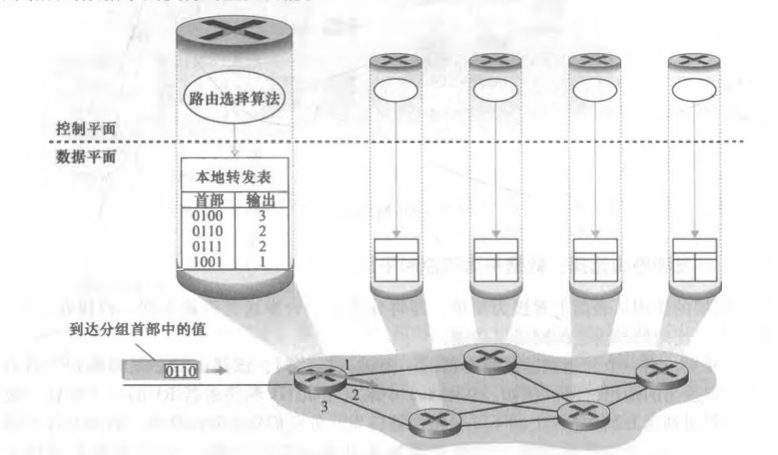

+ 路由选择算法决定了插入该路由器转发表的内容；
+ 路由选择算法运行在每台路由器中，并且在每台路由器中都包含转发和路由选择两种功能；
+ 每台路由器都有一个与其他路由器的路由选择组件通信的路由选择组件；
+ 通过根据路由选择协议交换包含路由选择信息的路由选择报文，在一台路由器中的路由选择算法与在其他路由器中的路由选择算法通信，以计算出它的转发表的值。

**SDN 方法**

Software-Defined Networking

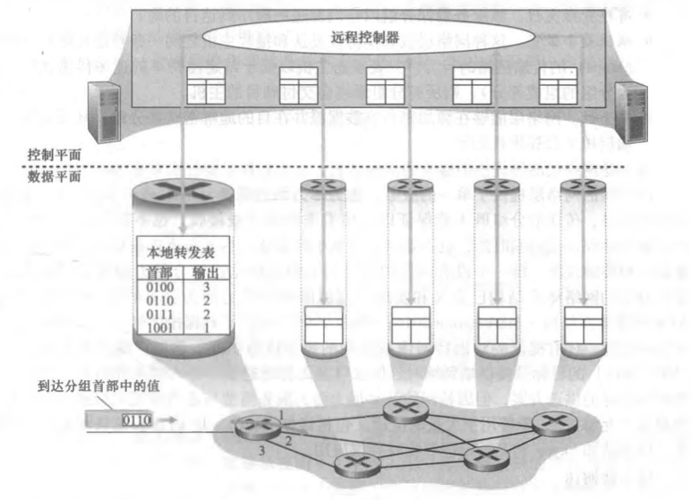

+ 远程控制器计算和分发转发表以供每台路由器所使用；
+ 路由选择设备仅执行转发，而远程控制器计算并分发转发表；
+ 通过交换包含转发表和其他路由选择信息的报文，路由器和远程控制器之间进行通信；
+ 远程控制器可能实现在具有高可靠性和冗余的远程数据中心中，并可能由 ISP 或某些第三方管理。

### 网络服务模型

网络服务模型（network service model）定义了分组在发送与接收端系统之间的端到端运输特性。

网络层可能提供一些服务：

+ 确保交付：该服务确保分组将最终到达目的地。
+ 具有时延上界的确保交付：该服务不仅确保分组的交付，而且在特定的主机到主机时延上界内交付。
+ 有序分组交付：该服务确保分组以它们发送的顺序到达目的地。
+ 确保最小带宽：这种网络层服务模仿在发送和接收主机之间一条特定比特率的传输链路的行为。只要发送主机以低于特定比特率的速率传输比特，则所有分组最终会交付到目的主机。
+ 安全性：网络层能够在源加密所有数据报并在目的地解密这些分组，从而对所有运输层报文段提供机密性。

因特网的网络层提供的服务：

+ 因特网的网络层提供了单一的服务，称为**尽力而为服务**（best-effort service）。
+ 使用尽力而为服务，传送的分组既不能保证以它们发送的顺序被接收；也不能保证它们最终交付；既不能保证端到端时延；也不能保证有最小的带宽。
+ 但因特网的基本尽力而为服务模型与适当带宽供给相结合已被证明超过“足够好”，能够用于大量的应用。

## 数据平面

### 路由器体系结构

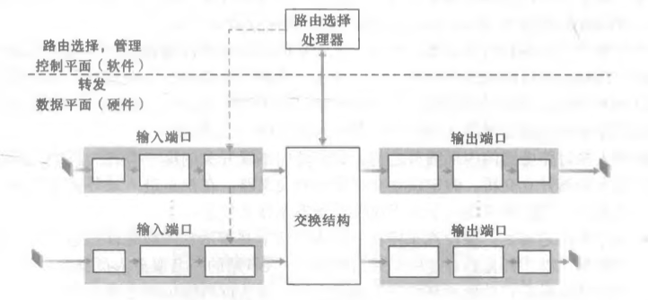

+ 输入端口

  + 在路由器中执行终结入物理链路的物理层功能；

  + 与位于入链路远端的数据链路层交互来执行数据链路层功能；

  + 执行查找功能，通过查询转发表决定路由器的输出端口，到达的分组通过路由器的交换结构转发到输出端

    口；

  + 控制分组（如携带路由选择协议信息的分组）从输入端口转发到路由选择处理器。

+ 交换结构

  + 将路由器的输入端口连接到它的输岀端口；
  + 交换结构完全包含在路由器之中，是一个网络路由器中的网络。

+ 输出端口

  + 存储从交换结构接收的分组，并通过执行必要的链路层和物理层功能在输出链路上传输这些分组。

+ 路由选择处理器

  + 执行控制平面功能；
  + 执行网络管理功能；
  + 在传统的路由器中，它执行路由选择协议，维护路由选择表与关联链路状态信息，并为该路由器计算转发表；
  + 在 SDN 路由器中，路由选择处理器负责与远程控制器通信，接收由远程控制器计算的转发表项，并在该 路由器的输入端口安装这些表项；
  + 转发表从路由选择处理器经过独立总线（例如一个 PCI 总线）复制到输入线路卡。

#### 输入端口处理

转发有两种：基于目的地转发、通用转发。

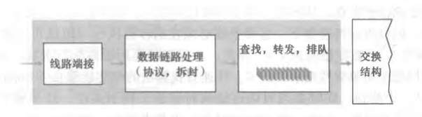

基于目的地转发的输入端口处理动作：

+ 输入端口的线路端接功能与链路层处理实现了用于各个输入链路的物理层和链路层。
+ 在输入端口，路由器使用转发表来查找输出端口，使得到达的分组能经过交换结构转发到该输出端口。
+ 转发表从路由选择处理器经过独立总线复制到线路卡，使用在每个输入端口的影子副本，转发决策能在每个输入端口本地做出，无须基于每个分组调用集中式路由选择处理器，因此避免了集中式处理的瓶颈。
+ 查找：
  + 前缀匹配：路由器用分组目的地址的前缀与转发表中的表项进行匹配，如果存在一个匹配项，则路由器向与该匹配项相关联的链路转发分组。
  + 最长前缀匹配规则：在转发表中寻找最长的匹配项，并向与最长前缀匹配相关联的链路接口转发分组。
  + 三态内容可寻址存储——TCAM：硬件逻辑只是搜索转发表查找最长前缀匹配，但在 G 比特速率下，这种查找必须在纳秒级执行，因此，不仅必须要用硬件执行查找，而且需要对大型转发表使用超出简单线性搜索的技术。
+ 转发、排队：
  + 一旦通过查找确定了某分组的输出端口，则该分组就能够发送进入交换结构。
  + 在某些设计中，如果来自其他输入端口的分组当前正在使用该交换结构，一个分组可能会在进入 交换结构时被暂时阻塞。
  + 一个被阻塞的分组必须要在输入端口处排队，并等待稍后被及时调度以通过交换结构。
+ 其他动作：
  + 必须出现物理层和链路层处理；
  + 必须检查分组的版本号、检验和以及寿命字段，并且重写后两个字段；
  + 必须更新用于网络管理的计数器。

#### 交换

交换结构位于一台路由器的核心部位, 因为正是通过这种交换结构, 分组才能实际地从一个输入端口交换（转发）到一个输出端口中。有以下几种交换方式：

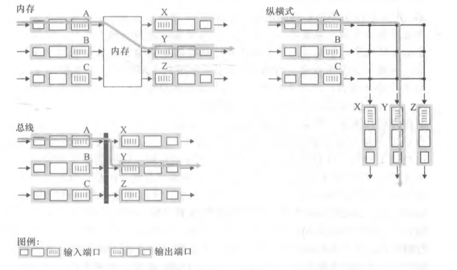

+ 经内存交换。

  + 最简单、最早的路由器是传统的计算机，**在输入端口与输出端口之间的交换是在 CPU（路由选择处理器）的直接控制下完成的**。
  + 输入与输出端口的功能就像在传统操作系统中的 I/O 设备一样。
    + 一个分组到达一个输入端口时，该端口会先通过中断方式向路由选择处理器发出信号。
    + 然后该分组从输入端口处被复制到处理器内存中。
    + 路由选择处理器则从其首部中提取目的地址，在转发表中找出适当的输出端口，并将该分组复制到输出端口的缓存中。
  + 如果内存带宽为每秒可写进内存或从内存读出最多 B 个分组，则总的转发吞吐量（分组从输入端口被传送到输出端口的总速率）必然小于 B/2。而且不能同时转发两个分组，即使它们有不同的目的端口，因为经过共享系统总线一次仅能执行一个内存读/写。
  + 许多现代路由器通过内存进行交换。然而，与早期路由器的一个主要差别是，目的地址的查找和将分组存储（交换）进适当的内存存储位置是由输入线路卡来处理的。
+ 经总线交换。

  + **输入端口经一根共享总线将分组直接传送到输出端口，不需要路由选择处理器的干预**。
    + 让输入端口为分组预先计划一个交换机内部标签（首部），指示本地输出端口，使分组在总线上传送和传输到输出端口。
    + 该分组能由所有输出端口收到，但只有与该标签匹配的端口才能保存该分组。
    + 然后标签在输出端口被去除，因为其仅用于交换机内部来跨越总线。
    + 如果多个分组同时到达路由器，每个位于不同的输出端口，除了一个分组外所有其他分组必须等待，因为一次只有一个分组能够跨越总线。
  + 因为每个分组必须跨过单一总线，故路由器的交换带宽受总线速率的限制。尽管如此，对于运行在小型局域网和企业网中的路由器来说，通过总线交换通常足够用了。

+ 经互联网络交换。
  + **纵横式交换机就是一种由 2N 条总线组成的互联网络，它连接 N 个输入端口与 N 个输岀端口**。每条垂直的总线在交叉点与每条水平的总线交叉，交叉点通过交换结构控制器（其逻辑是交换结构自身的一部分）能够在任何时候开启和闭合。
    + 当某分组到达端口 A，需要转发到端口 Y 时，交换机控制器闭合总线 A 和 Y 交叉部位的交叉点，然后端口 A 在其总线上发送该分组，该分组仅由总线 Y 接收。
    + 来自端口 B 的一个分组在同一时间能够转发到端口 X，因为 A 到 Y 和 B 到 X 的分组使用不同的输入和输岀总线。
  + 纵横式交换机是非阻塞的，只要没有其他分组当前被转发到该输出端口，转发到输出端口的分组将不会被到达输出端口的分组阻塞。可以克服单一、共享式总线带宽限制。但是，如果来自两个不同输入端口的两个分组其目的地为根同的输出端口，则一个分组必须在输入端等待，因为在某个时刻经给定总线仅能够发送一个分组。

#### 输出端口处理

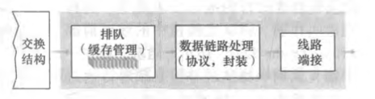

取出已经存放在输出端口内存中的分组并将其发送到输出链路上：

+ 选择和取岀排队的分组进行传输；
+ 执行所需的链路层和物理层传输功能。

#### 排队

排队的位置和程度（或者在输入端口排队，或者在输岀端口排队）将取决于流量负载、交换结构的相对速率和线路速率。

+ 输入排队
  + 因为到达的分组必须加入输入端口队列中，以等待通过交换结构传送到输出端口。如果交换结构不能快得（相对于输入线路速度而言）使所有到达分组无时延地通过它传送，在输入端口将岀现分组排队。
  + 考虑纵横式交换结构，只要其输出端口不同，多个分组可以被并行传送。然而，如果位于两个输入队列前端的两个分组是发往同一输出队列的，则其中的一个分组将被阻塞，且必须在输入队列中等待，因为交换结构一次只能传送一个分组到某指定端口。
  + **线路前部阻塞（Head-Of-the-Line，HOL）**：在一个输入队列中排队的分组必须等待通过交换结构发送即使输出端口是空闲的，因为它被位于线路前部的另一个分组所阻塞。
+ 输出排队
  + 因为输出端口在一个单位时间（该分组的传输时间）内仅能传输一个 分组，当 N 个到达分组必须排队经输岀链路传输。在正好传输 N 个分组（这些分组是前面正在排队的）之一的时间中，可能又到达N 个分组，在输出端口将出现分组排队。
  + 当没有足够的内存来缓存一个入分组时，就必须做出决定：要么丢弃到达的分组，要么删除一个或多个已排队的分组为新来的分组腾出空间。
  + 在某些情况下，在缓存填满之前便丢弃一个分组（或在其首部加上标记）的做法是有利的，这可以向发送方提供一个拥塞信号。
  + 目前有许多分组丢弃与标记策略，这些策略统称为**主动队列管理**（Active Queue Manage­ ment ，AQM）算法。**随机早期检测**（Random Early Detection，RED）算法是得到最广泛研究和实现的 AQM  算法之一。

#### 分组调度

+ 先进先出
  + First- In-First-Out，FIFO，也称为先来先服务，FCFS。
  + 
  + 如果链路当前正忙于传输另一个分组，到达链路输出队列的分组要排队等待传输。
  + 如果没有足够的缓存空间来容纳到达的分组，队列的分组丢弃策略则确定该分组是否将被丢弃或者从队列中去除其他分组以便为到达的分组腾出空间。
  + FIFO 调度规则按照分组到达输出链路队列的相同次序来选择分组在链路上传输。

+ 优先权排队
  + priority queuing
  + 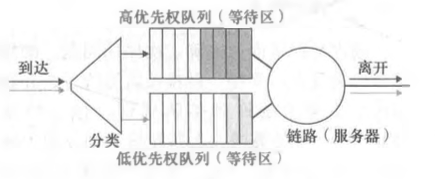
  + 到达输出链路的分组被分类放入输出队列中的优先权类。
  + 在实践中，网络操作员可以配置一个队列，这样携带网络管理信息的分组（例如，由源或目的 TCP/UDP 端口号所标识）获得超过用户流量的优先权；此外，基于IP 的实时话音分组可能获得超过非实时流量（如SMTP 或 IMAP 电子邮件分组）的优先权。
  + 每个优先权类通常都有自己的队列。当选择一个分组传输时，优先权排队规则将从队列为非空的最高优先权类中传输一个分组。在同一优先权类的分组之间的选择通常以 FIFO 方式完成。
  + 在**非抢占式优先权排队规则**下，一旦分组开始传输，就不能打断。

+ 循环和加权公平排队
  + 循环排队规则（round robin queuing discipline）
    + 分组像使用优先权排队那样被分类。然而，在类之间不存在严格的服务优先权，循环调度器在这些类之间轮流提供服务。
    + **保持工作排队**：在有分组排队等待传输时，不允许链路保持空闲。当寻找给定类的分组但是没有找到时，保持工作的循环规则将立即检查循环序列中的下一个类。
  + 加权公平排队（ Weighted Fair Queuing，WFQ）
    + 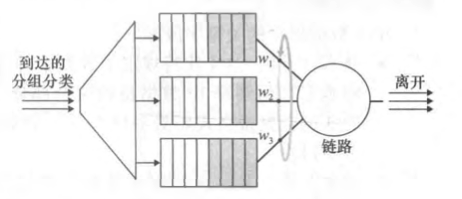
    + 到达的分组被分类并在合适的每个类的等待区域排队。
    + 与使用循环调度一 样，WFQ 调度器也以循环的方式为各个类提供服务。WFQ 也是一种保持工作排队规则，因此在发现一个空的类队列时，它立即移向服务序列中的下一个类。
    + WFQ 和循环排队的不同之处在于，每个类在任何时间间隔内可能收到不同数量的服务。

### 网际协议

#### IPv4

IPv4 数据报格式：

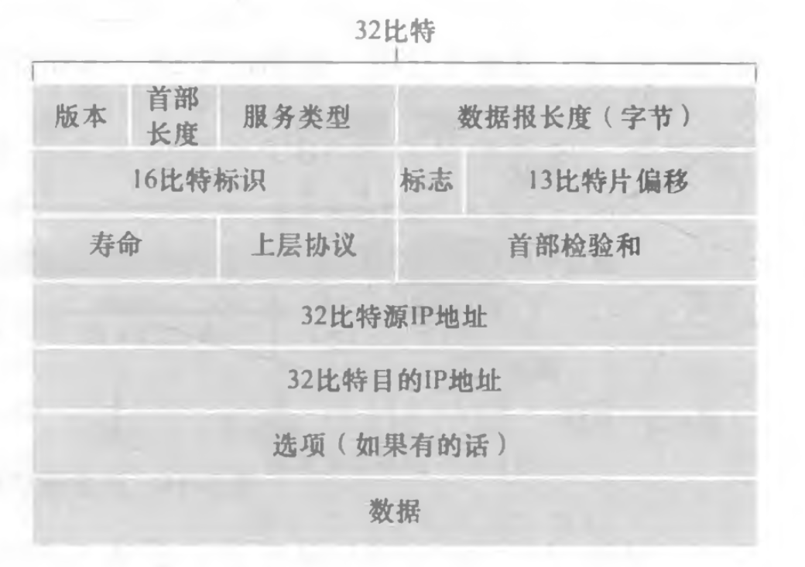

+ 版本
  + 4 比特
  + 规定了数据报的 IP 协议版本。
  + 通过查看版本号，路由器能够确定如何解释 IP 数据报的剩余部分。不同的 IP 版本使用不同的数据报格式。
+ 首部长度
  + 4 比特
  + 确定 IP 数据报中载荷实际开始的地方。
  + 因为一个 IPv4 数据报可包含一些可变数量的选项，这些选项包括在 IPv4 数据报首部中。大多数 IP 数据报不包含选项，所以一般的 IP 数据报具有 20 字节的首部。
+ 服务类型
  + 使不同类型的 IP 数据报能够区别开来。
+ 数据报长度
  + 16 比特
  + IP 数据报首部加上数据的总长度，以字节计。
  + 该字段长为 16 比特，所以 IP 数据报的理论最大长度为 65535字节。但数据报很少有超过 1500 字节的，该长度使得 IP 数据报能容纳最大长度以太网帧的载荷字段。
+ 标识、标志、片偏移
  + 与 IP 分片有关，IPv6 不允许在路由器上对分组分片。
  + 因为每个 IP数据报封装在链路层帧中从一台路由器传输到下一台路由器，故链路层协议的 MTU（Maximum Transmission Unit，最大传送单位）严格地限制着 IP 数据报的长度，不是所有链路层协议都能承载相同长度的网络层分组。
    + 解决该问题的方法是将 IP 数据报中的数据分片成两个或更多个较小的 IP 数据报，用单独的链路层帧封装这些较小的 IP 数据报，然后通过输出链路发送这些帧。
    + 每个这些较小的数据报都称为片。
    + IPv4 的设计者决定将数据报的重新组装工作放到端系统中，而不是放到网络路由器中。
+ 寿命
  + Time-To-Live，TTL
  + 用来确保数据报不会永远在网络中循环。
  + 每当一台路由器处理数据报时，该字段的值减 1，若 TTL 字段减为 0，则该数据报必须丢弃。
+ 协议
  + 指示 IP 数据报的数据部分应交给哪个特定的运输层协议。
  + 例如值为 6 表明数据部分要交给 TCP；值为 17 表明数据要交给UDP。
  + 协议号是将网络层与运输层绑定到一起的黏合剂，而端口号是将运输层和应用层绑定到一起的黏合剂。
+ 首部检验和
  + 帮助路由器检测收到的 IP 数据报中的比特错误。
  + 在每台路由器上必须重新计算检验和并再次存放到原处，因为 TTL 字段以及可能的选项字段会改变。
+ 源和目的 IP 地址
  + 当某源生成一个数据报时，它在源 IP 字段中插入它的 IP 地址，在目的 IP 地址字段中插入其最终目的地的地址。
+ 选项
  + 允许 IP 首部被扩展。
  + 因为数据报首部长度可变，故不能预先确定数据字段从何处开始；而且还因为有些数据报要求处理选项，而有些数据报则不要求，故导致一台路由器处理一个 IP 数据报所需的时间变化可能很大。IPv6 首部中已 去掉了 IP 选项。
+ 数据
  + IP 数据报中的数据字段包含要交付给目的地的运输层报文段（TCP 或 UDP）。但该数据字段也可承载其他类型的数据，如 ICMP 报文。

#### IPv4编址

**主机与路由器连入网络的方法**：

+ 一台主机通常只有一条链路连接到网络，当主机中的 IP 想发送一个数据报时，它就在该链路上发送。

+ 接口：
  + 主机与物理链路之间的边界；
  + 路由器与它的任意一条链路之间的边界，一台路由器有多个接口，每个接口有其链路，IP 要求每台主机和路由器接口拥有自己的 IP 地址。
+ 从技术上讲，一个 IP 地址与一个接口相关联，而不是与包括该接口的主机或路由器相关联。

**点分十进制记**：

+ 每个 IP 地址长度为 32 比特，等价为 4 字节，因此总共有 2^32 个，大约 40 亿个可能的 IP 地址。
+ 地址中的每个字节用它的十进制形式书写，各字节间以句点隔开。
+ 例如虑 IP 地址 `193.32.216.9` 的二进制法是 `11000001 00100000 11011000 00001001`

**子网**

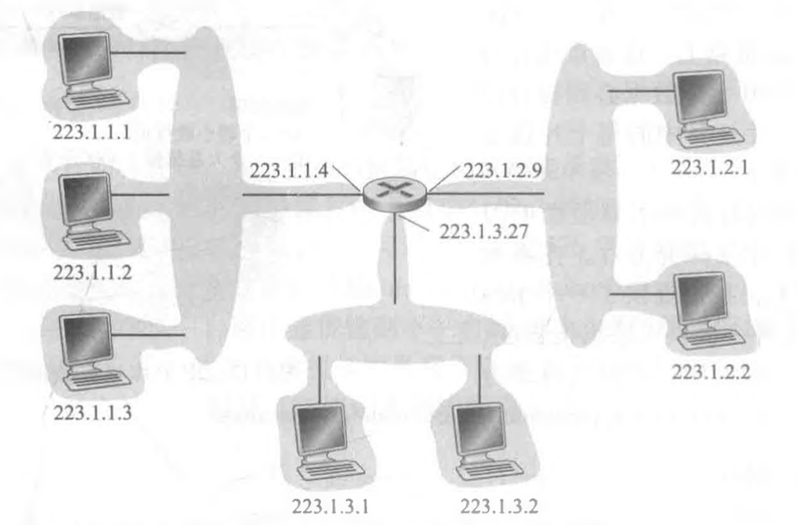

+ 一个接口的 IP 地址的一部分需要由其连接的子网来决定。
+ 图中左上角互联这 3 个主机接口与 1 个路由器接口的网络形成一个子网，子网也称为 IP 网络，或直接称为网络。
+ IP 编址为这个子网分配一个地址 223.1.1.0/24，其中的 `/24` 记法，有时称为子网掩码，指示 32 比特中的最左侧 24 比特定义了子网地址。
+ 为了确定子网，分开主机和路由器的每个接口，产生几个隔离的网络岛，使用接口端接这些隔离的网络的端点。这些隔离的网络中的每一个都叫作一个**子网**。

**CIDR**

+ 无类别域间路由选，Classless Interdomain Routing，因特网的地址分配策略。
+ CIDR 将子网寻址的概念一般化了。当使用子网寻址时，32 比特的 IP 地址被划分为两部分，并且也具有点分十进制数形式 `a. h. c. d/x`，其中 `/x` 指示了地址的第一部分中的比特数。
+ 一个地址的剩余 32-x 比特可认为是用于区分该组织内部设备的，其中的所有设备具 有相同的网络前缀。当该组织内部的路由器转发分组时，才会考虑这些比特。这些较低阶比特可能或可能不具有另外的子网结构。
+ 形式为 a.b. c. d/x 的地址的 x 最高比特构成了 IP 地址的网络部分，并且经常被称为该地址的前缀，一个组织通常被分配一块连续的地址，即具有相同前缀的一段地址。
+ 当该组织外部的一台路由器转发一个数据报，且该数据报的目的地址位于该组织的内部时，仅需要考虑该地址的前面 x 比特。这相当大地减少了在这些路由器中转发表的长度，因为形式为 a.b. c. d/x 的单一表项足以将数据报转发到该组织内的任何目的地。
+ **IP 广播地址 255. 255. 255. 255**，当一台主机发出一个目的地址为 255. 255. 255. 255 的数据报时，该报文会交付给同一个网络中的所有主机。路由器也会有选择地向邻近的子网转发该报文(一般不这样做)。

**获取地址**

**一个组织是如何为其设备得到一个地址块**

+ 为了获取一块 IP 地址用于一个组织的子网内，某网络管理员也许首先会与他的 ISP 联系，该  ISP 可能会从已分给它的更大地址块中提供一些地址。
  + 例如，该 ISP 也许自己已被分配了地址块 200. 23. 16. 0/20。
  + 该 ISP 可以依次将该地址块分成 8 个长度相等的连续地址块，为本 ISP 支持的最多达 8 个组织中的一个分配这些地址块中的一块。
  + 例如：200. 23. 16. 0/23、200. 23. 18. 0/23、200. 23. 20. 0/23、......、200. 23. 30. 0/23。
+ ICANN
  + 因特网名字和编号分配机，Internet Corporation for Assigned Names and Numbers。
  + 全球性的权威机构，具有管理 IP 地址空间并向各 ISP 和其他组织分配地址块的最终责任。
  + 不仅分配 IP 地址，还管理 DNS 根服务器，分配域名与解决域名纷争。

**一个设备是如何从某组织的地址块中分配到一个地址**

+ 某组织一旦获得了一块地址，它就可为本组织内的主机与路由器接口逐个分配 IP 地址。
+ 手工配置
  + 系统管理员通常手工配置路由器中的 IP 地址。
  + 常常在远程通过网络管理工具进行配置。
+ 动态主机配置协议
  + DHCP，Dynamic Host Configuration。
  + DHCP 允许主机自动获取（被分配）一个 IP 地址。
  + 网络管理员能够配置 DHCP，以使某给定主机每次与网络连接时能得到一个相同的 IP 地址，或者某主机将被分配一个临时的 IP 地址，每次与网络连接时该地址也许是不同的。除了主机 IP 地址分配外，DHCP 还允许一台主机得知其他信息，例如它的子网掩码、它的第一跳路由器地址与它的本地 DNS 服务器的地址。
  + DHCP是一个客户 - 服务器协议。
    + 客户通常是新到达的主机，它要获得包括自身使用的IP地址在内的网络配置信息。
    + 在最简单场合下，每个子网将具有一台 DHCP 服务器。
    + 如果在某子网中没有服务器，则需要一个 DHCP 中继代理（通常是一台路由器），这个代理知道用于该网络的 DHCP 服务器的地址。

**DHCP 协议**

对于一台新到达的主机而言，DHCP 协议是一个 4 个步骤的过程：

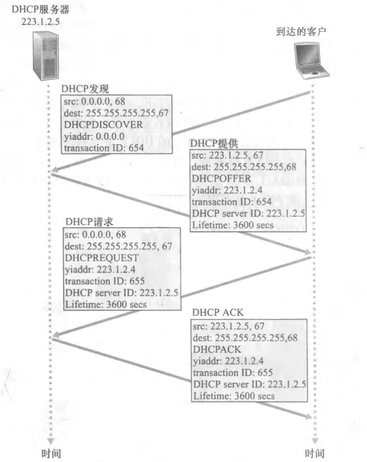

+ DHCP 服务器发现
  + 通过使用 **DHCP 发现报文**来使一台新到达的主机发现一个要与其交互的 DHCP 服务器，客户在 UDP 分组中向端口 67 发送该发现报文；
  + 因为客户不知道数据报应发给谁，在这种情况下，DHCP 客户生成包含 DHCP 发现报文的 IP 数据报，其中使用广播目的地址 255.255.255.255 并且使用本主机源 IP 地址 0.0.0.0；
  + DHCP 客户将该 IP 数据报传递给链路层，链路层然后将该帧广播到所有与该子网连接的节点。
+ DHCP 服务器提供
  + DHCP 服务器收到一个 DHCP 发现报文时，用 **DHCP 提供报文**向客户做出响应；
  + 每台服务器提供的报文包含有收到的发现报文的事务 ID、向客户推荐的 IP 地址、网络掩码以及 IP 地址租用；
  + 该报文向该子网的所有节点广播，仍然使用 IP 广播地址 255. 255. 255. 255，因为在子网中可能存在几个 DHCP 服务器，该客户也许会发现它处于能在几个提供者之间进行选择的优越位置。
+ DHCP 请求
  + 新到达的客户从一个或多个服务器提供中选择一个，并向选中的服务器提供用 **DHCP 请求报文**进行响应，回显配置的参数。
+ DHCP ACK
  + 服务器用 **DHCP ACK 报文**对 DHCP 请求报文进行响应，证实所要求的参数。

**网络地址转换**

NAT，Network Address Translation

每个 IP 使能的设备都需要一个 IP 地址，每当一个 SOHO（Small Office, Home Office，小型办公室、家庭办公室） 想安装一个 LAN 以互联多台机器时，需要 ISP 分配一组地址以供该 SOHO 的所有 IP 设备。如果该子网变大了，则需要分配一块较大的地址；如果 ISP 已经为 SOHO 网络的当前地址范围分配过一块连续地址怎么办呢？NAT 来解决。

+ 位于家中的 NAT 使能的路由器有一个接口，其中所有接口都具有相同的网络地址，例如 10. 0. 0/24，这些地址用于家庭网络等专用网络或具有专用地址的地域。具有专用地址的地域是指其地址仅对该网络中的设备有意义的网络。
+ 10.0.0.0/24 地址仅在给定的网络中才有意义，当向或从全球因特网发送或接收分组时需要进行转换。

+ NAT 使能路由器对于外部世界来说甚至不像一台路由器，相反 NAT 路由器对外界的行为就如同一个具有单一  IP 地址的单一设备。
+ 所有离开家庭路由器流向更大因特网的报文都拥有一个源IP地址，且所有进入家庭的报文都拥有同一个目的 IP 地址。
+ NAT 路由器使用一张 NAT 转换表匹配应将某个分组转发给哪个内部主机，在表项中包含了端口号及其 IP 地址。

#### IPv6

**出现原因**：

+ 新的子网和 IP 节点以惊人的增长率连到因特网上（并被分配唯一的IP地址），32比特的 IP 地址空间即将用尽。
+ IPv5：最初预想 ST-2 协议将成为 IPv5，但 ST-2 后来被舍弃了。

**相比于 IPv4 的优势**：

+ 扩大的地址容量：IPv6 将 IP 地址长度从 32 比特增加到 128 比特；
+ 任播地址：这种地址可以使数据报交付给一组主机中的任意一个；
+ 简化高效的 40 字节首部：许多 IPv4 字段已被舍弃或作为选项，因而所形成的 40 字节定长首部允许路由器更快地处理 IP 数据报；
+ 流标签：给属于特殊流的分组加上标签，这些特殊流是发送方要求进行特殊处理的流，如一种非默认服务质量或需要实时服务的流。

**IPv6 数据报格式**：

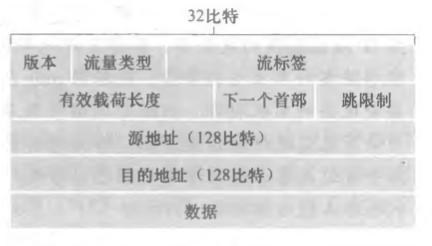

+ 版本
  + 4 比特
  + IPv6 将该字段值设为 6，将该字段值置为 4 并不能创建一个合法的 IPv4 数据报。
+ 流量类型
  + 8 比特
  + 与 IPv4 中的 TOS 字段的含义相似。
+ 流标签
  + 20 比特
  + 用于标识一条数据报的流。
  + 能够对一条流中的某些数据报给出优先权，或者它能够用来对来自某些应用（例如 IP 话音）的数据报给岀更高的优先权，以优于来自其他应用（例如SMTP电子邮件）的数据报。
+ 有效载荷长度
  + 16 比特
  + 给出了 IPv6 数据报中跟在定长的 40 字节数据报首部后面的字节数量。
+ 下一个首部
  + 标识数据报中的内容（数据字段）需要交付给哪个协议，TCP 或 UDP。
  + 该字段使用与 IPv4 首部中协议字段相同的值。
+ 跳限制
  + 转发数据报的每台路由器将对该字段的内容减 1。
  + 如果跳限制计数达到 0，则该数据报将被丢弃。
+ 源地址和目的地址
+ 数据
  + IPv6 数据报的有效载荷部分。
  + 当数据报到达目的地时，该有效载荷就从 IP 数据报中移出，并交给在下一个首部字段中指定的协议处理。

**在 IPv4 数据报中岀现的几个字段在 IPv6 数据报中已不复存在：**

+ 分片/重新组装
  + IPv6 不允许在中间路由器上进行分片与重新组装。这种操作只能在源与目的地执行。
  + 如果路由器收到的 IPv6 数据报因太大而不能转发到出链路上的话，则路由器只需丢掉该数据报，并向发送方发回一个 “分组太大” 的 ICMP差错报文即可。
  + 分片与重新组装是一个耗时的操作，将该功能从路由器中删除并放到端系统中，大大加快了网络中的IP转发速度。
+ 首部检验和
  + 因为因特网层中的运输层和数据链路层协议执行了检验操作，在网络层中无需再检验。
  + 由于 IPv4 首部中包含有一个 TTL 字段（类似于 IPv6 中的跳限制字段)，所以在每台路由器上都需要重新计算 IPv4 首部检验和，这是一项耗时的操作。为了快速处理 IP 分组 IPv6 去掉了这个字段
+ 选项
  + 选项字段不再是标准 IP 首部的一部分了，但可以出现在 IPv6 首部中由“下一个首部”指出的位置上。
  + 删除选项字段使得 IP 首部成为定长的 40 字节。

#### 从 IPv4 到 IPv6 的迁移

虽然新型 IPv6 使能系统可做成向后兼容，即能发送、路由和接收 IPv4 数据报，但已部署的具有 IPv4 能力的系统却不能够处理 IPv6 数据报。可以采用以下几种方法：

+ 宣布一个标志日
  + 不可取
  + 指定某个日期和时间，届时因特网的所有机器都关机并从 IPv4 升级到 IPv6。
+ 建隧道
  + 假定两个 IPv6 节点要使用 IPv6 数据报进行交互，但它们是经由中间 IPv4 路由器互联的。我们将两台 IPv6 路由器之间的中间 IPv4 路由器的集合称为一个隧道。
  + 借助于隧道，在隧道发送端的 IPv6 节点可将整个 IPv6 数据报放到一个 IPv4 数据报的数据的有效载荷字段中，该 IPv4 数据报的地址设为指向隧道接收端的 IPv6 节点，再发送给隧道中的第一个节点。
  + 隧道中的中间 IPv4 路由器在它们之间为该数据报提供路由，就像对待其他数据报一样，完全不知道该 IPv4 数据报自身就含有一个完整的 IPv6 数据报。
  + 隧道接收端的 IPv6 节点最终收到该 IPv4 数据报，并确定该 IPv4 数据报含有一个 IPv6 数据报，从中取出 IPv6 数据报，然后再为该 IPv6 数据报提供路由，就好像它是从一个直接相连的 IPv6 邻居那里接收到该 IPv6 数据报一样。

+ 要改变网络层协议是极其困难的
  + 自从 20 世纪 90 年代早期以来，有许多新的网络层协议被鼓吹为因特网的下一次重大革命，但这些协议中的大多数至今为止只取得了有限突破。
  + 这些协议包括 IPv6、多播协议、资源预留协议。
  + 在网络层中引入新的协议的确如同替换一幢房子的基石，即在不拆掉整幢房子，或至少临时重新安置房屋住户的情况下是很难完成上述工作的。
+ 因特网却已见证了在应用层中新协议的快速部署
  + 例如 Web、即时讯息、流媒体、分布式游戏和各种形式的社交媒体。
  + 引入新的应用层协议就像给一幢房子重新刷一层漆，这是相对容易做的事，如果你选择了一个好看的颜色，邻居将会照搬你的选择。

### 通用转发

因特网路由器的转发决定传统上仅仅基于分组的目的地址，但执行许多第三层功能的中间盒有了大量发展：

+ NAT 盒重写首部 IP 地址和端口号；
+ 防火墙基于首部字段值阻拦流量或重定向分组以进行其他处理，如深度分组检测（DPI）；
+ 负载均衡器将请求某种给定服务（例如一个 HTTP 请求）的分组转发到提供该服务的服务器集合中的一个。

考虑一种更有意义的通用 “匹配加动作” 范式：

+ 其中能够对协议栈的多个首部字段进行 “匹配”，这些首部字段是与不同层次的不同协议相关联的。
+ “动作” 能够包括：将分组转发到一个或多个输出端口（就像在基于目的地转发中一样）；跨越多个通向服务的离开接口进行负载均衡分组（就像在负载均衡中一样），重写首部值（就像在 NAT 中一样），有意识地阻挡/丢弃某个分组（就像在防火墙中一样），为进一步处理和动作而向某个特定的服务器发送一个分组（就像在 DPI —样）等等。

在通用转发中，一张匹配加动作表将基于目的地的转发表一 般化了。将这些转发设备更为准确地描述为 “分组交换机” 而不是第三层 “路由器” 或第二层 “交换机”。

匹配加动作表由远程控制器计算、安装和更新，但实践中通用匹配加动作能力是通过计算、安装和更新这些表的远程控制器实现的。

+ 传统的 IP 转发：转发基于数据报的目的地址进行；
+ 通用转发：其中转发和其他功能可以使用数据报首部中的几个不同的字段值来进行。

#### OpenFlow

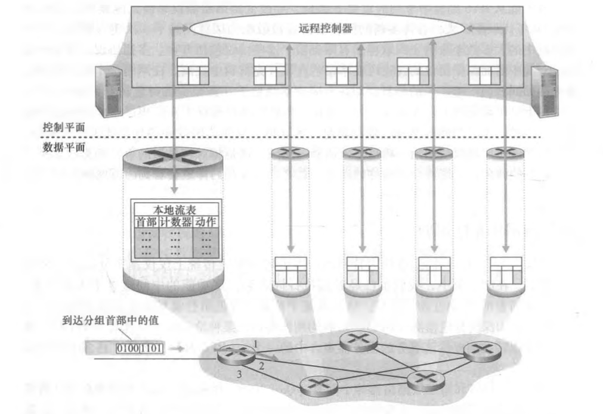

OpenFlow 是一个得到高度认可和成功的标准，它已经成为匹配加动作转发抽象、控制器以及更为一般的 SDN 革命等概念的先驱。

匹配加动作转发表在 OpenFlow 中称为**流表**，它的每个表项包括：

+ 首部字段值的集合
  + 入分组将与之匹配；
  + 与基于目的地转发的情况一样，基于硬件匹配在 TCAM 内存中执行得最为迅速；
  + 匹配不上流表项的分组将被丢弃或发送到远程控制器做更多处理；
  + 在实践中，为了性能或成本原因，一个流表可以由多个流表实现。
+ 计数器集合
  + 当分组与流表项匹配时更新计数器；
  + 这些计数器可以包括已经与该表项匹配的分组数量，以及自从该表项上次更新以来的时间。
+ 当分组匹配流表项时所采取的动作集合
  + 这些动作可能将分组转发到给定的输出端口，丢弃该分组、复制该分组和将它们发送到多个输岀端口，和/或重写所选的首部字段。

#### 匹配

流表的分组匹配字段包含 11个分组首部字段和入端口 ID，该 ID 能被 OpenFlow1.0 中的匹配加动作规则所匹配。

并非一个 IP 首部中的所有字段都能被匹配。例如 OpenFlow 并不允许基于 TTL 字段或数据报长度字段的匹配。

选择一种抽象的 “艺术” 是提供足够的功能来完成某种任务，在这种情况下是实现、配置和管理宽泛的网络层功能，以前这些一直是通过各种各样的网络层设备来实现的。不必用如此详尽和一般性的 “超负荷” 抽象，这种抽象 已经变得臃肿和不可用。

#### 动作

每个流表项都有零个或多个动作列表，这些动作决定了应用于与流表项匹配的分组的处理：

+ 转

  + 一个入分组可以转发到一个特定的物理输岀端口，广播到所有端口（分组到达的端口除外），或通过所选的端口集合进行多播。
  + 该分组可能被封装并发送到用于该设备的远程控制器。
  + 该控制器则可能对该分组采取某些动作，包括安装新的流表项，以及可能将该分组返回给该设备以在更新的流表规则集合下 进行转发。
+ 丢弃
+ 没有动作的流表项表明某个匹配的分组应当被丢弃。
+ 修改字段
  + 在分组被转发到所选的输出端口之前，分组首部 10 个字段（除 IP协议字段外的所有第二、三、四层的字段）中的值可以重写。

如果有多个动作，它们以在表中规定的次序执行。

