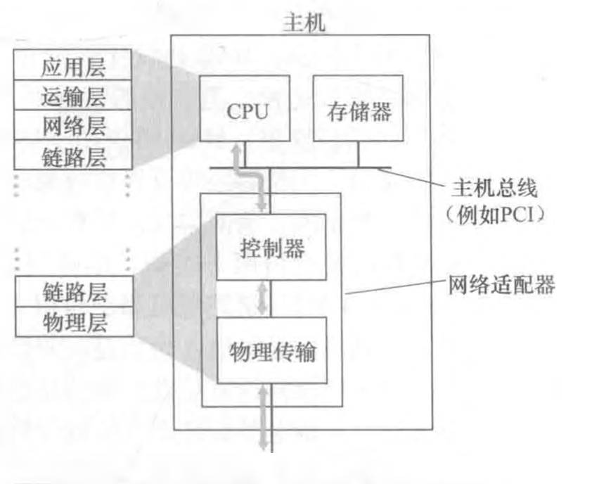
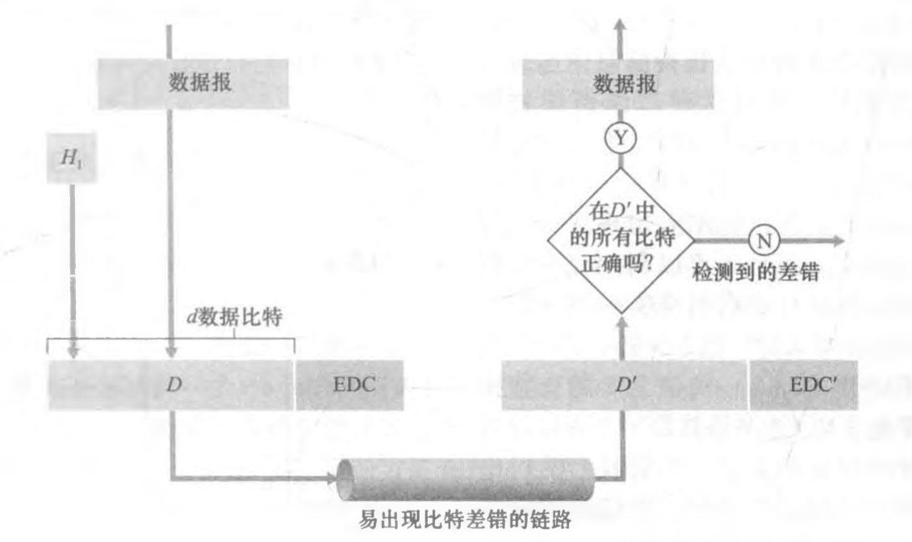
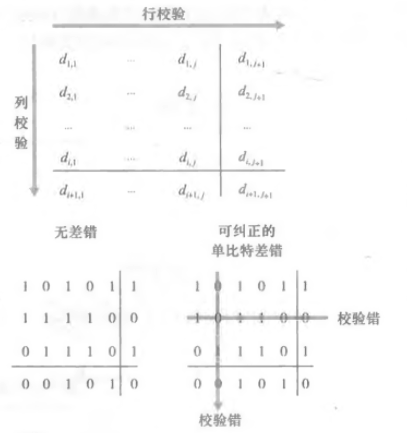
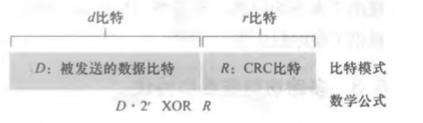

## 链路层信道

+ 第一种类型是广播信道：
  + 这种信道用于连接有线局域网、卫星网和混合光纤同轴电缆接入网中的多台主机。
  + 因为许多主机与相同的广播信道连接，需要所谓的媒体访问协议来协调帧传输。
  + 在某些场合中，可以使用中心控制器来协调传输。
+ 第二种类型是点对点通信链路：
  + 这在诸如长距离链路连接的两台路由器之间，或用户办公室计算机与它们所连接的邻近以太网交换机之间等场合经常能够发现。

## 术语

+ 节点（node）：运行链路层协议的任何设备均称为节点，节点包括主机、路由器、交换机和WiFi接入点；
+ 链路（link）：沿着通信路径连接相邻节点的通信信道，为了将一个数据报从源主机传输到目的主机，数据报必须通过沿端到端路径上的各段链路传输。
  + 例如，考虑从无线主机之一向服务器之一发送一个数据报，该数据报将实际通过 6 段链路：
  + 发送主机与WiFi接入点之间的WiFi链路，接入点和链路层交换机之间的以太网链路，链路层交换机与路由器之间的链路，两台路由器之间的链路，最后是交换机和服务器之间的以太网链路。
  + 在通过特定的链路时，传输节点将数据报封装在链路层帧中，并将该帧传送到链路中。

## 链路层提供服务

尽管任一链路层的基本服务都是将数据报通过单一通信链路从一个节点移动到相邻节点，但所提供的服务细节能够随着链路层协议的不同而变化。链路层协议能够提供的可能服务包括：

+ 成帧 framing：
  + 在每个网络层数据报经链路传送之前，几乎所有的链路层协议都要将其用链路层帧封装起来。
  + 一个帧由一个数据字段和若干首部字段组成，其中网络层数据报就插在数据字段中。
  + 帧的结构由链路层协议规定，不同的链路层会有不同的帧格式。
+ 链路接入
  + 媒体访问控制（Medium Access Control，MAC）协议规定了帧在链路上传输的规则。
  + 对于在链路的一端仅有一个发送方、链路的另一端仅有一个接收方的点对点链路，MAC 协议比较简单，深圳不存在，无论何吋链路空闲，发送方都能够发送帧。
  + 对于多个节点共享单个广播链路，即所谓多路访问问题。MAC 协议用于协调多个节点的帧传输。
+ 可靠交付
  + 当链路层协议提供可靠交付服务时，它保证无差错地经链路层移动每个网络层数据报。
  + 与运输层可靠交付服务类似，链路层的可靠交付服务通常是通过确认和重传取得的。
  + 链路层可靠交付服务通常用于易于产生高差错率的链路，例如无线链路，其目的是在差错发生的链路上纠正一个差错，而不是通过运输层或应用层协议迫使进行端到端的数据重传。
  + 对于低比特差错的链路，包括光纤、同轴电缆和许多双绞铜线链路，链路层可靠交付可能会被认为是一种不必要的开销。因此许多有线的链路层协议不提供可靠交付服务。
+ 差错检测和纠正
  + 当帧中的一个比特作为1传输时，接收方节点中的链路层硬件可能不正确地将其判断为0，反之亦然。这种比特差错是由信号衰减和电磁噪声导致的，所以许多链路层协议提供一种机制来检测这样的比特差错。
  + 通过让发送节点在帧中包括差错检测比特，让接收节点进行差错检查，以此来完成差错检测和纠正。
  + 与因特网的运输层和网络层的差错检测对比，链路层的差错检测通常更复杂，并且用硬件实现。
  + 差错纠正类似于差错检测，区别在于接收方不仅能检测帧中出现的比特差错，而且能够准确地确定帧中的差错出现的位置，纠正这些差错。

## 链路层在何处实现

链路层是实现在路由器的线路卡中的。

*图：网络适配器——它与其他主机组件及协议栈功能的关系*

+ **链路层的主体部分是在网络适配器（network adapter）中实现的，网络适配器有时也称为网络接口卡（Network Interface Card，NIC）。** 
+ **位于网络适配器核心的是链路层控制器，该控制器通常是一个实现了许多链路层服务（成帧、链路接入、差错检测等）的专用芯片。**因此，链路层控制器的许多功能是用硬件实现的。
  + 例如，Intel 的 710 控制器实现了以太网协议；Atheros AR5006 控制器实现了 802.11 WiFi 协议。
  + 在发送端
    + 控制器取得了由协议栈较高层生成并存储在主机内存中的数据报，在链路层帧中封装该数据报，然后遵循链路接入协议将该帧传进通信链路中。
  + 在接收端
    + 控制器接收了整个帧，抽取出网络层数据报。
    + 如果链路层执行差错检测，则需要发送控制器在该帧的首部设置差错检测比特，由**接收控制器执行差错检测**。
  
+ **链路层是硬件和软件的结合体**
  + 尽管大部分链路层是在硬件中实现的，但部分链路层是在运行于主机 CPU 上的软件中实现的。
  + 链路层的软件组件实现了高层链路层功能，如组装链路层寻址信息和激活控制器硬件。
  + 在接收端，链路层软件响应控制器中断，处理差错条件和将数据报向上传递给网络层。
+ 直到 20 世纪 90 年代后期，大部分网络适配器还是物理上分离的卡，如一块 PCMCIA 卡或者一块插进 PC 的 PCI 卡槽中的插入卡，但越来越多的网络适配器被综合进主机的主板，即所谓的**局域网在主板配置**。

## 差错检测和纠正技术

差错检测和纠正技术，Error Detection and Correction，EDC。

比特级差错检测和纠正（bit-level error detection and correc­ tion），即对从一个节点发送到另一个物理上连接的邻近节点的链路层帧中的比特损伤进行检测和纠正，它们通常是链路层提供的两种服务。

+ 在发送节点，为了保护比特免受差错，使用 EDC 来增强数据D。
+ 通常，要保护的数据不仅包括从网络层传递下来需要通过链路传输的数据报，而且包括链路帧首部中的链路级的寻址信息、序号和其他字段。链路级帧中的 D 和 EDC 都被发送到接收节点。
+ 在接收节点，接收到比特序 D‘ 和 EDC’ 。因传输中的比特翻转所致，D‘ 和 EDC’ 可能与初始的 D 和 EDC 不同。
+ EDC 使接收方**有时但并不总是**检测出已经出现的比特差错。即使采用差错检测比特，也还是可能有未检出比特差错。
+ 因此要选择一个差错检测方案，使得这种事件发生的概率很小。一般而言，差错检测和纠错技术越复杂（那些具有未检测出比特差错概率较小的技术)，导致的开销就越大，这就是意味着需要更多的计算量及更多的差错检测和纠错比特。

### 奇偶校验

用来描述差错检测和纠正背后隐含的基本思想

#### **单个奇偶校验位** 

假设要发送的信息有 d 比特：

+ 在偶校验方案中，发送方只需包含一个附加的比特，选择它的值，使得这 d + 1 比特 （初始信息加上一个校验比特）中 1 的总数是偶数。
+ 对于奇校验方案，选择校验比特值使得有奇数个 1。

缺点：

+ 只能监测到出现了奇数个比特差错的场景。
+ 差错经常以“突发”方式聚集在一起，而不是独立地发生。在突发差错的情况下，使用单比特奇偶校验保护的一帧中未检测出差错的概率能够达到50%。

#### **二维奇偶校验**

two-dimensional parity

+ D 中的 d 个比特被划分为 i 行 j 列，对每行和每列计算奇偶值。产生的 i + j + 1 奇偶比特构成了链路层帧的井错检测比特。
+ 
+ 使用这种二维奇偶校验方案，包含比特值改变的列和行的校验值都将会岀现差错。 因此接收方不仅可以检测到出现了单个比特差错的事实，而且还可以利用存在奇偶行校验差错的列和行的索引来实际识别发生差错的比特并纠正它。

#### 前向纠错

Forward Error Correction - FEC

+ 接收方检测和纠正差错的能力被称为前向纠错。
+ 这些技术通常用于如音频 CD 这样的音频存储和回放设备中。
+ 在网络环境中，FEC 技术可以单独应用，或与链路层 ARQ 技术一起应用。
+ FEC 技术很有价值，因为它们可以减少所需的发送方重发的次数。更为重要的是，它们允许在接收方立即纠正差错。
+ FEC 避免了不得不等待的往返时延，而这些时延是发送方收到 NAK 分组并向接收方重传分组所需要的，这对于实时网络应用，或者具有长传播时延的链路（如深空间链路）可能是一种非常重要的优点。

### 检验和方法

通常更多地应用于运输层

+ d 比特数据被作为一个 k 比特整数的序列处理。
+ 一个简单检验和方法就是将这 k 比特整数加起来，并且用得到的和作为差错检测比特。
+ 因特网检验和（Internet checksum）就基于这种方法，即数据的字节作为 16 比特的整数对待并求和。这个和的反码形成了携带在报文段首部的因特网检验和。
+ 接收方通过对接收的数据（包括检验和）的和取反码，并且检测其结果是否为全 1 比特来检测检验和。如果这些比特中有任何比特是 0，就可以指示出差错。

**为什么运输层使用检验和而链路层使用 CRC**：

+ 检验和方法需要相对小的分组开销，例如 TCP 和 UDP 中的检验和只用了 16 比特，但与链路层的CRC相比，它们提供的差错保护相对弱一些。
+ 运输层通常是在主机中作为用户操作系统的一部分用软件实现的。因为运输层差错检测用软件实现，采用简单而快速如检验和这样的差错检测方案是重要的。
+ 另一方面，链路层的差错检测在适配器中用专用的硬件实现，它能够快速执行更复杂的 CRC 操作。

### 循环冗余检测 

Cyclic Redundancy Check，CRC，通常更多地应用在适配器中的链路层。

现今的计算机网络中广泛应用的差错检测技术基于 CRC 编码， 因为该编码能够将要发送的比特串看作为系数是 0 和 1 一个多项式，对比特串的操作被解释为多项式算术。

CRC编码操作如下：

+ 考虑 d 比特的数据 D，发送节点要将它发送给接收节点。
+ 发送方和接受方首先必须协商一个 r + 1 比特模式，称为生成多项式，表示为 G。
+ 要求 G 的最高有效位的比特（最左边）是1。
+ 
+ 对于一个给定的数据段 D，发送方要选择 r 个附加比特 R，并将它们附加到 D 上，使得得到的 d + r 比特模式（被解释为一 个二进制数）用模 2 算术恰好能被 G 整除（即没有余数）。
+ 用 CRC 进行差错检测的过程因此很简单：接收方用 G 去除接收到的 d + r 比特，如果余数为非零，接收方知道出现了差错，否则认为数据正确而被接收。

## 多路访问链路和协议

两种类型网络链路:

+ 点对点链路
  + 由链路一端的单个发送方和链路另一端的单个接收方组成；
  + 点对点协议（point-to-point，PPP）、高级数据链路控制（high-level data link control，HDLC）；
+ 广播链路
  + 让多个发送和接收节点都连接到相同的、单一的、共享的广播信道上；
  + 当任何一个节点传输一个帧时，信道广播该帧，每个其他节点都收到一个副本；
  + 以太网和无线局域网使用的广播链路层技术。

多路访问问题：如何协调多个发送和接收节点对一个共享广播信道的访问。

多路访问协议：节点通过这些协议来规范它们在共享的广播信道上的传输行为。

+ 节点：发送和接收设备
+ 碰撞：因为所有的节点都能够传输帧，所以多个节点可能会同时传输帧。当发生这种情况时，所有节点同时接到多个帧。当碰撞发生时，没有一个接收节点能够有效地获得任何传输的帧。
+ 协调：当多个节点处于活跃状态时，为了确保广播信道执行有用的工作，以某种方式协调活跃节点的传输是必要的。这种协调工作由多路访问协议负责。
+ 能够将任何多路访问协议划分为三种类型之一
  + 信道划分协议 - channel partitioning protocol
  + 随机接入协议 - random access protocol
  + 轮流协议 - taking-turns protocol

多路访问协议的两个理想特性：

+ 当只有一个节点活跃吋，该活跃节点具有 R bps 的吞吐量；
+ 当有 M 个节点活跃时，每个活跃节点的吞吐量接近 R/M bps。

### 信道划分协议

*一个 4 节点的 TDM 与 FEM 的例子*

假设一个支持N 个节点的信道且信道的传输速率为R bps

#### 时分多路复用-TDM

实现：

+ TDM 将时间划分为时间帧，并进一步划分每个时间帧为 N  个时隙；
+ 然后把每个时隙分配给 N 个节点中的一个；
+ 无论何时某个节点在有分组要发送的时候，它在循环的 TDM 帧中指派给它的时隙内传输分组比特；
+ 通常，选择的时隙长度应使一个时隙内能够传输单个分组。 

类比：

+ 一个采用 TDM 规则的鸡尾酒会将允许每个聚会客人在固定的时间段发言，然后再允许另一个聚会客人发言同样时长，以此类推。
+ 一旦每个人都有了说话机会，将不断重复着这种模式。

优势：

+ 消除了碰撞而且非常公平：每个节点在每个帧时间内得到了专用的传输速率 R/N bps。

劣势：

+ 节点被限制于 R/N bps 的平均速率，即使当它是唯一有分组要发送的节点时；
+ 节点必须总是等待它在传输序列中的轮次，即使它是唯一一个有帧要发送的节点。

#### 频分多路复用-FDM

实现：

+  FDM 将 R bps信道划分为不同的频段，每个频段具有 R/N 带宽；
+ 把每个频率分配给 N 个节点中的一个；
+ FDM 在单个较大的 R bps 信道中创建了 N 个较小的 R/N bps 信道。

优势：

+ 避免了碰撞，在 N 个节点之间公平地划分了带宽。

劣势：

+ 限制一个节点只能使用 R/N 的带宽，即使当它是唯一一个有分组要发送的节点时。

#### 码分多址-CDMA

Code Division Multiple Access

+ 实现
  + 对每个节点分配一种不同的编码；
  + 每个节点用它唯一的编码来对它发送的数据进行编码；
  + 精心选择这些编码，不同的节点能够同时传输，并且它们各自相应的接收方仍能正确接收发送方编码的数据比特（假设接收方知道发送方的编码），而不在乎其他节点的干扰传输。

### 随机接入协议

+ 在随机接入协议中，一个传输节点总是以信道的全部速率（即 Kbps）进行发送；
+ 当有碰撞时，涉及碰撞的每个节点反复地重发它的帧（也就是分组），到该帧无碰撞地通过为止；
+ 但是当一个节点经历一次碰撞时，它不必立刻重发该帧；相反，它在重发该帧之前等待一个随机时延；涉及碰撞的每个节点独立地选择随机时延。
+ 因为该随机时延是独立地选择的，所以下述现象是有可能的：这 些节点之一所选择的时延充分小于其他碰撞节点的时延，并因此能够无碰撞地将它的帧在信道中发出。

#### 时隙 ALOHA

*节点1、2和3在第一个时隙碰撞。节点2最终在第4个时隙成功，节点1在第8个时隙成功，节点3在第9个时隙成功*

实现：

+ 令 P 是一个概率，即一个在0和1之间的数。在每个节点中，时隙 ALOHA 的操作是简单的；

+ 当节点有一个新帧要发送时，它等到下一个时隙开始并在该时隙传输整个帧；
+ 如果没有碰撞，该节点成功地传输它的帧，从而不需要考虑重传该帧（如果该节点有新帧，它能够为传输准备一个新帧）；
+ 如果有碰撞，该节点在时隙结束之前检测到这次碰撞。该节点以概率 P 在后续的每个时隙中重传它的帧，直到该帧被无碰撞地传输出去。

优势：

+ 与信道划分不同，当某节点是唯一活跃的节点时（一个节点如果有帧要发送就认为它是活跃的），时隙 ALOHA 允许该节点以全速 R 连续传输；
+ 时隙 ALOHA 也是高度分散的，因为每个节点检测碰撞并独立地决定什么时候重传。

劣势：

+ 当有多个活跃节点时，一部分时隙将有碰撞，因此将被“浪费”掉了；
+ 时隙的另一部分将是空闲的，因为所有活跃节点由于概率传输策略会节制传输。唯一 “未浪费的”时隙是那些刚好有一个节点传输的时隙。

效率：

+ 这个协议的最大效率为 1/e=0.37；
+ 当有大量节点有很多帧要传输时，则最多仅有 37% 的时隙做有用的工作。因此该信道有效传输速率不是R bps，而仅为 0.37 Rbps。37% 的时隙是空闲的，26% 的时隙有碰撞。

#### 纯 ALOHA

*纯 ALOHA 中的干扰传输*

实现：

+ 时隙 ALOHA 协议要求所有的节点同步它们的传输，以在每个时隙开始时开始传输。第一个 ALOHA 协议实际上是一个非时隙、完全分散的协议；
+ 在纯 ALOHA 中，当一帧首次到达（即一个网络层数据报在发送节点从网络层传递下来），节点立刻将该帧完整地传输进广播信道；
+ 如果一个传输的帧与一个或多个传输经历了碰撞，这个节点将立即（在完全传输完它的碰撞帧之后）以概率 P 重传该帧。
+ 否则，该节点等待一个帧传输时间；
+ 在此等待之后，它则以概率 P 传输该帧，或者以概率 1-P 在另一个帧时间等待（保持空闲）。

效率：

+ 纯 ALOHA 协议的最大效率仅为 1/2e；
+ 这刚好是时隙 ALOHA 的一半。这就是完全分散的 ALOHA 协议所要付出的代价。

#### 载波侦听多路访问-CSMA

Carrier Sense Multiple Access

ALOHA 缺点：

+ 在时隙和纯 ALOHA 中，一个节点传输的决定独立于连接到这个广播信道上的其他节点的活动；
+ 一个节点不关心在它开始传输时是否有其他节点碰巧在传输，而且即使有另一个节点开始干扰它的传输也不会停止传输；
+ 类比鸡尾酒会，ALOHA 协议非常像一个粗野的聚会客人，他喋喋不休地讲话而不顾是否其他人在说话。

进一步：

+ 作为人类，我们有人类的协议，它要求我们不仅要更为礼貌，而且在谈话中要减少与他人“碰撞”的时间，从而增加我们谈话中交流的数据量；
+ 具体而言，有礼貌的人类谈话有两个重要的规则：
  + 说话之前先听：在网络领域中，这被称为**载波侦听（carrier sensing）**，即一个节点在传输前先听信道。如果来自另一个节点的帧正向信道上发送，节点则等待直到检测到一小段时间没有传输，然后开始传输。
  + 如果与他人同时开始说话，停止说话：在网络领域中，这被称为**碰撞检测（collision detection）**，一个节点正在传输干扰帧，它就停止传输，在 重复“侦听-当空闲时传输”循环之前等待一段随机时间。

如果所有的节点都进行载波侦听了，为什么当初会发生碰撞？

+ 广播信道的端到端信道传播存在时延。
+ 该传播时延越长，载波侦听节点不能侦听到网络中另一个节点已经开始传输的机会就越大。

#### 具有碰撞检测的 CSMA-CSMA/CD

CSMA with Collision Detection

+ 在图 6-12中，节点没有进行碰撞检测，即使已经出现了碰撞，B 和 D 都将继续完整地传输它们的帧；
+ 当某节点执行碰撞检测时，一旦它检测到碰撞将立即停止传输；
+ 图 6-13 这两个节点在检测到碰撞后很短的时间内都放弃了它们的传输；
+ 显然，在多路访问协议中加入碰撞检测，通过不传输一个无用的、损坏的帧，将有助于改善协议的性能。

从与广播信道相连的适配器的角度总结它的运行:

+ 适配器从网络层一条获得数据报，准备链路层帧，并将其放入帧适配器缓存中；
+ 如果适配器侦听到信道空闲，它开始传输帧。在另一方面，如果适配器侦听到信道正在忙，它将等待，直到侦听到没有信号能量时才开始传输帧；
+ 在传输过程中，适配器监视来自其他使用该广播信道的适配器的信号能量的存在。
+ 如果适配器传输整个帧而未检测到来自其他适配器的信号能量，该适配器就完成了该帧。在另一方面，如果适配器在传输时检测到来自其他适配器的信号能量，它中止传输。
+ 中止传输后，适配器等待一个随机时间量，然后返回第二步。

每次适配器准备传输一个新的帧时，它要运行 CSMA/CD 算 法。不考虑近期过去的时间内可能已经发生的任何碰撞。因此，当几个其他适配器处于指数后退状态时，有可能一个具有新帧的节点能够立刻插入一次成功的传输。

效率：

+ dprop：信号能量在任意两个适配器之间传播所需的最大时间；
+ dtrans：传输一个最大长度的以太网帧的时间；
+ 效率：1/（1+5（dprop/dtrans））；
+ 当 dprop 接近 0 时，效率接近1。如果传播时延是 0，碰撞的节点将立即中止而不会浪费信道；
+ 当 dtrans 无限大时，效率接近1。当一个帧取得了信道时，它将占有信道很长时间；
+ 因此信道在大多数时间都会有效地工作。

### 轮流协议

ALOHA 和 CSMA 协议具备多路访问协议的两个理想特性的第一个特性，但不具备第二个特性。

#### 轮询协议

polling protocol

实现：

+ 轮询协议要求这些节点之一要被指定为主节点，主节点以循环的方式轮询每个节点；
+ 主节点首先向节点 1 发送一个报文，告诉节点 1 能够传输的帧的最多数量；
+ 在节点 1 传输了某些帧后，主节点告诉节点 2 能够传输的帧的最多数量；
+ 主节点能够通过观察在信道上是否缺乏信号，来决定一个节点何时完成了帧的发送；
+ 上述过程以这种方式继续进行，主节点以循环的方式轮询了每个节点。

优势：

+ 轮询协议消除了困扰随机接入协议的碰撞和空时隙，这使得轮询取得高得多的效率。

劣势：

+ 该协议引入了轮询时延，即通知一个节点“它可以传输”所需的时间。例如，如果只有一个节点是活跃的，那么这个节点将以小于 R bps的速 率传输，因为每次活跃节点发送了它最多数量的帧时，主节点必须依次轮询每一个非活跃的节点。
+ 第二个缺点可能更为严重，就是如果主节点有故障，整个信道都变得不可操作。

使用：802. 15协议、蓝牙协议。

#### 令牌传递协议 
token-passing protocol

实现：

+ 在这种协议中没有主节点。一个称为令牌（token）的小的特殊帧在节点之间以某种固定的次序进行交换。
+ 例如，节点 1 可能总是把令牌发送给节点 2，节点 2 可能总是把令牌发送给节点 3，而节点 N 可能总是把令牌发送给节点 1。
+ 当一个节点收到令牌时，仅当它有一些帧要发送时，它才持有这个令牌；否则，它立即向下一个节点转发该令牌。
+ 当一个节点收到令牌时，如果它确实有帧要传输，它发送最大数目的帧数，然后把令牌转发给下一个节点。

优势：

+ 令牌传递是分散的，并有很高的效率。

劣势

+ 一个节点的故障可能会使整个信道崩溃；
+ 如果一个节点偶然忘记了释放令牌，则必须调用某些恢复步骤使令牌返回到循环中来。

使用：光纤分布式数据接口（FDDI）协议、IEEE 802. 5 令牌环协议。

