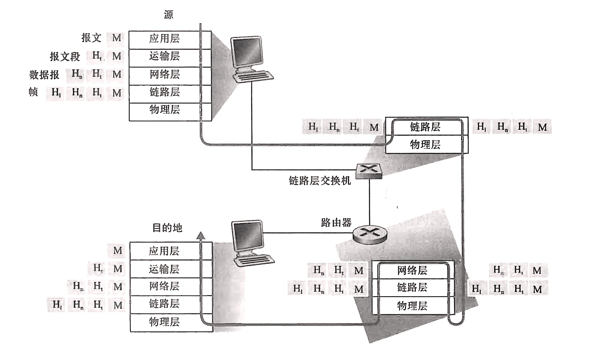

## 什么是因特网

**TODO**

## 网络边缘

### 接入网

**TODO**

### 物理媒体（physical medium）

+ 导引型媒体（guided media）：电波沿着固体媒体前行
  + 双绞铜线
  + 同轴电缆
  + 光纤
+ 非导引型媒体（unguided media）：电波在空气或外层空间中传播
  + 陆地无线电信道
  + 卫星无线电信道

## 网络核心

通过网络链路和交换机移动数据有两种基本方式：**分组交换**（packet switching）和**电路交换**（circuit switching）

边缘路由器：端系统到任何其他远程端系统的路径上的第一台路由器

### 分组交换

#### 分组交换机

+ packet switch
+ 路由器（router）
+ 链路层交换机（link-layer switch）

#### 存储转发传输

+ stroe-and-forward transmission
+ 多数分组交换机在链路的输入端使用存储转发传输。
+ 存储转发传输是指：在交换机能够开始向输出链路传输该分组的第一个比特之前，必须接受到整个分组。
+ 缺点：
  + 存储转发时延
  + 输出缓存的排队时延
    + 输出缓存（output buffer）：存储路由器准备发往那条链路的分组。
  + 分组丢失/丢包（packet loss）

### 电路交换

+ 在电路交换网络中，在端系统间通信会话期间，预留了端系统间沿路径通信所需要的资源（缓存，链路传输速率）。
+ 传统的电话网络就是电路交换网络的例子
  + **TODO**

#### 复用

**TODO**

### 分组交换和电路交换的对比

**TODO**

## 网络结构

**TODO**

## 时延

**TODO**

## 丢包

**TODO**

## 吞吐量

**TODO**

## 协议层次

### 协议分层

#### 应用层

+ **报文**（message）：应用层协议分布在多个端系统上，一个端系统中的应用程序使用协议与另一个端系统中的应用程序交换信息分组。这种位于应用层的信息分许就是报文。
+ 相关协议
  + HTTP：Web 文档的请求和传送
  + SMTP：电子邮件报文的传输
  + FTP：两个端系统之间的文件传输
  + DNS：域名系统

#### 运输层

+ **报文段**（segment）：运输层在应用程序端点之间传送应用层报文，在运输层的分组就是报文段。
+ 相关协议
  + TCP：向应用程序提供面向连接的服务
  + UDP：向应用程序提供无连接服务

#### 网络层

+ **数据报**（datagram）：网络层将网络层分组从一台主机移动到另一台主机，这个网络层分组就是数据报。
+ 相关协议
  + IP：定义数据报中各个字段，以及端系统和路由器如何作用于这些字段

#### 链路层

+ 帧（frame）：链路层将整个分组从一个网络元素移动到邻近网络元素，这个链路层分组就是帧。
+ 相关协议
  + 以太网
  + WiFi
  + DOCSIS 协议

#### 物理层

+ 将帧中的一个个比特从一个节点移动到下一个节点。

### OSI 模型

开放系统互连模型

+ 应用层
+ 表示层
  + 使通信的应用程序能够解释交换数据的含义。
  + 包括数据压缩和数据加密以及数据描述。
+ 会话层
  + 提供数据交换的定界和同步功能。
  + 包括建立检察点和恢复方案的方法。
+ 运输层
+ 网络层
+ 数据链路层
+ 物理层

### 封装

## 网络攻击

